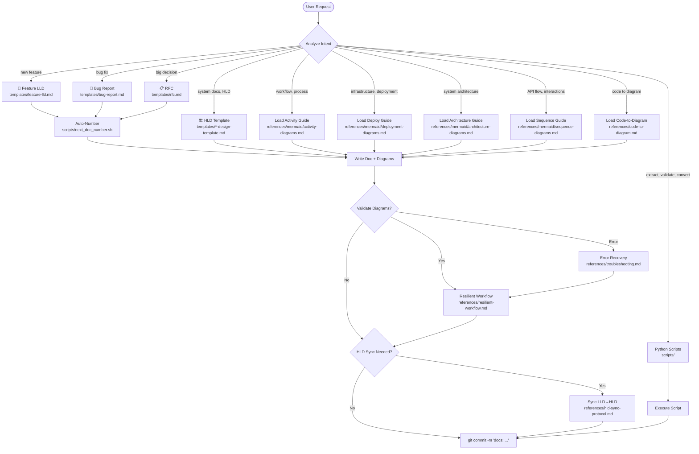

# Design Documentation Skill

Every code change must be preceded by documentation. This skill creates Low-Level Design docs (LLD) for individual features/bugs and maintains High-Level Design docs (HLD) for system-wide architecture.

**Iron Law: No code without a design doc first.**

## Decision Tree



## Directory Structure

```
docs/
├── design/     ← HLD (one per system component, always current)
├── features/   ← Feature LLD (auto-numbered, one per feature)
├── bugs/       ← Bug reports (auto-numbered, one per bug)
├── rfcs/       ← All decisions: full RFC + short-form RFC (auto-numbered)
├── policies/   ← Policy docs (migration, secrets, etc.)
└── archive/    ← Old/superseded docs
```

**`docs/adr/` is deprecated — do not create it. All decisions go in `docs/rfcs/`.**

## Process

> ⚠️ **Before writing any doc, read `docs/STANDARDS.md`.**
> It defines required metadata, status lifecycles, required sections, and diagram requirements.
> It overrides any agent-specific guidance in this skill.

### Step 1: Determine Doc Type

```
What are you about to build?
  → New feature          → Feature LLD      (docs/features/NNN-name.md)
  → Bug fix              → Bug report       (docs/bugs/BUG-NNN-name.md)
  → Significant decision → RFC full         (docs/rfcs/RFC-NNN-name.md) via rfc.md
  → Small decision       → RFC short-form   (docs/rfcs/RFC-NNN-name.md) via rfc-short.md
  → System docs          → HLD              (docs/design/*.md)
  → Just a diagram       → Skip to Step 3, load mermaid guide directly

NOTE: docs/adr/ is deprecated. All decisions go in docs/rfcs/.
```

### Step 2: Auto-Number

Run `scripts/next_doc_number.sh <type>` to get the next number:

- `bash scripts/next_doc_number.sh features` → `003`
- `bash scripts/next_doc_number.sh bugs` → `BUG-001`
- `bash scripts/next_doc_number.sh rfcs` → `RFC-001`

### Step 3: Load Template and Write

1. Read the appropriate template from `templates/`
2. Fill in ALL sections — no placeholders, no TODOs
3. Add Mermaid diagrams (**MANDATORY** — every doc must have at least one)
4. For diagram guidance, load the relevant guide from `references/mermaid/`:
   - Data flows → `mermaid/sequence-diagrams.md`
   - System components → `mermaid/architecture-diagrams.md`
   - Workflows/processes → `mermaid/activity-diagrams.md`
   - Infrastructure → `mermaid/deployment-diagrams.md`
   - Symbols → `mermaid/unicode-symbols.md`

### Step 4: Validate Diagrams (Recommended)

Use the resilient workflow for validated diagram generation:

```bash
python scripts/resilient_diagram.py \
    --code "[mermaid code]" \
    --markdown-file design_doc \
    --diagram-num 1 \
    --title "process_flow" \
    --format png --json
```

**If validation fails:** Check `references/troubleshooting.md` (28 documented errors with fixes).

### Step 5: HLD Sync Check

After writing any LLD, check if HLD needs updating:

1. Read `references/hld-sync-protocol.md` for the sync rules
2. Identify which HLD files are affected
3. Update affected HLD sections
4. Add changelog entry at bottom of HLD

### Step 6: Commit the Doc

Commit the documentation before any code:

```bash
git add docs/
git commit -m "docs: add LLD for <feature-name>"
```

## Diagram Requirements

**Every design doc MUST include at least one Mermaid diagram.** This is not optional.

| Doc Type    | Minimum Diagrams                                     |
| ----------- | ---------------------------------------------------- |
| Feature LLD | 1 sequence/activity diagram showing the feature flow |
| Bug report  | 1 diagram showing the bug's data flow or state       |
| RFC         | 2+ diagrams: current state + proposed state          |
| HLD         | 3+ diagrams: architecture, data flow, deployment     |

### Diagram Style Rules

1. **Unicode symbols always** — Use semantic symbols (🔐 🌐 ⚙️ 💾 📬)
2. **High-contrast colors** — Light bg + dark text, always specify `color:` in `classDef`
3. **Labels are descriptive** — Not "Service A", but "Auth Service (JWT)"

## Reference Materials (load on-demand, not preemptively)

| File | When to Load |
|---|---|
| `references/doc-standards.md` | Checking what good LLD/HLD looks like |
| `references/hld-sync-protocol.md` | When/how to sync LLD changes to HLD |
| `references/troubleshooting.md` | Diagram fails to render (28 error fixes) |
| `references/resilient-workflow.md` | Generating diagrams with validation pipeline |
| `references/code-to-diagram.md` | Extracting architecture from source code |
| `references/code-to-diagram-fastapi.md` | Analyzing FastAPI/Python code specifically |
| `references/code-to-diagram-react.md` | Analyzing React/Next.js code specifically |
| `references/mermaid/activity-diagrams.md` | Workflow/process diagrams |
| `references/mermaid/sequence-diagrams.md` | API/data flow diagrams |
| `references/mermaid/architecture-diagrams.md` | System component diagrams |
| `references/mermaid/deployment-diagrams.md` | Infrastructure diagrams |
| `references/mermaid/unicode-symbols.md` | Symbol catalog for all diagrams |

## Scripts (execute directly, don't read into context)

| Script | Purpose | Usage |
|---|---|---|
| `scripts/next_doc_number.sh` | Auto-increment doc numbering | `bash scripts/next_doc_number.sh features` |
| `scripts/extract_mermaid.py` | Extract/validate Mermaid from markdown | `python scripts/extract_mermaid.py doc.md --validate` |
| `scripts/mermaid_to_image.py` | Convert .mmd to PNG/SVG | `python scripts/mermaid_to_image.py diagram.mmd output.png` |
| `scripts/resilient_diagram.py` | Full diagram workflow with error recovery | `python scripts/resilient_diagram.py --code "..." --json` |

## Templates

| Template | Use For |
|---|---|
| `templates/feature-lld.md` | New feature documentation |
| `templates/bug-report.md` | Bug fix documentation |
| `templates/rfc.md` | Significant architectural decisions (full RFC) |
| `templates/rfc-short.md` | Small decisions (short-form RFC) |
| `templates/system-design-template.md` | Complete system HLD |
| `templates/architecture-design-template.md` | Architecture HLD |
| `templates/api-design-template.md` | API design HLD |
| `templates/database-design-template.md` | Database schema HLD |
| `templates/feature-design-template.md` | Feature design HLD |
