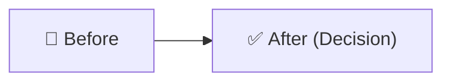

# RFC-NNN: [Title]

> **Doc ID:** RFC-NNN-title
> **Date:** YYYY-MM-DD
> **DRI:** [Name]
> **Status:** Draft | Proposed | Approved | Implemented | Verified | Rejected

*Use this short-form RFC for small decisions. Use `rfc.md` for significant architectural changes.*

---

## Problem Statement

What problem needs solving? (1–3 sentences. Be specific.)

## Decision

What was chosen and why? Include a diagram if it helps clarity.

## Alternatives Considered

| Option | Why Rejected |
|---|---|
| [Alternative 1] | [Reason] |
| [Alternative 2] | [Reason] |

## Impact

What changes as a result of this decision?

- [File / component / behaviour that changes]
- [Any migration or cleanup required]
- [Any downstream effects]
