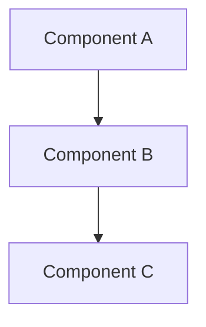

# Brainstorming Ideas Into Designs

## Overview

Help turn ideas into fully-formed designs through collaborative dialogue. Understand the project context, ask questions to refine the idea, then present the design for approval.

**HARD GATE:** Do NOT write any code, scaffold any project, or take any implementation action until you have presented a design and the user has approved it. This applies to EVERY project regardless of perceived simplicity.

## Anti-Pattern: "This Is Too Simple To Need A Design"

Every project goes through this process. A todo list, a single-function utility, a config change — all of them. "Simple" projects are where unexamined assumptions cause the most wasted work.

## Anti-Pattern: "The User Seems Ready, Let's Move On"

Do NOT rush through brainstorming. Continue until the user explicitly says they are satisfied AND the Completeness Checklist is fully covered. Asking 2-3 questions and jumping to a plan is a VIOLATION — but there is no minimum round count. Exit criteria is user satisfaction + checklist complete, not a turn count.

## Process

### 1. Explore Project Context

- Check existing files, docs, dependencies
- Read `.gemini/tech-stack.md` if it exists
- Read relevant `docs/design/*.md` (HLD) to understand current system state
- Understand current project state

### 2. Ask Clarifying Questions (Iterative — as many rounds as needed)

- One question at a time — don't overwhelm
- Prefer multiple choice when possible
- Focus: purpose, constraints, success criteria, edge cases, risks, dependencies
- Use `notify_user` to ask questions
- **Do NOT transition to design until all items in the Completeness Checklist are covered**

### 3. Completeness Checklist (MUST complete before moving on)

Before proposing approaches, verify you have answers for ALL:

- [ ] **Scope** — What is in scope? What is explicitly out of scope?
- [ ] **User problem** — What user pain does this solve?
- [ ] **Success criteria** — How will we measure success? (specific, measurable)
- [ ] **Constraints** — Performance budgets, compatibility, deadlines?
- [ ] **Edge cases** — What happens with empty input, concurrent access, network failure?
- [ ] **Dependencies** — What does this depend on? What depends on this?
- [ ] **Risks** — What could go wrong? What's the fallback?
- [ ] **Security** — Any auth, authorization, data sensitivity concerns?

If any item is unclear, ask the user. Do NOT fill in assumptions.

### 4. Sketch Architecture (During Brainstorm)

While brainstorming, create rough Mermaid diagrams to visualize ideas:

Diagrams during brainstorm are rough — they'll be refined in the documentation step.

### 5. Propose 2-3 Approaches

- Present options with trade-offs
- Lead with your recommended option and explain why
- YAGNI ruthlessly — remove unnecessary features
- Include rough diagrams for each approach

### 6. Present Design

- Scale each section to its complexity
- Ask after each section whether it looks right
- Cover: architecture, components, data flow, error handling, testing
- Use `notify_user` for section-by-section approval

### 7. Transition

- When called from `docs-driven-dev.md`: transition to documentation step (design-docs skill)
- When called standalone: save to `implementation_plan.md` artifact, then invoke `write-plan.md`

## Key Principles

- **Extensive back-and-forth** — As many rounds as needed; exit only when user is satisfied and checklist is complete
- **One question at a time** — Don't overwhelm with multiple questions
- **Multiple choice preferred** — Easier to answer than open-ended
- **Explore alternatives** — Always propose 2-3 approaches before settling
- **Incremental validation** — Present design, get approval before moving on
- **Diagram early** — Sketch rough architecture during brainstorm, not after
