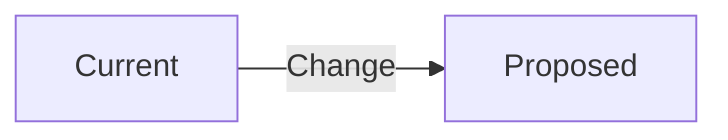

# ADR-NNN: [Title] (Short-Form)

> **Doc ID:** ADR-NNN-kebab-name
> **Date:** YYYY-MM-DD
> **DRI:** [Name — Directly Responsible Individual]
> **Status:** Draft | Proposed | Approved | In Progress | Implemented | Verified | Rejected | Superseded

---

## Problem Statement

What problem are we solving? Why now? (1–3 sentences max)

## Decision

What was chosen, and why?

Include a diagram if the decision involves architecture or data flow:

## Alternatives Considered

| Option | Why rejected |
|---|---|
| Option A | [Reason] |
| Option B | [Reason] |

## Impact

What changes as a result of this decision?

- [File / system affected]
- [Behavior changed]
- [Migration required? Yes/No]

## Related Documents

- Feature LLD: [Link if applicable]
- HLD: [Link to affected HLD]
