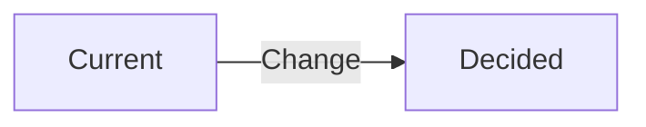

# ADR-NNN: [Title] (Short-Form)

> **Doc ID:** ADR-NNN-kebab-name
> **Date:** YYYY-MM-DD
> **DRI:** [Name — Directly Responsible Individual]
> **Status:** Draft | Proposed | Approved | Implemented | Superseded | Rejected

Short-form ADR for routine architectural decisions (≤4 sections, no major migration impact). For significant decisions with multi-month consequences, use `adr.md` instead.

## Context

What situation forced the decision? 1-3 sentences max. State the forces, not options.

## Decision

> **We will [chosen approach].**

One paragraph of supporting detail. Diagram only if architecture changes:

## Consequences

- **Positive:** [What this enables]
- **Negative:** [What this costs]
- **Commitment:** [What we're locked into]

## Related Documents

- Supersedes: [ADR-NNN or "none"]
- Related: [Feature LLDs, Design Docs affected]

## Changelog

| Date | Change |
|------|--------|
| YYYY-MM-DD | Initial draft — Status: Draft |
