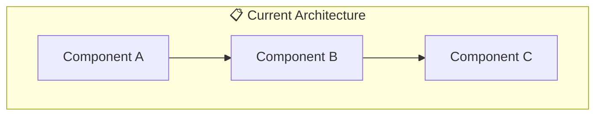
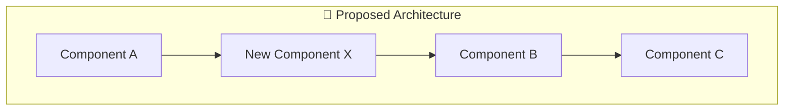

# ADR-NNN: [Title]

> **Date:** YYYY-MM-DD
> **DRI:** [Name — Directly Responsible Individual]
> **Status:** Draft | Proposed | Approved | In Progress | Implemented | Verified | Rejected | Superseded
> **OKR Alignment:** [Which objective does this serve?]

## Problem Statement

What problem are we solving? Why does it matter now? What happens if we don't solve it?

## Proposed Solution

### Overview

One-paragraph summary of the proposed approach.

### Architecture (Current → Proposed)

**Current State:**

**Proposed State:**

### Detailed Design

[Technical details of the proposed solution]

### Data Model Changes

[Schema changes, new tables, modified columns]

### API Changes

[New/modified endpoints, breaking changes]

## Alternatives Considered

### Alternative 1: [Name]

- **Pros:** ...
- **Cons:** ...
- **Why rejected:** ...

### Alternative 2: [Name]

- **Pros:** ...
- **Cons:** ...
- **Why rejected:** ...

## Impact Assessment

### What Changes

- [System components affected]
- [Data migrations required]
- [API contract changes]

### What Could Break

- [Backward compatibility concerns]
- [Performance implications]
- [Security implications]

### Migration Strategy

- [How do we get from current → proposed safely?]

## Success Metrics

| Metric     | Current | Target  |
| ---------- | ------- | ------- |
| [Metric 1] | [Value] | [Value] |
| [Metric 2] | [Value] | [Value] |

## Timeline

| Phase   | Duration   | Deliverable        |
| ------- | ---------- | ------------------ |
| Phase 1 | [Duration] | [What's delivered] |
| Phase 2 | [Duration] | [What's delivered] |

## Decision

> **Decision:** [Approved / Rejected / Deferred]
> **Date:** YYYY-MM-DD
> **Rationale:** [Why this decision was made]

## Related Documents

- Feature LLDs: [Links]
- HLD updates needed: [Links]
