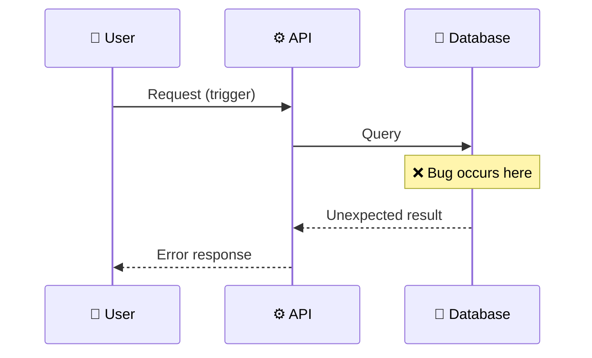

# Bug Report: [Brief Description]

> **Doc ID:** BUG-NNN-description
> **Date:** YYYY-MM-DD
> **Severity:** Critical | High | Medium | Low
> **Status:** Investigating | Root Cause Found | Fix Applied | Verified

## Observed Behavior

What happened? Include exact error messages, logs, or screenshots.

## Expected Behavior

What should have happened instead?

## Steps to Reproduce

1. Step 1
2. Step 2
3. Step 3

## Environment

- **Branch:** `main` / `feature/...`
- **Component:** [Which part of the system]
- **Triggered by:** [User action / automated test / monitoring alert]

## Root Cause Analysis

### Data Flow Diagram (Bug Path)

### Root Cause

Why did this happen? Trace the data flow backward from the symptom to the source.

### Contributing Factors

- [What made this possible? Missing validation? Race condition?]

## Fix Description

### Changes Made

| File              | Change      |
| ----------------- | ----------- |
| `path/to/file.ts` | Description |

### Why This Fix Works

[Explain the fix logic, not just what changed]

## Regression Prevention

- **Test added:** [Name of test that catches this bug]
- **Guard added:** [Validation, constraint, or check that prevents recurrence]

## Related Documents

- Feature: [Link to feature LLD if applicable]
- HLD: [Link to affected HLD if applicable]
