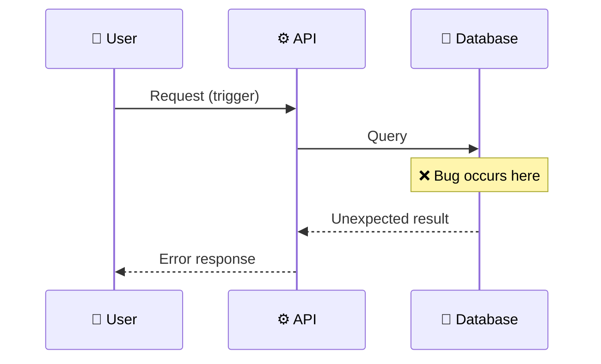

# Bug Report: [Brief Description]

> **Doc ID:** BUG-NNN-kebab-name
> **Date:** YYYY-MM-DD
> **DRI:** [Name — Directly Responsible Individual]
> **Severity:** Critical | High | Medium | Low
> **Status:** Investigating | Root Cause Found | In Progress | Fix Applied | Verified

## Observed Behavior

What happened? Include exact error messages, logs, or screenshots.

## Expected Behavior

What should have happened instead?

## Steps to Reproduce

1. Step 1
2. Step 2
3. Step 3

## Environment

- **Branch:** `main` / `feature/...`
- **Component:** [Which part of the system]
- **Triggered by:** [User action / automated test / monitoring alert]

## Root Cause Analysis

### Data Flow Diagram (Bug Path)

### Root Cause

Why did this happen? Trace the data flow backward from the symptom to the source.
Cite specific files + lines.

### Contributing Factors

- [What made this possible? Missing validation? Race condition? Doc drift?]

## Fix Description

### Changes Made

| File | Change |
|------|--------|
| `path/to/file.ts` | Description |

### Why This Fix Works

[Explain the fix logic, not just what changed. What invariant is now preserved?]

## Iteration Log

One entry per attempt. The Bug Report doc spans all attempts — never split a bug across multiple BUG-NNN docs. `fix:` commit only after the user explicitly confirms resolution.

| # | Date | Hypothesis | Change | Observed Result | User Verification |
|---|------|------------|--------|-----------------|-------------------|
| 1 | YYYY-MM-DD | [What you thought caused it] | [What you changed] | [What happened after] | Pending / Confirmed / Still broken |

If iteration #1 fails (user says "still broken"), append iteration #2 below — do not overwrite.

## Regression Prevention

- **Test added:** [Exact test function name + path — e.g. `apps/api/tests/test_auth.py::test_token_expiry_boundary`]
- **Guard added:** [Validation, constraint, or runtime check that prevents recurrence]

## Related Documents

- Feature LLD: [Link to related Feature LLD if applicable]
- Design Doc: [Link to affected component Design Doc — e.g. `docs/design/api-design.md`]
- ADR: [Link to ADR if the bug exposes a decision that needs revisiting]

## Changelog

Append-only. Add an entry at creation, on each status transition, and on each iteration.

| Date | Change |
|------|--------|
| YYYY-MM-DD | Initial draft — Status: Investigating |
