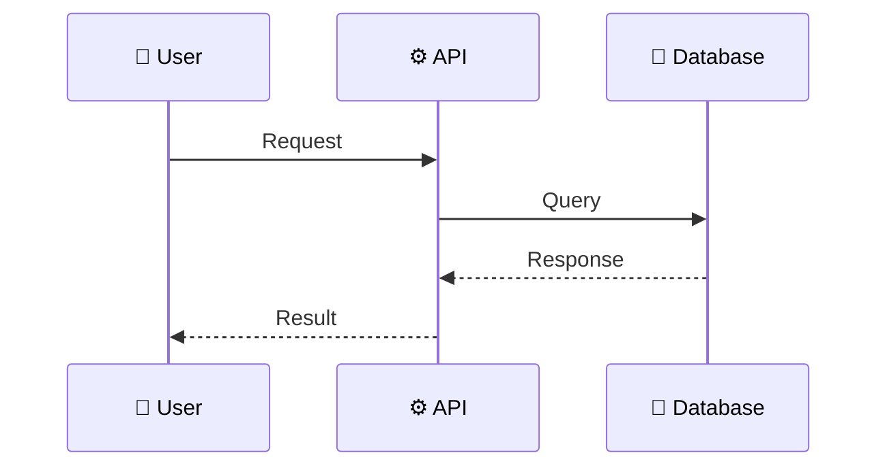

# Feature: [Feature Name]

> **Doc ID:** NNN-feature-name
> **Date:** YYYY-MM-DD
> **DRI:** [Name]
> **Status:** Draft | Proposed | Approved | In Progress | Implemented | Verified

## Problem Statement

What user problem does this solve? Why is it needed now?

## Success Criteria

- [ ] Criterion 1 (measurable)
- [ ] Criterion 2 (measurable)
- [ ] Criterion 3 (measurable)

## Scope

### In Scope

- Item 1
- Item 2

### Out of Scope

- Item 1 (and why)

## Design

### Architecture / Data Flow

### API Changes

| Method | Endpoint               | Description         |
| ------ | ---------------------- | ------------------- |
| POST   | `/api/v1/resource`     | Create new resource |
| GET    | `/api/v1/resource/:id` | Get resource by ID  |

### Database Changes

| Table        | Column        | Type   | Description    |
| ------------ | ------------- | ------ | -------------- |
| `table_name` | `column_name` | `type` | What it stores |

### Component Changes

| File              | Change                |
| ----------------- | --------------------- |
| `path/to/file.ts` | Description of change |

## Edge Cases & Error Handling

| Scenario                | Expected Behavior                 |
| ----------------------- | --------------------------------- |
| Invalid input           | Return 400 with validation errors |
| Resource not found      | Return 404                        |
| Concurrent modification | Optimistic locking with retry     |

## Security Considerations

- Authentication: [How is access controlled?]
- Authorization: [Who can do what?]
- Data sensitivity: [Any PII or secrets?]

## Testing Strategy

- **Unit tests:** [What functions to test]
- **Integration tests:** [What flows to test]
- **Edge case tests:** [What boundaries to verify]

## Dependencies

- [External service/library and version]

## Related Documents

- HLD: [Link to affected HLD]
- RFC: [Link to RFC if applicable]
