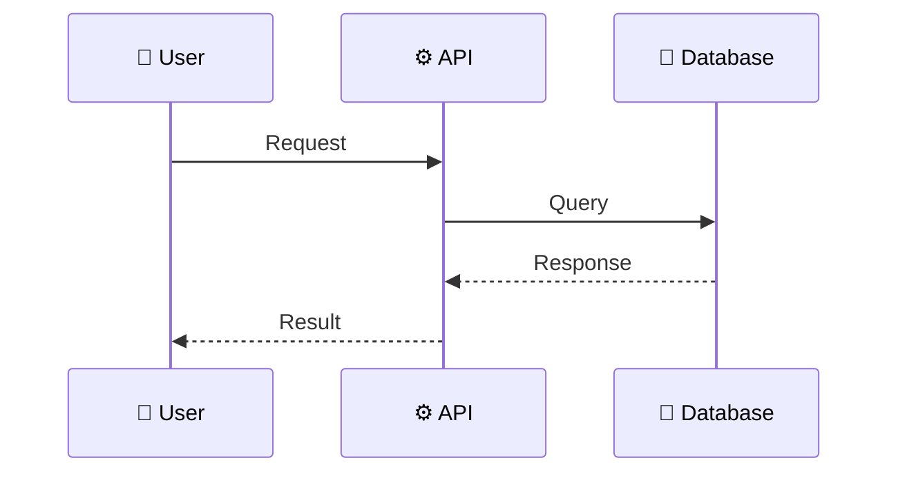

# Feature: [Feature Name]

> **Doc ID:** NNN-feature-name
> **Date:** YYYY-MM-DD
> **DRI:** [Name — Directly Responsible Individual]
> **Type:** Feature LLD
> **Status:** Draft | Proposed | Approved | In Progress | Implemented | Verified

## Problem Statement

What user problem does this solve? Why is it needed now? What happens if we don't ship it?

## Success Criteria

Measurable checkboxes. No prose. Each criterion must be verifiable from outside the implementation.

- [ ] Criterion 1 (measurable)
- [ ] Criterion 2 (measurable)
- [ ] Criterion 3 (measurable)

## Scope

### In Scope

- Item 1
- Item 2

### Out of Scope

- Item 1 (and why — defer reason, not just "not now")

## Design

### Architecture / Data Flow

### API Changes

| Method | Endpoint | Description |
|--------|----------|-------------|
| POST   | `/api/v1/resource` | Create new resource |
| GET    | `/api/v1/resource/:id` | Get resource by ID |

### Database Changes

| Table | Column | Type | Description |
|-------|--------|------|-------------|
| `table_name` | `column_name` | `type` | What it stores |

### Component Changes

| File | Change |
|------|--------|
| `path/to/file.ts` | Description of change |

## Edge Cases & Error Handling

| Scenario | Expected Behavior |
|----------|-------------------|
| Invalid input | Return 400 with validation errors |
| Resource not found | Return 404 |
| Concurrent modification | Optimistic locking with retry |

## Security Considerations

- **Authentication:** [How is access controlled?]
- **Authorization:** [Who can do what? Role/permission model.]
- **Data sensitivity:** [Any PII or secrets? How encrypted at rest / in transit?]
- **Threat model:** [What attacks must this resist? Rate limiting? Replay?]

## Testing Strategy

- **Unit tests:** [Exact functions / modules + what each covers]
- **Integration tests:** [End-to-end flows + which boundaries they cross]
- **Edge case tests:** [Boundary values, error paths, race conditions]
- **TDD vertical slicing:** one failing test → one implementation → repeat

## Dependencies

- [External service / library + version]
- [Internal package / module + path]

## Related Documents

- Design Doc: [Link to affected component Design Doc — e.g. `docs/design/api-design.md`]
- ADR: [Link to ADR that this feature implements or relies on]
- Plan: [Link to implementation plan in `docs/plans/`]

## Changelog

Append-only. Add an entry at creation and whenever implementation deviates from the original design.

| Date | Change |
|------|--------|
| YYYY-MM-DD | Initial draft — Status: Draft |
