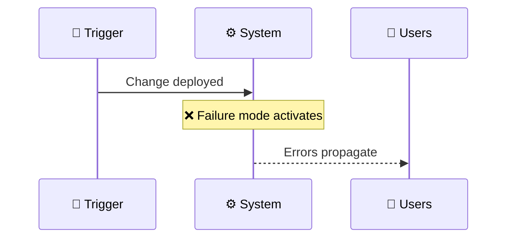

# Postmortem: [Incident Title]

> **Doc ID:** POSTMORTEM-YYYY-MM-DD-kebab-name
> **Date:** YYYY-MM-DD (incident date)
> **DRI:** [Author of postmortem — typically the on-call who handled the incident]
> **Status:** Draft | Reviewed | Action Items Tracked | Closed
> **Severity:** SEV1 | SEV2 | SEV3 | SEV4

Blameless postmortem in the Google SRE tradition. Refer to roles, never names ("the on-call engineer", not "Jane"). The goal is learning, not assigning fault.

## Summary

2-3 sentences. What broke, who was affected, how long.

## Impact

- **Users affected:** [Count + segment — e.g. "12% of authenticated users in EU region"]
- **Duration:** [Detection → mitigation → full resolution timestamps]
- **Revenue / SLO impact:** [Quantified where possible — failed requests, lost transactions, error budget burned]
- **Data integrity:** [Was data lost or corrupted? Recoverable?]

## Timeline

All times UTC. Use real timestamps from logs / pagers.

| Time | Event |
|------|-------|
| HH:MM | [First customer report / monitoring alert / change deployed] |
| HH:MM | [On-call paged] |
| HH:MM | [Initial investigation begins] |
| HH:MM | [Root cause hypothesis confirmed] |
| HH:MM | [Mitigation applied] |
| HH:MM | [Full resolution + monitoring confirms green] |

## Root Cause

What actually broke and why. Trace the causal chain backward from symptom to source. Cite specific files / commits / config changes.

### Trigger

[What initiated the failure — deploy, traffic spike, dependency outage, expired cert]

### Underlying cause

[The condition that turned the trigger into an incident — missing validation, fragile retry, untested code path]

## What Went Well

- [Detection mechanism that fired correctly]
- [Runbook that worked]
- [Person / team who acted decisively]

## What Went Wrong

- [Detection gap — was there a delay?]
- [Documentation gap — was a runbook missing?]
- [Process gap — escalation, communication]
- [Code / system gap — fragile component]

## Where We Got Lucky

What near-misses surfaced during this incident? What could have made it worse but didn't? This section is the highest-signal — surfaces latent risk.

- [Example: "A retry storm was prevented only because we had set max_retries=3 last quarter for an unrelated reason"]
- [Example: "If this had happened during peak hours, blast radius would have been 10x"]

## Action Items

Trackable, owned, due-dated. No aspirational items.

| Priority | Action | Owner | Due | Tracking |
|----------|--------|-------|-----|----------|
| P0 | [Specific change — e.g. "Add validation guard at apps/api/auth.py:42"] | [Owner] | YYYY-MM-DD | [Linear / GH issue link] |
| P1 | [Test or runbook addition] | [Owner] | YYYY-MM-DD | [link] |
| P2 | [Longer-term improvement] | [Owner] | YYYY-MM-DD | [link] |

## Lessons Learned

What pattern does this incident reveal? What rule, guardrail, or doc change would have prevented it?

- [Pattern — e.g. "We don't have an SLO for this service, so the alerting threshold was set arbitrarily"]
- [Rule change — e.g. "Add ADR-NNN: all auth-path changes require integration test on token expiry boundary"]

## Related Documents

- Bug Report: [BUG-NNN if a separate bug report was filed]
- ADR: [ADR-NNN if this incident drove a new architectural decision]
- Design Doc: [Affected component Design Doc]
- Runbook: [Updated or new runbook if this incident exposed a gap]

## Changelog

| Date | Change |
|------|--------|
| YYYY-MM-DD | Initial draft — Status: Draft |
