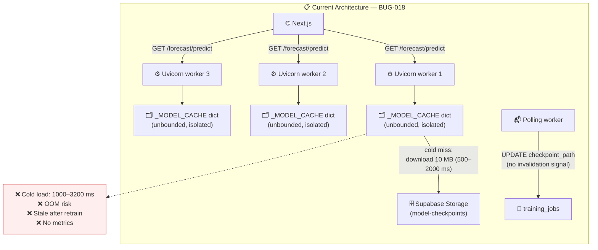
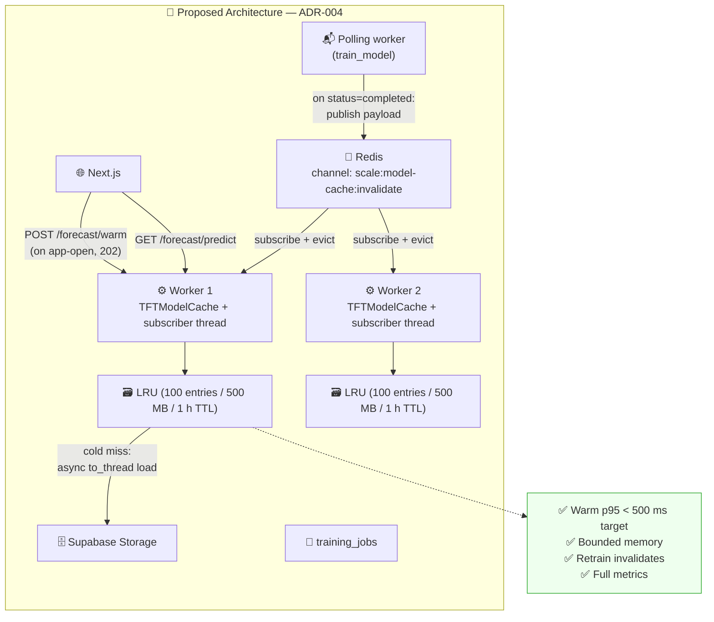

# ADR-004: TFT Inference Cache Architecture (Pre-warm + Bounded LRU + Redis Pub-Sub Invalidation)

> **Doc ID:** ADR-004-tft-inference-cache-architecture
> **Date:** 2026-04-17
> **DRI:** Mohammed Hassan Mohiddin
> **Status:** Implemented
> **OKR Alignment:** Q2 2026 — "Forecast API returns in under 500 ms at p95 on CPU for established users" (latency SLO in LLD 009 §Success Criteria). Resolves the deployment blocker documented in BUG-018; a precondition for flipping `docs/features/009-prediction-engine.md` status to `Verified` in production.

## Problem Statement

`docs/bugs/BUG-018-tft-inference-cold-load-no-bounded-cache.md` documents four structural deficiencies in the only existing TFT caching layer — the module-level dict `_MODEL_CACHE: Dict[str, Any] = {}` at `packages/forecasting/inference.py:24`:

1. **No bounded eviction** — `_MODEL_CACHE[user_id] = tft` grows unboundedly. A worker serving a few thousand distinct users will be OOM-killed.
2. **Per-process isolation** — uvicorn with `--workers N` creates N independent caches. The cold-load penalty is paid N times per user across the fleet, and a user's request load-balanced to a worker that has not served them yet pays the full 1–3 s cost even when another worker has the model warm.
3. **No invalidation hook** — `invalidate_cache()` is defined but has zero callers. After `apps/worker/main.py` writes a new `checkpoint_path` to `training_jobs`, API workers keep serving the old in-memory model indefinitely.
4. **No metrics** — no Prometheus counters, no cache-hit rate, no cold-load latency histogram. The 500 ms SLO in LLD 009 is unmeasurable in production.

Additionally, BUG-018 §"Observed Behavior" shows the cold-path latency breakdown: checkpoint download (500–2000 ms) plus model load (200–500 ms) plus inference (100–300 ms) plus Chronos-2 inference (150–400 ms) = **1,000–3,200 ms end-to-end on a cold miss**. Warm-path p95 is ~650 ms which *already* exceeds the SLO once Chronos-2 is added to every request. This ADR addresses the cold path; the warm-path headroom issue is noted as a follow-on.

If this is not solved now, LLD 009 cannot ship. Every first-request-per-user-per-worker blows the 500 ms SLO; every deploy resets the fleet to cold; retrained models are silently not used. The feature is inoperable in its current form.

## Proposed Solution

### Overview

Replace `_MODEL_CACHE` with a bounded LRU cache class (`TFTModelCache` in a new module `packages/forecasting/cache.py`) sized by **both** max-entries and max-bytes. Combine three mechanisms to control cold-miss frequency and freshness:

1. **Pre-warm on app-open** — a new `POST /forecast/warm` endpoint that fires a fire-and-forget background task loading the user's TFT into the serving worker's cache. The Next.js frontend calls it on app-open and on the AI Insights route navigation, so by the time `/forecast/predict` lands, the cache is hot.
2. **Redis pub-sub invalidation** — `apps/worker/main.py` publishes `(user_id, checkpoint_updated_at)` to a `scale:model-cache:invalidate` Redis channel immediately after transitioning `training_jobs.status → 'completed'`. Every API worker runs a daemon subscriber thread that evicts the cached entry on receipt. Reuses the Redis instance already deployed as Celery broker — zero new infra.
3. **TTL fallback** — each cached entry expires after 1 h (configurable), so even if a pub-sub message is lost the stale window is bounded. Server-side bulk pre-warm (e.g., top-100-active-users beat task) is deliberately **out of scope for v1**: the Celery worker process has its own separate Python runtime without the API's `TFTModelCache` singleton, so no server-initiated load can touch API-worker caches. Server-initiated pre-warm is tracked as a follow-on ADR.

Async contract: the blocking `TemporalFusionTransformer.load_from_checkpoint(...)` call is wrapped in `asyncio.to_thread(...)` so it runs in a threadpool and does not starve the FastAPI event loop. Concurrent cold misses for the same user are single-flight locked per `user_id` — the first request loads, the rest await the same result.

Prometheus metrics cover every lifecycle event: hits, misses, evictions by cause (LRU / invalidated / TTL), cold-load latency histogram, resident entries, resident bytes, pub-sub invalidations received. The 500 ms SLO becomes measurable and alertable.

### Architecture (Current → Proposed)

**Current State:**



**Proposed State:**



### Detailed Design

#### 1. Module — `packages/forecasting/cache.py` (new)

```python
"""Bounded LRU cache of per-user TFT models. Replaces the unbounded
module-level dict in inference.py (see BUG-018)."""

import asyncio
import logging
import os
import threading
from collections import OrderedDict
from dataclasses import dataclass
from datetime import datetime
from time import monotonic

from pytorch_forecasting import TemporalFusionTransformer
from supabase import Client

logger = logging.getLogger(__name__)


@dataclass
class CachedModel:
    """A single cache entry."""
    model: TemporalFusionTransformer
    checkpoint_path: str
    checkpoint_updated_at: datetime      # from training_jobs.updated_at
    size_bytes: int
    cached_at: float                     # monotonic()
    hit_count: int = 0


@dataclass
class CacheStats:
    hits: int
    misses: int
    evictions_lru: int
    evictions_invalidated: int
    evictions_ttl: int
    resident_entries: int
    resident_bytes: int


class TFTModelCache:
    """Thread-safe bounded LRU cache with per-user single-flight load locks."""

    def __init__(
        self,
        max_entries: int = 100,
        max_bytes: int = 500_000_000,    # 500 MB
        ttl_seconds: int = 3600,         # 1 h fallback invalidation
    ):
        self._entries: OrderedDict[str, CachedModel] = OrderedDict()
        self._lock = threading.RLock()
        self._max_entries = max_entries
        self._max_bytes = max_bytes
        self._ttl = ttl_seconds
        self._resident_bytes = 0
        # counters
        self.hits = 0
        self.misses = 0
        self.evictions_lru = 0
        self.evictions_invalidated = 0
        self.evictions_ttl = 0

    def get(self, user_id: str) -> CachedModel | None:
        with self._lock:
            entry = self._entries.get(user_id)
            if entry is None:
                self.misses += 1
                return None
            # TTL check
            if monotonic() - entry.cached_at > self._ttl:
                self._evict_unlocked(user_id, reason="ttl")
                self.misses += 1
                return None
            self._entries.move_to_end(user_id)           # LRU: mark as recently used
            entry.hit_count += 1
            self.hits += 1
            return entry

    def put(self, user_id: str, cached: CachedModel) -> None:
        with self._lock:
            if user_id in self._entries:
                self._resident_bytes -= self._entries[user_id].size_bytes
                del self._entries[user_id]
            self._entries[user_id] = cached
            self._resident_bytes += cached.size_bytes
            self._enforce_caps_unlocked()

    def invalidate(self, user_id: str) -> None:
        with self._lock:
            if user_id in self._entries:
                self._evict_unlocked(user_id, reason="invalidated")

    def stats(self) -> CacheStats:
        with self._lock:
            return CacheStats(
                hits=self.hits,
                misses=self.misses,
                evictions_lru=self.evictions_lru,
                evictions_invalidated=self.evictions_invalidated,
                evictions_ttl=self.evictions_ttl,
                resident_entries=len(self._entries),
                resident_bytes=self._resident_bytes,
            )

    def _enforce_caps_unlocked(self) -> None:
        while (
            len(self._entries) > self._max_entries
            or self._resident_bytes > self._max_bytes
        ):
            user_id, _ = next(iter(self._entries.items()))     # oldest
            self._evict_unlocked(user_id, reason="lru")

    def _evict_unlocked(self, user_id: str, *, reason: str) -> None:
        entry = self._entries.pop(user_id, None)
        if entry is None:
            return
        self._resident_bytes -= entry.size_bytes
        if reason == "lru":
            self.evictions_lru += 1
        elif reason == "invalidated":
            self.evictions_invalidated += 1
        elif reason == "ttl":
            self.evictions_ttl += 1


_inflight: dict[str, asyncio.Future[CachedModel | None]] = {}
_inflight_lock = asyncio.Lock()


async def get_or_load(
    cache: TFTModelCache,
    supabase: Client,
    user_id: str,
) -> CachedModel | None:
    """Single-flight async load.

    - Fast path: cache hit → return immediately (in-process dict lookup, no await).
    - Cold path: exactly one coroutine issues the blocking download via
      ``asyncio.to_thread``; concurrent callers for the same ``user_id`` await
      the same ``asyncio.Future`` rather than entering the threadpool. This
      eliminates head-of-line blocking of the anyio threadpool under concurrent
      cold-miss fan-out.
    """
    cached = cache.get(user_id)
    if cached is not None:
        return cached

    async with _inflight_lock:
        fut = _inflight.get(user_id)
        if fut is None:
            fut = asyncio.get_running_loop().create_future()
            _inflight[user_id] = fut
            leader = True
        else:
            leader = False

    if leader:
        try:
            result = await asyncio.to_thread(_download_and_load, supabase, user_id)
            if result is not None:
                cache.put(user_id, result)
            fut.set_result(result)
        except Exception as e:
            fut.set_exception(e)
            raise
        finally:
            async with _inflight_lock:
                _inflight.pop(user_id, None)
        return result

    return await fut


def _download_and_load(supabase: Client, user_id: str) -> CachedModel | None:
    """Migrated from the removed ``load_model()`` in inference.py. Runs synchronously
    inside the anyio threadpool (called via ``asyncio.to_thread``). Never called on
    the event-loop thread.

    Returns:
        CachedModel on success; None on any recoverable failure (missing checkpoint,
        Supabase Storage download error, PyTorch load exception). Caller falls back
        to Chronos-only path.
    """
    import io
    import sys
    from datetime import datetime

    # 1. Resolve latest completed training job for this user
    try:
        resp = (
            supabase.table("training_jobs")
            .select("checkpoint_path, updated_at")
            .eq("user_id", user_id)
            .eq("status", "completed")
            .order("created_at", desc=True)
            .limit(1)
            .execute()
        )
    except Exception as e:
        logger.error("load_job_fetch_failed", user_id=user_id, error=str(e))
        return None
    if not resp.data:
        logger.info("no_trained_model", user_id=user_id)
        return None
    row = resp.data[0]
    checkpoint_path: str = row["checkpoint_path"]
    updated_at_raw: str = row["updated_at"]
    try:
        checkpoint_updated_at = datetime.fromisoformat(updated_at_raw.replace("Z", "+00:00"))
    except Exception:
        checkpoint_updated_at = datetime.utcnow()

    # 2. Download checkpoint bytes
    try:
        buf = supabase.storage.from_("model-checkpoints").download(checkpoint_path)
    except Exception as e:
        logger.error("checkpoint_download_failed", checkpoint_path=checkpoint_path, error=str(e))
        return None

    # 3. Load via PyTorch
    try:
        with io.BytesIO(buf) as bio:
            model = TemporalFusionTransformer.load_from_checkpoint(bio, map_location="cpu")
            model.eval()
            model.freeze()
    except Exception as e:
        logger.error("checkpoint_deserialize_failed", checkpoint_path=checkpoint_path, error=str(e))
        return None

    # 4. Measure resident size: param count × 4 bytes (FP32) + buffer overhead
    param_bytes = sum(p.numel() for p in model.parameters()) * 4
    buffer_bytes = sum(b.numel() for b in model.buffers()) * 4
    size_bytes = param_bytes + buffer_bytes + sys.getsizeof(buf)

    return CachedModel(
        model=model,
        checkpoint_path=checkpoint_path,
        checkpoint_updated_at=checkpoint_updated_at,
        size_bytes=size_bytes,
        cached_at=monotonic(),
    )
```

#### 2. Redis pub-sub — `packages/forecasting/cache_invalidation.py` (new)

```python
"""Redis pub-sub channel for cross-worker TFT cache invalidation."""

import json
import logging
import os
import threading
import time

import redis

from packages.forecasting.cache import TFTModelCache

logger = logging.getLogger(__name__)

CHANNEL = "scale:model-cache:invalidate"


def publish_invalidation(
    user_id: str,
    checkpoint_updated_at: str,   # ISO 8601 — used as stale-guard on subscriber side
    redis_url: str | None = None,
) -> None:
    """Called from apps/worker/main.py AFTER writing training_jobs.status='completed'.
    Must run AFTER the DB commit: any follower that reacts to this message needs
    `training_jobs` to already reflect the new state so a subsequent
    `_download_and_load` fetches the new checkpoint.
    Failure to publish is logged but not raised — TTL fallback (1 h) covers the gap."""
    url = redis_url or os.environ["REDIS_URL"]
    try:
        r = redis.from_url(url)
        r.publish(CHANNEL, json.dumps({
            "user_id": user_id,
            "checkpoint_updated_at": checkpoint_updated_at,
        }))
    except Exception as e:
        logger.warning("cache_invalidation_publish_failed",
                       user_id=user_id, error=str(e))


def start_subscriber(cache: TFTModelCache, redis_url: str | None = None) -> threading.Thread:
    """Spawned by FastAPI lifespan startup. Daemon thread + reconnect-on-error loop.

    Important: each uvicorn worker process runs its own `lifespan`, so each
    spawns its own subscriber. Redis pub-sub fan-out delivers every published
    message to every subscriber. This is intentional — each worker has its own
    ``TFTModelCache`` to invalidate. There is no leader election; N workers
    produce N evictions, which is exactly the correct behaviour.
    """
    url = redis_url or os.environ["REDIS_URL"]

    def _loop() -> None:
        from datetime import datetime
        backoff = 1.0
        while True:
            try:
                r = redis.from_url(url)
                pubsub = r.pubsub()
                pubsub.subscribe(CHANNEL)
                logger.info("tft_cache_subscriber_connected", channel=CHANNEL)
                backoff = 1.0
                for msg in pubsub.listen():
                    if msg["type"] != "message":
                        continue
                    try:
                        payload = json.loads(msg["data"])
                        user_id = payload["user_id"]
                        # Out-of-order-delivery guard: if the incoming payload's
                        # timestamp is older than our cached entry's, skip the
                        # invalidation. Protects against a rare race where two
                        # retrain events publish in reverse order.
                        incoming_ts = datetime.fromisoformat(
                            payload["checkpoint_updated_at"].replace("Z", "+00:00"))
                        cached = cache._entries.get(user_id)      # non-locking peek
                        if cached is not None and cached.checkpoint_updated_at >= incoming_ts:
                            logger.info("cache_invalidation_skipped_stale_message",
                                        user_id=user_id)
                            continue
                        cache.invalidate(user_id)
                        logger.info("cache_invalidated_via_pubsub", user_id=user_id)
                    except Exception as e:
                        logger.error("cache_invalidation_dispatch_failed",
                                     error=str(e))
            except Exception as e:
                logger.error("tft_cache_subscriber_disconnected",
                             error=str(e), backoff_s=backoff)
                time.sleep(backoff)
                backoff = min(backoff * 2, 30.0)

    t = threading.Thread(target=_loop, daemon=True, name="tft-cache-invalidator")
    t.start()
    return t
```

#### 3. FastAPI lifespan bootstrap — `apps/api/main.py`

```python
from contextlib import asynccontextmanager
from fastapi import FastAPI
from packages.forecasting.cache import TFTModelCache
from packages.forecasting.cache_invalidation import start_subscriber

_TFT_CACHE: TFTModelCache | None = None


def get_tft_cache() -> TFTModelCache:
    assert _TFT_CACHE is not None, "TFT cache not initialised; lifespan not wired"
    return _TFT_CACHE


@asynccontextmanager
async def lifespan(app: FastAPI):
    global _TFT_CACHE
    _TFT_CACHE = TFTModelCache(
        max_entries=int(os.getenv("TFT_CACHE_MAX_ENTRIES", "100")),
        max_bytes=int(os.getenv("TFT_CACHE_MAX_BYTES", "500000000")),
        ttl_seconds=int(os.getenv("TFT_CACHE_TTL_SECONDS", "3600")),
    )
    start_subscriber(_TFT_CACHE)
    yield


app = FastAPI(lifespan=lifespan, ...)
```

`get_tft_cache` is a FastAPI dependency used by the service layer and the `/forecast/warm` endpoint.

#### 4. Worker invalidation publish — `apps/worker/main.py`

Append immediately after the successful `training_jobs.status='completed'` commit in `train_model`:

```python
from packages.forecasting.cache_invalidation import publish_invalidation

# After the row write:
# supabase.table("training_jobs").update({"status": "completed", ...}).eq("id", job_id).execute()
publish_invalidation(
    user_id=user_id,
    checkpoint_updated_at=datetime.now(timezone.utc).isoformat(),
)
```

**Ordering contract:** the publish MUST fire after the DB commit completes. Any follower
receiving the message may immediately re-load the model, and that load must see the
newly-written `training_jobs.status='completed'` row. Placing the publish after the DB
write guarantees linearisation.

Failure to publish is non-fatal (logged warning); TTL fallback covers missed messages.

#### 5. Pre-warm endpoint — `apps/api/domains/forecasting/router.py`

The rate limiter reuses the project's existing Redis sliding-window `RateLimiter` +
`rate_limit_dependency` pattern (`apps/api/core/rate_limiter.py`). The limiter instance
is constructed once in `apps/api/main.py` lifespan alongside the TFT cache and stashed
on `app.state.warm_rate_limiter`. The router resolves it via a per-request dependency.

```python
# apps/api/main.py — lifespan body, after _TFT_CACHE initialisation
app.state.warm_rate_limiter = rate_limit_dependency(
    RateLimiter(_redis_client, max_requests=1, window_seconds=300)   # 1 / 5 min
)

# apps/api/domains/forecasting/router.py
from fastapi import APIRouter, BackgroundTasks, Depends, Request

from apps.api.main import get_tft_cache
from packages.forecasting.cache import TFTModelCache, get_or_load


def _warm_rate_limit(request: Request):
    return request.app.state.warm_rate_limiter(request)


@router.post("/warm", status_code=202)
async def warm_model(
    background: BackgroundTasks,
    _rl: None = Depends(_warm_rate_limit),
    user_id: str = Depends(get_current_user_id),
    client: Client = Depends(get_user_client),
    cache: TFTModelCache = Depends(get_tft_cache),
):
    """Fire-and-forget TFT model warm for the current user.
    Returns 202 immediately; the load happens in the background task pool.
    Rate-limited to 1 call per 5 minutes per user via the existing Redis
    sliding-window limiter — exceeding returns 429 with Retry-After."""
    background.add_task(_warm_task, cache, client, user_id)
    return {"status": "warming", "user_id": user_id}


async def _warm_task(
    cache: TFTModelCache,
    client: Client,
    user_id: str,
) -> None:
    try:
        await get_or_load(cache, client, user_id)
    except Exception as e:
        logger.warning("tft_warm_task_failed", user_id=user_id, error=str(e))
```

Frontend calls `POST /forecast/warm` in `apps/web/app/layout.tsx` on first mount when
the user is authenticated, and again on navigation to `/insights`. Rate limit prevents
abuse (max one warm per 5 min per user). `slowapi` is NOT used — this is the same
limiter that gates `/api/import/*` at `apps/api/main.py:136–138`.

#### 6. Server-initiated bulk pre-warm — deliberately out of scope for v1

The obvious-looking design of "daily Celery beat task that pre-warms the top-N most-active
users into the cache" does not work with the current process topology and is therefore
**deferred to a follow-on ADR**. Two constraints make it non-trivial:

1. **Process-boundary isolation.** `TFTModelCache` lives in the API (uvicorn) process memory.
   A Celery worker is a separate Python process with its own memory space and its own
   (empty) module-level state. Calling `get_tft_cache()` from a Celery task would either
   raise `AssertionError` (no lifespan ran there) or — worse — silently pre-warm into the
   Celery worker's private memory, benefiting no API request.
2. **Cross-worker fan-out.** Even within API processes, a server-side initiator has to
   reach every uvicorn worker to populate every cache copy. Load-balancer round-robin
   does not guarantee coverage in a bounded number of internal calls.

Candidate server-initiated designs for the follow-on ADR:

- A new Redis pub-sub channel `scale:model-cache:prewarm` where publishing a user_id
  causes every API-worker subscriber to trigger `get_or_load` on its local cache.
- An internal `POST /internal/warm-bulk` endpoint called by a Celery beat task, fired
  enough times (with jitter) to probabilistically reach every worker.
- A persistent on-disk cache that survives restarts and is mapped by every worker on
  boot.

v1 relies exclusively on FE-initiated `POST /forecast/warm` (§5). For the 500 ms SLO to
hold on the first request after an API deploy, the frontend MUST issue the warm call
before the first forecast request — this is an explicit requirement on the FE.

#### 7. Service integration — `apps/api/domains/forecasting/service.py`

Replace every `load_model(self.supabase, user_id)` with:

```python
from apps.api.main import get_tft_cache
from packages.forecasting.cache import get_or_load

cache = get_tft_cache()
cached = await get_or_load(cache, self.supabase, user_id)
tft_model = cached.model if cached is not None else None
```

`predict()` becomes `async def` if it isn't already. Tests mock `get_tft_cache` via dependency override.

#### 8. Prometheus metrics + `/metrics` endpoint

> **New subsystem.** Grep for `prometheus_client`, `Counter(`, `Histogram(` across the
> repo returns zero hits — the project does not yet have Prometheus wiring. The existing
> `/metrics` route at `apps/api/domains/categorization/router.py:161` returns custom JSON,
> not Prometheus exposition format. This ADR stands up the Prometheus subsystem as part
> of its own scope. Specifically:
>
> - Add `prometheus-client>=0.20,<1.0` to `apps/api/requirements.txt`.
> - Create `apps/api/core/metrics.py` exposing a single module-level
>   `CollectorRegistry` (`REGISTRY`) plus factory functions `counter(name, doc, labels=())`,
>   `histogram(name, doc, labels=(), buckets=None)`, `gauge(name, doc, labels=())` that
>   wrap `prometheus_client` constructors and register into `REGISTRY`. All ADR-004
>   metrics are defined here as module-level singletons.
> - Register a FastAPI route at `/metrics/prom` (note: not `/metrics` — avoids collision
>   with the categorization JSON route). Returns `Response(content=generate_latest(REGISTRY),
>   media_type=CONTENT_TYPE_LATEST)`. Unauthenticated — Prometheus scrapers are behind
>   the internal VPC / ingress allowlist per the ops runbook.
> - Rename the categorization JSON route from `/metrics` to `/categorization/metrics` in
>   a separate follow-up (flagged in §Impact Assessment; out of scope for this ADR if it
>   would otherwise block).
>
> The eleven metrics below are emitted via `TFTModelCache.stats()` refresh on every
> request plus direct increments from `publish_invalidation`, the subscriber loop, and
> `get_or_load`:

| Name | Type | Meaning |
|---|---|---|
| `tft_cache_hits_total` | Counter | Cache hits (recency-promoted) |
| `tft_cache_misses_total` | Counter | Cache misses (triggered a load) |
| `tft_cache_evictions_total{reason="lru\|invalidated\|ttl"}` | Counter (labelled) | Evictions by cause |
| `tft_cache_load_duration_seconds` | Histogram | Cold-load latency (download + load); SLO watchdog fires off this histogram's `le="0.5"` bucket |
| `tft_cache_resident_entries` | Gauge | Currently cached model count |
| `tft_cache_resident_bytes` | Gauge | Currently cached bytes |
| `tft_cache_pubsub_invalidations_total` | Counter | Pub-sub invalidations received |
| `tft_cache_pubsub_invalidations_skipped_stale_total` | Counter | Subscriber skipped because incoming timestamp older than cached entry (H4 guard) |
| `tft_cache_pubsub_publish_failures_total` | Counter | `publish_invalidation` failures |
| `tft_cache_subscriber_reconnects_total` | Counter | Subscriber thread reconnects |
| `forecast_warm_outcome_total{result="ok\|429\|timeout\|error"}` | Counter (labelled) | Per Codex Fix #4 — closes the loop on FE-initiated `POST /forecast/warm` outcomes. Fed by the client via a new `POST /api/v1/metrics/client-event` route (JWT-authenticated, rate-limited 30/min). Lets ops detect a high `result="timeout"` rate (warm endpoint is slow) or `result="error"` rate (auth or network breakage) without inferring from cache hit/miss alone. |

All histograms use seconds per Prometheus convention; no separate `_ms` metric.
Grafana dashboard `dashboards/forecast-cache.json` out of scope for this ADR but tracked as a follow-up.

### Data Model Changes

**None.** Server-initiated bulk pre-warm is out of scope for this ADR (§6), so no
`top_active_users` RPC is created here. The follow-on ADR that implements bulk pre-warm
will own that migration.

`public.user_predictions` exists (from ADR-003). `training_jobs` unchanged.

### API Changes

| Method | Endpoint | Change |
|---|---|---|
| POST | `/api/v1/metrics/client-event` | **New per Codex Fix #4.** Accepts `{event: "forecast_warm_outcome", result: "ok\|429\|timeout\|error"}`. Increments `forecast_warm_outcome_total{result=...}`. JWT-authenticated, rate-limited 30/min/user via `RateLimiter + rate_limit_dependency`. Body validated by Pydantic; unknown event names rejected 400. |
| POST | `/forecast/warm` | **New.** Fire-and-forget TFT warm. Returns 202. JWT-authenticated. Rate-limited to 1 per 5 min per user. |
| GET | `/metrics/prom` | Prometheus exposition endpoint stood up by this ADR's §8. Carries all eleven new metric series listed above. |

No other endpoints change. `/forecast/predict` now consumes `get_tft_cache()` internally but the contract is unchanged from ADR-003.

## Alternatives Considered

### Alternative 1: Pre-warm on login only (BUG-018 option A, without the bounded LRU)

- **Pros:** Simplest. No Redis integration. Zero new moving parts.
- **Cons:** Only helps first-request-per-session. Post-deploy thundering herd still hits every user cold simultaneously. User who opens app and immediately checks forecast (< 1 s apart) still pays cold load. Per-worker isolation unresolved. Does not prevent OOM (the dict still grows unboundedly). Does not address retrain staleness.
- **Why rejected:** Addresses only one of the four BUG-018 defects. Ships a latency improvement at the cost of not solving the OOM or staleness problems, which are equally important.

### Alternative 2: Shared local mmap cache (BUG-018 option B)

- **Pros:** All workers on one host share one memory region. Sub-100 ms cold load via page fault rather than network I/O. Solves per-worker isolation.
- **Cons:** Requires host-shared-memory volumes — not available on serverless (Vercel, Lambda, Cloud Run). Complex cross-process eviction coordination. Platform-dependent — if SCALE migrates hosts, the cache architecture has to be rebuilt. mmap of PyTorch model state dicts requires custom serialization; `TemporalFusionTransformer.load_from_checkpoint` does not mmap natively.
- **Why rejected:** Platform lock-in and cross-process coordination complexity is disproportionate to the latency gain. The Redis pub-sub + per-worker LRU architecture here gets most of the benefit without the constraints.

### Alternative 3: Consistent-hash routing (BUG-018 option C)

- **Pros:** No cache code changes at all. L7 load balancer hashes `user_id` → same user always lands on same worker. Maximises cache locality.
- **Cons:** Requires an LB feature not universally available (Nginx `hash $cookie_user_id consistent` directive exists, AWS ALB requires custom Lambda@Edge, Vercel's serverless model effectively prohibits it). Post-deploy herd still cold for every user. Hot users can starve other users' cache slots on their pinned worker. If a worker dies, that subset of users experiences a total cold cache. Does not address staleness or OOM.
- **Why rejected:** Depends on infra that SCALE's current hosting may not support, and even when it does, it addresses only one defect. The Redis-based architecture does not make routing assumptions.

### Alternative 4: Supabase Realtime instead of Redis pub-sub

- **Pros:** Would extend to browser subscribers later (e.g., frontend subscribing to `cache.invalidated` to trigger a refetch).
- **Cons:** Higher latency (WSS through Supabase edge vs in-process Redis client). Counts against Supabase Realtime quotas (tight on free tier — 200 concurrent connections). Adds a second realtime dependency on a stack where Redis is already deployed. JavaScript-SDK-mapped-to-Python websocket handling is more code than `redis.pubsub().subscribe`.
- **Why rejected:** Redis is already in the stack as the Celery broker. Reusing it has zero marginal cost. Browser-subscriber use case is speculative.

### Alternative 5: Persistent per-worker disk cache

- **Pros:** Survives worker restarts. Cold-start after deploy is disk-read, not network-read.
- **Cons:** Requires a writable persistent volume per worker (not available on serverless). Stale-detection harder. For 100 × 10 MB = 1 GB disk per worker, cost is meaningful at scale.
- **Why rejected:** Architectural complexity for a narrow improvement. The TTL + pre-warm-on-boot combination handles post-deploy cold-start adequately. Revisit if deploy cadence becomes > daily.

## Impact Assessment

### What Changes

- **Backend — new files:**
  - `packages/forecasting/cache.py` — `TFTModelCache`, `CachedModel`, `CacheStats`, `get_or_load`, `_download_and_load`, `_inflight` future table
  - `packages/forecasting/cache_invalidation.py` — `publish_invalidation`, `start_subscriber`, `CHANNEL`
  - `packages/forecasting/tests/test_cache.py`
  - `packages/forecasting/tests/test_cache_invalidation.py`
  - `apps/api/core/metrics.py` — module-level `CollectorRegistry` + counter/histogram/gauge factories + all eleven ADR-004 metric singletons
  - `apps/api/domains/forecasting/tests/test_warm_endpoint.py`
  - `apps/worker/tests/test_train_publishes_invalidation.py`
- **Backend — modified files:**
  - `packages/forecasting/inference.py` — **DELETE** `_MODEL_CACHE`, `load_model`, `invalidate_cache`. `_download_and_load` body migrates into `cache.py`.
  - `apps/api/main.py` — `lifespan` instantiates `TFTModelCache`, starts the subscriber thread, and constructs `app.state.warm_rate_limiter` via the existing `RateLimiter` + `rate_limit_dependency` pattern (no slowapi).
  - `apps/api/domains/forecasting/service.py` — replace `load_model(...)` with `await get_or_load(cache, ...)`. `predict()` becomes `async`.
  - `apps/api/domains/forecasting/router.py` — add `POST /forecast/warm` endpoint with `_warm_rate_limit` dependency.
  - `apps/worker/main.py` — call `publish_invalidation(user_id, checkpoint_updated_at)` immediately after the successful `status='completed'` DB commit.
  - `apps/api/main.py` — register a new `GET /metrics/prom` route returning `generate_latest(REGISTRY)` (distinct from the existing `/metrics` JSON route at `apps/api/domains/categorization/router.py:161`; renaming that to `/categorization/metrics` is flagged as a follow-up and out of scope).
- **Dependencies:**
  - `apps/api/requirements.txt` — add `prometheus-client>=0.20,<1.0`.
- **Config:**
  - New env vars: `TFT_CACHE_MAX_ENTRIES`, `TFT_CACHE_MAX_BYTES`, `TFT_CACHE_TTL_SECONDS`. Defaults in code; override via `.env`.
- **Out of scope (tracked for follow-on ADR):**
  - Celery-beat server-initiated bulk pre-warm (`warm_hot_models` task, `top_active_users` RPC, beat-schedule entry). §Detailed Design #6 explains why this cannot be done safely in v1 without additional cross-process plumbing.
- **Docs:**
  - `docs/bugs/BUG-018-tft-inference-cold-load-no-bounded-cache.md` changelog — append "Fix architecture chosen: see ADR-004" entry. Status `Root Cause Found → Fix Applied` once code lands.
  - `docs/features/009-prediction-engine.md` changelog — append DEVIATION entry noting that LLD 009's implicit "singleton pattern for Chronos-2" (line 289–291) now applies to both tiers via `TFTModelCache` for TFT + the existing singleton for Chronos-2.
  - `docs/design/system-architecture.md` — add cache + pub-sub lane to the forecast sequence diagram.

### What Could Break

| Risk | Assessment | Mitigation |
|---|---|---|
| Deleting `_MODEL_CACHE` breaks existing tests in `test_inference.py` | **Medium.** Some tests import `_MODEL_CACHE` directly to seed fixtures. | Migrate all references to `TFTModelCache` constructor + `put()`/`get()`. Run `grep -rn "_MODEL_CACHE" packages/ apps/` before merge and remove every hit. |
| Subscriber thread dies silently, cache goes stale until TTL | **Low.** Reconnect loop with exponential backoff should recover from transient Redis failures. | Prometheus counter `tft_cache_subscriber_reconnects_total` alerts on rate > 5/min. Future: replace threading-based subscriber with asyncio task inside lifespan so failures show up in FastAPI's logs. |
| `asyncio.to_thread` starves the threadpool under heavy cold-miss fan-out | **Low.** Single-flight via `asyncio.Future` (§1) ensures at most ONE `to_thread` call per user, not one per request. Concurrent cold misses for the same user share a single future. Distinct-user cold misses scale with the anyio threadpool default (40 threads). | Measured in Phase 10 load test. If observed in production, raise `settings.thread_pool_size` or add a `asyncio.Semaphore` at the `_inflight`-leader entry point. |
| Pre-warm endpoint abuse | **Low.** JWT-authenticated; rate-limited to 1 call / 5 min per user via the existing `RateLimiter` (Redis sliding window, 429 with Retry-After). A single authenticated user cannot burst the endpoint. The "many distinct users" vector requires many valid JWTs — controlled upstream by auth. | Reuse `RateLimiter + rate_limit_dependency` pattern from `apps/api/main.py:136–138`. |
| `get_tft_cache()` called before `lifespan` startup completes | **Low.** FastAPI guarantees `lifespan.enter` runs before the first request. | `assert _TFT_CACHE is not None` in `get_tft_cache()` raises a clear error if misused (e.g., from a test that imports the service without lifespan). |
| Cache size estimate (5–15 MB per model) is wrong on CPU with frozen graph | **Medium.** If resident size is higher than budgeted, eviction churns more than expected. | `CachedModel.size_bytes` is measured at insertion time via `sys.getsizeof` + parameter-count × 4-byte float; real figure validated in pass-1 load test. Raise `max_bytes` in env if measured > budget. |
| Redis evicts pub-sub messages under memory pressure | **Very low.** Pub-sub messages are not persisted; delivery to current subscribers is best-effort. | TTL fallback catches any missed invalidation within 1 h. Grafana panel tracks `tft_cache_pubsub_invalidations_total` vs `training_jobs.status='completed'` DB count to detect drift. |

### Migration Strategy

Single-commit deployment, no feature flag. No data-layer migration in v1.

1. Deploy backend (API + worker) with the new cache module. Rolling deploy is safe:
   - Old workers still serve predictions via `_MODEL_CACHE` (if not yet deleted) or via the new cache (if deleted). Because the cache replacement is a drop-in at the service-layer boundary, a mixed fleet works.
   - Once all old workers are cycled, `_MODEL_CACHE` is gone and the only path is the new cache.
2. Frontend ships the `POST /forecast/warm` call on the subsequent FE release (independent timing).

Zero downtime. No user-visible changes until the frontend wires `/forecast/warm`; the cache transparently replaces the unbounded dict.

**Rollback:** Revert the backend deploy. No data to unwind. Pub-sub channel goes silent — no listeners, no harm.

## Success Metrics

| Metric | Current (BUG-018 baseline) | Target (30 days post-launch) |
|---|---|---|
| Cold-miss p95 latency (`tft_cache_load_duration_seconds`) | 1000–3200 ms (estimated) | ≤ 1500 ms p95 — bounded by Supabase Storage download + single model load |
| Warm-hit p95 latency (forecast request, cache hit) | ≤ 700 ms | ≤ 500 ms (matches LLD 009 SLO) |
| Forecast request cache-hit rate | 0 % (cache doesn't work across workers or across sessions) | ≥ 80 % once FE ships `POST /forecast/warm` on app-open; cold-load-per-session amortises across hour-plus sessions |
| Worker RSS under sustained load | unbounded (OOM at ~2 k distinct users) | ≤ 1.5 GB per worker (500 MB cache + 500 MB Chronos-2 + 500 MB headroom) |
| Time from `training_jobs.status='completed'` → cached model invalidated on serving workers | infinite (manual restart only) | ≤ 2 s (Redis pub-sub delivery) at p99 |
| `tft_cache_subscriber_reconnects_total` | n/a | < 5 per worker per day |
| Frontend app-open to `/forecast/predict` cache-hit rate | 0 % (always cold) | ≥ 80 % once FE ships `/forecast/warm` |

## Timeline

| Phase | Duration | Deliverable |
|---|---|---|
| Phase 1 | 0.5 day | ADR-004 spec review + user approval + merge |
| Phase 2 | 1 day | `packages/forecasting/cache.py` + tests (TDD) including `asyncio.Future` single-flight |
| Phase 3 | 0.5 day | `cache_invalidation.py` + tests (fakeredis + reconnect loop) |
| Phase 4 | 0.5 day | `apps/api/main.py` lifespan + `get_tft_cache` + `app.state.warm_rate_limiter` |
| Phase 5 | 0.5 day | Worker `publish_invalidation` wiring + test (polling worker, NOT Celery) |
| Phase 6 | 0.5 day | `POST /forecast/warm` endpoint + test via existing `RateLimiter + rate_limit_dependency` (no slowapi) |
| Phase 7 | 1 day | Prometheus subsystem: add `prometheus-client` dependency, create `apps/api/core/metrics.py` (`CollectorRegistry` + factories + eleven ADR-004 metrics), register `/metrics/prom` route, update ops-runbook note on the existing `/metrics` JSON route naming collision |
| Phase 8 | 0.5 day | `inference.py` deletion + service-layer migration + integration tests |
| Phase 9 | 1 day | End-to-end load test, latency benchmark, append observed p50/p95 per metric as a new Research doc `docs/research/NNN-rfc-004-load-test.md` |

Total: ~6 engineering-days. Parallelisable to ~4 days (cache module + invalidation + metrics subsystem are independent).

## Decision

> **Decision:** Proposed — pending user review
> **Date:** 2026-04-17
> **Rationale:** Hybrid approach (pre-warm + bounded LRU + Redis pub-sub + TTL fallback) addresses all four BUG-018 defects simultaneously: OOM-safe via LRU, cross-worker consistent via pub-sub, retrain-aware via invalidation, measurable via Prometheus. Zero new infrastructure (Redis already runs for Celery); Prometheus subsystem is introduced here as an explicitly-scoped side-effect of making the SLO measurable. Graceful degradation on every partial failure: publish fails → TTL catches within 1 h; subscriber dies → reconnect loop; load fails → service-layer Chronos-only fallback (inherited from ADR-003 service routing, not defined here). Server-initiated bulk pre-warm is deliberately scoped out to a follow-on ADR because pre-warming into the Celery worker's address space cannot populate API-worker caches. The remaining warm-path headroom issue (Chronos-2 inference brings p95 near the SLO ceiling) is a separate concern tracked for a follow-on.

## Related Documents

- Bug: `docs/bugs/BUG-018-tft-inference-cold-load-no-bounded-cache.md` — defect this ADR resolves
- Feature LLD: `docs/features/009-prediction-engine.md` — the < 500 ms SLO; this ADR is a precondition for the `Verified` status
- Related ADR: `docs/adr/ADR-003-forecast-api-schema-and-prediction-logging.md` — established the `user_predictions` table and the forecast-API contract this ADR caches models for
- HLD to update after implementation: `docs/design/system-architecture.md` — add cache + pub-sub lane to the prediction-engine sequence diagram
- Follow-on ADR (not yet authored): server-initiated bulk pre-warm (`warm_hot_models` + `top_active_users` RPC) — scoped out of this ADR per §6
- Existing code references: `packages/forecasting/inference.py:24` (`_MODEL_CACHE` — being deleted), `apps/worker/main.py:37` (`train_model` — gaining `publish_invalidation` call after the DB commit)

## Changelog

| Date | Entry |
|---|---|
| 2026-04-17 | Initial draft. Architecture chosen after brainstorming BUG-018's four candidate options (pre-warm, mmap, consistent-hash, hybrid): hybrid prevails because it is the only option that addresses all four structural defects enumerated in BUG-018. Redis pub-sub selected over Supabase Realtime for the invalidation channel because Redis is already deployed as the Celery broker and has lower latency for the single-producer / few-consumer traffic pattern. Status: Proposed. |
| 2026-04-17 | Spec review pass 1 fixes. C1: removed slowapi (doesn't exist in repo) — rewrote `/forecast/warm` endpoint to use the existing `RateLimiter + rate_limit_dependency` pattern from `apps/api/main.py`. C2: dropped the false "existing `prometheus_client` wiring" claim; the ADR now explicitly stands up the Prometheus subsystem (`prometheus-client` dependency, new `apps/api/core/metrics.py`, new `/metrics/prom` route, named-collision note vs the existing `/metrics` JSON route in categorization). C3: removed the server-initiated `warm_hot_models` Celery beat task because pre-warming into the Celery worker's memory cannot populate API-worker caches — deferred to a follow-on ADR; v1 relies on FE-initiated `POST /forecast/warm`. C4: replaced the `threading.Lock`-inside-`asyncio.to_thread` single-flight pattern (threadpool head-of-line blocking risk) with an `asyncio.Future`-based leader/follower pattern under a single `asyncio.Lock`, with cleanup on completion. H1: dropped the `top_active_users` RPC (no longer needed after C3). H4: `publish_invalidation` payload slimmed to `(user_id, checkpoint_updated_at)`; subscriber uses timestamp as stale-guard to skip out-of-order messages. H5: documented per-worker subscriber fan-out intent. Dropped `forecast_cold_load_latency_ms` (unit collision with `_seconds`); SLO watchdog fires off histogram bucket. Removed `from __future__ import annotations` imports (redundant on 3.14). |
| 2026-04-17 | **Codex Fix #4** (medium) — paired with LLD-011 update. Warm path was fire-and-forget with no observability and no first-request latency contract. Added counter `forecast_warm_outcome_total{result="ok\|429\|timeout\|error"}` (eleventh metric) and new `POST /api/v1/metrics/client-event` route (JWT + rate-limited 30/min) so client warm outcomes are server-side measurable. LLD 011 takes the bounded-wait + race-with-predict pattern. |
| 2026-05-04 | Status flipped Proposed → Implemented. `packages/forecasting/cache.py` (TFTModelCache + LRU + byte-cap + TTL + single-flight) + `cache_invalidation.py` (Redis pub-sub publish/subscribe + stale-guard + reconnect) + `apps/api/core/metrics.py` (eleven Prometheus metrics on a private `CollectorRegistry`) + lifespan wiring + `POST /forecast/warm` + `GET /metrics/prom` + `POST /api/v1/metrics/client-event` landed in master-plan Stage 3; lifespan loader `default_supabase_loader` wired in Stage 5; legacy `_MODEL_CACHE`/`load_model`/`invalidate_cache` shims deleted from `inference.py` in Stage 5. DEVIATION: pub-sub channel name set to `tft_cache_invalidation` in code; this ADR's prose said `scale:model-cache:invalidate` — code is canonical. BUG-018 status: Fix Applied (real-Redis runtime check still pending production deploy). |
