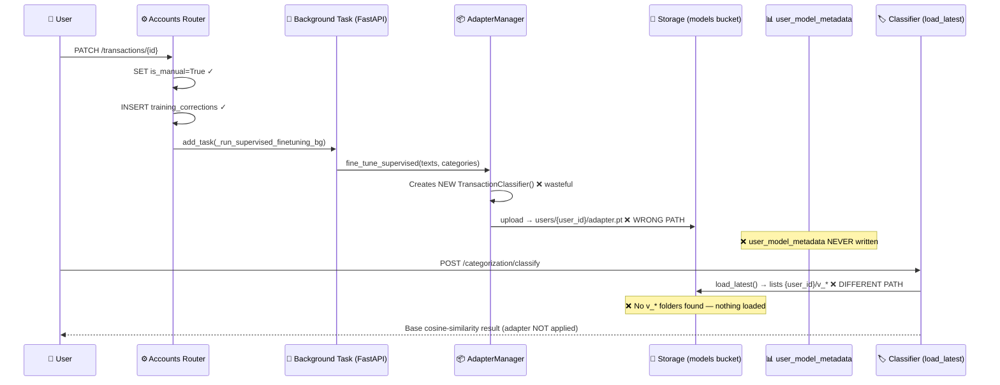

# Bug Report: Linear Adapter Broken Pipeline

> **Doc ID:** BUG-002-linear-adapter-broken-pipeline
> **Date:** 2026-03-16
> **Status:** Root Cause Found
> **Severity:** High
> **DRI:** Hassan
> **Type:** Bug Report

---

## 1. Observed Behavior

`user_model_metadata` is always empty in Supabase — `correction_count`, `adapter_url`, and
`adapter_updated_at` are never set, even after the user makes category corrections via the
dashboard. All classification calls use the base cosine-similarity model regardless of how
many corrections have been made.

---

## 2. Expected Behavior

After a user corrects a transaction category:

1. A `LinearAdapter` is trained on the correction data.
2. The adapter `.pt` file is uploaded to the `models` Supabase Storage bucket.
3. `user_model_metadata` is upserted: `adapter_url` set, `correction_count` incremented,
   `adapter_updated_at` refreshed.
4. Subsequent `POST /categorization/classify` calls load the adapter from
   `user_model_metadata.adapter_url` and apply it, overriding the base cosine-similarity result.

---

## 3. Steps to Reproduce

1. Log in and upload a bank statement.
2. Open any transaction; change its category (triggers `PATCH /accounts/transactions/{id}`).
3. Check Supabase table `user_model_metadata` — row is missing or empty.
4. Make further corrections; call `POST /categorization/classify` on a corrected transaction.
5. Observe: classification returns the base model prediction, not the user-corrected category.

---

## 4. Environment

- **Branch:** `feat/account-aggregator` (affects all branches — no adapter was ever working)
- **Components:**
  - `packages/categorization/classifier.py`
  - `packages/categorization/model_registry.py`
  - `packages/categorization/adapter_manager.py`
  - `apps/api/domains/accounts/router.py`
  - `apps/api/tasks/training_tasks.py`
- **Trigger:** Any category correction via `PATCH /accounts/transactions/{id}`

---

## 5. Root Cause Analysis

There is no dedicated Feature LLD for the v2 classifier / LinearAdapter system. It was
implemented across multiple files without a central design document, which led directly to
the split-brain architecture described here. **The absence of documentation is itself a
root cause.**

There are five interconnected bugs. No single fix resolves the symptom — all five must be
addressed together.

### Bug Path Diagram



### Bug 1 — No writer for `user_model_metadata` (root cause of observed symptom)

**File:** `packages/categorization/model_registry.py:28-65`

`save_version()` uploads the `.pt` file to Storage and returns a `ModelVersion` dataclass
but **never writes to `user_model_metadata`**.

**File:** `packages/categorization/adapter_manager.py:68-88`

`save_user_adapter()` saves to Storage but also **never writes to `user_model_metadata`**.

The table was defined in migration `20260301000000_user_model_metadata.sql` to serve as the
canonical pointer to a user's adapter. No code populates it.

---

### Bug 2 — Storage path split brain (adapter saved to path classifier never reads)

Two incompatible storage paths are in use simultaneously:

| Code path | Saves to | Callers |
|---|---|---|
| `AdapterManager.save_user_adapter()` | `users/{user_id}/adapter.pt` | `_run_supervised_finetuning_bg` (PATCH flow) |
| `model_registry.save_version()` | `{user_id}/v_{timestamp}/adapter.pt` | `train_adapter_task` (Celery manual training) |
| `model_registry.load_latest()` | Expects `{user_id}/v_*/adapter.pt` | All classification calls |

The background task triggered by user corrections uses `AdapterManager`, which saves to
`users/{user_id}/adapter.pt`. The classifier's `load_latest()` lists the `{user_id}/` prefix
and filters for folders starting with `v_` — it will never find anything saved under `users/`.
Adapters from the background task are permanently unreachable.

**Files:** `apps/api/domains/accounts/router.py:39-71`, `packages/categorization/model_registry.py:68-100`

---

### Bug 3 — `AdapterManager` is dead code in the live classification pipeline

`AdapterManager` is only called by `_run_supervised_finetuning_bg` in the accounts router.
The classification path (`categorization/service.py → load_latest`) never uses it.
Additionally, `AdapterManager.fine_tune_supervised()` creates a brand-new
`TransactionClassifier()` from scratch, loading the full 22M-parameter MiniLM model into
memory, while the FastAPI process already holds a singleton.

**Files:** `packages/categorization/adapter_manager.py:103-125`, `apps/api/domains/accounts/router.py:54-63`

---

### Bug 4 — `training_corrections` table is write-only (never read by any training job)

`training_corrections` receives writes from two sources:

- `POST /categorization/feedback` → `{user_id, description, corrected_category}`
- `PATCH /accounts/transactions/{id}` → `{user_id, transaction_id, description, original_category, corrected_category}`

But `POST /training/train` (the manual Celery training endpoint) reads from
`transactions WHERE is_manual=True`. It never reads `training_corrections`.
The table is an audit log with no consumer.

**Files:** `apps/api/domains/categorization/router.py:138`, `apps/api/domains/accounts/router.py:382-391`, `apps/api/domains/training/router.py:273-280`

---

### Bug 5 — `training_jobs` status CHECK constraint blocks `"queued"` inserts

`schema.sql` defines the CHECK constraint as:

```sql
status IN ('pending', 'running', 'processing', 'completed', 'failed')
```

The training router inserts `status: "queued"` — which is **not in the allowed set**.
Every `POST /training/train` and `POST /training/upload` will fail at the
`INSERT INTO training_jobs` step with a CHECK constraint violation.

**File:** `apps/api/domains/training/router.py:143-151` (insert with `"queued"`),
`architecture/schema.sql:157-159` (constraint definition).

---

## 6. Fix Description

### Fix 1 — Write to `user_model_metadata` inside `save_version()` (Bugs 1 + 2 partial)

After the Storage upload in `model_registry.save_version()`, add a service-role upsert:

```python
client.table("user_model_metadata").upsert({
    "user_id": user_id,
    "adapter_url": storage_path,
    "adapter_updated_at": datetime.utcnow().isoformat(),
}, on_conflict="user_id").execute()
# correction_count: use a separate RPC or increment query
```

`correction_count` must be incremented atomically — use a Postgres RPC
(`UPDATE ... SET correction_count = correction_count + N`) to avoid race conditions.

---

### Fix 2 — Replace `AdapterManager` in background task with `model_registry` (Bugs 2 + 3)

Rewrite `_run_supervised_finetuning_bg` in `apps/api/domains/accounts/router.py`:

1. Use `get_classifier()` singleton (no re-instantiation).
2. Call `classifier.train_adapter(texts, categories)` directly.
3. Call `model_registry.save_version(service_client, user_id, adapter.state_dict(), metrics)`.

This saves to `{user_id}/v_{timestamp}/adapter.pt` — the path `load_latest()` can find —
and triggers Fix 1 to populate `user_model_metadata`.

---

### Fix 3 — Connect `training_corrections` to the training pipeline (Bug 4)

Option A (preferred): When `POST /categorization/feedback` is called, also update
matching `transactions` rows with `is_manual=True` and the corrected category.
This keeps `POST /training/train` working as-is.

Option B: Change `POST /training/train` to also query `training_corrections` and merge
with `is_manual=True` transactions before training.

---

### Fix 4 — Add `"queued"` to the `training_jobs` status constraint (Bug 5)

```sql
ALTER TABLE training_jobs DROP CONSTRAINT training_jobs_status_check;
ALTER TABLE training_jobs ADD CONSTRAINT training_jobs_status_check
    CHECK (status = ANY(ARRAY[
        'pending','queued','running','processing','completed','failed'
    ]));
```

---

### Fix 5 — Remove `AdapterManager` (cleanup from Fix 2)

Once `_run_supervised_finetuning_bg` no longer uses `AdapterManager`, the class has zero
callers. Delete `packages/categorization/adapter_manager.py`.

---

## 7. Regression Prevention

Tests to add **before** implementing any fix (TDD — write failing test first):

| Test | Asserts |
|---|---|
| `test_save_version_writes_user_model_metadata` | `user_model_metadata` row created/updated after `save_version()` |
| `test_load_latest_finds_adapter_after_background_task` | After PATCH correction + background task, `load_latest()` returns non-None |
| `test_adapter_applied_after_correction` | E2E: correct a transaction, classify same description, confidence differs from base |
| `test_training_corrections_feeds_training` | After `POST /feedback`, training job uses those corrections |
| `test_training_jobs_insert_with_queued_status` | `INSERT INTO training_jobs (status='queued')` does not raise constraint violation |

---

## 8. Related Documents

| Document | Relation |
|---|---|
| `docs/design/database-design.md` | `user_model_metadata`, `training_corrections` table definitions |
| `docs/design/system-architecture.md` | ML pipeline — needs update to reflect v2 classifier + adapter training flow |
| `packages/categorization/classifier.py` | `LinearAdapter`, `train_adapter()`, `predict_batch()` |
| `packages/categorization/model_registry.py` | `save_version()`, `load_latest()` — fix targets |
| `apps/api/tasks/training_tasks.py` | `train_adapter_task` — uses correct path, missing `user_model_metadata` write |
| `apps/api/domains/accounts/router.py` | `_run_supervised_finetuning_bg` — uses wrong path |

---

## Changelog

| Date | Change |
|---|---|
| 2026-03-16 | Initial report — 5 root causes identified, fix strategy documented |
