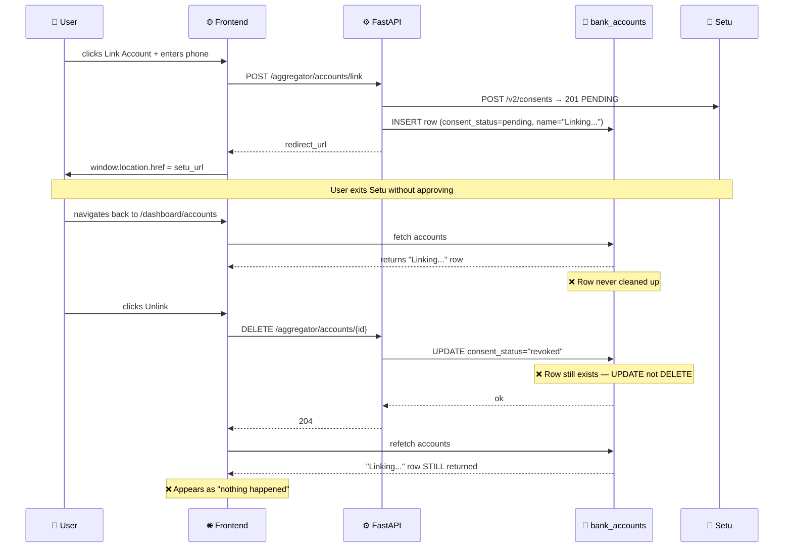

# Bug Report: Setu AA — Phantom "Linking..." Accounts, Broken Unlink, and v2 Payload Errors

> **Doc ID:** BUG-004-setu-phantom-account-unlink-and-v2-payload
> **Date:** 2026-03-16
> **Status:** Root Cause Found
> **DRI:** Hassan
> **Severity:** High

## Observed Behavior

1. When a user initiates account linking and then exits/rejects the Setu consent flow, the account remains permanently in the accounts list as "Linking..." with consent_status `revoked` or `pending`. It is never automatically removed.
2. Clicking the "Unlink" button on a pending/revoked account visually does nothing — the account stays in the list.
3. `fetch_transactions` has not been updated for the v2 API. It uses v1-style payload keys (`DataRange`, `consentId`, `format`) against the `/v2/fi/fetch` endpoint, which will cause failures when sync is triggered on any linked account.
4. `consentDuration.value` in `initiate_consent` is sent as the string `"12"` instead of the integer `12`.

## Expected Behavior

1. If a user exits or rejects the Setu consent flow, the pending bank_accounts record should be cleaned up (deleted). The account list should not show a permanently-stuck "Linking..." entry.
2. Clicking "Unlink" on any non-manual account (whether pending, revoked, or active) should **delete** the record and remove it from the list.
3. `fetch_transactions` should send the correct v2 payload keys to `/v2/fi/fetch`.
4. `consentDuration.value` should be an integer.

## Steps to Reproduce

**Bug 1 + 2 (phantom account / broken unlink):**
1. Click "Link Account" → enter phone number → click "Continue"
2. Backend creates consent with Setu, inserts bank_accounts row (`account_name: "Linking..."`, `consent_status: "pending"`)
3. Browser navigates to Setu consent webview (`fiu-uat.setu.co/v2/consents/webview/{id}`)
4. User exits OneMoney (e.g., sees "no accounts found" and clicks Exit, or presses browser Back)
5. Setu redirects browser to `SETU_REDIRECT_URL?consent_id={id}` (our `/dashboard/accounts/callback`)
6. Callback page calls `GET /aggregator/accounts/callback?consent_id={id}` → `handle_callback` runs
7. `check_consent_status` returns `"REVOKED"` from Setu (the status for an abandoned/exited consent)
8. `handle_callback` hits the `else` branch at `service.py:72` → calls `UPDATE consent_status="revoked"` — does NOT delete
9. Callback page redirects to `/dashboard/accounts`; account still exists with consent_status `"revoked"`, account_name still `"Linking..."`
10. User clicks Unlink → `unlink_account` at `service.py:148` calls `UPDATE` again (to "revoked") but never DELETEs → account stays

**Bug 3 (fetch_transactions v1 payload):**
1. Successfully link an account (consent_status = "active")
2. Click "Sync" on the account
3. Backend calls `fetch_transactions` → sends v1-style payload to `/v2/fi/fetch`
4. Observe: sync fails or returns unexpected error

## Environment

- **Branch:** `feat/account-aggregator`
- **Component:** API — `apps/api/domains/aggregator/service.py`, `providers/setu.py`
- **Triggered by:** User exits Setu consent flow / user clicks Unlink / user triggers sync

## Root Cause Analysis

### Data Flow Diagram — Phantom Account Bug



### Root Cause — Bug 1 & 2

**File:** `apps/api/domains/aggregator/service.py`, `unlink_account()` (line 142–150)

```python
# CURRENT — wrong
async def unlink_account(client, account_id, provider):
    ...
    client.table("bank_accounts").update({
        "consent_status": "revoked",   # ← updates status but never deletes
        "sync_status": "idle",
    }).eq("id", account_id).execute()
```

`unlink_account` performs an UPDATE instead of a DELETE. After the update, the record still exists and the frontend refetch still returns it. The SyncStatusIndicator shows "Synced" for `sync_status: "idle"`, giving the illusion nothing changed.

Additionally, `handle_callback` for non-ACTIVE/non-REJECTED statuses (e.g. "REVOKED", "PAUSED") only updates the status field — it does not delete the record. This is a secondary path that also leaves orphan rows.

**File:** `apps/api/domains/aggregator/service.py`, `handle_callback()` (line 52–74)

```python
else:
    # ← for REVOKED, PAUSED, etc. — sets status but leaves row
    client.table("bank_accounts").update({"consent_status": status.lower()})...
```

### Root Cause — Bug 3

**File:** `apps/api/domains/aggregator/providers/setu.py`, `fetch_transactions()` (line 178–196)

```python
payload = {
    "consentId": consent_id,   # ← v1 field name
    "DataRange": {              # ← v1 PascalCase
        "from": ...,
        "to": ...,
    },
    "format": "json",           # ← v1 field
}
resp = await client.post(f"{self.base_url}/v2/fi/fetch", ...)  # ← v2 endpoint
```

The endpoint was updated to `/v2/fi/fetch` but the payload still uses v1 key names. The v2 data fetch API uses a data session model with different fields.

### Root Cause — Bug 4

**File:** `apps/api/domains/aggregator/providers/setu.py`, `initiate_consent()` (line 139)

```python
"consentDuration": {"unit": "MONTH", "value": "12"},  # ← "12" is a string
```

Should be `"value": 12` (integer). Setu currently accepts this in sandbox but it is technically invalid per their schema.

### Contributing Factors

- Gemini fixed the auth flow correctly but did not update `unlink_account` to use DELETE semantics
- The v1→v2 API migration was done for consent creation endpoints but not for the FI data fetch endpoint
- No webhook handler exists to process Setu's `CONSENT_STATUS_UPDATE` notifications; cleanup relies entirely on explicit user action (Unlink button)

## Fix Description

### Changes Required

| File | Change |
|------|--------|
| `apps/api/domains/aggregator/service.py` | `unlink_account`: replace `UPDATE` with `DELETE` for non-manual accounts |
| `apps/api/domains/aggregator/service.py` | `handle_callback`: DELETE account for all non-ACTIVE statuses (not just REJECTED) |
| `apps/api/domains/aggregator/providers/setu.py` | `fetch_transactions`: update payload from v1 (`consentId`, `DataRange`, `format`) to v2 fields (`consentId` → keep as-is; `DataRange` → `dataRange` camelCase; remove `format`; endpoint `/v2/fi/fetch`) |
| `apps/api/domains/aggregator/providers/setu.py` | `initiate_consent`: change `"value": "12"` to `"value": 12` |
| `apps/api/domains/aggregator/tests/test_service.py` | Add tests: unlink deletes, callback non-active deletes |

### Why This Fix Works

**Unlink DELETE:** Removing the row entirely from `bank_accounts` means the subsequent `fetchAccounts()` call on the frontend will not return the account, giving instant visual feedback. For active consents, Setu's revoke API is still called first to signal consent withdrawal.

**Callback cleanup:** All non-ACTIVE states (REJECTED, REVOKED, PAUSED, EXPIRED) indicate the consent is not usable. Deleting the row on callback ensures the frontend never shows an account the user cannot use. The callback page already handles the "rejected" status correctly — the deletion supports that path.

**fetch_transactions v2 payload:** The v2 FI fetch API uses a data session model. The corrected payload structure matches what the `/v2/fi/fetch` endpoint expects.

## Regression Prevention

- **Tests added:**
  - `test_unlink_deletes_account` — verifies DELETE is called on `bank_accounts`
  - `test_unlink_active_calls_revoke_then_deletes` — verifies revoke + delete for active consents
  - `test_callback_non_active_deletes_account` — verifies callback deletes for REVOKED/PAUSED/EXPIRED statuses

- **Pre-existing broken test — must fix alongside this bug:**
  - `test_link_account` in `apps/api/domains/aggregator/tests/test_service.py` is already failing: it calls `service.link_account` with 4 arguments but the function now requires 5 (`vua` was added in the Gemini session). Fix: add `vua="9876543210@onemoney"` to the call.

- **Guard added:** `unlink_account` now asserts delete semantics via the test; the `handle_callback` else-branch deletes instead of updating — tests lock this in.

## Related Documents

- Refs: `docs/bugs/BUG-003-setu-cors-unhandled-exception.md`
- Feature: `docs/features/004-account-aggregator.md`

## Changelog

| Date | Author | Change |
|------|--------|--------|
| 2026-03-16 | Hassan | Initial bug report — phantom account, broken unlink, v2 payload mismatch |
