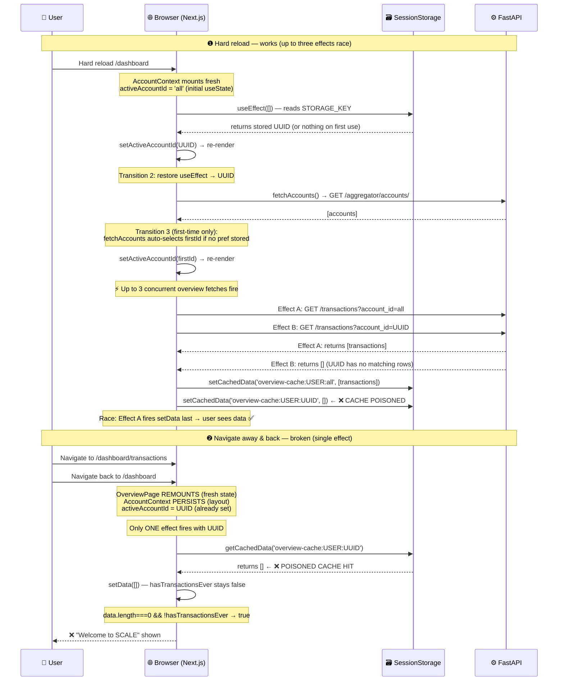

# Bug Report: Dashboard Shows Empty State on Client-Side Navigation

> **Doc ID:** BUG-005-dashboard-empty-state-on-client-navigation
> **Date:** 2026-03-17
> **Status:** Root Cause Found
> **DRI:** Hassan
> **Severity:** High

## Observed Behavior

The Overview (`/dashboard`), Transactions (`/dashboard/transactions`), and all other dashboard pages show the "Welcome to SCALE! Add first transaction" empty state even when the database contains transactions. The bug reproduces consistently on client-side navigation:

- Hard browser reload → dashboard shows data correctly ✅
- Navigate to any other page (e.g. Transactions), then navigate back → empty state shown ❌

## Expected Behavior

Dashboard pages should always show available transaction data regardless of navigation method (hard reload vs client-side routing). The "Welcome to SCALE" empty state should only appear when the user has **zero transactions globally**.

## Steps to Reproduce

1. Ensure at least one transaction exists in the database.
2. Hard reload `/dashboard` → data shows correctly.
3. Click "Transactions" in the sidebar.
4. Click "Overview" in the sidebar to navigate back.
5. Observe: "Welcome to SCALE! Add first transaction" empty state is displayed, data is gone.

## Environment

- **Branch:** `feat/account-aggregator`
- **Component:** Frontend — `apps/web/app/dashboard/page.tsx`, `apps/web/lib/contexts/AccountContext.tsx`
- **Triggered by:** Client-side navigation within the dashboard (Next.js App Router)

## Root Cause Analysis

Four interacting bugs combine to produce the symptom. Each is traceable to specific code paths.

### Data Flow Diagram — Bug Path



### Root Cause — Four Defects

**Defect 1 — AccountContext: multi-render race (`AccountContext.tsx:43–84`)**

`activeAccountId` undergoes up to **three** async state transitions on a hard reload:

1. `useState<string>('all')` — initial value on first render (`AccountContext.tsx:43`)
2. Restore `useEffect([])` reads `sessionStorage`/`localStorage` and transitions to stored UUID (`AccountContext.tsx:46–52`)
3. `fetchAccounts` auto-select transitions to `data[0].id` when no real preference is stored (`AccountContext.tsx:63–73`):

```tsx
// apps/web/lib/contexts/AccountContext.tsx:43
const [activeAccountId, setActiveAccountIdState] = useState<string>('all');

// apps/web/lib/contexts/AccountContext.tsx:46–52  ← Transition 2
useEffect(() => {
  const storage = getAppStorage();
  const persisted = storage?.getItem(STORAGE_KEY);
  if (persisted) {
    setActiveAccountIdState(persisted);
  }
}, []);

// apps/web/lib/contexts/AccountContext.tsx:63–73  ← Transition 3 (first-time only)
if ((!persisted || persisted === 'all') && data.length > 0) {
  const firstId = data[0].id;
  setActiveAccountIdState(firstId);
  storage?.setItem(STORAGE_KEY, firstId);
}
```

Each transition triggers a re-render and causes the Overview page's `useEffect([router, activeAccountId])` at `dashboard/page.tsx:54` to fire again, spawning a new concurrent fetch. On first use (no stored value): three fetches fire — with `'all'`, then UUID from accounts API. On subsequent visits (UUID stored): two fetches fire — with `'all'` (initial render), then UUID (restore effect).

On client-side navigation back, the `DashboardLayout` persists (Next.js App Router layout semantics), so `AccountContext` already has `activeAccountId = UUID`. The Overview page remounts fresh and fires only **one** effect (with UUID). The 'all' path never runs.

**Defect 2 — Cache poisoning (`dashboard/page.tsx:136`)**

When the UUID-filtered fetch returns an empty array, that empty result is cached:

```tsx
// apps/web/app/dashboard/page.tsx:135–136
setData(allItems);
setCachedData(cacheKey, allItems); // ← stores [] when allItems is empty
```

`setCachedData(cacheKey, [])` writes `{ timestamp, data: [] }` to sessionStorage under the UUID cache key. On navigation back, `getCachedData` returns this `[]` as a valid hit.

**Defect 3 — Cache path never sets `hasTransactionsEver` (`dashboard/page.tsx:72–78`)**

When cached data is returned, the function early-returns without setting `hasTransactionsEver`:

```tsx
// apps/web/app/dashboard/page.tsx:72–78
if (cachedData) {
  setData(cachedData);
  setLoading(false);
  return; // ← hasTransactionsEver stays false!
}
```

If `cachedData = []` (poisoned entry from Defect 2), then `data.length === 0` AND `hasTransactionsEver === false`, satisfying the "Welcome to SCALE" render condition (`page.tsx:426`):

```tsx
{data.length === 0 && !hasTransactionsEver ? (
  // ❌ Wrong empty state
) : (
  // ✅ Dashboard content
)}
```

**Defect 4 — `anyCheck` applies account-scoped filter (`dashboard/page.tsx:126–130`)**

The global existence check that determines `hasTransactionsEver` incorrectly passes `account_id: activeAccountId`. If the user has transactions on other accounts but none on the active UUID, `anyCheck.items.length === 0` and `setHasTransactionsEver(false)`:

```tsx
// apps/web/app/dashboard/page.tsx:126–130
const anyCheck = await accountsApi.getTransactions(session.access_token, {
  limit: 1,
  account_id: activeAccountId, // ← wrong: should check globally
});
setHasTransactionsEver(anyCheck.items.length > 0);
```

This masks the true "has transactions ever" state whenever the active account UUID doesn't match the transactions' stored `account_id`.

**Defect 5 — Transactions page also poisons its own cache (`transactions/page.tsx:401–414`)**

The same empty-array caching pattern exists in `fetchTransactions`:

```tsx
// apps/web/app/dashboard/transactions/page.tsx:401–414
const response = await accountsApi.getTransactions(session.access_token, {
  limit: PAGE_SIZE,
  account_id: activeAccountId,
});
const rows = response.items.map(mapItem);
setTransactions(rows);
// ...
setCachedData<TxCache>(cacheKey, { rows, ... }); // ← stores {rows: []} when empty
```

When `activeAccountId = UUID` and no transactions match, `{ rows: [] }` is cached under `transactions-cache:USER:UUID`. On navigation back to the transactions page, the poisoned entry is served and `transactions` stays empty.

### Contributing Factors

- The AccountContext 'all'→UUID transition pattern was intentional (progressive enhancement), but its interaction with the Overview page's dependency array was not considered.
- `getAppStorage()` returns `sessionStorage` in development, which persists across page navigations and reloads within the same browser tab (but clears on tab close). This means poisoned cache entries survive reloads, making the issue reproducible within a single tab session in dev.
- Empty array `[]` is a valid JavaScript value; `setCachedData` has no guard against storing it.

## Fix Description

### Changes Required

| File | Defect | Function | Change |
|---|---|---|---|
| `apps/web/lib/contexts/AccountContext.tsx` | D1 | `AccountProvider` | Replace `useState('all')` + restore `useEffect([])` with a single lazy `useState` initializer that reads storage synchronously |
| `apps/web/lib/contexts/AccountContext.tsx` | D1 | restore `useEffect([])` (lines 46–52) | Remove (superseded by lazy init) |
| `apps/web/app/dashboard/page.tsx` | D2 | `fetchData` — `setCachedData` (line 136) | Guard: only call `setCachedData` when `allItems.length > 0` |
| `apps/web/app/dashboard/page.tsx` | D3 | `fetchData` — cache path (lines 74–78) | Set `hasTransactionsEver = cachedData.length > 0` before returning (effective only after D2 fix prevents caching `[]`) |
| `apps/web/app/dashboard/page.tsx` | D4 | `fetchData` — `anyCheck` (lines 126–130) | Remove `account_id` parameter entirely; backend treats omission and `account_id=all` identically — both skip the `account_id` filter (`core/filtering.py:60`) |
| `apps/web/app/dashboard/transactions/page.tsx` | D5 | `fetchTransactions` — `setCachedData` (line 410) | Guard: only call `setCachedData` when `rows.length > 0` |

### Why This Fix Works

**AccountContext lazy init** eliminates Defect 1 for all visits where storage has a value: `activeAccountId` is read from `sessionStorage`/`localStorage` synchronously in the `useState` initializer, so the first render already has the correct UUID (or `'all'`). The restore `useEffect` transition is eliminated. For first-time users (no stored value), the `fetchAccounts` auto-select (Transition 3) may still trigger one additional re-render, but since no cache exists yet, no poisoning occurs — all fetches during first use hit the API fresh.

**Cache poison prevention (D2)** eliminates Defect 2: `setCachedData` is only called when `allItems.length > 0`. Empty results are never written to storage. On navigation back with a cache miss, the page makes a fresh API request rather than reading stale `[]`.

**Cache path sets `hasTransactionsEver` (D3)** eliminates Defect 3: when cache returns a non-empty array, `hasTransactionsEver = true` is set before the early return. This fix is dependent on D2: it is only meaningful once the cache can no longer contain `[]`. With D2 in place, a cache hit always implies real data, so `cachedData.length > 0` will be true on a valid hit.

**Global `anyCheck` (D4)** eliminates Defect 4: omitting `account_id` causes the backend (`core/filtering.py:60`) to skip the `account_id` filter clause and return all user transactions regardless of account. `hasTransactionsEver` now correctly reflects the user's global transaction state.

**Transactions cache guard (D5)** eliminates Defect 5: same pattern as D2, applied to `fetchTransactions`. Empty transaction page results are not written to sessionStorage.

## Regression Prevention

- **Test added:** `apps/web/__tests__/dashboard-navigation-cache.test.tsx`:

  ```
  it('does not show Welcome empty state after navigating back to overview when UUID cache was previously empty but global transactions exist')
  ```

  Mocks `getCachedData` to return `[]` for the UUID key, mocks `getTransactions` to return data for `account_id=all`/undefined, confirms the "Welcome to SCALE" heading is NOT rendered.
- **Guard added:** `setCachedData` calls in both `dashboard/page.tsx` and `transactions/page.tsx` gated on `length > 0`, preventing empty-array cache entries from being written in the future.
- **Guard added:** `AccountContext` lazy `useState` initializer prevents the 'all'→UUID re-render transition for all users who have a stored account preference, making cache key selection stable from the first render.

## Related Documents

- Feature: `docs/features/004-account-aggregator.md`
- Bug: `docs/bugs/BUG-004-setu-phantom-account-unlink-and-v2-payload.md`

## Changelog

| Date | Author | Change |
|---|---|---|
| 2026-03-17 | Hassan | Initial bug report — 4 root causes identified and documented |
