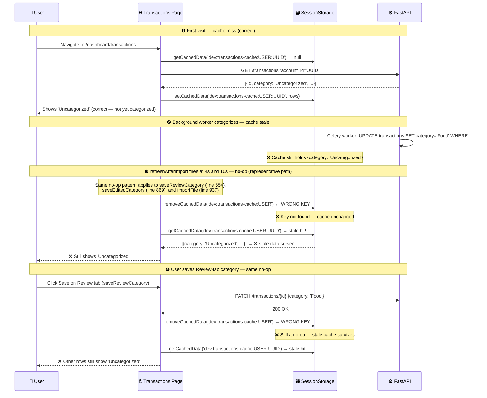

# Bug Report: Transactions Page Shows Stale Categories After Categorization

> **Doc ID:** BUG-006-transactions-cache-invalidation-key-mismatch
> **Date:** 2026-03-17
> **Status:** Root Cause Found
> **DRI:** Hassan
> **Severity:** High

## Observed Behavior

The Transactions page shows "Uncategorized" for most transactions even though:

- Supabase has the correct categories stored in the database.
- Other dashboard pages (Overview, Analytics) display categories correctly.
- After a hard reload and cache miss the correct categories appear briefly.

The categories do not update when the background Celery categorizer finishes, when a user saves
a category from the Review tab, or when a user edits a category inline — even though all those
actions call `fetchTransactions()` immediately after.

## Expected Behavior

After any of the following actions the Transactions page should display the latest category
values from the API without requiring a manual browser reload or cache expiry (1 hour):

- Background categorizer assigns categories after import.
- User saves a category from the Review tab.
- User edits a category inline in the All tab.
- User imports a file via the Import dialog.

## Steps to Reproduce

1. Import a CSV file — transactions are inserted without categories.
2. The background Celery worker categorizes the transactions (within a few seconds).
3. Open Transactions page → most rows show "Uncategorized" even after the worker has finished.
4. Navigate to Supabase Table Editor → `transactions` table → categories are present.
5. Hard-refresh the page (Cmd+Shift+R) clears the cache → categories appear.

## Environment

- **Branch:** `feat/account-aggregator`
- **Component:** Frontend — `apps/web/app/dashboard/transactions/page.tsx`
- **Triggered by:** Account aggregator feature added `:${activeAccountId}` to cache keys without
  updating the invalidation call sites.

## Root Cause Analysis

### Data Flow Diagram — Bug Path



### Root Cause — Single Defect

**Cache key format diverged when account aggregator was added.**

The account aggregator feature (BUG-005 fix cycle) updated the cache **write** to scope keys by
`activeAccountId`:

```tsx
// transactions/page.tsx:388 — key defined here
const cacheKey = `transactions-cache:${user.id}:${activeAccountId}`;
// transactions/page.tsx:412 — WRITE uses account-scoped key ✅
setCachedData<TxCache>(cacheKey, { rows, ... });
```

But **all five `removeCachedData` call sites** still use the old, shorter key format (no
`activeAccountId`):

```tsx
// LINE 554 — saveReviewCategory
removeCachedData(`transactions-cache:${userId}`);           // ❌ missing :accountId

// LINE 573 — refreshAfterImport (4s and 10s delayed)
removeCachedData(`transactions-cache:${userId}`);           // ❌ missing :accountId

// LINE 575 — refreshAfterImport (overview cache also wrong)
removeCachedData(`overview-cache:${userId}`);               // ❌ missing :accountId

// LINE 869 — saveEditedCategory (inline edit)
removeCachedData(`transactions-cache:${userId}`);           // ❌ missing :accountId

// LINE 937 — importFile
removeCachedData(`transactions-cache:${userId}`);           // ❌ missing :accountId
```

`removeCachedData` calls `storage.removeItem(getCacheKey(key))` — exact-key match, no prefix
scan. Because `dev:transactions-cache:USER` does not exist in storage (the actual key is
`dev:transactions-cache:USER:UUID`), every `removeCachedData` call is a **silent no-op**.

After the no-op, `fetchTransactions()` is called, which immediately hits the still-valid cache
(`getCachedData` returns the stale rows), and the page displays old "Uncategorized" values.

The `overview-cache` invalidation in `refreshAfterImport` has the identical mismatch:
stored as `overview-cache:USER:UUID`, invalidated as `overview-cache:USER`.

`uncategorized-cache` is unaffected because it was never scoped by account ID:
stored as `uncategorized-cache:USER`, invalidated as `uncategorized-cache:USER` — keys match.

### Contributing Factors

- `removeCachedData` uses exact-key lookup with no warning when the key is missing. A mismatched
  key silently does nothing, making the bug invisible during manual testing (the page appears to
  refresh, but actually serves the old cache).
- The account-scoped cache key was introduced in the same branch without a global search for
  existing `removeCachedData` call sites that referenced the old key format.

## Fix Description

### Changes Required

| File | Line(s) | Change |
|---|---|---|
| `apps/web/app/dashboard/transactions/page.tsx` | 554 | Change `transactions-cache:${userId}` → `transactions-cache:${userId}:${activeAccountId}` |
| `apps/web/app/dashboard/transactions/page.tsx` | 573 | Same as above |
| `apps/web/app/dashboard/transactions/page.tsx` | 575 | Change `overview-cache:${userId}` → `overview-cache:${userId}:${activeAccountId}` |
| `apps/web/app/dashboard/transactions/page.tsx` | 869 | Change `transactions-cache:${userId}` → `transactions-cache:${userId}:${activeAccountId}` |
| `apps/web/app/dashboard/transactions/page.tsx` | 937 | Same as above |

`activeAccountId` is already available in the component via `useAccount()` at the top of the
file (`transactions/page.tsx:241`). No new dependencies needed.

### Why This Fix Works

The corrected key matches the key written by `setCachedData` at line 412. `storage.removeItem`
now targets the actual entry in storage, so the stale cache is evicted. On the subsequent
`fetchTransactions()` call, `getCachedData` finds no valid entry and falls through to the API
fetch, which returns the current (post-categorization) rows from the database.

## Regression Prevention

- **Test to be added:** `apps/web/__tests__/transactions-cache-invalidation.test.tsx`

  ```
  it('re-fetches from API (not cache) after saveReviewCategory — categories reflect server state')
  it('re-fetches from API (not cache) after saveEditedCategory — inline edit reflects server state')
  ```

- **Guard added:** All `removeCachedData` calls for account-scoped caches include
  `:${activeAccountId}` in the key, matching the write-time key exactly.

## Related Documents

- Bug: `docs/bugs/BUG-005-dashboard-empty-state-on-client-navigation.md`

## Changelog

| Date | Author | Change |
|---|---|---|
| 2026-03-17 | Hassan | Initial bug report — cache key mismatch identified at 5 call sites |
