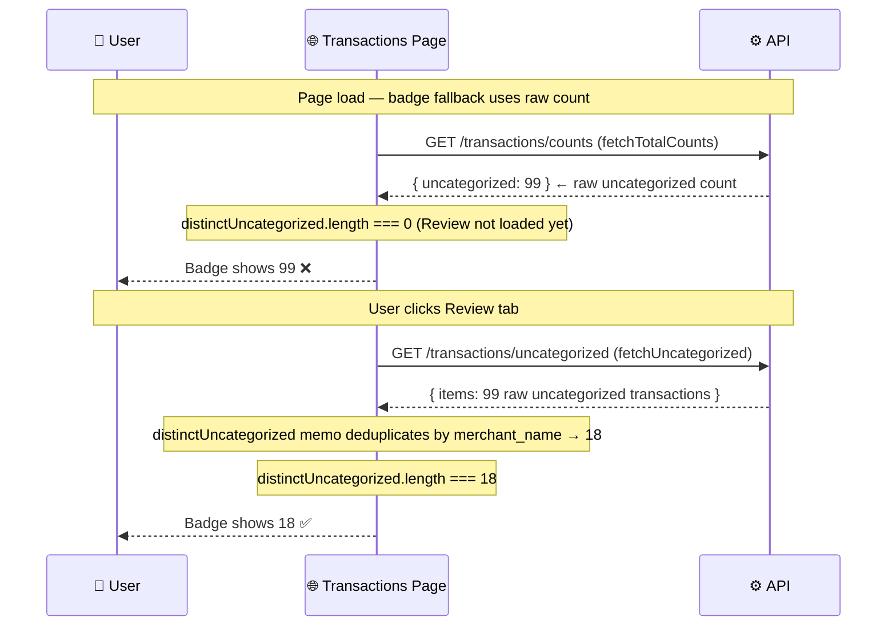

# Bug Report: Review Tab Badge Shows Wrong Uncategorized Count

> **Doc ID:** BUG-007-review-badge-wrong-count
> **Date:** 2026-03-17
> **Status:** Implemented
> **DRI:** Hassan
> **Severity:** Medium

## Observed Behavior

The Review tab badge on the Transactions page shows **99** before the user clicks on the Review tab. After clicking, the Review panel shows **18 pending** items. The badge then correctly updates to 18.

## Expected Behavior

The Review badge should always show the count of items in the AI review queue (transactions with a suggested_category awaiting user confirmation) — i.e., the same count shown inside the Review tab.

## Steps to Reproduce

1. Navigate to /dashboard/transactions.
2. Observe the Review tab badge (shows 99).
3. Click the Review tab — panel shows "18 pending."
4. Badge correctly updates to 18.

## Environment

- **Branch:** `feat/account-aggregator`
- **Component:** `apps/web/app/dashboard/transactions/page.tsx`
- **Triggered by:** Page load; `fetchTotalCounts` populates `serverCounts.uncategorized`

## Root Cause Analysis

### Data Flow Diagram



### Root Cause

The badge has two code paths with different counting methods:

- **Before Review tab click:** `distinctUncategorized.length === 0` (data not yet loaded), badge falls back to `serverCounts.uncategorized` = **99** (raw row count from `getTransactionCounts` API).
- **After Review tab click:** `fetchUncategorized` loads the data, then `distinctUncategorized` memo deduplicates by `merchant_name` (page.tsx lines 766–778) — 99 raw rows from the same ~18 merchants collapse to **18** distinct entries.

Badge logic (page.tsx ~lines 1200–1205):

```tsx
{distinctUncategorized.length > 0
  ? distinctUncategorized.length      // 18 — after Review tab click (deduped)
  : serverCounts?.uncategorized}      // 99 — fallback before click (raw, not deduped)
```

`getTransactionCounts` and `getUncategorized` both filter on `category = 'Uncategorized'` — the count difference is entirely due to the frontend deduplication by merchant, not any backend filter difference.

### Contributing Factors

- `fetchUncategorized` is only called when the Review tab is selected (page.tsx line 521–522). The deduplicated count is therefore never populated before the user clicks.
- When `distinctUncategorized.length === 0` (tab not yet clicked), the badge shows the raw 99 which doesn't match what the tab will show once loaded.

## Fix Description

### Changes Required

| File | Change |
|---|---|
| `apps/web/app/dashboard/transactions/page.tsx` | Call `fetchUncategorized()` on mount (alongside `fetchTransactions` + `fetchTotalCounts`) so the deduplicated count is available before the user clicks the Review tab |

`fetchUncategorized` uses `uncategorized-cache:${userId}` which is TTL-cached. Calling it eagerly means the badge always shows the deduplicated merchant count (18) from the start, matching what the Review panel will show.

The badge logic does not need changing — it already prefers `distinctUncategorized.length` when the data is loaded.

### Why This Fix Works

Once `fetchUncategorized` runs at mount, `uncategorized` state is populated, the `distinctUncategorized` memo deduplicates by merchant to 18, and `distinctUncategorized.length === 18 > 0` — so the badge picks that value instead of `serverCounts.uncategorized` (99).

## Regression Prevention

- Existing tests in `transactions-cache-invalidation.test.tsx` cover `fetchTransactions` cache invalidation.
- No new test needed beyond confirming badge shows accurate count: manual verification.

## Related Documents

- Bug: `docs/bugs/BUG-006-transactions-cache-invalidation-key-mismatch.md`

## Changelog

| Date | Author | Change |
|---|---|---|
| 2026-03-17 | Hassan | Initial bug report |
