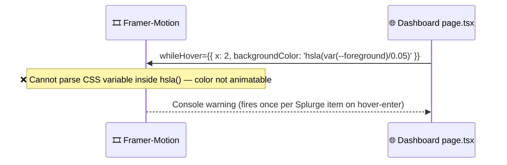

# Bug Report: Console Errors — Non-Animatable Color and Recharts -1 Dimensions

> **Doc ID:** BUG-008-console-errors-framer-recharts
> **Date:** 2026-03-17
> **Status:** Root Cause Found
> **DRI:** Hassan
> **Severity:** Medium

## Observed Behavior

Two classes of console errors appear across the dashboard:

**A — Overview page** (appears on every render of the Big Splurges section):

```
'hsla(var(--foreground)/0.05)' is not an animatable color.
Use the equivalent color code instead.
```

**B — Analytics page** (appears on initial load for 3 charts):

```
MonthlyComparison.tsx:78   The width(-1) and height(-1) of chart should be greater than 0
SubscriptionRadar.tsx:177  The width(-1) and height(-1) of chart should be greater than 0
CategoryDistribution.tsx:132 The width(-1) and height(-1) of chart should be greater than 0
```

## Expected Behavior

- No console warnings or errors on normal page usage.
- Charts render at correct dimensions on first mount.

## Steps to Reproduce

**Error A:**
1. Navigate to /dashboard (Overview).
2. Open DevTools console.
3. Observe repeated `'hsla(var(--foreground)/0.05)' is not an animatable color` warnings.

**Error B:**
1. Navigate to /dashboard/analytics.
2. Open DevTools console.
3. Observe `width(-1) and height(-1)` errors for MonthlyComparison, SubscriptionRadar, CategoryDistribution.

## Environment

- **Branch:** `feat/account-aggregator`
- **Components:**
  - `apps/web/app/dashboard/page.tsx` (Error A)
  - `apps/web/app/dashboard/analytics/components/MonthlyComparison.tsx` (Error B)
  - `apps/web/app/dashboard/analytics/components/SubscriptionRadar.tsx` (Error B)
  - `apps/web/app/dashboard/analytics/components/CategoryDistribution.tsx` (Error B)

## Root Cause Analysis

### Error A — Framer-Motion Non-Animatable Color



At `page.tsx:608`, the Big Splurges item uses:

```tsx
<motion.div
  whileHover={{ x: 2, backgroundColor: 'hsla(var(--foreground)/0.05)' }}
```

Framer-motion tries to tween from the current `backgroundColor` to `hsla(var(--foreground)/0.05)`. It can't parse CSS variables at animation time (they resolve only in the browser paint step), so it logs the warning and skips the animation. The visual hover effect already works via the Tailwind class `bg-muted/30 hover:border-red-500/20` — the `backgroundColor` in `whileHover` is redundant and incorrect.

### Error B — Recharts ResponsiveContainer Receives -1 Dimensions

```mermaid
sequenceDiagram
    participant 🌐 as 🌐 Analytics page
    participant 📦 as 📦 ExpandableCard (compact)
    participant 📊 as 📊 ResponsiveContainer

    Note over 🌐,📊: Initial render — framer-motion animation in progress

    🌐->>📦: Render compact card (flex-1 container, h-full)
    📦->>📊: height="100%" or height="80%" (percentage)
    Note over 📊: ❌ Parent height not yet computable from % — returns -1
    📊-->>🌐: Console warning; chart may not render
```

Each affected chart uses a percentage height (`"100%"` or `"80%"`) for its `ResponsiveContainer` inside a flex-based parent. On first render, before the browser has completed layout, the parent's pixel height isn't available to Recharts' resize observer. Recharts logs the warning and the chart may render incorrectly.

Specific culprits:
- `MonthlyComparison.tsx:77` — `<div className="flex-1 min-h-0 ..."> <ResponsiveContainer height="100%">`
- `SubscriptionRadar.tsx:176` — `<div className="flex-1 ... min-h-[200px]"> <ResponsiveContainer height="80%">`
- `CategoryDistribution.tsx:131` — `<div className="... h-full min-h-[250px]"> <ResponsiveContainer height="100%">`

In all three cases, the parent has no explicit pixel height at first render — height is derived from flex growth, which Recharts can't observe before layout completes.

### Contributing Factors

- `ExpandableCard` uses `layoutId` (framer-motion shared-layout animation) which delays final DOM sizing.
- `will-change: transform, opacity` on the card prevents the browser from computing layout synchronously during the animation phase.

## Fix Description

### Changes Required

| File | Line | Change |
|---|---|---|
| `apps/web/app/dashboard/page.tsx` | ~608 | Remove `backgroundColor` from `whileHover` on Big Splurges items |
| `apps/web/app/dashboard/analytics/components/MonthlyComparison.tsx` | ~77 | Replace `flex-1 min-h-0` container + `height="100%"` with explicit `h-[300px]` when not expanded |
| `apps/web/app/dashboard/analytics/components/SubscriptionRadar.tsx` | ~176 | Replace `height="80%"` with explicit `height={200}` when not expanded |
| `apps/web/app/dashboard/analytics/components/CategoryDistribution.tsx` | ~131 | Replace `h-full min-h-[250px]` + `height="100%"` with explicit `h-[250px]` when not expanded |

### Why This Fix Works

**Error A:** Removing `backgroundColor` from `whileHover` eliminates the unparseable value. The hover highlight is already handled by Tailwind CSS — no visual regression.

**Error B:** Replacing percentage heights with explicit pixel heights gives Recharts a concrete measurement at render time. The error fires because Recharts calls `getBoundingClientRect` on its parent during mount — an explicit `h-[300px]` returns a valid pixel value immediately. When `isExpanded=true`, the parent is the full-screen modal which has `h-full` on a defined viewport size — `height="100%"` works there.

## Regression Prevention

- **Guard:** Recharts `ResponsiveContainer` should use explicit pixel heights in compact mode; `"100%"` only when parent has a guaranteed pixel height (e.g., expanded modal with known viewport).
- No automated test needed (console warning only, not a user-visible functional break).

## Related Documents

- BUG-010: `docs/bugs/BUG-010-subscriptionradar-window-ssr-crash.md` — latent SSR crash in `SubscriptionRadar.tsx` (`window.innerWidth` at lines 185–186); both fixes should land in the same commit.

## Changelog

| Date | Author | Change |
|---|---|---|
| 2026-03-17 | Hassan | Initial bug report |
