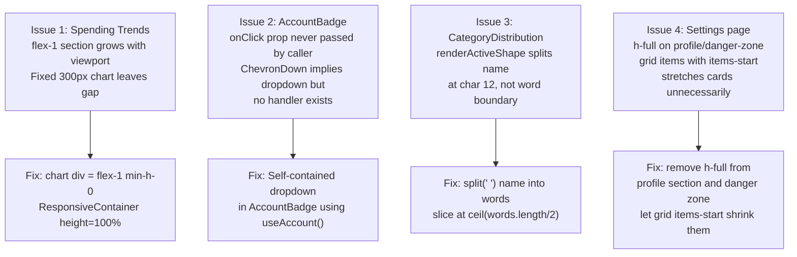

# Bug Report: UI Layout Issues — Chart White Space, AccountBadge, CategoryDistribution, Settings

> **Doc ID:** BUG-009-ui-layout-issues
> **Date:** 2026-03-17
> **Status:** Root Cause Found
> **DRI:** Hassan
> **Severity:** Low

## Observed Behavior

Four UI layout issues across the dashboard:

1. **Overview — Spending Trends chart has large empty white space below the bars.** The chart is a fixed 300px block inside a flex-1 section that grows to fill the viewport. The remaining space below the chart is blank.

2. **Accounts dropdown badge broken on all pages.** The `AccountBadge` component in page headers shows "Manual Import ▼" with a ChevronDown icon implying clickability, but clicking does nothing — no `onClick` handler is connected.

3. **CategoryDistribution label word-wraps incorrectly.** Long category names like "Internet & Phone" (16 chars) are split at character position 12 to produce "Internet & P" on line 1 and "hone" on line 2 instead of splitting at a word boundary.

4. **Settings page has excessive white space.** The Profile Details card and Danger Zone card stretch to fill the grid row height (determined by the taller middle column), creating blank space below their content. The grid uses `items-start` so cards should be auto-height.

## Expected Behavior

1. Spending Trends chart fills the available height of its container instead of leaving blank space.
2. Clicking the AccountBadge chip opens an account selector dropdown.
3. "Internet & Phone" renders as "Internet & Phone" on two lines split at the word boundary: "Internet &" / "Phone".
4. Settings page cards have natural (content-driven) height with no extra white space.

## Steps to Reproduce

1. Navigate to /dashboard — observe white space below Spending Trends bars.
2. Click the "Manual Import ▼" badge in the Overview page header — nothing happens.
3. Navigate to /dashboard/analytics → expand the Category Distribution card → hover over or click the "Internet & Phone" pie segment directly — label shows "Internet & P / hone".
4. Navigate to /dashboard/settings — Profile Details and Danger Zone cards have excessive blank space.

## Environment

- **Branch:** `feat/account-aggregator`
- **Components:**
  - `apps/web/app/dashboard/page.tsx` (issues 1 & 2)
  - `apps/web/app/dashboard/analytics/components/CategoryDistribution.tsx` (issue 3)
  - `apps/web/components/accounts/AccountBadge.tsx` (issue 2)
  - `apps/web/app/dashboard/settings/page.tsx` (issue 4)

## Root Cause Analysis



### Issue 1 — Spending Trends chart fixed height inside flex-1 section

The Spending Trends section (`page.tsx:639`) uses `className="flex-1 min-h-[380px] ... flex flex-col"` — it grows to fill remaining vertical space. Inside it, the chart container is:

```tsx
<div style={{ width: '100%', height: '300px' }}>
  <ResponsiveContainer width="100%" height={300} minWidth={1}>
```

Fixed at 300px regardless of section height. When the section is taller (large viewport), the space below the chart is empty.

### Issue 2 — AccountBadge has no onClick handler

`AccountBadge.tsx` accepts an optional `onClick` prop but no caller passes it:

```tsx
// dashboard/page.tsx:408
<AccountBadge />   // ← no onClick
// transactions/page.tsx — also no onClick
```

The component renders a `<button>` with `<ChevronDown />` implying it opens a dropdown, but clicking does nothing.

Fix: make AccountBadge self-contained using `useAccount()` hook (which it already imports). Add local `open` state and render an inline account-list dropdown on click. The existing `AccountSwitcher` component (`apps/web/app/dashboard/layout.tsx:277`) handles account switching in the sidebar and is not directly reusable here — it is a full sidebar widget, not a compact dropdown. AccountBadge should NOT wrap or render AccountSwitcher; instead it should build a minimal inline dropdown using the same `useAccount()` data, keeping the two components independent.

### Issue 3 — CategoryDistribution renderActiveShape splits at char 12

```tsx
// CategoryDistribution.tsx lines 30–37 (renderActiveShape)
{payload.name.length > 12 ? (
  <>
    <tspan x={cx} dy="-4">{payload.name.substring(0, 12)}</tspan>
    <tspan x={cx} dy="20">{payload.name.substring(12, 22) + (payload.name.length > 22 ? '...' : '')}</tspan>
  </>
```

"Internet & Phone" → `substring(0,12)` = `"Internet & P"`, `substring(12,22)` = `"hone"`. The code splits at a fixed character position, not a word boundary.

The fix splits on words using `split(' ')`, then divides the words array at `Math.ceil(words.length / 2)`:

```
words = ["Internet", "&", "Phone"]  // length 3
mid = Math.ceil(3 / 2) = 2
line1 = words.slice(0, 2).join(' ')  // "Internet &"
line2 = words.slice(2).join(' ')     // "Phone"
```

This produces the correct word-boundary split for any category name.

### Issue 4 — Settings grid cards stretch with h-full

Settings layout (`settings/page.tsx:334`):

```tsx
<div className="grid gap-4 lg:grid-cols-3 items-start">
  <section className="... h-full">   ← Profile (col 1)
  <div className="space-y-4">        ← Middle col (determines row height)
  <section className="... h-full flex flex-col justify-between">  ← Danger Zone (col 3)
```

`items-start` (alias for `align-items: start`) prevents the *implicit* stretching that CSS Grid applies by default. However, `h-full` (`height: 100%`) on the section element is an *explicit* height declaration. CSS resolves `height: 100%` against the grid area height, which equals the row track size (determined by the tallest item — the middle column). So the profile and danger-zone sections still expand to match the middle column, creating empty space inside them despite `items-start`.

Inside each section, `flex flex-col h-full` (lines 337, 554) propagates the full height further down, causing inner content to justify-between and spread into the empty space rather than staying compact.

## Fix Description

### Changes Required

| File | Change |
|---|---|
| `apps/web/app/dashboard/page.tsx` | Replace `<div style={{height:'300px'}}>` with `<div className="flex-1 min-h-0">` for chart container; also change `ResponsiveContainer height={300}` to `height="100%"` |
| `apps/web/components/accounts/AccountBadge.tsx` | Add self-contained dropdown with `open` state, rendering accounts from `useAccount()`; both callers (`dashboard/page.tsx:408`, `transactions/page.tsx:1076`) require no changes — the fix is entirely within the component. Also update JSDoc at line 12: remove "Clicking opens the AccountSwitcher (caller's job)" and replace with description of the self-contained dropdown behaviour |
| `apps/web/app/dashboard/analytics/components/CategoryDistribution.tsx` | Change `renderActiveShape` to split label by word boundary |
| `apps/web/app/dashboard/settings/page.tsx` | Remove `h-full` from outer profile section (line 336); remove `h-full` from inner profile flex div (line 337); remove `h-full` and `justify-between` from danger zone section (line 553) |

### Why These Fixes Work

1. `flex-1 min-h-0` lets the chart container grow to fill the section's remaining height. `ResponsiveContainer height="100%"` then correctly fills that container.
2. AccountBadge with its own dropdown works independently — no inter-component communication needed.
3. Word-boundary split avoids cutting mid-word.
4. Without `h-full`, `items-start` takes effect: grid items shrink to natural content height.

## Regression Prevention

- No automated tests needed (visual/interaction issues).
- **Guard:** AccountBadge self-contained — future callers need not pass `onClick`.

## Related Documents

- BUG-008: `docs/bugs/BUG-008-console-errors-framer-recharts.md` — Issue 1's fix (`flex-1 min-h-0` + `ResponsiveContainer height="100%"`) must be coordinated with BUG-008's fix. BUG-008 changes Analytics charts from percentage heights to explicit pixel heights to fix Recharts `-1` dimension errors. The Spending Trends section in `page.tsx` is different — its `flex-1` parent is bounded by the viewport so `height="100%"` works correctly — but both fixes should land in the same commit to avoid inconsistency across chart components.

## Changelog

| Date | Author | Change |
|---|---|---|
| 2026-03-17 | Hassan | Initial bug report |
