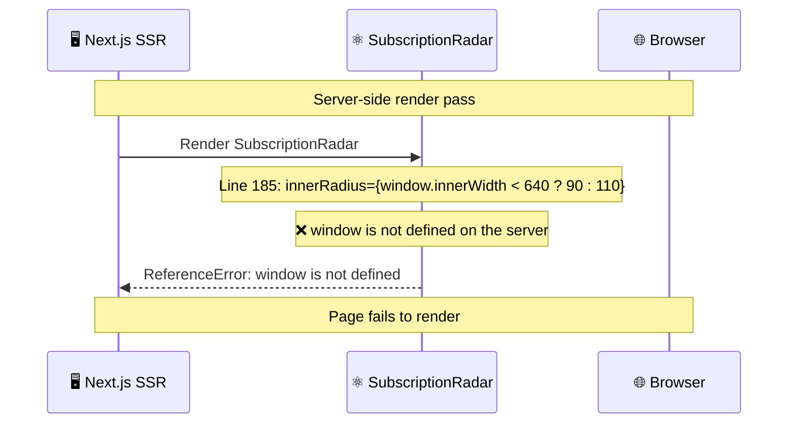

# Bug Report: SubscriptionRadar Accesses window.innerWidth During SSR

> **Doc ID:** BUG-010-subscriptionradar-window-ssr-crash
> **Date:** 2026-03-17
> **Status:** Implemented
> **DRI:** Hassan
> **Severity:** Medium

## Observed Behavior

In server-side rendering (SSR) or during Next.js hydration, accessing `window.innerWidth` at the component's render-time scope crashes the page with:

```
ReferenceError: window is not defined
```

This crash occurs silently in development (because the analytics page may be client-rendered in dev mode), but will surface in production builds and during pre-rendering.

## Expected Behavior

`SubscriptionRadar` should render without any `window` access during SSR. The responsive radius values should be determined client-side only, falling back to the desktop dimensions on the server.

## Steps to Reproduce

1. Enable server-side rendering for the analytics page (or run `next build && next start`).
2. Navigate to `/dashboard/analytics`.
3. Observe: `ReferenceError: window is not defined` thrown inside `SubscriptionRadar.tsx`.

Alternatively, run TypeScript strict check or the Next.js build:

```bash
cd apps/web && npm run build
```

## Environment

- **Branch:** `feat/account-aggregator`
- **Component:** `apps/web/app/dashboard/analytics/components/SubscriptionRadar.tsx`
- **Lines:** 185–186

## Root Cause Analysis



At `SubscriptionRadar.tsx` lines 185–186, `window.innerWidth` is accessed directly inside JSX during the render pass:

```tsx
innerRadius={window.innerWidth < 640 ? 90 : 110}
outerRadius={window.innerWidth < 640 ? 120 : 140}
```

`window` is a browser-only global. It does not exist in the Node.js SSR environment. Next.js renders components on the server during the initial page request and during static generation. Any direct `window` access at render time causes an immediate `ReferenceError`.

### Why It Hasn't Crashed

`apps/web/app/dashboard/analytics/page.tsx` declares `'use client'` at line 1. In Next.js App Router, a `'use client'` boundary on the page marks all its imported descendants — including `SubscriptionRadar` — as client components. Client components are not rendered on the server during SSR. This boundary shields the current crash path.

The bug is latent: if `SubscriptionRadar` is ever extracted into a shared component library, rendered in a server component subtree, or the `'use client'` directive is removed from the analytics page, the crash becomes immediate in both dev and production.

### Contributing Factors

- `apps/web/app/dashboard/analytics/page.tsx` carries a `'use client'` directive at line 1, which currently shields `SubscriptionRadar` from Next.js SSR. The crash does **not** fire in practice today — but only because of that boundary on the parent page.
- `SubscriptionRadar.tsx` itself has no `'use client'` directive and no SSR guard on the `window` access. If the component is ever extracted, moved, or reused outside a `'use client'` tree, the crash becomes immediate.
- The `window` access is in the JSX return value, not guarded by a `useEffect` or `typeof window !== 'undefined'` check, making it a latent code correctness violation regardless of the current parent boundary.

## Fix Description

### Changes Required

| File | Lines | Change |
|---|---|---|
| `apps/web/app/dashboard/analytics/components/SubscriptionRadar.tsx` | 185–186 | Replace `window.innerWidth` with a responsive hook or static fallback |

### Fix

Replace the bare `window.innerWidth` calls with a safe client-only measurement. The simplest approach is a `useState` + `useEffect` pattern:

```tsx
// At component top
const [isSmall, setIsSmall] = useState(false);
useEffect(() => {
  setIsSmall(window.innerWidth < 640);
}, []);

// In JSX
innerRadius={isSmall ? 90 : 110}
outerRadius={isSmall ? 120 : 140}
```

`useState(false)` defaults to desktop radii on the server and on the initial client render (before `useEffect` fires), preventing SSR/hydration mismatch. `useEffect` updates to the correct value after mount.

### Why This Fix Works

`useEffect` only runs in the browser, never on the server. The initial `false` (desktop) default matches the hydrated DOM on the server pass, avoiding React hydration mismatch errors. After mount, the correct responsive size is applied.

**Trade-off:** Mobile screens (< 640 px) will see a one-frame layout shift: the first render uses `innerRadius={110}` (desktop default), then `useEffect` fires and corrects to `innerRadius={90}`. This is visually imperceptible on initial page load and is acceptable for this use case. If a zero-shift solution is needed, a `window.matchMedia` check wrapped in `useEffect` or a `useWindowSize` hook can be substituted.

## Regression Prevention

- **Test:** `it('renders without accessing window during SSR')` in `apps/web/__tests__/SubscriptionRadar.ssr.test.tsx`. The test file must declare `// @vitest-environment node` at the top — the default vitest environment is `jsdom`, which provides `window` globally, meaning the crash would NOT reproduce in jsdom even with the bug present. Only in Node environment is `window` genuinely absent. Call `renderToString(<SubscriptionRadar transactions={[]} />)` from `react-dom/server` and assert no exception is thrown.
- **Guard:** Never access `window`, `document`, or `navigator` at render time in any component that may be server-rendered. Always guard with `typeof window !== 'undefined'` or move to `useEffect`.
- Related: BUG-008 fixes Recharts height issues in the same component — both fixes should land together.

## Related Documents

- BUG-008: `docs/bugs/BUG-008-console-errors-framer-recharts.md` — Recharts `-1` dimension errors in same component; both should be fixed in one commit.

## Changelog

| Date | Author | Change |
|---|---|---|
| 2026-03-17 | Hassan | Initial bug report — discovered during spec review of BUG-008 |
| 2026-03-17 | Hassan | Implemented. DEVIATION: used `useSyncExternalStore` instead of `useState + useEffect` — `react-hooks/set-state-in-effect` lint rule flags setState inside effect bodies. `useSyncExternalStore` is the idiomatic React 18 API for subscribing to external (browser) state and avoids the lint violation. Also adds live resize responsiveness as a side effect. |
