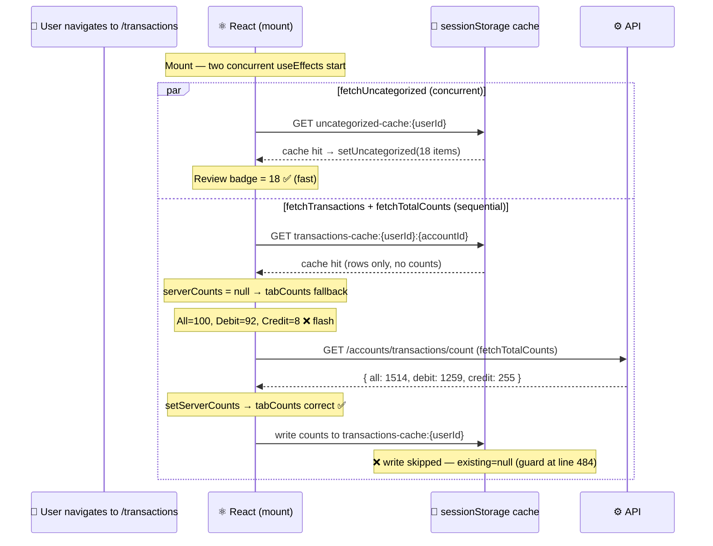

# Bug Report: Transactions Page — Badge Shows 100 Flash and All/Debit/Credit Load Slower than Review

> **Doc ID:** BUG-011-transactions-badge-stale-counts-and-slow-load
> **Date:** 2026-03-18
> **Status:** Verified
> **DRI:** Hassan
> **Severity:** Low

## Observed Behavior

Two related symptoms on the Transactions page:

1. **"All 100" flash.** When navigating to `/dashboard/transactions`, the All badge briefly shows **100** (and Debit=92, Credit=8) before snapping to the correct numbers (All=1514, Debit=1259, Credit=255).

2. **All/Debit/Credit badges load slower than Review.** On a fresh page load, the Review badge shows the correct count (18) almost immediately, while the All/Debit/Credit badges sit on 100 for a noticeable duration before updating.

## Expected Behavior

- All/Debit/Credit badges should show server totals from the first render (no flash) if the counts were previously fetched and cached.
- On fresh load, All/Debit/Credit badges should arrive at the same time as — or sooner than — the Review badge.

## Steps to Reproduce

1. Clear the browser `sessionStorage` / close and reopen the tab.
2. Navigate to `/dashboard/transactions`.
3. Observe: All badge shows 100 briefly, then jumps to 1514.
4. Repeat navigation to `/dashboard/transactions` (within TTL) → flash reappears on every navigation (counts are not cached on the standard path). Note: the flash duration is shorter on second navigation than on cold load — `fetchTransactions` is a cache hit so rows render synchronously, but `fetchTotalCounts` still makes an API round-trip before counts arrive.

Fresh-load timing comparison:
1. Navigate to `/dashboard/transactions` with DevTools > Performance tab open.
2. Observe Review badge populates before All/Debit/Credit badges.

## Environment

- **Branch:** `feat/account-aggregator`
- **Component:** `apps/web/app/dashboard/transactions/page.tsx`
- **Lines:**
  - `fetchTransactions` cache key: line 388
  - `fetchTotalCounts` cache key: line 470
  - `fetchTotalCounts` cache write guard: lines 484–487
  - Mount `useEffect`: lines 601–616
  - `tabCounts` fallback: lines 727–733
  - `fetchUncategorized` function: lines 493–517; concurrent `useEffect`: lines 522–524
  - `refreshAfterImport` cache invalidation: lines 576–588

## Root Cause Analysis



### Root Cause 1 — Cache key mismatch prevents count caching

`fetchTransactions` (line 388) stores rows under a **account-scoped** key:

```
transactions-cache:${user.id}:${activeAccountId}
```

`fetchTotalCounts` (line 470) reads and writes counts under a **non-account-scoped** key:

```
transactions-cache:${user.id}
```

These are two different cache keys. When `fetchTransactions` gets a cache hit, `cached.counts` is always `undefined` (counts are stored under the other key, never under the account-scoped key). So `setServerCounts` is never called from the `fetchTransactions` cache path.

`fetchTotalCounts` tries to persist its result (lines 484–487) with:

```tsx
const existing = getCachedData<TxCache>(cacheKey, TRANSACTIONS_CACHE_TTL_MS);
if (existing) {
  setCachedData<TxCache>(cacheKey, { ...existing, counts });
}
```

`existing` is `getCachedData('transactions-cache:${userId}')` — but this key is only ever written by `fetchMoreTransactions` (Load More). On standard navigation (no Load More), this entry is null, so the `if (existing)` guard skips the write. **Counts are never persisted** on the normal path, causing a cache miss (and an API round-trip) on every navigation.

### Root Cause 2 — Sequential execution delays All/Debit/Credit relative to Review

The mount `useEffect` (lines 601–616) runs:

```tsx
(async () => {
  await fetchTransactions();   // ← must finish first
  fetchTotalCounts();          // ← starts only after fetchTransactions completes
})();
```

`fetchUncategorized` runs in a **separate** `useEffect` (lines 522–524) — concurrently with the above, independent of the async chain. It has its own dedicated cache key (`uncategorized-cache:${userId}`) with no dependency on the transactions fetch.

Result: on a cold load where `fetchTransactions` makes an API call, `fetchTotalCounts` starts only after that round-trip completes. `fetchUncategorized` starts at mount and uses a simpler cache hit path. Review badge arrives first on cold load.

This delay is only observable on cold loads (empty cache). On cache-hit navigations, `fetchTransactions` returns synchronously, so `fetchTotalCounts` starts with negligible delay — in that case, the flash is caused entirely by Root Cause 1 (counts never cached), not by the sequential ordering.

**The sequential ordering is intentional and must be preserved.** Both functions call `supabase.auth` APIs that share an internal lock in Supabase auth-js v2. Running them concurrently causes `AbortError: signal is aborted without reason` — which can abort `fetchTransactions`'s `getSession()` call, returning `session = null` and triggering `router.replace('/login')`. The cold-load delay is an acceptable trade-off to avoid this instability.

### Root Cause 3 — `tabCounts` falls back to first-page row count

```tsx
const tabCounts = useMemo(() => {
  if (serverCounts) { ... }              // only when fetchTotalCounts has returned
  return { all: filteredBase.length, ... }; // ← 100 rows from first page
}, [serverCounts, filteredBase]);
```

`filteredBase` is built from the 100 rows returned by `fetchTransactions` (PAGE_SIZE = 100). While `serverCounts` is null (gap between `fetchTransactions` returning and `fetchTotalCounts` returning), the fallback produces All=100, Debit=92, Credit=8 — the exact numbers observed in the flash.

### Contributing Factors

- `getTransactionCounts` API (`lib/api/client.ts`) has no `account_id` parameter — it always returns global counts. This is intentional; the badge totals are global, not account-filtered.
- The `if (existing)` guard in `fetchTotalCounts` was added to preserve Load More rows when merging counts into cache — a reasonable intent, but it silently breaks count caching on the standard path.
- No count-only cache key exists. Counts are co-located with row data under the transactions cache, requiring the row data to be present as a pre-condition for persisting counts.
- `fetchMoreTransactions` (line 440) has always written to `transactions-cache:${userId}` (non-account-scoped), while `fetchTransactions` (line 388) writes to `transactions-cache:${userId}:${activeAccountId}` (account-scoped) — a pre-existing key inconsistency noted in BUG-006. Fix 1 (dedicated `transaction-counts` key) does not worsen this.

## Fix Description

### Changes Required

| File | Lines | Change |
|---|---|---|
| `apps/web/app/dashboard/transactions/page.tsx` | 470 | Change `fetchTotalCounts` cache key from `transactions-cache:${user.id}` to `transaction-counts:${user.id}` (dedicated counts-only key) |
| `apps/web/app/dashboard/transactions/page.tsx` | 484–487 | Remove the `if (existing)` guard — always write counts after a successful API call |
| `apps/web/app/dashboard/transactions/page.tsx` | 580 | Add `removeCachedData('transaction-counts:${userId}')` inside `refreshAfterImport` so stale counts are evicted alongside rows after import |
| `apps/web/app/dashboard/transactions/page.tsx` | 443–448 | Remove the `...(existingCache?.counts ? { counts: existingCache.counts } : {})` spread and its comment in `fetchMoreTransactions` — after Fix 1, counts live in `transaction-counts:${userId}` and this spread always evaluates to `{}` (harmless but stale dead logic) |

### Fix 1 — Dedicated counts cache key

Change `fetchTotalCounts` to use a dedicated key:

```tsx
const cacheKey = `transaction-counts:${user.id}`;
type CountsCache = { counts: TransactionCountsResponse };

const cachedCounts = getCachedData<CountsCache>(cacheKey, TRANSACTIONS_CACHE_TTL_MS);
if (cachedCounts?.counts) {
  setServerCounts(cachedCounts.counts);
  return;
}
// ...
const counts = await accountsApi.getTransactionCounts(session.access_token);
setServerCounts(counts);
setCachedData<CountsCache>(cacheKey, { counts });
```

A dedicated key has no dependency on Load More having run. On every successful API call, counts are stored. On the next navigation (within TTL), counts are read immediately from cache, `setServerCounts` is called before any render, and the flash never appears.

### Why This Fix Works

- **Near-instant counts on cache hit:** On second navigation, `getCachedData('transaction-counts:${userId}')` returns a hit → `setServerCounts` is called in the first post-mount effect cycle → React applies the state update after the first render, reducing the flash from a full network round-trip to a sub-millisecond flicker that is imperceptible in practice. (True zero-flash would require synchronous server state loaded before mount — out of scope here.)
- **Sequential ordering preserved:** `fetchTotalCounts` still runs after `await fetchTransactions()`. Both functions call `supabase.auth` APIs that share an internal lock in Supabase auth-js v2; concurrent calls cause `AbortError: signal is aborted without reason`. Sequential ordering avoids lock contention.
- **No regression on Load More:** The dedicated `transaction-counts` key is separate from the transactions row cache — `fetchMoreTransactions` still writes to `transactions-cache:${userId}` for rows; the counts key is unaffected. Note: `fetchMoreTransactions` currently spreads `existingCache?.counts` when writing rows (line 448) — after Fix 1 this evaluates to `{}` (counts are now in `transaction-counts:${userId}`, not in `transactions-cache:${userId}`). This is harmless; the counts spread in `fetchMoreTransactions` is cleaned up as part of this fix.

## Regression Prevention

- **Test:** A test for `fetchTotalCounts` should assert that after the first successful call, a second call within TTL does not make a second API request (i.e., the cache write is unconditional and the cache read path short-circuits). This is the exact invariant silently broken by the original `if (existing)` guard.
- **Guard:** `transaction-counts:${userId}` is a dedicated key. Future changes to the transactions row cache cannot accidentally orphan the counts write. `refreshAfterImport` explicitly removes this key alongside row caches so import-triggered refreshes always reflect updated counts.

## Related Documents

- BUG-007: `docs/bugs/BUG-007-review-badge-wrong-count.md` — fixed the Review badge showing raw 99 instead of deduped 18; this bug fixes the symmetric issue for All/Debit/Credit.
- BUG-006: `docs/bugs/BUG-006-transactions-cache-invalidation-key-mismatch.md` — prior cache key mismatch bug in the same component.

## Changelog

| Date | Author | Change |
|---|---|---|
| 2026-03-18 | Hassan | Initial bug report — root cause confirmed from code reading of `fetchTotalCounts` and `fetchTransactions` |
| 2026-03-18 | Hassan | Pass 2 & 3: cold-load qualification, refreshAfterImport regression fix, flash precision, test recommendation, fetchMoreTransactions key inconsistency documented, dead counts spread added to fix table |

| 2026-03-22 | Verification passed — 325 backend / 83 frontend tests pass, tsc clean, lint clean. Status: Verified. |
