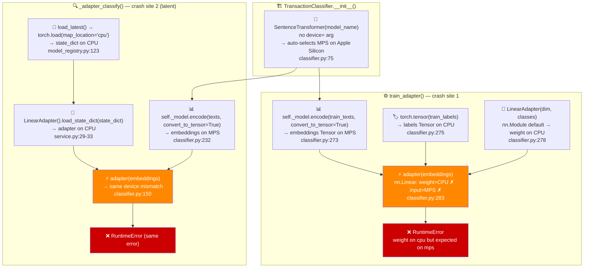

# Bug Report: MPS Device Mismatch in LinearAdapter Training and Inference

> **Doc ID:** BUG-012-mps-device-mismatch-linear-adapter
> **Date:** 2026-03-22
> **Severity:** High
> **Status:** Verified
> **Type:** Bug Report
> **DRI:** Mohammed Hassan Mohiddin

## Observed Behavior

On Apple Silicon Macs (M1/M2/M3), calling `PATCH /api/v1/accounts/transactions/{id}` with
a category change that triggers supervised fine-tuning raises a `RuntimeError` in the
background task:

```
RuntimeError: Tensor for argument weight is on cpu but expected on mps
```

The error originates in `packages/categorization/classifier.py:283` inside `train_adapter()`,
at the `adapter(embeddings)` forward pass. The background task in
`apps/api/domains/accounts/router.py` swallows the exception with
`logger.warning("supervised_finetuning_failed", ...)`, so the HTTP response returns 200 OK —
the failure is silent from the API consumer's perspective.

A second, latent crash exists in the inference path: `_adapter_classify()` at
`packages/categorization/classifier.py:150` fails with the same error when a user adapter
is loaded from Storage and passed to `predict_batch()`. This path has not been triggered
in production because training never completes successfully on Apple Silicon.

## Expected Behavior

`train_adapter()` trains the `LinearAdapter` without errors on any device
(CPU, CUDA, MPS). The adapter is saved to Supabase Storage via `model_registry.save_version()`.

`_adapter_classify()` uses a loaded adapter to classify transactions without errors,
regardless of the device the embedding model is using.

## Steps to Reproduce

1. Run the API locally on an Apple Silicon Mac (`make dev`).
2. Authenticate as any user with transactions.
3. Call `PATCH /api/v1/accounts/transactions/{id}` with a `category` change and an
   `old_category` that matches several transactions (triggering merchant-batch
   reclassification and subsequently supervised fine-tuning).
4. Observe the API logs — `supervised_finetuning_failed` is emitted with
   `"Tensor for argument weight is on cpu but expected on mps"`.

**Alternative (unit reproduce):**

```python
from packages.categorization.classifier import TransactionClassifier
clf = TransactionClassifier()          # SentenceTransformer auto-selects MPS
adapter = clf.train_adapter(
    texts=["amazon purchase"],
    categories=["Shopping"],
)
# → RuntimeError: Tensor for argument weight is on cpu but expected on mps
```

## Environment

- **Branch:** `feat/account-aggregator` (hardware-triggered, not branch-specific — reproducible on any branch on Apple Silicon)
- **Component:** `packages/categorization/classifier.py` (training + inference)
- **Triggered by:** `PATCH /api/v1/accounts/transactions/{id}` →
  `_run_supervised_finetuning_bg` background task (`apps/api/domains/accounts/router.py`);
  also `POST /api/v1/training/train` → `train_adapter_task` Celery task
  (`apps/api/tasks/training_tasks.py`)
- **Hardware:** Apple Silicon Mac (M1/M2/M3) with PyTorch >= 2.0
- **Not triggered on:** Linux CI / Railway (CPU-only environment — all tensors stay on CPU)

## Root Cause Analysis

### Data Flow Diagram (Bug Path)



### Root Cause

`SentenceTransformer(model_name)` with no `device=` argument auto-detects the best
available device (`classifier.py:75`). On Apple Silicon with PyTorch >= 2.0 and
`torch.backends.mps.is_available() == True`, it selects **MPS**. All subsequent
`encode(..., convert_to_tensor=True)` calls return tensors on MPS.

`LinearAdapter` is an `nn.Module` instantiated without `.to(device)`, so its parameters
(weight, bias) live on **CPU** (the PyTorch default for new modules).

When `adapter(embeddings)` is called in `train_adapter()` at `classifier.py:283`,
`nn.Linear.forward()` tries to compute `x @ weight.T + bias`. PyTorch's MPS dispatch
requires both input and weight on the same device. Since `x` (embeddings) is on MPS but
`weight` is on CPU, it raises:

```
RuntimeError: Tensor for argument weight is on cpu but expected on mps
```

There are **three mismatches**, not one:

| # | Tensor | Actual device | Expected device | Exact location |
|---|---|---|---|---|
| 1 | `adapter.weight` | CPU | MPS | `classifier.py:283` — `adapter(embeddings)` in `train_adapter()` |
| 2 | `labels` | CPU | MPS | `classifier.py:284` — `cross_entropy(logits, labels)` — latent after #1 fixed |
| 3 | `adapter.weight` (inference) | CPU | MPS | Load site: `service.py:29-33` `_load_user_adapter()`; crash site: `classifier.py:150` `_adapter_classify()` |

Mismatch #2 is latent — it surfaces only after #1 is fixed without also moving `labels`
to the same device.

### Contributing Factors

- `SentenceTransformer` device auto-detection is silent — there is no log entry indicating
  which device was selected at startup, making the mismatch invisible until a crash.
- `train_adapter()` and `LinearAdapter.__init__()` have no device parameter — they always
  construct on CPU regardless of the embedding model's device.
- The background task in `apps/api/domains/accounts/router.py:77` wraps the entire
  `train_adapter` call in a broad `except Exception`, silencing the crash and returning
  HTTP 200 to the caller.
- `model_registry.load_latest()` hardcodes `map_location="cpu"` — correct for
  production (Linux/CPU-only); the mismatch is in the consumer (`_adapter_classify`),
  not the loader.

## Fix Description

### Changes Required

| File | Change |
|---|---|
| `packages/categorization/classifier.py` | **`train_adapter()` — insert after line 273 (`embeddings = self._model.encode(...)`) and before line 278 (`adapter = LinearAdapter(...)`):** add `device = embeddings.device`; add `adapter.to(device)` immediately after the `LinearAdapter` construction at line 278; add `labels = labels.to(device)` after line 275 (`labels = torch.tensor(...)`). **`_adapter_classify()` — insert between line 148 (`adapter.eval()`) and line 150 (`logits = adapter(embeddings)`):** add `adapter.to(embeddings.device)`. |

`apps/api/domains/categorization/service.py` is **not changed**. `_load_user_adapter()`
(lines 24–34) continues to build the adapter on CPU with `map_location="cpu"`. The device
move is done lazily in `_adapter_classify()` on first use, keeping the load path
environment-agnostic.

### Why This Fix Works

By detecting the device from `embeddings` (which always reflects where
`SentenceTransformer` placed itself) and moving `adapter` and `labels` to that same
device, all three tensors are co-located before any forward pass. This works on CPU,
CUDA, and MPS without hardcoding any device string.

`nn.Module.to(device)` modifies the module in-place and returns `self`, so no copy
overhead and no API changes to callers.

**Startup observability improvement (alongside the fix):** Add a log line at the end of
`TransactionClassifier.__init__()`:

```python
logger.info("classifier_device", device=str(next(self._model.parameters()).device))
```

This would have made the MPS selection immediately visible in startup logs and prevented
the need for live reproduction to diagnose the issue.

## Regression Prevention

- **Test to add:** `test_train_adapter_moves_adapter_to_embedding_device` in
  `packages/categorization/tests/test_classifier_v2.py` — patches
  `SentenceTransformer.encode` to return a tensor on a specific device, asserts no
  `RuntimeError` and that `next(adapter.parameters()).device == embeddings.device`.
  **Implementation note:** must use a locally-instantiated `TransactionClassifier`
  (not the module-scoped `classifier` fixture), because the module-scoped fixture loads
  the real model before the patch is applied and the mock will not affect the already-bound
  `_model.encode` reference.
- **Test to add:** `test_adapter_classify_no_device_mismatch` in
  `packages/categorization/tests/test_classifier_v2.py` — creates a CPU-resident
  `LinearAdapter`, passes MPS-shaped embeddings to `_adapter_classify`, asserts no
  `RuntimeError`. Same note applies: use a locally-scoped classifier instance, not
  the module-scoped fixture.
- **Guard to add:** A `DEBUG`-level assertion inside `_adapter_classify`
  (`packages/categorization/classifier.py`, before line 150) that checks
  `next(adapter.parameters()).device == embeddings.device` after the `.to()` call.
  Note: this guard is a local developer safeguard only — on Linux CI (CPU-only), both
  sides will always be CPU and the assertion trivially passes; it provides no CI signal
  for device mismatch, only local visibility.

## Related Documents

- Bug: `docs/bugs/BUG-002-linear-adapter-broken-pipeline.md` — fixed the storage path
  split-brain and `user_model_metadata` write gap; the MPS device mismatch existed
  independently of those fixes and was surfaced during live verification after BUG-002
  was resolved.
- HLD: `docs/design/system-architecture.md` — ML pipeline section

## Changelog

| Date | Entry |
|---|---|
| 2026-03-22 | BUG-012 created. Status: Investigating. |
| 2026-03-22 | Root cause identified via live reproduction on Apple Silicon M-chip. Three device mismatches documented. Status: Root Cause Found. |
| 2026-03-22 | Fix applied — commits `6faf052` and `3827e9d`. `device = embeddings.device` + `.to(device)` added in `train_adapter()`; `adapter.to(embeddings.device)` added in `_adapter_classify()`; early-return path fixed. 3 device-consistency tests added. DEVIATION: early-return `LinearAdapter` path also needed `.to(model_device)` — not captured in original Fix Description; added as a separate commit. Status: Implemented. |
| 2026-03-22 | Verification passed — 325/325 tests pass (`apps/ packages/`). Status: Verified. |
