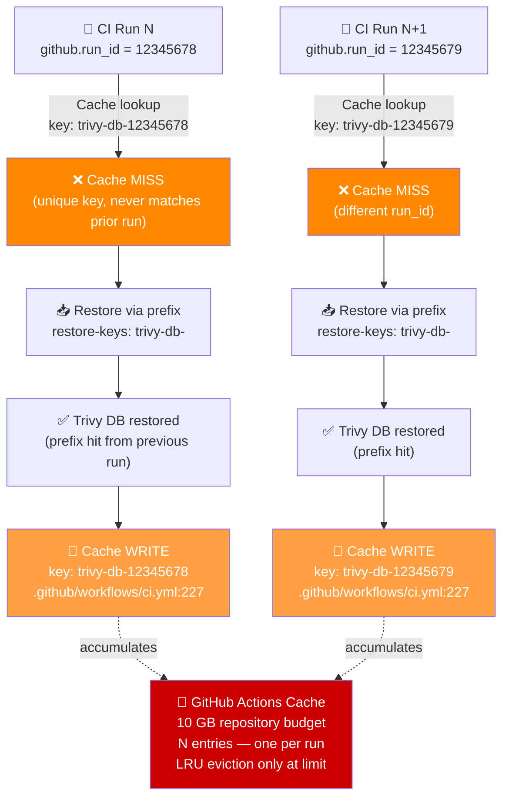

# Bug Report: Trivy Cache Accumulates One Entry Per CI Run Due to run_id Key

> **Doc ID:** BUG-014-trivy-cache-run-id
> **Date:** 2026-03-24
> **Severity:** Low
> **Status:** Fix Applied
> **DRI:** Mohammed Hassan Mohiddin

## Observed Behavior

One new GitHub Actions cache entry is created per CI run under the key
`trivy-db-<run_id>`. Old entries are never evicted by an exact key hit because
`github.run_id` is unique per workflow execution. Over time the 10 GB repository
cache budget fills with stale Trivy database snapshots, requiring manual cache
purges or waiting for GitHub's LRU eviction to reclaim space.

The symptom is visible in the GitHub Actions Cache tab (Settings → Actions → Caches):
entries appear as `trivy-db-12345678`, `trivy-db-12345679`, etc., one per CI run on
every branch.

## Expected Behavior

The Trivy vulnerability database should be cached with a stable key that is reused
by all CI runs within the same calendar week. A single entry per OS per week should
exist. When a new week starts, the old entry stops receiving writes and is eventually
reclaimed by LRU eviction, keeping cache usage bounded.

## Steps to Reproduce

1. Open `.github/workflows/ci.yml` and locate the `Cache Trivy DB` step
   (line 223–228 inside the `build-push-images` job).
2. Observe `key: trivy-db-${{ github.run_id }}` — `run_id` is unique per run.
3. Trigger two CI runs back-to-back on any branch (e.g., push two commits).
4. Navigate to the repository's GitHub Actions Cache tab.
5. Observe two separate entries written — `trivy-db-<run_id_1>` and
   `trivy-db-<run_id_2>` — neither matched nor evicted by the other.

## Environment

- **Branch:** `main` (all branches affected; key is not branch-scoped)
- **Component:** `.github/workflows/ci.yml` — `Cache Trivy DB` step,
  `build-push-images` job, line 227
- **Triggered by:** Every push to any branch that executes the
  `build-push-images` job

## Root Cause Analysis

### Bug Path Diagram



### Root Cause

`key: trivy-db-${{ github.run_id }}` at `.github/workflows/ci.yml:227` uses a value
that is unique per workflow run. `actions/cache` only skips the post-step write when
the exact key is a hit at the restore step. Because `run_id` never matches a previous
run, every execution performs a new cache write.

The `restore-keys: trivy-db-` prefix correctly restores the Trivy database from the
most recent entry, so the database is populated on every run. However, `actions/cache`
still writes a new entry under the unique exact key after a prefix restore. This
creates unbounded accumulation.

GitHub Actions enforces a 10 GB cache limit per repository. Entries are only purged
by LRU when the limit is reached, rather than expiring on a predictable schedule.

### Contributing Factors

- No TTL is enforced on individual entries; growth is only bounded by the global 10 GB
  limit and LRU eviction.
- `restore-keys` prefix matching provides read correctness but does not suppress the
  write that follows on a key miss — the key mismatch is the condition that triggers
  the new write.

## Fix Description

### Files Changed

| File | Change |
|---|---|
| `.github/workflows/ci.yml` | Add `Get week stamp for Trivy cache key` step; update `Cache Trivy DB` key and `restore-keys` |

### Before

```yaml
- name: Cache Trivy DB
  uses: actions/cache@v4
  with:
    path: ~/.cache/trivy
    key: trivy-db-${{ github.run_id }}
    restore-keys: trivy-db-
```

### After

```yaml
- name: Get week stamp for Trivy cache key
  id: date
  run: echo "week=$(date +%Y-%U)" >> $GITHUB_OUTPUT

- name: Cache Trivy DB
  uses: actions/cache@v4
  with:
    path: ~/.cache/trivy
    key: trivy-db-${{ runner.os }}-${{ steps.date.outputs.week }}
    restore-keys: trivy-db-${{ runner.os }}-
```

### Why This Fix Works

`date +%Y-%U` produces an output like `2026-12` (ISO year + zero-padded week number).
All CI runs within the same calendar week share the same exact key →
`actions/cache` finds an exact hit at restore time → no new entry is written → one
entry per OS per week.

When the week increments, the previous entry receives no new writes and becomes the
oldest entry in the LRU pool, where it is reclaimed once the global limit is approached.

The `runner.os` prefix (e.g., `Linux`) prevents cache collisions if CI ever runs on
multiple operating systems. The updated `restore-keys: trivy-db-${{ runner.os }}-`
prefix ensures cross-week restores still find the most recent entry for the same OS.

## Regression Prevention

- **Automated test:** No automated test for GitHub Actions cache behavior is practical.
  Verification is manual: after the fix is merged, trigger two CI runs in the same
  calendar week and confirm only one `trivy-db-Linux-<YYYY-WW>` entry appears in the
  Actions Cache tab.
- **Guard added:** The weekly key format `%Y-%U` causes cache entries to rotate
  predictably on a 7-day boundary, preventing indefinite accumulation regardless of
  CI run frequency.

## Related Documents

- Feature: `docs/features/006-ci-cd-pipeline-hardening.md` — CI pipeline hardening
  (parent feature that encompasses this fix)

## Changelog

| Date | Entry |
|---|---|
| 2026-03-24 | Bug report created. Status: Root Cause Found. |
| 2026-03-24 | Fix applied. Status → Fix Applied |
