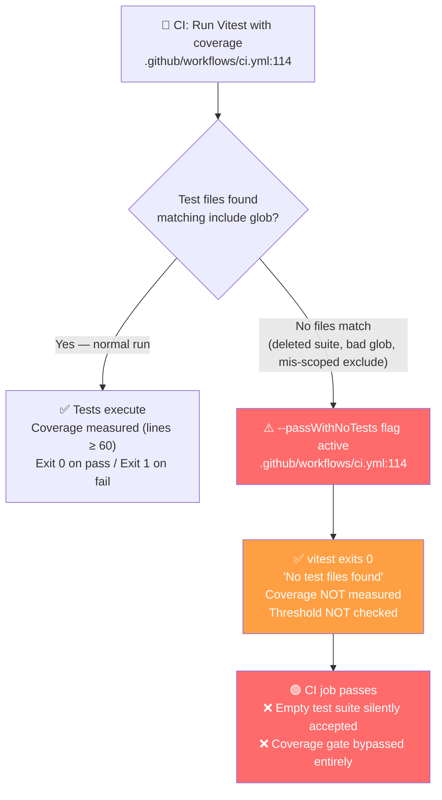

# Bug Report: vitest --passWithNoTests Silences Empty Test Suite in CI

> **Doc ID:** BUG-015-vitest-pass-with-no-tests
> **Date:** 2026-03-24
> **Severity:** Medium
> **Status:** Verified
> **DRI:** Mohammed Hassan Mohiddin

## Observed Behavior

When ALL test files are accidentally excluded — due to a wrong glob pattern, a deleted test
suite, or a mis-scoped `exclude` pattern in `vitest.config.ts` — CI exits 0 with no test
output. The GitHub Actions `Run Vitest with coverage` step shows green with zero tests
executed. The entire frontend test suite has silently disappeared with no alert.

The vitest output in this scenario reads:

```
No test files found, exiting with code 0
```

CI considers this a passing run, and the merge-blocking `test-frontend` job reports success
despite no frontend code having been exercised.

## Expected Behavior

When no test files match the configured patterns, vitest should exit 1 and CI should fail
with a clear "No test files found" error. An empty test suite must be indistinguishable from
a broken test configuration — both should block the merge.

The coverage threshold (`lines: 60`) defined in `apps/web/vitest.config.ts` cannot protect
against this case because coverage measurement never runs when there are no test files to
execute.

## Steps to Reproduce

1. Open `.github/workflows/ci.yml` and locate line 114:

   ```
   run: cd apps/web && npx vitest run --coverage --passWithNoTests
   ```

2. Locally, rename `apps/web/src` to `apps/web/src_backup` so no test files match the
   default `include` glob.
3. Run: `cd apps/web && npx vitest run --coverage --passWithNoTests`
4. Observe: vitest exits 0 with output `No test files found, exiting with code 0`.
5. In CI, this would produce a green check mark — the branch would be mergeable with zero
   tests having run.

## Environment

- **Branch:** All branches (affects every CI run that executes the `test-frontend` job)
- **Component:** `.github/workflows/ci.yml` — `Run Vitest with coverage` step, line 114,
  inside the `test-frontend` job
- **Triggered by:** Every push that executes the `test-frontend` job; risk is highest after
  refactoring that moves, renames, or bulk-excludes test files

## Root Cause Analysis

### Bug Path Diagram



### Root Cause

The `--passWithNoTests` flag at `.github/workflows/ci.yml:114` instructs vitest to treat an
empty match as a successful run. Without this flag, vitest exits 1 when no test files match
its `include` patterns, which is the correct behaviour for CI — an empty test suite is
indistinguishable from a broken configuration and should fail the build.

**The exact defective command** (`.github/workflows/ci.yml:114`):

```yaml
run: cd apps/web && npx vitest run --coverage --passWithNoTests
```

### Important Distinction from Coverage Threshold

`apps/web/vitest.config.ts` already defines `coverage.thresholds.lines: 60`. This threshold
correctly catches low coverage **when tests exist and run**. It does not protect against the
zero-tests case because:

1. vitest only evaluates thresholds after running tests.
2. With `--passWithNoTests`, vitest never enters the test-execution phase when no files match.
3. Therefore the threshold is never evaluated and cannot fire.

These are two independent gates. The coverage threshold handles the "tests run but coverage is
low" case. Removing `--passWithNoTests` handles the "no tests ran at all" case.

### Contributing Factors

- `--passWithNoTests` was likely added during initial project setup to avoid CI failures
  before any tests were written. It was never removed once a meaningful test suite existed.
- The coverage threshold creates a false sense of safety — it appears to guard the test suite,
  but it is bypassed entirely by the zero-tests code path.

## Fix Description

### Files Changed

| File | Change |
|---|---|
| `.github/workflows/ci.yml` | Remove `--passWithNoTests`; add `--reporter=verbose` for clearer CI output |

### Before

```yaml
- name: Run Vitest with coverage
  run: cd apps/web && npx vitest run --coverage --passWithNoTests
```

### After

```yaml
- name: Run Vitest with coverage
  run: cd apps/web && npx vitest run --coverage --reporter=verbose
```

### Why This Fix Works

Removing `--passWithNoTests` restores vitest's default behaviour: exit 1 when no test files
match the include patterns. CI immediately fails with a clear "No test files found" error.
Any accidental deletion of test files, mis-scoped glob exclusion, or directory rename will
now block the merge rather than silently passing.

`--reporter=verbose` replaces the removed flag in the command. It does not change pass/fail
logic — it causes vitest to print each test name as it runs, making CI output more readable
and the cause of failures easier to diagnose. It is not required by the fix; it is an
optional improvement added at the same opportunity.

`apps/web/vitest.config.ts` requires no changes. The existing `coverage.thresholds.lines: 60`
remains correct and continues to protect against low coverage in the normal (tests-found) path.

## Regression Prevention

- **Automated test:** No practical automated test exists for a CI flag's exit-code behaviour.
  Verification is manual: after the fix is merged, rename `apps/web/src` to
  `apps/web/src_backup` locally and confirm `cd apps/web && npx vitest run --coverage
  --reporter=verbose` exits 1 with "No test files found". Restore the directory and confirm
  the suite passes normally.
- **Guard added:** Without `--passWithNoTests`, any future accidental exclusion of all test
  files will immediately cause CI to fail with a clear error. The absence of the flag is itself
  the ongoing guard.

## Related Documents

- Feature: `docs/features/006-ci-cd-pipeline-hardening.md` — CI pipeline hardening (parent
  feature that encompasses this fix)

## Changelog

| Date | Entry |
|---|---|
| 2026-03-24 | Bug report created. Status: Root Cause Found. |
| 2026-03-24 | Fix applied. Status → Fix Applied |
| 2026-03-25 | Verification passed. Status → Verified |
