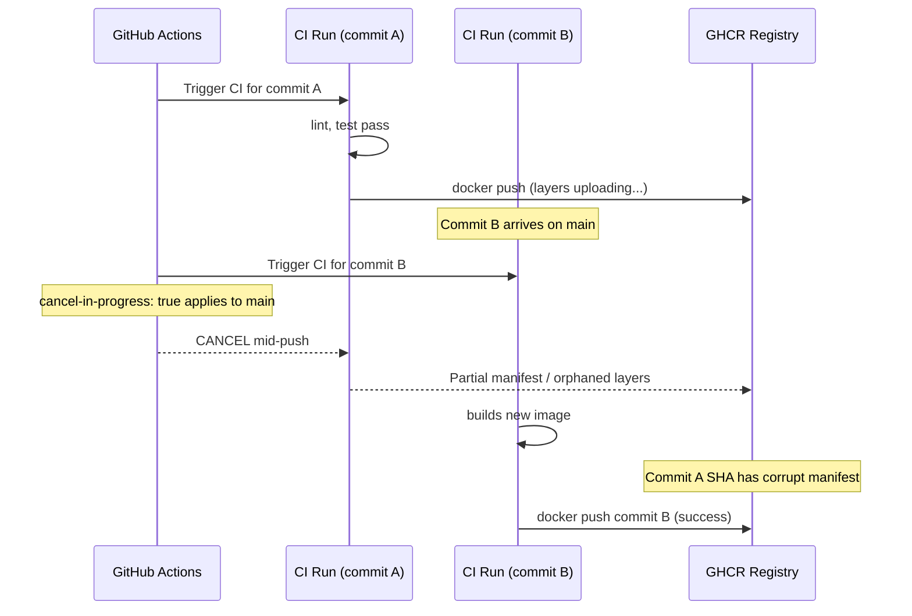

# Bug Report: cancel-in-progress Can Abort Docker Push on main

> **Doc ID:** BUG-016-concurrency-cancels-docker-push
> **Date:** 2026-03-24
> **Severity:** High
> **Status:** Verified
> **DRI:** Mohammed Hassan Mohiddin

## Observed Behavior

When two commits land on `main` in quick succession (e.g., a merge followed by a hotfix within
seconds), the first CI run is cancelled while it is actively pushing a Docker image to GHCR.
This leaves a partial or corrupt image manifest in the registry. The deploy workflow then picks
up a bad image SHA, potentially deploying a broken artifact to staging.

## Expected Behavior

CI runs triggered by `main` branch pushes should always run to completion. Cancellation should
only apply to PR and feature-branch runs where the in-flight work is immediately superseded by
the newer commit.

## Steps to Reproduce

1. Open `.github/workflows/ci.yml` — note lines 13–15:

   ```yaml
   concurrency:
     group: ci-${{ github.ref }}
     cancel-in-progress: true
   ```

2. Push two commits to `main` within a few seconds of each other (e.g., a revert followed by a
   hotfix, or two merge commits from a merge queue).
3. Observe: the first CI run is cancelled mid-execution — potentially while `docker push` is
   running inside the `build-push-images` job.
4. Result: GHCR may contain a partial manifest for the cancelled run's SHA, while the deploy
   workflow expects a clean image at that SHA.

## Environment

- **Branch:** `main` (the bug is specific to the main branch; PR runs are safe to cancel)
- **Component:** `.github/workflows/ci.yml` — `concurrency` block, lines 13–15
- **Triggered by:** Rapid successive pushes to `main` — common during release sequences,
  cherry-picks, revert-then-fix patterns, or merge queue activity

## Root Cause Analysis

**Root Cause:**

`cancel-in-progress: true` is set unconditionally at the workflow level in
`.github/workflows/ci.yml` (lines 13–15). GitHub Actions applies this to ALL refs in the
`ci-${{ github.ref }}` concurrency group — including `refs/heads/main`. When a second push to
`main` arrives while CI is running for the first push, GitHub cancels the first run regardless
of its current step.

The `build-push-images` job (line 190) calls `docker/build-push-action@ca052bb54ab0790a636c9b5f226502c73d547a25`
(line 213), which performs a multi-step push: it uploads individual image layers first, then
writes the manifest index. If cancellation occurs between the layer uploads and the manifest
write, the result is a dangling manifest or missing layers in GHCR. The deploy workflow then
references the cancelled run's SHA and attempts to pull a corrupt image.

**Contributing Factors:**

- `cancel-in-progress: true` is the correct setting for PR workflows — it prevents wasted CI
  minutes on stale commits. It was set globally because PR and branch runs share the same
  concurrency block (`ci-${{ github.ref }}`).
- No branch-conditional guard was added to exclude `refs/heads/main` from cancellation when the
  setting was introduced.

**Sequence Diagram:**



## Fix Description

Restrict cancellation to non-main branches using a conditional expression so that `main` runs
always complete, while PR and feature-branch runs continue to cancel fast.

| File | Change |
|---|---|
| `.github/workflows/ci.yml` | Change `cancel-in-progress: true` to `cancel-in-progress: ${{ github.ref != 'refs/heads/main' }}` |

**Before (lines 13–15):**

```yaml
concurrency:
  group: ci-${{ github.ref }}
  cancel-in-progress: true
```

**After:**

```yaml
concurrency:
  group: ci-${{ github.ref }}
  cancel-in-progress: ${{ github.ref != 'refs/heads/main' }}
```

**Why this fix works:** On `main`, `github.ref` equals `refs/heads/main`, so the expression
evaluates to `false` — cancellation is disabled and every run completes. On any PR or feature
branch (`refs/heads/feature/foo`, `refs/pull/NNN/merge`, etc.), the expression evaluates to
`true` — fast cancellation still applies, saving CI minutes. This preserves the speed benefit
for PRs while protecting the integrity of `main` pushes.

## Regression Prevention

- **Automated test:** No automated test for GitHub Actions concurrency behaviour is practical.
  Verification is manual: trigger two rapid pushes to `main` and confirm both runs complete
  without cancellation, and that GHCR contains clean manifests for both SHAs.
- **Guard added:** The conditional expression `${{ github.ref != 'refs/heads/main' }}` makes
  the protection permanent and self-documenting in the workflow file. Any future reviewer can
  see immediately that main-branch runs are intentionally protected from cancellation.

## Related Documents

- `docs/features/006-ci-cd-pipeline-hardening.md` — CI pipeline hardening feature that
  introduced the concurrency block
- `docs/features/007-cd-implementation.md` — CD implementation that depends on clean GHCR
  images produced by CI

## Changelog

| Date | Note |
|---|---|
| 2026-03-24 | Bug report created. Status: Root Cause Found |
| 2026-03-25 | Fix applied. Status → Fix Applied |
| 2026-03-25 | Verification passed. Status → Verified |
