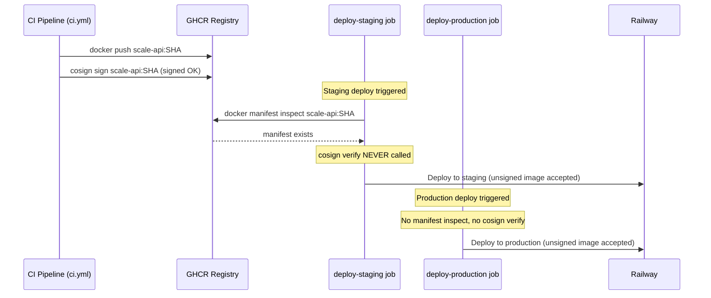

# Bug Report: cosign Image Signatures Never Verified Before Railway Deploy

> **Doc ID:** BUG-017-cosign-signature-never-verified
> **Date:** 2026-03-24
> **Severity:** High
> **Status:** Root Cause Found
> **DRI:** Mohammed Hassan Mohiddin

## Observed Behavior

CI signs Docker images with cosign (Sigstore keyless signing) after pushing to GHCR. However,
`deploy.yml` only calls `docker manifest inspect` to verify image existence before deploying to
Railway — it never calls `cosign verify`. An image pushed directly to GHCR (bypassing CI) would
be deployed without any signature check, defeating the supply chain protection the signing step
was intended to provide.

## Expected Behavior

Before deploying to either staging or production, the pipeline must call `cosign verify` to
confirm the image was produced by a legitimate CI run using the GitHub Actions OIDC token. Images
without a valid Sigstore signature should fail the pre-deploy gate and block the deployment.

## Steps to Reproduce

1. Open `.github/workflows/ci.yml` — locate the `cosign sign` step inside the
   `build-push-images` job. Confirm images are signed after push.
2. Open `.github/workflows/deploy.yml` — locate the `deploy-staging` and `deploy-production`
   jobs.
3. Search for `cosign verify` in `deploy.yml` — it does not exist.
4. Observe: `deploy-staging` contains a `Verify image exists in GHCR` step (`docker manifest
   inspect`) but no `cosign verify` step. `deploy-production` has no existence check at all —
   it proceeds directly from `Log in to GHCR` to `Deploy to Railway (production)`. In neither
   job is signature validity confirmed prior to deployment.

## Environment

- **Branch:** `main` (both staging and production deployments are triggered from `main`)
- **Component:** `.github/workflows/deploy.yml` — `deploy-staging` and `deploy-production` jobs
  (pre-deploy verification section)
- **Triggered by:** Every deployment to staging and every promotion to production

## Root Cause Analysis

**Root Cause:**

The CI pipeline signs images (`cosign sign` step in the `build-push-images` job of `ci.yml`) but
the deploy pipeline performs only an existence check (`docker manifest inspect`), not a signature
verification (`cosign verify`). The signing and verification steps live in separate workflow
files. The `cosign verify` step was never added to `deploy.yml` when cosign signing was
introduced.

This gap means the cosign signing step in CI provides no real supply chain protection — an image
can be deployed even if it was never signed by a CI run. The Sigstore transparency log (Rekor)
entry for a legitimate CI build is never consulted during deployment.

**Attack scenario:** An attacker with GHCR write access (e.g., via a compromised PAT or a
misconfigured package permission) pushes a malicious image with the correct SHA tag. For staging,
`docker manifest inspect` passes (existence confirmed) but no signature verification is
performed. For production, there is not even an existence check — the image is deployed directly.
In both cases the malicious image reaches Railway.

**Sequence Diagram:**



**Contributing Factors:**

- cosign signing was added to `ci.yml` but `deploy.yml` was not updated to include a
  corresponding `cosign verify` step in either deploy job.
- `deploy-staging` uses `docker manifest inspect` as its only pre-deploy check, which confirms
  only that an image with the given tag exists — not that it was produced by a trusted CI run.
- `deploy-production` has no pre-deploy image verification at all: it proceeds directly from
  `Log in to GHCR` to deploying the image.

## Fix Description

Add `sigstore/cosign-installer` and `cosign verify` steps to both deploy jobs in `deploy.yml`.
The steps should be inserted after the existing `Verify image exists in GHCR` step
(`docker manifest inspect`) in `deploy-staging`, and after the `Log in to GHCR` step in
`deploy-production` (which has no manifest inspect step).

| File | Change |
|---|---|
| `.github/workflows/deploy.yml` | Add `sigstore/cosign-installer@v3` + `cosign verify` step to `deploy-staging` job |
| `.github/workflows/deploy.yml` | Add `sigstore/cosign-installer@v3` + `cosign verify` step to `deploy-production` job |

**Steps to add (same pattern for both jobs):**

```yaml
- name: Install cosign
  uses: sigstore/cosign-installer@v3

- name: Verify image signature
  run: |
    cosign verify \
      --certificate-identity-regexp="https://github.com/${{ github.repository }}/.*" \
      --certificate-oidc-issuer="https://token.actions.githubusercontent.com" \
      ghcr.io/${{ github.repository_owner }}/scale-api:${{ steps.sha.outputs.value }}
```

Note: `steps.sha.outputs.value` refers to the SHA output from the existing `Set deploy SHA` step
present in both jobs.

**Why this fix works:** `cosign verify` queries the Sigstore transparency log (Rekor) for a
certificate that:

1. Was issued by the GitHub Actions OIDC provider (`certificate-oidc-issuer`)
2. Is scoped to this specific repository's workflow (`certificate-identity-regexp`)

An image pushed directly to GHCR outside of CI will have no matching Rekor entry. `cosign verify`
exits with a non-zero status, the deploy step fails, and the deployment is blocked. Only images
that were signed by a legitimate run of this repository's CI workflow can pass the gate.

## Regression Prevention

- **Automated test:** No practical automated test exists for cosign signature verification in
  GitHub Actions workflows. Verification is manual: push an unsigned image to GHCR with the
  correct SHA tag and confirm that the `deploy-staging` and `deploy-production` jobs fail at the
  `Verify image signature` step.
- **Guard added:** Both deploy jobs will fail with a non-zero exit code if `cosign verify` cannot
  find a valid Sigstore signature, blocking deployment of any image not produced by a trusted CI
  run.

## Related Documents

- `docs/features/007-cd-implementation.md` — CD pipeline implementation where cosign signing was
  introduced
- `docs/features/006-ci-cd-pipeline-hardening.md` — CI hardening that added the `cosign sign`
  step to `ci.yml`

## Changelog

| Date | Note |
|---|---|
| 2026-03-24 | Bug report created. Status: Root Cause Found |
