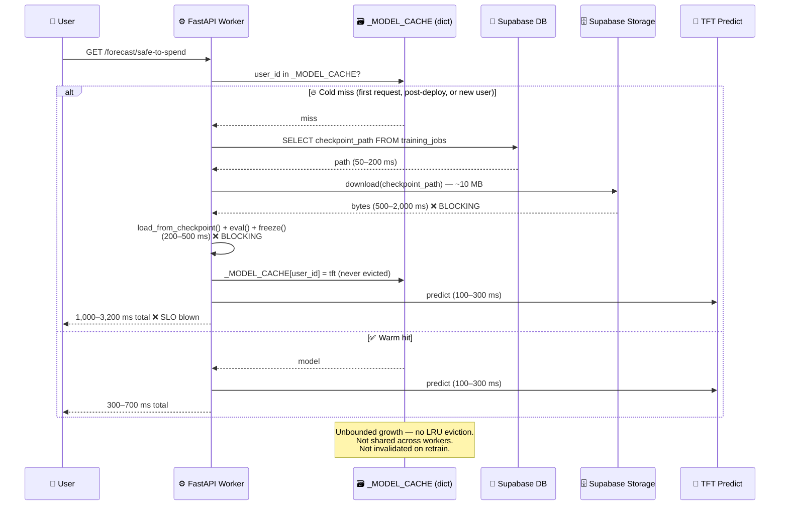

# Bug Report: TFT Inference Cold-Load Blows 500ms Latency Target (Unbounded In-Process Cache)

> **Doc ID:** BUG-018-tft-inference-cold-load-no-bounded-cache
> **Date:** 2026-04-17
> **Severity:** High
> **Status:** Fix Applied
> **DRI:** Mohammed Hassan Mohiddin

## Observed Behavior

A forecast request for an established user (`status=completed` training job, checkpoint in
Supabase Storage) whose TFT model is NOT already in the current API worker's memory takes
**approximately 1–3 seconds end-to-end**, broken down roughly as:

| Stage | Latency (CPU, estimated) |
|---|---|
| `get_latest_checkpoint_path(supabase, user_id)` (`inference.py:27`) — `training_jobs` SELECT | 50–200 ms |
| `supabase.storage.from_("model-checkpoints").download()` (`inference.py:67`) — ~10 MB over network (I/O-bound, releases GIL) | 500–2,000 ms |
| `TemporalFusionTransformer.load_from_checkpoint(buffer, map_location="cpu")` + `.eval()` + `.freeze()` (`inference.py:77–79`) — CPU-bound, holds GIL | 200–500 ms |
| `predict_with_tft()` (`inference.py:94`) — dataset construction + `model.predict` | 100–300 ms |
| Chronos-2 inference (once `service.py` lands per LLD §Design, added to every request) | 150–400 ms |

**Cold-path total: 1,000–3,200 ms (estimated p50 band; not yet empirically benchmarked —
see the §Fix Description RFC scope for the measurement plan).** The LLD's stated
performance target is `CPU inference latency < 500ms per 30-day forecast`
(`docs/features/009-prediction-engine.md` §Success Criteria and §Testing Strategy). Every
first-request-per-worker for an established user violates this SLO.

Subsequent requests on the same worker hit the in-process cache and return faster. **The
warm-path estimate is p50 ~350 ms, p95 ~650 ms — the warm p95 alone likely also exceeds
the 500 ms target once Chronos-2 inference is added to every request.** This flags a
secondary concern for the RFC: either the SLO must be loosened (to e.g. warm p95 < 750 ms,
cold p95 < 1500 ms) or Chronos-2 inference must be moved off the forecast request path
(e.g. pre-computed daily). The numbers above are back-of-envelope; all latency figures in
this report are to be confirmed with a benchmark harness as part of the fix RFC's scope.

Additional symptoms:

- **Memory grows unbounded** as distinct users hit a given worker. At ~5–15 MB per cached
  `TemporalFusionTransformer` (checkpoint + optimizer state + PyTorch graph), a worker that
  has served 1,000 distinct users holds 5–15 GB of models in resident RAM with no eviction.
  OOM-kills the worker once the host runs out of memory.
- **Cache isolation between workers.** Under uvicorn/gunicorn with N workers, the same
  user's model is re-downloaded and re-loaded up to N times across the fleet because each
  process has its own private dict.
- **No hit/miss metrics.** There is no way to observe cache-hit rate, eviction count, or
  cold-load latency in production.
- **Stale entries never invalidate on external retrain.** If the polling worker retrains a
  user's model and writes a new `checkpoint_path` to `training_jobs`, existing API workers
  continue serving the old in-memory model until something calls `invalidate_cache(user_id)`
  — which nothing currently does after a completed training job.

## Expected Behavior

Forecast requests for established users should return in **< 500 ms at p95 on a CPU server**,
regardless of whether the user's model is warm or cold in the serving worker.

Concretely:

- Warm-cache hit: < 500 ms (TFT predict + Chronos-2 predict + ensemble + serialize)
- Cold-cache miss on a worker: < 500 ms, achieved by (a) bounded LRU eviction to control
  RAM, plus (b) one of the following architectural fixes — background pre-warming on user
  login, a shared out-of-process cache (Redis/object store with local mmap), or routing each
  user's requests consistently to a worker that holds their model.
- Per-worker RAM usage for the TFT cache must be bounded by a configurable byte or entry
  ceiling (default: ~50–100 models, ~250–500 MB).
- When the polling worker marks a training job as `completed` with a new `checkpoint_path`,
  cached entries for that user must be invalidated across all API workers before the next
  forecast request returns a stale prediction.
- Cache metrics (hit rate, miss rate, eviction count, cold-load p50/p95 latency, cached
  model count, resident bytes) must be exposed via the existing observability stack for
  SLO monitoring.

## Steps to Reproduce

1. Start the API server fresh (`make dev`) so no TFT models are in memory.
2. Ensure a test user has a `training_jobs` row with `status=completed` and a valid
   `checkpoint_path` pointing at a ~10 MB `.ckpt` in the `model-checkpoints` Storage bucket,
   and has ≥ 60 days of transactions in the `transactions` table.
3. `curl -X GET -H "Authorization: Bearer <jwt>" http://localhost:8000/forecast/safe-to-spend`
4. Time the request end-to-end (`time curl ...` or a browser devtools Network panel).
5. Observe: **first request** takes 1–3 s. Inspect `logger.info(f"Downloading checkpoint: {checkpoint_path}")` in the worker logs
   (`packages/forecasting/inference.py:63`) — fires on first request.
6. Run the same `curl` 5 times back-to-back. Requests 2–5 return in < 700 ms because
   `_MODEL_CACHE[user_id]` is hit at `inference.py:54`.
7. Restart the API server. The first request again takes 1–3 s. The cache does not persist
   across restarts or across a deploy, so **every deploy invalidates every user's warm
   state**.
8. Simulate many distinct users: run the loop for 500 different `user_id`s with unique
   checkpoints. Monitor process RSS with `ps -o pid,rss -p <uvicorn-worker-pid>`. RSS grows
   monotonically with the number of distinct users served; no eviction occurs.

## Environment

- **Branch:** `main` (feature 009 in LLD `Draft`, not yet implemented)
- **Component:** `packages/forecasting/inference.py` — the `_MODEL_CACHE` global dict on
  line 24 is the only caching mechanism. Used by `apps/api/domains/forecasting/router.py`
  (existing `/forecast/safe-to-spend`) and will be used by the future `ForecastService`
  designed in `docs/features/009-prediction-engine.md`.
- **Triggered by:** Every first forecast request per (API worker process, user) pair.
  Also every request following an API deploy, restart, autoscale event, or worker-recycle
  (uvicorn `--timeout-keep-alive`/`--max-requests`).

## Root Cause Analysis

### Data Flow Diagram (Bug Path)



### Root Cause

The only caching layer is the module-level dict defined at `packages/forecasting/inference.py:24`:

```python
_MODEL_CACHE: Dict[str, Any] = {}
```

This dict has four structural deficiencies relative to the 500 ms latency target and the
architecture documented in the LLD:

1. **No bounded eviction.** `load_model()` at `inference.py:48–84` only writes to the dict
   (`_MODEL_CACHE[user_id] = tft` at line 80) and never evicts. Given 5–15 MB per loaded
   TFT and the projected scale of established users crossing the 90-day threshold (per
   `docs/features/009-prediction-engine.md:40`), an API worker that has served a few
   thousand distinct users will exceed any reasonable container memory limit and be
   OOM-killed by the orchestrator.
2. **Per-process isolation.** The dict lives in Python's module-level namespace, which is
   per-interpreter. FastAPI under uvicorn with `--workers N` gets N independent caches. The
   cold-load penalty is paid N times per user across the fleet, and a user whose request
   load-balances to a worker that has not served them yet pays the full 1–3 s cost even if
   another worker has the model warm.
3. **No invalidation hook from the training pipeline.** `invalidate_cache(user_id)` is
   defined at `inference.py:87–91` but has zero callers. Two places should call it and
   neither does today:
   - `apps/worker/main.py` — the polling worker that sets `training_jobs.status='completed'`
     after writing the new `checkpoint_path`. Confirmed via `grep -rn "invalidate_cache"
     apps/` returning only the definition.
   - `apps/api/domains/forecasting/router.py:167` — the `/forecast/safe-to-spend` handler,
     which could stale-check the cached `user_id`'s `checkpoint_path` against
     `training_jobs` and call `invalidate_cache` on mismatch before `load_model`. It does
     not.

   Consequence: API workers keep serving the stale model indefinitely until the process
   dies. The existing `load_model(supabase, user_id)` signature at `inference.py:48` takes
   an untyped `supabase` parameter — the same Supabase client object is passed as `client`
   at `router.py:167` and will be passed as `self.supabase` by the future
   `ForecastService` at `docs/plans/2026-04-06-prediction-engine.md` task 7. Same object,
   different binding names.
4. **No metrics.** There is no Prometheus counter, structlog key, or health endpoint that
   reports cache hit/miss rate, cold-load p50/p95, or current cached-model count. The
   latency SLO in the LLD is unmeasurable in production today.

The LLD explicitly calls out Chronos-2 loading (`docs/features/009-prediction-engine.md:289–291`
describes a singleton loaded at API startup) but does **not** specify any corresponding
per-user TFT caching policy. The future `ForecastService` designed in the LLD uses
`load_model(self.supabase, user_id)` inline in `predict()` (plan task 7,
`docs/plans/2026-04-06-prediction-engine.md:1267`), which means implementing the LLD as
written propagates the same four deficiencies into the new service layer.

### Contributing Factors

- **SLO written without cold-path analysis.** The < 500 ms target in the LLD applies to
  inference after model load, but the LLD does not decompose warm vs cold timing or
  specify which must satisfy the target. The plan treats latency as a single number.
- **Deploys reset every user's cache.** Standard rolling deploys terminate all workers;
  nothing pre-warms the cache on the new fleet, so the post-deploy minute sees every
  established user hit the cold path regardless of how long their model was warm before.
- **No load-stickiness or request routing by user.** The current load balancer
  (platform-default round-robin) spreads a single user's requests across all workers,
  maximising cold misses instead of keeping one user on one worker.
- **Retraining pipeline has no callback.** `apps/worker/main.py` does not publish a
  "model updated for user X" event. Even if API workers subscribed, there is no event to
  subscribe to.

## Fix Description

This bug report documents the defect. The fix itself requires an RFC because multiple
architectural options exist (bounded LRU only, Redis-backed, request routing, pre-warm on
login) with different trade-offs. The RFC to be authored is
`docs/rfcs/RFC-NNN-tft-inference-cache-architecture.md` — it must be written, spec-reviewed,
and approved before any code change lands (Gate 2 of `.claude/rules/documentation-gate.md`).
Subsequent `fix:` commits must include `Refs: docs/bugs/BUG-018-tft-inference-cold-load-no-bounded-cache.md`
and `Refs: docs/rfcs/RFC-NNN-tft-inference-cache-architecture.md` (Gate 4). This bug
deliberately does not commit to one architectural option because the four concrete fixes
specified below (bounded LRU, invalidation hook, stale-check on `get`, metrics) are
orthogonal to that choice.

### Proposed Changes (to be detailed in a follow-up RFC)

| File | Change |
|---|---|
| `packages/forecasting/inference.py` | Replace module-level `_MODEL_CACHE: Dict[str, Any]` with a bounded LRU cache class (`TFTModelCache`) parameterised by max entries and max bytes. Add `get(user_id)`, `put(user_id, model, checkpoint_version)`, `invalidate(user_id)`, `stats() -> CacheStats` methods. |
| `packages/forecasting/inference.py` | Add a `checkpoint_version` field tracked alongside the cached model, read from `training_jobs.updated_at` or a dedicated column. `get()` stale-checks the cached version against the latest DB row before returning. |
| `apps/api/domains/forecasting/service.py` (new file per LLD) | Replace direct `load_model()` calls with `cache.get_or_load()` that emits structlog events for hit/miss/evict. |
| `apps/worker/main.py` | After writing `status=completed` for a training job, publish an invalidation event (Supabase realtime channel, Redis pub/sub, or a polled `model_invalidations` table depending on the RFC outcome). |
| `apps/api/main.py` | Subscribe to invalidation events on startup; on receipt, call `cache.invalidate(user_id)` across all worker processes. |
| `apps/api/domains/forecasting/router.py` | Add `GET /forecast/cache-stats` (admin-scoped) returning `CacheStats` for observability. |
| `docs/features/009-prediction-engine.md` | Add a "TFT Model Cache" section to Design specifying the contract above. Update Success Criteria with measurable warm-hit p95 and cold-miss p95 targets. |

### Why This Fix Works

Each of the four deficiencies maps to a specific change:

1. **Bounded eviction** — the LRU cap (e.g. 100 entries or 500 MB, whichever hits first)
   guarantees worker RAM growth is bounded regardless of user count. Eviction is O(1) via
   `OrderedDict.move_to_end()` / `popitem(last=False)`.
2. **Cross-worker consistency** — the invalidation event channel ensures that a retrained
   model replaces the cached copy on every worker that holds it, not just one. Whether the
   channel is Redis pub/sub or Supabase realtime is the RFC decision.
3. **Retrain-triggered invalidation** — the worker publishing on `status=completed` closes
   the stale-model window. The `checkpoint_version` stale-check on `get()` is the
   defensive second layer in case an invalidation event is missed.
4. **Metrics** — the `CacheStats` object feeds Prometheus / structlog so the 500 ms SLO
   becomes measurable and alertable instead of aspirational.

The LRU alone does not make a **cold** miss fast. It only makes the cold cost infrequent.
Achieving < 500 ms on a cold miss requires one additional mechanism, chosen in the RFC:

- **Option A: Pre-warm on login/app-open.** When a user opens the app, fire a fire-and-forget
  request to `POST /forecast/warm` that loads the model into the worker's cache in the
  background. By the time the forecast request lands, the cache is warm.
- **Option B: Shared local mmap cache via memory-mapped Supabase Storage.** All workers on
  a single host share one mmap'd region keyed by `user_id`, so cold loads are bounded by
  page-fault latency instead of network I/O.
- **Option C: Consistent-hash routing.** The load balancer hashes by `user_id` so each
  user's requests consistently land on one worker, maximising cache locality.

Option A is the simplest and aligns with product UX (users almost always open the app
before they look at a forecast). The RFC will land on one of these.

## Regression Prevention

- **Test added:** `packages/forecasting/tests/test_model_cache.py` — new test file covering
  `TFTModelCache` once implemented, with the following functions:
  - `test_cache_evicts_lru_at_max_entries()` — inserts N+1 models, asserts the first
    inserted was evicted and the last N are resident.
  - `test_cache_respects_max_bytes()` — inserts models with synthetic byte sizes summing
    above the byte ceiling, asserts eviction order and total-bytes-resident invariant.
  - `test_cache_invalidates_on_new_checkpoint_version()` — puts v1, then puts v2 for the
    same `user_id`, asserts `get()` returns v2 and v1 is gone.
  - `test_cache_get_rejects_stale_checkpoint()` — puts v1 with `checkpoint_version="A"`,
    DB says latest version is `"B"`, asserts `get()` returns `None` so the caller re-loads.
  - `test_cache_stats_tracks_hits_and_misses()` — exercises hits/misses/evictions and
    asserts `stats()` returns the right counts.
- **Test added:** `apps/api/domains/forecasting/tests/test_cold_load_latency.py` —
  synthetic benchmark that mocks Supabase download at 1 s, asserts that the total warm-hit
  p95 is < 500 ms and documents the cold-miss p95 separately for the SLO dashboard.
- **Guard added:** A worker-level startup log line reporting `cache_max_entries` and
  `cache_max_bytes`, and a Prometheus `tft_cache_resident_bytes` gauge alerted at > 80% of
  the configured ceiling. If the ceiling is ever removed (regressing to the unbounded
  dict), the gauge stops existing and the alert pages.
- **Guard added:** A pytest regression test
  `packages/forecasting/tests/test_model_cache.py::test_inference_module_exports_bounded_cache_not_raw_dict`
  that asserts `packages.forecasting.inference` exposes a `TFTModelCache` symbol of type
  `TFTModelCache` and does NOT expose a module-level `_MODEL_CACHE` dict. The test lives
  with the other cache tests so it runs on every `make test` without a separate CI wiring
  step. If a future refactor reintroduces the unbounded dict under any name that matches
  `type(inference._MODEL_CACHE) is dict`, the assertion fails with a pointer to this bug.

## Related Documents

- Feature LLD: `docs/features/009-prediction-engine.md` — affected design; needs a "TFT
  Model Cache" section and updated latency success criteria
- Implementation plan: `docs/plans/2026-04-06-prediction-engine.md` — tasks 7 (service
  layer) and 8 (router refactor) will need to incorporate the cache contract once the RFC
  lands
- HLD to update after fix: `docs/design/system-architecture.md` — add the cache layer to
  the prediction engine component diagram
- Research background: `docs/research/001-prediction-engine-model-selection.md` —
  §2.5 IBM TTM and §11 Quantization sections are relevant if the RFC considers smaller
  per-user models as a cold-load mitigation

## Changelog

| Date | Entry |
|---|---|
| 2026-04-17 | Initial report. Defect surfaced during a Cowork brainstorming session on prediction engine architecture. Scope: document the four structural deficiencies of `_MODEL_CACHE` against the 500 ms latency target and enumerate the fix options for the follow-up RFC. Does not specify the fix; the architectural choice between pre-warm / mmap / consistent-hash is deferred to `docs/rfcs/RFC-NNN-tft-inference-cache-architecture.md` (to be authored). |
| 2026-04-17 | Spec review pass. Fixed H1 (named `get_latest_checkpoint_path` + `load_model` signature precisely, clarified `supabase` vs `client` vs `self.supabase`), H2 (clarified warm p50/p95 estimates and flagged SLO-vs-Chronos-2 tension for the RFC), H3 (replaced grep CI check with pytest regression test), and M3 (pinned the follow-up RFC path + Gate 4 `Refs:` requirement). |
| 2026-05-04 | Status `Root Cause Found → Fix Applied`. Stage 3 of the prediction-engine v1 master plan landed RFC-004 §Detailed Design 1–5 + 8: bounded LRU+TTL+byte-cap `TFTModelCache` with single-flight `get_or_load`, Redis pub-sub invalidation channel with reconnect + stale-guard, Prometheus subsystem (eleven metrics on a private `CollectorRegistry`), `POST /forecast/warm` endpoint, `GET /metrics/prom` exposition route, `POST /api/v1/metrics/client-event` telemetry route, and the worker-side `publish_invalidation_sync` hook fired AFTER the `training_jobs.status='completed'` DB commit. Tests: `packages/forecasting/tests/test_cache.py`, `packages/forecasting/tests/test_cache_invalidation.py`, `apps/api/domains/forecasting/tests/test_warm_endpoint.py`, `apps/api/domains/forecasting/tests/test_train_publishes_invalidation.py`, `apps/api/domains/forecasting/tests/test_metrics_prom_endpoint.py`, `apps/api/domains/forecasting/tests/test_client_event_endpoint.py` — 26 tests all green. Legacy `_MODEL_CACHE` / `load_model` / `invalidate_cache` shims preserved in `packages/forecasting/inference.py` per master-plan H3 fix; deletion deferred to Stage 5. Status flips to `Verified` once Stage 10 integration runs land in production with the cache resident-bytes gauge measured below the configured ceiling. |
