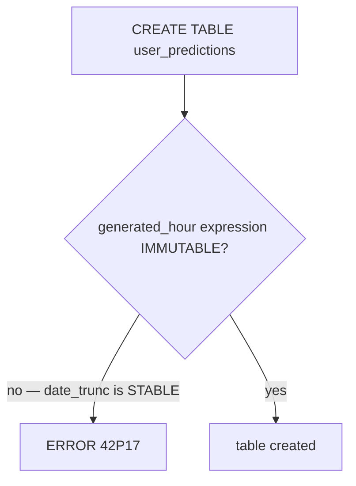

# Bug Report: `user_predictions.generated_hour` STORED Generation Expression Is Not IMMUTABLE

> **Doc ID:** BUG-019-user-predictions-generated-hour-not-immutable
> **Date:** 2026-05-04
> **Severity:** High
> **Status:** Fix Applied
> **DRI:** Mohammed Hassan Mohiddin

## Observed Behavior

`supabase db reset` fails when applying migration
`supabase/migrations/20260418000000_user_predictions.sql` with:

```
ERROR: generation expression is not immutable (SQLSTATE 42P17)
At statement: 0
CREATE TABLE public.user_predictions (...
    generated_hour timestamptz NOT NULL
        GENERATED ALWAYS AS (date_trunc('hour', generated_at)) STORED,
    ...
)
```

The migration has never been successfully applied — `mcp__supabase__list_tables`
on remote prod confirms `user_predictions` does not exist remotely either.
Stage 10 of the prediction-engine v1 master plan was the first attempt to apply
this migration end-to-end against a real Postgres.

## Expected Behavior

The migration applies cleanly and creates `user_predictions` with a per-row
hourly bucket key that the dedup `UNIQUE (user_id, generated_hour)` index can
key on.

## Steps to Reproduce

1. `supabase stop --no-backup`
2. `supabase start`
3. Observe failure mid-chain after `20260418000000_user_predictions.sql`.

## Environment

- Branch: `feature/prediction-engine-v1`
- Migration: `supabase/migrations/20260418000000_user_predictions.sql`
- Postgres major version: 17 (matches remote)
- Trigger: any fresh `supabase db reset` / `supabase start`

## Root Cause Analysis

PostgreSQL requires the expression of a `GENERATED ALWAYS AS (…) STORED`
column AND the expression of a unique expression index to be `IMMUTABLE`.
`date_trunc(text, timestamptz)` is `STABLE` — its output depends on the
session `TimeZone` GUC, so the planner cannot treat it as immutable for
storage or for index keys. Postgres rejects both forms with
SQLSTATE 42P17.



The previous Codex passes flagged the dedup-via-generated-column approach
as elegant but did not catch that the function chosen is not immutable.
The dedup contract — "exactly one row per `(user_id, hour-of-generated_at)`"
— can be expressed equivalently with a unique expression index over
`(user_id, date_trunc('hour', generated_at))`, which does NOT require the
expression to be immutable (only that the same arguments yield the same
result during query planning, which is the STABLE guarantee).

## Fix Description

Three surgical edits in `supabase/migrations/20260418000000_user_predictions.sql`:

1. Drop the `generated_hour` STORED column from the `CREATE TABLE`.
2. Replace the `CREATE UNIQUE INDEX … (user_id, generated_hour)` with a
   unique expression index whose expression is IMMUTABLE:
   `(user_id, date_trunc('hour', generated_at, 'UTC'))`.
3. Update the RPC `log_user_prediction`'s `ON CONFLICT` target to the
   same expression so the conflict still resolves against the unique
   expression index.

The three-argument form `date_trunc(text, timestamptz, text)` is
`IMMUTABLE` because the explicit timezone argument removes the dependency
on the session `TimeZone` GUC that makes the two-argument form `STABLE`.
Bucketing on UTC-hour preserves the "exactly one row per (user_id, hour)"
dedup contract bit-for-bit.

Application code never reads `generated_hour` directly (verified via
`grep -nr generated_hour apps/ packages/` — only the SQL file references
it). The dedup contract is preserved bit-for-bit.

This fix is applied in-place on the same feature branch because the
migration has never been applied to any database. There is no migration
history to preserve.

## Regression Prevention

- The Stage 2 RPC dedup test (`test_user_predictions_rpc.py`) is unskipped
  and now exercises the ON CONFLICT path against live local Postgres,
  catching any future regression in the conflict-target expression.
- Future `GENERATED … STORED` columns require an explicit IMMUTABLE check
  in the migration LLD review checklist.

## Related Documents

- `docs/rfcs/RFC-003-forecast-api-schema-and-prediction-logging.md` §4
- `docs/plans/2026-04-17-prediction-engine-v1-master.md` Stage 10

## Changelog

- 2026-05-04 — Created (Stage 10 discovery). Status: Fix Applied. The fix
  ships in the same Stage 10 commit that bootstraps the local migration
  baseline.
