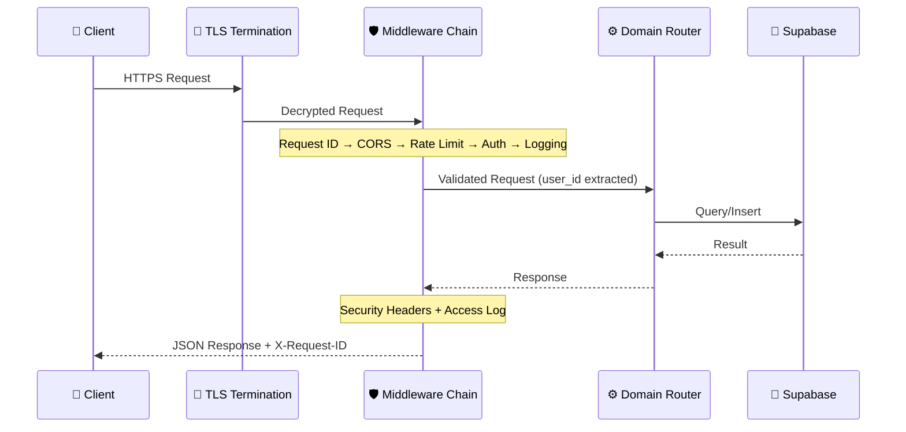
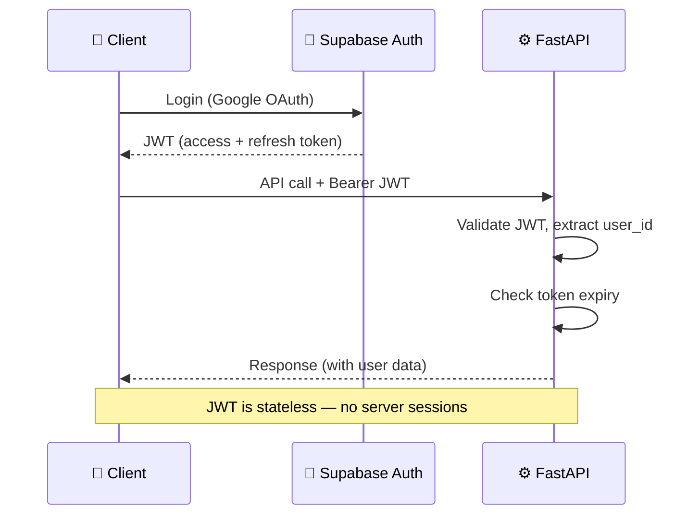
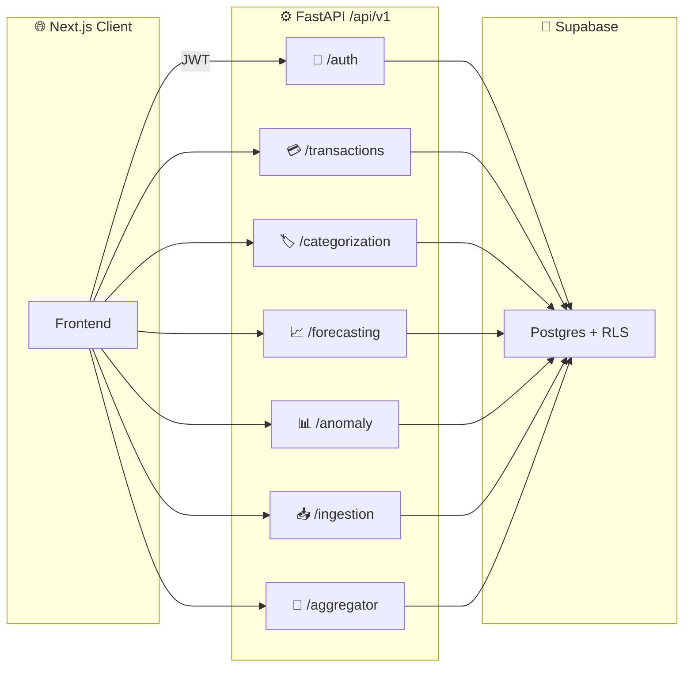

# API Design — HLD

> **Doc ID:** api-design
> **Last Updated:** 2026-03-15
> **Status:** Current
> **Version:** 1.0
> **DRI:** Hassan

## Overview

RESTful API served by FastAPI with OpenAPI auto-documentation, JWT auth via Supabase, and domain-separated routers under `/api/v1`.

## Request Lifecycle



## Endpoint Catalog

### Ingestion Domain (`/api/v1/ingestion`)

| Method | Endpoint | Description | Auth |
|---|---|---|---|
| POST | `/import` | Import transactions from CSV/XLSX | ✅ |
| POST | `/parse` | Parse file without importing | ✅ |
| GET | `/uploaded-files` | List user's uploaded files | ✅ |

### Categorization Domain (`/api/v1/categorization`)

| Method | Endpoint | Description | Auth |
|---|---|---|---|
| POST | `/classify` | Classify single transaction | ✅ |
| POST | `/classify/batch` | Classify batch (up to 1000) | ✅ |
| POST | `/feedback` | Submit category correction | ✅ |

### Forecasting Domain (`/api/v1/forecasting`)

| Method | Endpoint | Description | Auth |
|---|---|---|---|
| POST | `/forecast/upload` | Upload data for forecast | ✅ |
| GET | `/forecast/{user_id}` | Get forecast results | ✅ |

### Training Domain (`/api/v1/training`)

| Method | Endpoint | Description | Auth |
|---|---|---|---|
| POST | `/training/upload` | Start training job | ✅ |
| GET | `/training/status/{job_id}` | Get job status | ✅ |
| GET | `/training/checkpoints` | List model checkpoints | ✅ |
| GET | `/training/stream/{job_id}` | SSE stream (progress) | ✅ |

### Accounts Domain (`/api/v1/accounts`)

| Method | Endpoint | Description | Auth |
|---|---|---|---|
| GET | `/transactions` | List user transactions (paginated) | ✅ |
| GET | `/profile` | Get user profile | ✅ |
| PUT | `/settings` | Update user settings | ✅ |

### Health (`/api/v1`)

| Method | Endpoint | Description | Auth |
|---|---|---|---|
| GET | `/health` | Liveness check | ❌ |
| GET | `/ready` | Readiness check (deps) | ❌ |

## Authentication Flow



## Error Format (RFC 7807)

All errors follow Problem Details format:

```json
{
  "type": "https://scale.app/errors/validation",
  "title": "Validation Error",
  "status": 422,
  "detail": "Field 'amount' must be a positive number",
  "instance": "/api/v1/ingestion/import",
  "request_id": "550e8400-e29b-41d4-a716-446655440000"
}
```

## Rate Limiting

| Endpoint Group | Limit | Window |
|---|---|---|
| General API | 100 req | 1 minute |
| Auth endpoints | 10 req | 1 minute |
| Import (heavy) | 5 req | 1 minute |
| Batch classify | 10 req | 1 minute |

Implemented via Redis sliding window (Upstash).

## Pagination

Cursor-based (keyset) pagination for collection endpoints:

```json
{
  "data": [...],
  "pagination": {
    "cursor": "eyJkYXRlIjoiMjAyNi0wMS0xNSIsImlkIjoiYWJjMTIzIn0=",
    "has_more": true,
    "limit": 50
  }
}
```

## Caching Strategy

| Data | Cache Layer | TTL | Invalidation |
|---|---|---|---|
| Transaction list | Client (stale-while-revalidate) | 60s | On import |
| Categories | Client (cache-first) | 24h | Manual refresh |
| User category list | Redis | 1h | On classify/feedback |
| Rate limit windows | Redis | 60s | Auto-expire |
| Static assets | Vercel CDN | 1 year | Hashed filenames |

## Domain Endpoint Map



## Changelog

| Date | Feature | Change |
|---|---|---|
| 2026-03-06 | Initial HLD | Created from archived API design and implementation plan docs |
| 2026-03-08 | Doc standards | Added Doc ID, Version, DRI metadata; added domain endpoint map diagram |
| 2026-03-15 | Account Aggregator | Added `/aggregator` domain (bank_accounts CRUD, consent flow, sync, webhook). See docs/features/004-account-aggregator.md |
