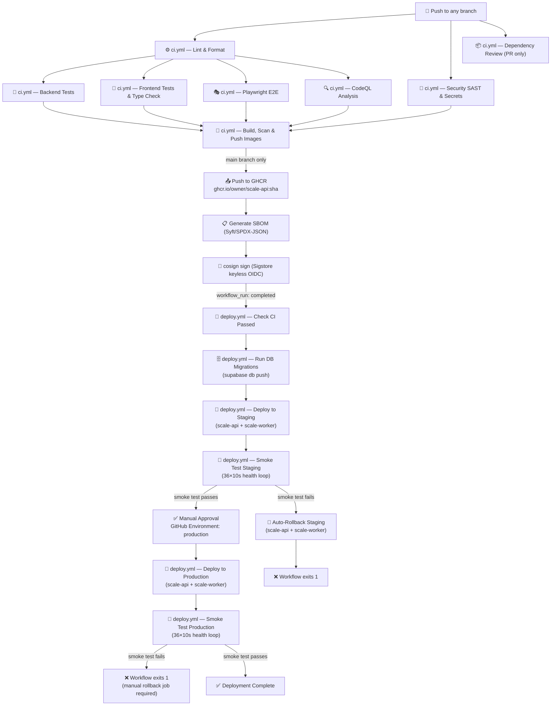
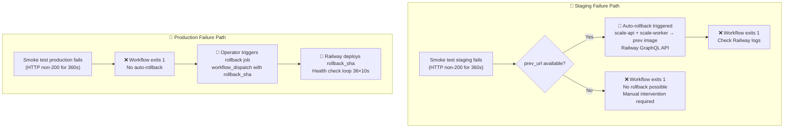

# CI/CD Pipeline Architecture — HLD

> **Doc ID:** ci-cd-pipeline
> **Last Updated:** 2026-03-25
> **Version:** 1.0
> **Status:** Current
> **DRI:** Mohammed Hassan Mohiddin

---

## 1. Overview

SCALE's CI/CD pipeline is a two-workflow GitHub Actions system. `ci.yml` gates all code changes through lint, security scans, tests, and an image build/sign/push sequence. `deploy.yml` triggers automatically on CI success (via `workflow_run`) and delivers the signed image through staging, a manual production approval gate, and into production — with auto-rollback on staging smoke failure and a manual rollback job for production.

---

## 2. CI Pipeline (`ci.yml`)

### Trigger Conditions

- `push` to any branch (`**`)
- `pull_request` targeting `main`

### Concurrency

- Group: `ci-${{ github.ref }}`
- `cancel-in-progress`: enabled on all branches **except** `main` (prevents mid-push Docker cancellation on the release branch — see BUG-016)

### Global Permissions

`contents: read` (minimal; individual jobs elevate as needed)

---

### Job: `lint` — Lint & Format

**Runs:** ubuntu-latest, 10-minute timeout
**Needs:** none (runs immediately on push)

| Step | Tool | What it checks |
|---|---|---|
| Python lint | `ruff check apps/ packages/` | PEP8, import ordering, code style |
| Python format | `ruff format --check apps/ packages/` | Consistent formatting |
| Node lint | `npm run lint` in `apps/web/` | ESLint rules |
| npm audit | `npm audit --audit-level=high` | Known high-severity Node vulnerabilities |

**Key outputs:** None; blocks downstream test jobs on failure.

---

### Job: `security-sast` — Security Scans (SAST & Secrets)

**Runs:** ubuntu-latest, 15-minute timeout
**Needs:** none (runs in parallel with lint)

| Step | Tool | What it checks |
|---|---|---|
| Secret scanning | TruffleHog (SHA-pinned: `6c64db94`) | Verified secrets in commit delta |
| SAST | Bandit (`-r apps/api/ -ll`) | Python security anti-patterns |
| SCA | `pip-audit -r requirements.txt` | Python dependency CVEs (hard-fail) |

**Note:** TruffleHog is pinned to an immutable commit SHA (`6c64db94...`) to prevent supply-chain substitution.

---

### Job: `test-backend` — Backend Tests

**Runs:** ubuntu-latest, 15-minute timeout
**Needs:** `lint`

| Step | What it does |
|---|---|
| Install Python deps | `pip install -r requirements.txt` |
| pytest with coverage | `pytest apps/ packages/ --cov-fail-under=60` |

**Environment secrets passed:** `NEXT_PUBLIC_SUPABASE_URL`, `NEXT_PUBLIC_SUPABASE_ANON_KEY`
**Key outputs:** Coverage ≥60% enforced; failure blocks `build-push-images`.

---

### Job: `test-frontend` — Frontend Tests & Type Check

**Runs:** ubuntu-latest, 15-minute timeout
**Needs:** `lint`

| Step | What it does |
|---|---|
| TypeScript check | `npx tsc --noEmit` |
| Vitest with coverage | `npx vitest run --coverage --reporter=verbose` |
| Next.js build | `npm run build` — validates production buildability |

**Environment secrets passed:** `NEXT_PUBLIC_SUPABASE_URL`, `NEXT_PUBLIC_SUPABASE_ANON_KEY`
**Key outputs:** Build artifact validates SSR/static export; failure blocks `build-push-images`.

---

### Job: `test-e2e` — Playwright E2E Tests

**Runs:** ubuntu-latest, 15-minute timeout
**Needs:** `lint`
**Working directory:** `apps/web/`

| Step | What it does |
|---|---|
| Install Playwright browsers | `npx playwright install --with-deps chromium` |
| Run E2E tests | `npx playwright test` |

**Note:** E2E tests run against the Next.js dev server, not a production build. See Known Limitations.

---

### Job: `codeql` — CodeQL Analysis

**Runs:** ubuntu-latest, 15-minute timeout
**Needs:** none (runs in parallel)
**Permissions:** `security-events: write`
**Strategy:** Matrix — `[javascript-typescript, python]`

Uses GitHub's CodeQL (`github/codeql-action`) to perform semantic code analysis on both languages. `fail-fast: false` so both language scans complete independently.

---

### Job: `dependency-review` — Dependency Review

**Runs:** ubuntu-latest, 5-minute timeout
**Needs:** none
**Condition:** `github.event_name == 'pull_request'` only (does not run on direct pushes)
**Permissions:** `contents: read`, `pull-requests: read`

Uses `actions/dependency-review-action@v4` to compare dependency changes in the PR against the GitHub Advisory Database. Fails on `high` severity or above.

---

### Job: `build-push-images` — Build, Scan & Push Images

**Runs:** ubuntu-latest, 45-minute timeout
**Needs:** `test-backend`, `test-frontend`, `test-e2e`, `security-sast`, `codeql`
**Permissions:** `contents: read`, `packages: write`, `id-token: write` (OIDC for cosign)

| Step | Tool | What it does |
|---|---|---|
| Docker Buildx setup | `docker/setup-buildx-action@8d2750c6` (SHA-pinned) | Multi-arch builder |
| GHCR login | `docker/login-action@v3` | Authenticates with `secrets.GITHUB_TOKEN` |
| Build API image (local) | `docker/build-push-action@ca052bb5` (SHA-pinned) | Builds `scale-api:sha`, loads to local daemon (no push yet); uses registry cache |
| Trivy scan | `aquasecurity/trivy-action@57a97c7e` (SHA-pinned) | Scans built image for CRITICAL/HIGH OS CVEs; `exit-code: 1` hard-fails; weekly Trivy DB cache (BUG-014 fix) |
| Push to GHCR | docker CLI | Only on `main` branch: tags and pushes `ghcr.io/owner/scale-api:sha` |
| Generate SBOM | `anchore/sbom-action@v0` | Only on `main`: generates SPDX JSON from pushed image; uploaded as 30-day workflow artifact |
| cosign sign | `cosign sign --yes` | Only on `main`: keyless signature via Sigstore OIDC; no private key; recorded in Rekor transparency log |

**Registry cache strategy:** Cache written to GHCR (`buildcache` tag) only on `main` branch pushes; all branches read from cache.

---

## 3. CD Pipeline (`deploy.yml`)

### Trigger Conditions

- `workflow_run` on `CI` workflow `completed` for `main` branch (primary path)
- `workflow_dispatch` with inputs:
  - `deploy_sha` — full commit SHA for forced deploy (debugging only)
  - `rollback_sha` — image SHA to rollback to; mutually exclusive with `deploy_sha`

### Concurrency

- Group: `deploy-${{ github.ref }}`
- `cancel-in-progress: true`

### Global Permissions

`contents: read`

---

### Job: `check-ci-success`

**Condition:** `github.event_name == 'workflow_run'` only
**Purpose:** Aborts deployment if the triggering CI run did not conclude with `success`. Prevents deploying from a partially-failed or cancelled CI run.

---

### Job: `run-migrations`

**Needs:** `check-ci-success`
**Condition:** CI success (workflow_run path) OR manual `deploy_sha` dispatch
**Tool:** Supabase CLI (`supabase db push --db-url $DATABASE_URL`)
**Secret:** `secrets.DATABASE_URL`

Applies all pending Supabase migrations before any container is deployed. Ensures schema is in the correct state before the new image starts.

---

### Job: `deploy-staging`

**Needs:** `run-migrations`
**GitHub Environment:** `staging` (URL: `vars.STAGING_API_URL`)
**Permissions:** `contents: read`, `packages: read`
**Key output:** `prev_url` — previous staging deployment URL captured for rollback

| Step | What it does |
|---|---|
| Set deploy SHA | Resolves SHA from `workflow_run.head_sha` or `inputs.deploy_sha` |
| GHCR login | Authenticates for image inspection |
| Verify image exists | `docker manifest inspect ghcr.io/owner/scale-api:sha` — fails if image was never pushed |
| cosign verify | Verifies Sigstore signature against GitHub OIDC issuer; blocks unsigned/tampered images (BUG-017 fix) |
| Capture previous SHA | Queries Railway GraphQL API for the current staging deployment URL (used as rollback target) |
| Deploy to Railway | Railway GraphQL API: `serviceInstanceUpdate` (sets image) + `serviceInstanceDeploy` for both `scale-api` and `scale-worker` services in `RAILWAY_STAGING_ENV_ID` |

---

### Job: `smoke-test-staging`

**Needs:** `deploy-staging`

Health check loop: 36 iterations × 10 seconds = up to 360 seconds (6 minutes). Each attempt:
1. `curl` with `--max-time 10` to `$STAGING_API_URL/health`
2. Captures HTTP status code and response body
3. Logs attempt number, status, and body for diagnostics
4. Exits 0 on first HTTP 200

On final failure: runs `curl -v` for verbose diagnostic output, then exits 1.

**Auto-rollback (on smoke failure):** If `deploy-staging.outputs.prev_url` is non-empty, triggers Railway GraphQL API to restore both `scale-api` and `scale-worker` to the previous image in the staging environment.

---

### Job: `deploy-production`

**Needs:** `smoke-test-staging`, `run-migrations`
**GitHub Environment:** `production` (URL: `vars.PRODUCTION_API_URL`)
**Permissions:** `contents: read`, `packages: read`

The `production` GitHub Environment has a required reviewer approval rule — this is the manual gate blocking automatic promotion to production.

| Step | What it does |
|---|---|
| Set deploy SHA | Same SHA resolution as staging |
| GHCR login | Authenticates for image inspection |
| cosign verify | Re-verifies Sigstore signature (independent of staging verification) |
| Deploy to Railway | Railway GraphQL API: `serviceInstanceUpdate` + `serviceInstanceDeploy` for both services in `RAILWAY_PRODUCTION_ENV_ID` |

---

### Job: `smoke-test-production`

**Needs:** `deploy-production`

Identical health check loop to staging (36×10s, 360s total). No auto-rollback — production rollback is manual by design (see Failure Modes).

---

### Job: `rollback`

**Condition:** `workflow_dispatch` with non-empty `inputs.rollback_sha`
**Permissions:** `contents: read`, `packages: read`

| Step | What it does |
|---|---|
| Verify rollback image exists | `docker manifest inspect ghcr.io/owner/scale-api:rollback_sha` |
| Rollback via Railway API | `serviceInstanceUpdate` + `serviceInstanceDeploy` for both services in `RAILWAY_PRODUCTION_ENV_ID` with the rollback image |
| Verify rollback health | Same 36×10s health check loop against `PRODUCTION_API_URL` |

---

## 4. Security Controls

```mermaid
flowchart LR
    subgraph CI["⚙️ ci.yml — Build Job"]
        B1["🐳 Build scale-api:sha\n(local only)"]
        B2["🔍 Trivy Scan\nCRITICAL/HIGH OS CVEs\nexit-code 1"]
        B3["📤 Push to GHCR\nghcr.io/owner/scale-api:sha"]
        B4["📋 Syft SBOM\nSPDX-JSON artifact\n30-day retention"]
        B5["🔐 cosign sign\nSigstore keyless OIDC\nno private key stored\nRecorded in Rekor log"]
        B1 --> B2 --> B3 --> B4 --> B5
    end

    subgraph CD_S["🚀 deploy.yml — Staging"]
        D1["🔍 docker manifest inspect\nVerify image exists in GHCR"]
        D2["🔐 cosign verify\n--certificate-identity-regexp\n--certificate-oidc-issuer\nBlocks unsigned images"]
        D3["🚀 Railway Deploy (staging)"]
        D1 --> D2 --> D3
    end

    subgraph CD_P["🚀 deploy.yml — Production"]
        P1["🔐 cosign verify\n(independent re-verification)"]
        P2["🚀 Railway Deploy (production)"]
        P1 --> P2
    end

    B5 -->|"workflow_run triggers"| D1
    D3 -->|"smoke test + approval"| P1
```

| Control | Where | What it does |
|---|---|---|
| cosign sign | `ci.yml` — `build-push-images` | Signs image with Sigstore keyless signing using GitHub Actions OIDC token; no private key stored; signature recorded in public Rekor transparency log |
| cosign verify (staging) | `deploy.yml` — `deploy-staging` | Verifies Sigstore signature before deploying to staging; `--certificate-identity-regexp` scoped to `github.com/$repo`; blocks any image not signed by this repo's CI |
| cosign verify (production) | `deploy.yml` — `deploy-production` | Independent re-verification before production deploy |
| Trivy scan | `ci.yml` — `build-push-images` | Scans the locally-built image for CRITICAL and HIGH OS CVEs; `exit-code: 1` hard-fails CI; `ignore-unfixed: true` reduces noise; weekly Trivy DB cache (BUG-014 fix) |
| SBOM (Syft) | `ci.yml` — `build-push-images` | Generates SPDX-JSON software bill of materials for the pushed image; uploaded as workflow artifact with 30-day retention |
| TruffleHog | `ci.yml` — `security-sast` | Scans commit delta for verified secrets; SHA-pinned to `6c64db94` to prevent supply-chain attack |
| Bandit (SAST) | `ci.yml` — `security-sast` | Static analysis of Python code in `apps/api/` for security anti-patterns |
| pip-audit | `ci.yml` — `security-sast` | Checks Python dependencies against advisory databases; hard-fail (BUG-008 fix) |
| CodeQL | `ci.yml` — `codeql` | Semantic analysis of both JavaScript/TypeScript and Python for vulnerabilities |
| Dependency Review | `ci.yml` — `dependency-review` | Blocks PRs introducing high-severity dependency vulnerabilities |
| Docker action SHA pins | `ci.yml` — `build-push-images` | `docker/setup-buildx-action`, `docker/build-push-action`, and `aquasecurity/trivy-action` pinned to exact commit SHAs to prevent tag mutation attacks |
| `cancel-in-progress: false` on main | `ci.yml` — concurrency | Prevents mid-push CI cancellation on main, ensuring Docker push completes atomically (BUG-016 fix) |

---

## 5. Dependency Management

Dependabot is configured in `.github/dependabot.yml` with three ecosystems, all scheduled weekly on Monday:

| Ecosystem | Directory | PRs limit | Labels |
|---|---|---|---|
| `npm` | `/apps/web` | 10 | `dependencies`, `javascript` |
| `pip` | `/` (root `requirements.txt`) | 10 | `dependencies`, `python` |
| `github-actions` | `/.github/workflows` | 10 | `dependencies`, `github-actions` |

Dependabot PRs for `github-actions` will update unpinned action tags (e.g., `actions/checkout@v4`). SHA-pinned third-party actions (TruffleHog, Trivy, Docker Buildx, docker/build-push-action) are tracked separately; Dependabot will propose SHA updates when new versions are released.

---

## 6. Required Secrets & Variables

### Secrets (`secrets.*`)

| Secret | Description | Used In |
|---|---|---|
| `GITHUB_TOKEN` | Auto-provisioned GitHub Actions token | `ci.yml` — GHCR login, image push; `deploy.yml` — GHCR login for cosign verify and image inspection |
| `NEXT_PUBLIC_SUPABASE_URL` | Supabase project URL | `ci.yml` — `test-backend` (env var), `test-frontend` (Next.js build), `test-e2e` |
| `NEXT_PUBLIC_SUPABASE_ANON_KEY` | Supabase anonymous/public key | `ci.yml` — `test-backend`, `test-frontend`, `test-e2e` |
| `DATABASE_URL` | Full Supabase Postgres connection string with migration privileges | `deploy.yml` — `run-migrations` (supabase db push) |
| `RAILWAY_TOKEN` | Railway API service token | `deploy.yml` — `deploy-staging`, `smoke-test-staging` (rollback), `deploy-production`, `rollback` |

### Variables (`vars.*`)

| Variable | Description | Used In |
|---|---|---|
| `STAGING_API_URL` | Base URL of the staging API (e.g., `https://api-staging.railway.app`) | `deploy.yml` — `deploy-staging` environment URL, `smoke-test-staging` health check |
| `PRODUCTION_API_URL` | Base URL of the production API | `deploy.yml` — `deploy-production` environment URL, `smoke-test-production` and `rollback` health checks |
| `RAILWAY_API_SERVICE_ID` | Railway service ID for `scale-api` | `deploy.yml` — `deploy-staging`, `smoke-test-staging` rollback, `deploy-production`, `rollback` |
| `RAILWAY_WORKER_SERVICE_ID` | Railway service ID for `scale-worker` | `deploy.yml` — `deploy-staging`, `smoke-test-staging` rollback, `deploy-production`, `rollback` |
| `RAILWAY_STAGING_ENV_ID` | Railway environment ID for staging | `deploy.yml` — `deploy-staging`, `smoke-test-staging` rollback |
| `RAILWAY_PRODUCTION_ENV_ID` | Railway environment ID for production | `deploy.yml` — `deploy-production`, `rollback` |

---

## 7. Failure Modes & Recovery

| Failure Scenario | Automatic Response | Manual Recovery |
|---|---|---|
| CI fails on any branch | Workflow exits 1; merge blocked (PR) or deploy never triggers (push) | Fix code, repush |
| Trivy finds CRITICAL/HIGH CVE | `build-push-images` exits 1; no image pushed, no deploy | Update base image or patch dependency |
| cosign verify fails (staging) | `deploy-staging` exits 1; deployment blocked | Investigate image provenance; check if image was built by this repo's CI |
| cosign verify fails (production) | `deploy-production` exits 1; deployment blocked | Same as above |
| `run-migrations` fails | Deployment aborted before any container swap | Fix migration SQL, repush to main |
| Staging smoke test fails (prev_url known) | Auto-rollback: restores both services to previous Railway image; workflow exits 1 | Check Railway logs for failure reason |
| Staging smoke test fails (no prev_url) | Workflow exits 1; no rollback possible | Manually update Railway service image via dashboard |
| Production smoke test fails | Workflow exits 1; no auto-rollback | Trigger `rollback` job via `workflow_dispatch` with a known-good SHA |
| `check-ci-success` fails | Deployment aborted; CI must have failed or been cancelled | Fix CI failures, repush |

---

## 8. Known Limitations

| Limitation | Impact | Mitigation / Future Work |
|---|---|---|
| Playwright E2E runs against `npm run dev` (Next.js dev server), not a production build | E2E tests may not catch production-build-specific failures | Run E2E against `npm run start` after `npm run build` |
| No DAST (OWASP ZAP or equivalent) | Dynamic attack surface not tested in CI | Add ZAP baseline scan as a separate workflow |
| No k6 load tests | Performance regressions not caught automatically | Add k6 smoke performance job targeting staging |
| No Slack/PagerDuty alerts on deploy failure | Failures are silent unless watching GitHub Actions | Integrate `slackapi/slack-github-action` on `failure()` |
| Production auto-rollback is manual (by design) | Human must trigger `rollback` job with correct SHA | Intentional — prevents automated cascades on transient production failures |
| SHA pinning for GitHub-native actions (`actions/checkout`, `actions/setup-python`, `actions/setup-node`, `actions/cache`, `actions/upload-artifact`) is not yet implemented | Tag mutation on GitHub-native actions could substitute a different version | Audit and pin all `actions/*` to commit SHAs (tracked as future work) |
| `smoke-test-staging` auto-rollback uses `needs.deploy-staging.outputs.prev_url` which stores a Railway deployment URL, not the image SHA | If the Railway deployment URL does not map to a specific image SHA deterministically, rollback may not restore the expected image | Capture and store the previous image SHA directly rather than deployment URL |
| Railway GraphQL API URL inconsistency | `deploy-staging` and `rollback` use `backboard.railway.com` while `deploy-production` uses `backboard.railway.app` | Standardize to a single hostname in all Railway API calls |

---

## 9. Changelog

| Date | Change |
|---|---|
| 2026-03-25 | Initial HLD created — documents hardened CI/CD pipeline post BUG-014 through BUG-017 fixes |
