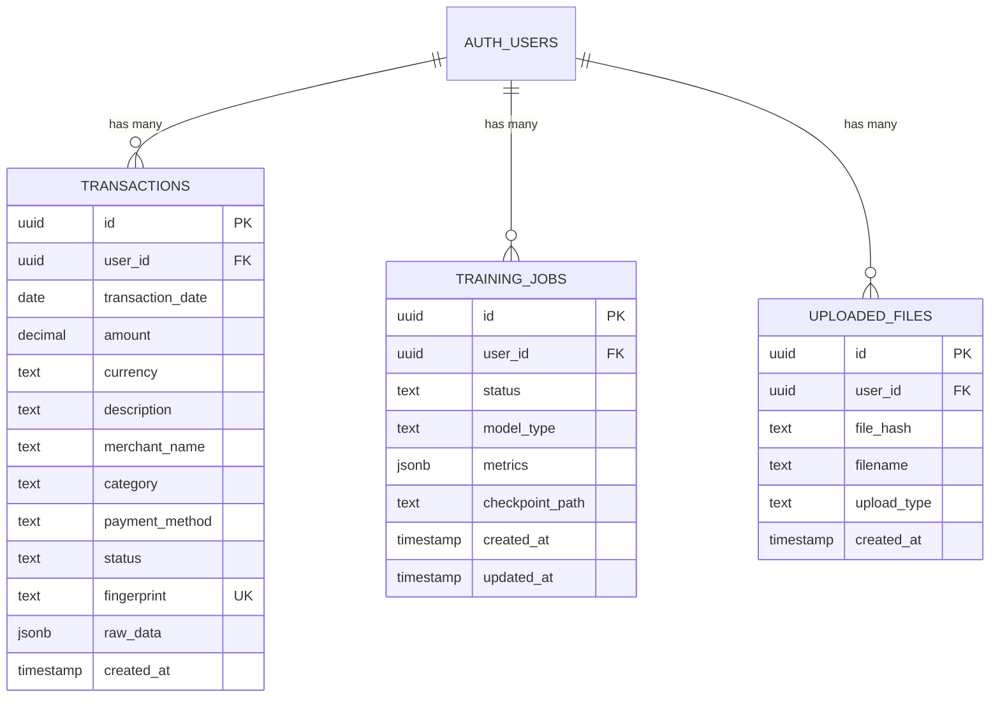
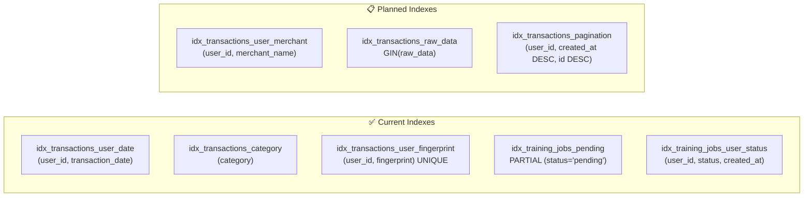
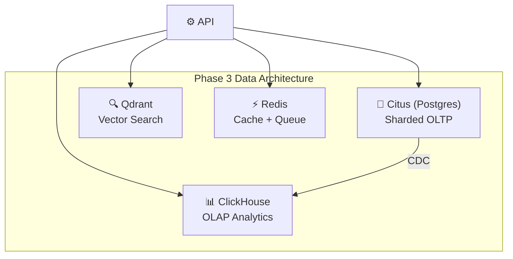

# Database Design — HLD

> **Doc ID:** database-design
> **Last Updated:** 2026-03-06
> **Status:** Current
> **Version:** 1.0
> **DRI:** Hassan

## Overview

Supabase (Postgres) with Row Level Security (RLS), PgBouncer connection pooling, and a migration-first approach via Supabase CLI.

## Schema Diagram



## Tables

### `transactions`

Primary data table. Stores all user financial transactions with deduplication via fingerprint.

- **RLS:** Enabled — users can only access their own rows (`auth.uid() = user_id`)
- **Fingerprint:** SHA256 hash of canonical fields (date, amount, merchant, description, payment_method, reference). UNIQUE per user.

### `training_jobs`

Tracks ML model training jobs (HypCD, TFT).

- **RLS:** Enabled
- **Service Role:** Celery worker uses `service_role` key to update status (bypasses RLS)

### `uploaded_files`

Tracks file uploads for deduplication.

### `bank_accounts`

Bank account records for the Account Aggregator integration. One row per linked account per user; "Manual Import" is a special `is_manual=true` account created automatically.

- **RLS:** Enabled — users can read/write only their own accounts; service role used by worker for auto-sync
- **Consent:** `consent_id`, `consent_status` (none/pending/active/expired/revoked), `consent_expiry` tracked per account
- **Sync:** `last_synced_at`, `sync_status` (idle/syncing/error)
- **Uniqueness:** One manual account per user (`WHERE is_manual = TRUE`); provider accounts unique by `(user_id, provider_account_id)`

`transactions.account_id` FK references `bank_accounts.id`. Fingerprint uniqueness moved to `(account_id, fingerprint)` partial index.

## Index Strategy



| Index | Purpose | Type |
|---|---|---|
| `idx_transactions_user_date` | Dashboard queries | B-tree composite |
| `idx_transactions_user_fingerprint` | Dedup on import | B-tree UNIQUE |
| `idx_training_jobs_pending` | Worker job polling | Partial index |
| `idx_transactions_pagination` | Cursor-based pagination | B-tree composite (planned) |

## Query Patterns

### Keyset Pagination (replacing OFFSET)

```sql
SELECT * FROM transactions
WHERE user_id = $1
  AND (transaction_date, id) < ($2, $3)
ORDER BY transaction_date DESC, id DESC
LIMIT 50;
```

### Batch Upsert (import)

```sql
INSERT INTO transactions (user_id, transaction_date, amount, ...)
VALUES ($1, $2, $3, ...),
       ($4, $5, $6, ...),
       ...
ON CONFLICT (user_id, fingerprint) DO NOTHING
RETURNING id;
```

## Connection Pooling

| Phase | Method | Max Connections |
|---|---|---|
| Phase 1 | Supabase PgBouncer (transaction mode) | 20 |
| Phase 2 | Supabase Pro PgBouncer | 200 |
| Phase 3 | Self-managed PgBouncer + Citus | 1000+ |

## Data Consistency

| Operation | Consistency | Rationale |
|---|---|---|
| Transaction insert | Strong (ACID) | Financial data must be correct |
| Balance read | Strong (latest) | User sees accurate balance |
| Category update | Eventual (~1s) | Cache refreshes async |
| Training status | Eventual (~5s) | Polling interval controls freshness |
| Forecast prediction | Eventual (~minutes) | Model updates are periodic |

## Future: Polyglot Persistence (Phase 3)



## Changelog

| Date | Feature | Change |
|---|---|---|
| 2026-03-06 | Initial HLD | Created from archived database/testing docs |
| 2026-03-08 | Doc standards | Added Doc ID, Version, DRI metadata |
| 2026-03-15 | Account Aggregator | Added bank_accounts table; transactions.account_id FK; fingerprint unique index moved to (account_id, fingerprint). See docs/features/004-account-aggregator.md |
