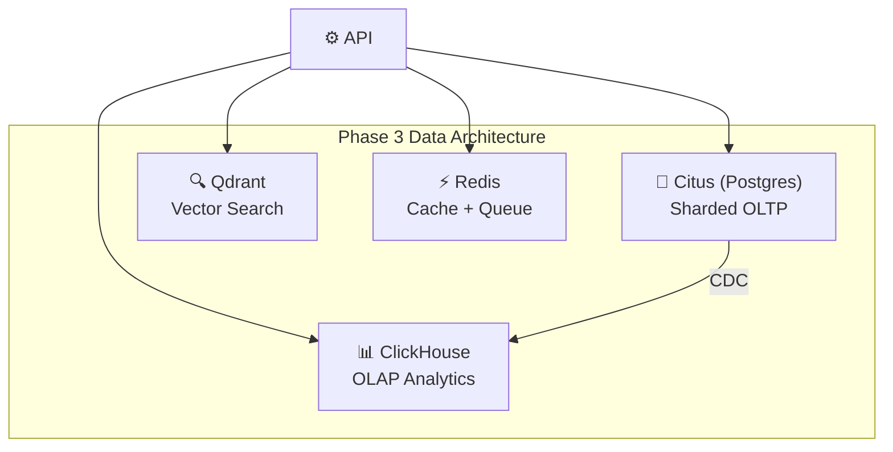

# Database Design — HLD

> **Doc ID:** database-design
> **Last Updated:** 2026-03-16
> **Status:** Current
> **Version:** 1.0
> **DRI:** Hassan

## Overview

Supabase (Postgres) with Row Level Security (RLS), PgBouncer connection pooling, and a migration-first approach via Supabase CLI.

## Schema Diagram

```mermaid
erDiagram
    AUTH_USERS ||--o{ BANK_ACCOUNTS : "has many"
    AUTH_USERS ||--o{ TRAINING_JOBS : "has many"
    AUTH_USERS ||--o{ UPLOADED_FILES : "has many"
    AUTH_USERS ||--|| USER_MODEL_METADATA : "has one"
    AUTH_USERS ||--o{ TRAINING_CORRECTIONS : "has many"
    BANK_ACCOUNTS ||--o{ TRANSACTIONS : "has many"

    BANK_ACCOUNTS {
        uuid id PK
        uuid user_id FK
        text account_name
        text account_type
        text institution
        text provider
        text consent_id
        text consent_status
        timestamptz consent_expiry
        timestamptz last_synced_at
        text sync_status
        boolean is_primary
        boolean is_manual
        text masked_number
        text currency
    }

    TRANSACTIONS {
        uuid id PK
        uuid user_id FK
        uuid account_id FK
        date transaction_date
        decimal amount
        text currency
        text description
        text merchant_name
        text category
        text suggested_category
        float confidence_score
        text payment_method
        text status
        text fingerprint
        boolean is_manual
        text informative_text
        text bank_name
        jsonb raw_data
    }

    TRAINING_JOBS {
        uuid id PK
        uuid user_id FK
        text status
        jsonb metrics
        text checkpoint_path
        int source_row_count
        date date_range_start
        date date_range_end
        text data_fingerprint
        text celery_task_id
        timestamp created_at
        timestamp updated_at
    }

    UPLOADED_FILES {
        uuid id PK
        uuid user_id FK
        text file_hash
        text filename
        text upload_type
        timestamp created_at
    }

    USER_MODEL_METADATA {
        uuid user_id PK_FK
        text adapter_url
        int correction_count
        timestamptz adapter_updated_at
        timestamptz created_at
    }

    TRAINING_CORRECTIONS {
        uuid id PK
        uuid user_id FK
        uuid transaction_id FK
        text description
        text original_category
        text corrected_category
        timestamp created_at
    }
```

## Tables

### `bank_accounts`

Bank account records for the Account Aggregator integration. One row per linked account per user; "Manual Import" is a special `is_manual=true` account created automatically on first file import.

- **RLS:** Enabled — users can read/write only their own accounts; service role used by worker for auto-sync
- **Consent:** `consent_id`, `consent_status` (none/pending/active/expired/revoked), `consent_expiry` tracked per account
- **Sync:** `last_synced_at`, `sync_status` (idle/syncing/error)
- **Uniqueness:** One manual account per user (`WHERE is_manual = TRUE`); provider accounts unique by `(user_id, provider_account_id)`

### `transactions`

Primary data table. Stores all user financial transactions. Every transaction belongs to a `bank_account` (manual import or AA-linked).

- **RLS:** Enabled — users can only access their own rows (`auth.uid() = user_id`)
- **Deduplication:** `fingerprint` is a SHA256 hash of canonical fields (date, amount, merchant, description, payment_method). Uniqueness enforced by partial index `idx_transactions_account_fingerprint (account_id, fingerprint) WHERE fingerprint IS NOT NULL`. Use `ON CONFLICT (account_id, fingerprint) WHERE fingerprint IS NOT NULL` in upserts.
- **Correction fields:** `suggested_category` holds the original ML-assigned category; `category` is the user-corrected value. `confidence_score` is the model's confidence at classification time. `is_manual` is set to `TRUE` when a user manually corrects the category (used as training signal by Celery jobs).
- **AA fields:** `informative_text`, `bank_name` carry raw AA data alongside `raw_data` (JSONB).

### `training_jobs`

Tracks Celery-based LinearAdapter training jobs triggered by `POST /training/train` or `POST /training/upload`.

- **RLS:** Enabled
- **Service Role:** Celery worker uses `service_role` key to update status (bypasses RLS)
- **Status values:** `pending | running | processing | completed | failed` (⚠️ `"queued"` is not valid — see BUG-002)
- **Lineage fields:** `source_row_count`, `date_range_start`, `date_range_end`, `data_fingerprint`, `celery_task_id` added by migration `20260309000002_add_training_lineage.sql`

### `uploaded_files`

Tracks file uploads for deduplication — prevents re-importing the same file twice via `file_hash`.

### `user_model_metadata`

Per-user metadata about the trained LinearAdapter. Intended to track `adapter_url` (path in Supabase Storage `models` bucket), `correction_count`, and `adapter_updated_at`.

- **Status: Dead** — no code path writes to this table (see BUG-002). Classification service reads `adapter_url` from Storage directly via `model_registry.load_latest()`, bypassing this table entirely.
- **RLS:** Service role full access via policy.

### `training_corrections`

Explicit user feedback records. Written by `POST /categorization/feedback` and `PATCH /accounts/transactions/{id}`.

- **Status: Write-only** — no training job reads from this table (see BUG-002). Training jobs read `transactions WHERE is_manual=TRUE` instead.
- Useful for future audit trail / analytics but currently not consumed by ML pipeline.

## Index Strategy

```mermaid
graph LR
    subgraph Current["✅ Current Indexes"]
        I1["idx_transactions_user_date<br/>(user_id, transaction_date)"]
        I2["idx_transactions_category<br/>(category)"]
        I3["idx_transactions_account_fingerprint<br/>(account_id, fingerprint) UNIQUE PARTIAL"]
        I4["idx_training_jobs_pending<br/>PARTIAL (status='pending')"]
        I5["idx_training_jobs_user_status<br/>(user_id, status, created_at)"]
        I6["idx_transactions_user_merchant<br/>(user_id, merchant_name)"]
        I7["idx_transactions_raw_data<br/>GIN(raw_data)"]
        I8["idx_transactions_pagination<br/>(user_id, created_at DESC, id DESC)"]
        I9["idx_transactions_user_amount<br/>(user_id, amount)"]
    end
```



| Index | Purpose | Type | Migration |
|---|---|---|---|
| `idx_transactions_user_date` | Dashboard date-range queries | B-tree composite | initial |
| `idx_transactions_account_fingerprint` | Dedup on import (per account) | B-tree UNIQUE PARTIAL | 20260315000001 |
| `idx_training_jobs_pending` | Worker job polling | Partial B-tree | initial |
| `idx_training_jobs_user_status` | Job status queries | B-tree composite | 20260228 |
| `idx_transactions_pagination` | Cursor-based pagination | B-tree composite | 20260228 |
| `idx_transactions_user_merchant` | Merchant filtering | B-tree composite | 20260228 |
| `idx_transactions_raw_data` | JSONB field queries | GIN | 20260228 |
| `idx_transactions_user_amount` | Amount range filtering | B-tree composite | 20260228 |

## Query Patterns

### Keyset Pagination (replacing OFFSET)

```sql
SELECT * FROM transactions
WHERE user_id = $1
  AND (transaction_date, id) < ($2, $3)
ORDER BY transaction_date DESC, id DESC
LIMIT 50;
```

### Batch Upsert (import)

```sql
INSERT INTO transactions (user_id, account_id, transaction_date, amount, ...)
VALUES ($1, $2, $3, ...),
       ($4, $5, $6, ...),
       ...
ON CONFLICT (account_id, fingerprint) WHERE fingerprint IS NOT NULL DO NOTHING
RETURNING id;
```

## Connection Pooling

| Phase | Method | Max Connections |
|---|---|---|
| Phase 1 | Supabase PgBouncer (transaction mode) | 20 |
| Phase 2 | Supabase Pro PgBouncer | 200 |
| Phase 3 | Self-managed PgBouncer + Citus | 1000+ |

## Data Consistency

| Operation | Consistency | Rationale |
|---|---|---|
| Transaction insert | Strong (ACID) | Financial data must be correct |
| Balance read | Strong (latest) | User sees accurate balance |
| Category update | Eventual (~1s) | Cache refreshes async |
| Training status | Eventual (~5s) | Polling interval controls freshness |
| Forecast prediction | Eventual (~minutes) | Model updates are periodic |

## Future: Polyglot Persistence (Phase 3)



## Changelog

| Date | Feature | Change |
|---|---|---|
| 2026-03-06 | Initial HLD | Created from archived database/testing docs |
| 2026-03-08 | Doc standards | Added Doc ID, Version, DRI metadata |
| 2026-03-15 | Account Aggregator | Added bank_accounts table; transactions.account_id FK; fingerprint unique index moved to (account_id, fingerprint). See docs/features/004-account-aggregator.md |
| 2026-03-16 | Schema audit | Updated Tables section to reflect all 6 active tables (user_model_metadata and training_corrections documented with dead/write-only status per BUG-002); promoted M2 indexes from Planned to Current; fixed batch upsert ON CONFLICT target to (account_id, fingerprint); updated ER diagram to reflect full current schema |
