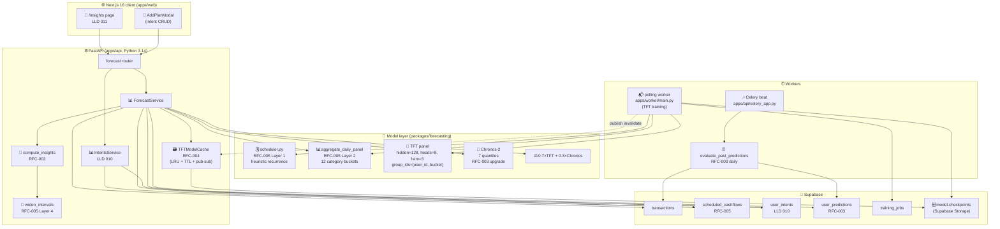
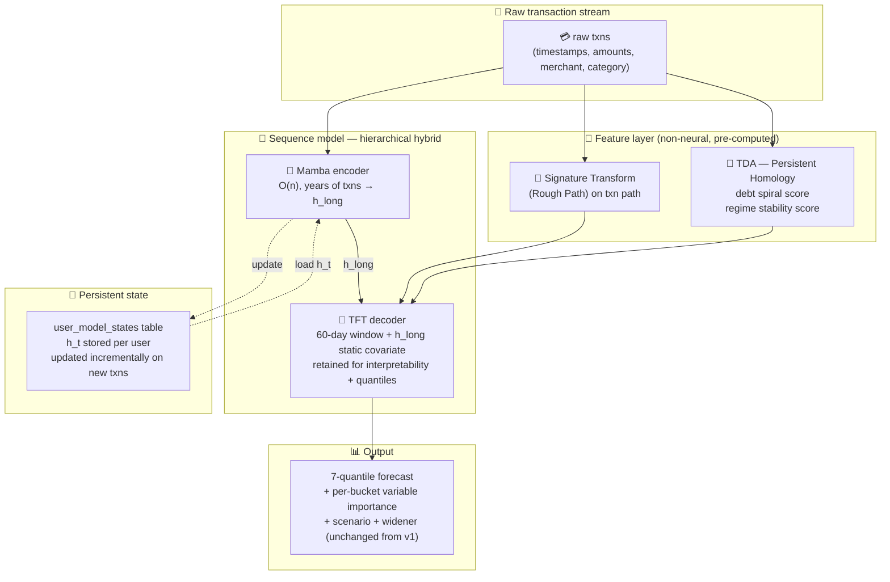
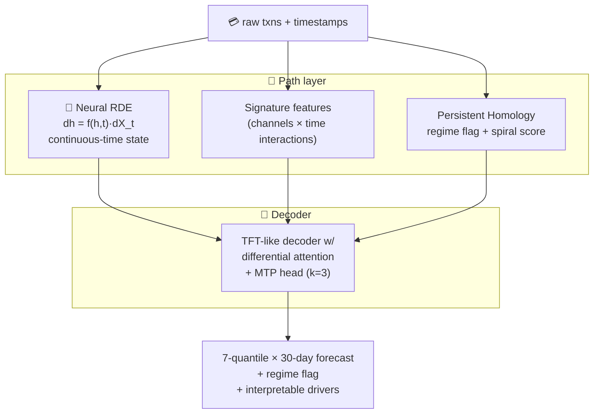
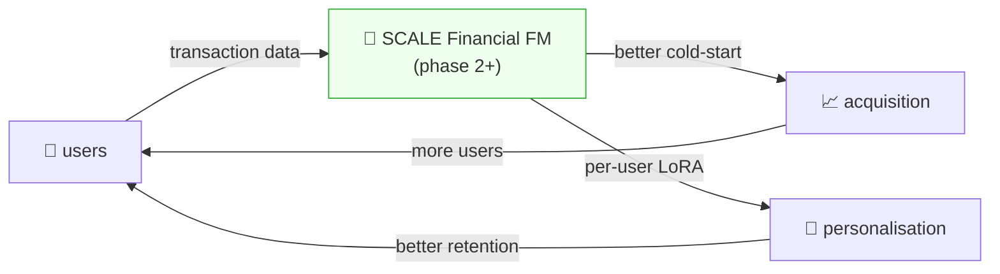
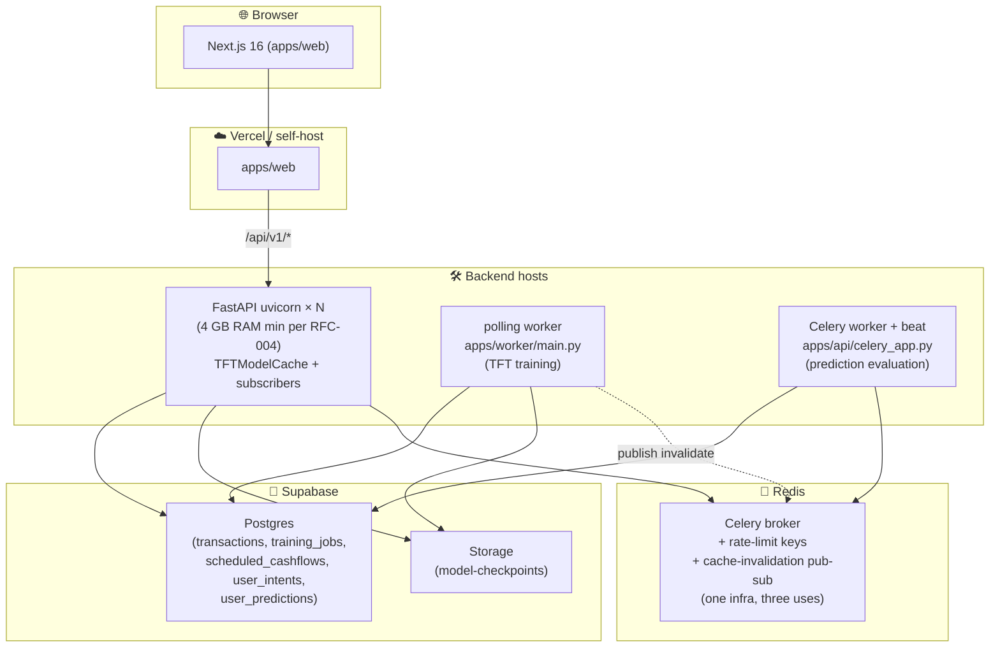

# HLD: Prediction Engine Roadmap — v1 through v3 + Foundation Model Flywheel

> **Doc ID:** prediction-engine-roadmap
> **Date:** 2026-04-17
> **Status:** Current
> **DRI:** Mohammed Hassan Mohiddin
> **Last Updated:** 2026-04-17
> **Version:** 1.0

## Purpose

Single source of truth for the prediction engine's architectural evolution. Every RFC / LLD / plan under the forecast surface (LLD 009 → LLD 011, RFC-003 → RFC-006, BUG-018) is a step on the path this HLD describes. When future decisions surface — "should we add Mamba?", "when do we build the foundation model?", "can we ship a simpler aggregator?" — the answer starts here.

The roadmap was produced from the Cowork brainstorming session captured on 2026-04-17 and the follow-on RFC/LLD work that same day. It does not invent new direction; it consolidates committed + planned state into one coherent story.

## v1 — The Planned Architecture (designs committed as RFCs/LLDs; implementation pending)

> **Framing note.** As of 2026-04-17 the v1 architecture described below is **designed but not implemented**. All five RFCs (003–006) are `Proposed`. LLD 009 / 010 / 011 are `Draft`. BUG-018 is `Root Cause Found` (fix pending in RFC-004). The actual code tree still runs the unbounded `_MODEL_CACHE` dict with `hidden_size=16` TFT from LLD 009's pre-upgrade baseline. This HLD is the `Current` roadmap — it reflects the *design decisions* the team has ratified — not a snapshot of the running system. The `Status` column added to the §v1 Document Map below makes the pending/shipped distinction explicit for every artifact.

### v1 Component Architecture

### v1 Document Map

| Concern | Doc | Status (as of 2026-04-17) |
|---|---|---|
| Two-tier engine LLD | `docs/features/009-prediction-engine.md` | Draft (with 2026-04-17 DEVIATION entry pointing at RFC-003) |
| Response schema + prediction logging | `docs/rfcs/RFC-003-forecast-api-schema-and-prediction-logging.md` | Proposed |
| Inference cache architecture | `docs/rfcs/RFC-004-tft-inference-cache-architecture.md` | Proposed |
| Aggregation strategy (three-tier data) | `docs/rfcs/RFC-005-aggregation-strategy-three-tier-data-separation.md` | Proposed |
| Walk-forward evaluation harness | `docs/rfcs/RFC-006-forecast-evaluation-harness.md` | Proposed |
| User intents + scenario endpoint | `docs/features/010-user-intents-and-scenario-forecasting.md` | Draft |
| AI Insights page UI | `docs/features/011-ai-insights-page.md` | Draft |
| Implementation plan | `docs/plans/2026-04-06-prediction-engine.md` | updated 2026-04-17 for RFC-003 scope |
| Deployment blocker (fix designed in RFC-004, not yet merged) | `docs/bugs/BUG-018-tft-inference-cold-load-no-bounded-cache.md` | Root Cause Found |

All designs above are locked at the architecture level — this HLD reflects their committed decisions. Implementation lands via the master plan tracked in `docs/plans/` once this HLD commit merges.

### v1 Boundaries

- **Target users:** pre-launch + early users (SCALE's MVP cohort).
- **Accuracy target:** ≤ 10 % MAPE on established users (RFC-005 success metric, measured by RFC-006 harness).
- **Latency target:** ≤ 500 ms p95 warm-path per LLD 009; cold-path ≤ 1500 ms per RFC-004.
- **Explicitly deferred:** transaction-level modelling, Mamba/Jamba, Neural RDE, TDA, population pretraining, LoRA per user, LLM orchestrator, shadow-mode rollout, frontend RSC migration, persistent on-disk cache, scenarios page, intent edit/delete flow.

## v2 — Transaction-Level Modelling (6–18 months post-v1)

### Trigger Conditions

v2 starts when at least one of:

1. **Accuracy ceiling hit.** RFC-006 walk-forward reports P50 MAPE ≥ 10 % stably across ≥ 3 monthly re-evaluations after RFC-005 is fully wired. Indicates category-level aggregation is the constraint, not model capacity or training dynamics.
2. **Transaction volume outgrows TFT.** Users routinely producing > 5000 txns in the trailing 90 days cause TFT's O(n²) attention on the panel to exceed the 1500 ms cold-load budget even after RFC-004. Measured by `tft_cache_load_duration_seconds` histogram.
3. **Temporal microstructure demand.** Product requests requiring intra-day or irregular-timestamp awareness (e.g., "detect the spending acceleration on weekends") that category-level daily panels cannot answer.

None of these are expected to bind inside the first 6 months post-v1. If none bind at 18 months, v2 is indefinitely deferred — the v1 architecture is the correct answer at that point.

### v2 Architecture

### v2 What Changes

| Layer | v1 | v2 |
|---|---|---|
| Input | daily category panel (12 buckets × days) | raw transaction stream (up to 75k events over 7 years) |
| Sequence model | TFT panel only | Mamba long-context encoder → TFT decoder (hierarchical, per Cowork synthesis) |
| State | ephemeral per prediction call | persistent `user_model_states` table, updated incrementally on every ingested transaction |
| Feature layer | `aggregate_daily_panel` | adds Signature Transform + Persistent Homology scores as static covariates |
| Training cadence | per-user retrain triggered by RFC-005 | continuous state update; periodic fine-tuning of Mamba + TFT decoder heads |
| Interpretability | TFT VSN | TFT VSN preserved; Mamba remains a black box (acceptable — only feeds a summary vector) |
| Pipeline breaking change | — | yes; `aggregate_daily_panel` retired, `create_timeseries_dataset` rewritten |

### v2 Prerequisites from v1

- Full 18-month `user_predictions` history (RFC-003) for walk-forward regression detection
- RFC-006 harness extended to support Mamba configs (A/B MamboTFT vs panel TFT on same folds)
- `scheduled_cashflows` + `user_intents` contracts unchanged — both still feed the TFT decoder as known-future covariates

### v2 Risks

- Mamba's selective state update mechanism may over-memorise specific transactions per the Cowork synthesis's grokking discussion. Requires the same training-dynamics experiment (extended patience + weight decay) that RFC-006 runs on v1 TFT.
- Persistent state store adds a second tier of caching/invalidation complexity on top of RFC-004's model cache. Probably merges with RFC-004's LRU to store `(model_weights, h_t)` tuples per user.
- Interpretability trade-off: "why did the model predict this?" explanations get harder when Mamba encodes years of context into a single vector. Mitigated by retaining the TFT decoder's VSN on the 60-day window.

## v3 — Math Engine Moat (18–36 months post-v1)

### Trigger Conditions

v3 starts when both of:

1. **v2 is shipped and stable.** At least 6 months of production Mamba+TFT data. Walk-forward pipeline extended.
2. **Research capacity exists.** Either an ML research partnership (university, shared-interest lab) or an internal ML hire with Rough Path / TDA experience. Without the expertise, attempting v3 produces cargo-cult versions of unusable sophistication.

### v3 Components

- **Neural RDE** (Rough Differential Equation) driving the continuous-time state update in place of Mamba's discrete-step selective SSM. Handles irregular transaction timestamps natively without discretisation. Signature Transform (already introduced in v2 as a static feature) becomes the path input rather than an auxiliary signal.
- **TDA as first-class driver** — Persistent Homology used not just as a static score but as a live regime-change detector. When the homology of the recent path stops resembling the historical homology, the model emits a "regime shift" flag and widens prediction intervals asymmetrically (similar in shape to RFC-005's `widen_intervals` but driven by topology rather than volatility).
- **Multi-Token Prediction (MTP)** head on the decoder — predict multiple future days simultaneously, densify training signal, enable speculative decoding. Reduces inference latency without reducing accuracy.
- **Differential Attention** in the TFT decoder per ICLR 2025 → noise cancellation on financial data.

### v3 Architectural Shape

### v3 Boundary

v3 is a research trajectory, not a commitment. Items may be selectively adopted or skipped depending on research outcomes. The point of documenting it here is to preserve the direction while v1/v2 ship.

## Foundation Model Flywheel (crosscuts all versions)

The Cowork synthesis identified SCALE's unique data position: the combination of fully-connected bank accounts + categorised transactions + user intents + loan/FD/investment data is a research-grade dataset that does not exist publicly. This opens a distinct path orthogonal to v1/v2/v3 model evolution.

### Phase 1 — Per-user TFT (v1 design)

Every established user gets a dedicated TFT trained on their own data only. Chronos-2 provides cold-start. Design committed under LLD 009 + RFC-005; accuracy measurement comes online with RFC-006's walk-forward harness in v1 implementation.

### Phase 2 — Population Pretraining (at ~10K users)

Train a SCALE-specific backbone on anonymised combined data from all users. Captures population patterns no individual's history can reveal:

- Salary arrival day-of-month distribution across Indian users
- Diwali / Holi / school-fee-cycle seasonal effects
- Income-bracket spending fingerprints
- UPI transaction temporal clustering
- Post-EMI-start discretionary compression
- Life-event transition patterns (new parent, new city, new job)

Per-user models become a fine-tune (LoRA rank 4–8) of the backbone instead of training from random initialisation. Cold-start performance dramatically improves because the foundation model already knows "what a typical Indian user looks like."

### Phase 3 — SCALE Financial Foundation Model (at 100K+ users)

The backbone at phase 2 scale becomes a genuine domain-specific foundation model. At this point:

- Chronos-2 is retired as the cold-start engine. The SCALE FM replaces it because it understands UPI, Diwali bonuses, Indian salary cycles, and everything Chronos-2 has never seen.
- Each new user starts with the full FM + an empty LoRA adapter. First forecast is materially better than any random-init TFT could produce at any training duration.
- The dataset itself becomes a research asset — defensible IP nobody else in Indian fintech can replicate without building SCALE's rails.

### Flywheel Mechanics

Every additional user improves the foundation model slightly for every other user. The flywheel compounds; the moat hardens.

### Flywheel Prerequisites

| Requirement | Where it sits today |
|---|---|
| Per-user prediction logging | RFC-003 `user_predictions` table designed (`Proposed`); once v1 implementation merges, pre-collection for phase 2 data starts with every forecast request |
| Anonymisation contract | not yet authored; required before phase 2 training begins |
| Federated-learning option (optional) | deferred; centralised pretraining simpler |
| LoRA infrastructure | PEFT library integration — v1.5+ engineering work |
| Research-grade dataset documentation | Cowork synthesis already flagged this; formalise before phase 2 |

### Flywheel Out of Scope for v1

Phase 2 starts when user count justifies the training cost (~10K users, estimated Q4 2026 at earliest given current growth assumptions). Phase 3 is a 2–3 year horizon. v1 collects the data that makes both phases possible — that's the only load-bearing flywheel work v1 carries.

## Decision Criteria — When to Move Versions

Each transition is gated by measurable signals, not calendar dates:

### v1 → v2 transition

| Signal | Threshold | Measured by |
|---|---|---|
| MAPE plateau above target | ≥ 10 % for 3 consecutive monthly RFC-006 runs after RFC-005 full implementation | RFC-006 harness output in `docs/research/` |
| Cold-load latency budget blown | Users with > 5000 txns in 90 days producing > 1500 ms cold load at p95 | `tft_cache_load_duration_seconds` histogram |
| Product requests needing intra-day | Frontend LLD / user research doc making the case | product docs |

Any one is sufficient to start v2 planning. All three together → fast-track.

### v2 → v3 transition

| Signal | Threshold | Measured by |
|---|---|---|
| v2 stable in production | 6 months live + walk-forward stable | RFC-006 harness |
| Research capacity | either a partnership agreement or an ML hire onboard | hiring pipeline / partnership MoU |
| Specific v3 research question answered | at least one of (Neural RDE > Mamba on our data, TDA regime detection > volatility detection, MTP lifts training throughput) validated on offline data | research doc under `docs/research/` |

### Foundation Model phase 1 → phase 2 transition

| Signal | Threshold | Measured by |
|---|---|---|
| User count | ≥ 10K established users with ≥ 90 days history | Supabase query on `training_jobs` success rows |
| Anonymisation & consent | user TOS allows aggregation for model improvement; anonymisation pipeline validated | legal + engineering sign-off |
| Per-user MAPE distribution | cold-start MAPE measurably worse than established-user MAPE (justifying the pretraining lift) | RFC-006 harness with stratified sampling |

### Foundation Model phase 2 → phase 3 transition

| Signal | Threshold | Measured by |
|---|---|---|
| Backbone beats Chronos-2 on held-out cold-start users | ≥ 5 % MAPE improvement on new-user forecasts | shadow-mode A/B using RFC-003 `user_predictions.shown_to_user=false` flag — shadow rollout RFC lands at this point |
| Operational cost defensible | inference + training cost per user < unit revenue | financial modelling |

## Diagrams — Deployment

v1 deployment model (unchanged through v2; v3 may introduce GPU inference):

## Changelog

| Date | Entry |
|---|---|
| 2026-04-17 | Initial publication. Consolidates v1 committed architecture (LLD 009, RFC-003 through RFC-006, LLD 010, LLD 011, BUG-018 resolution via RFC-004), v2 Mamba-hybrid trajectory, v3 math-engine-moat research direction, and the three-phase Foundation Model flywheel. Decision criteria tied to measurable signals (RFC-006 walk-forward outputs, cache-latency metrics, user count). Diagrams: v1 component architecture, v2 architecture, v3 architecture, Foundation Model flywheel, v1 deployment. Status: Current. |
