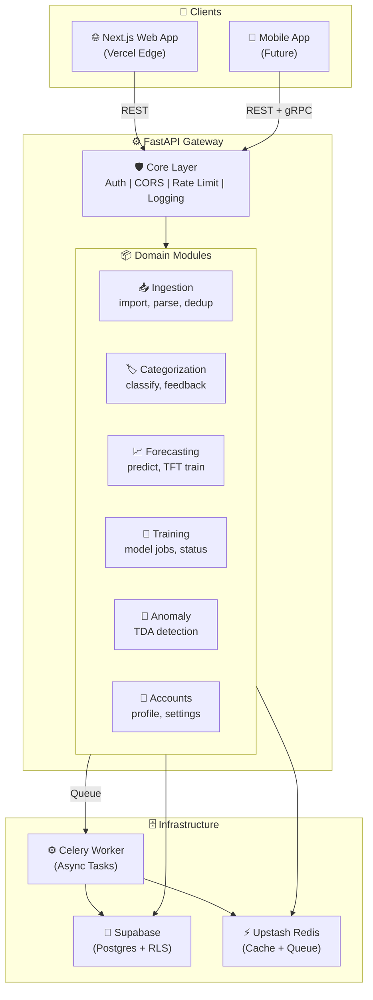

# System Architecture — HLD

> **Last Updated:** 2026-03-06
> **Status:** Current

## Overview

SCALE (SpendSmart) is an AI-powered personal finance platform built as a **modular monolith** — domain-separated FastAPI backend, pure Next.js frontend, Supabase database, and Celery workers for async compute.

## Architecture Diagram



## Domain Module Structure

```
apps/api/
├── domains/
│   ├── ingestion/       ← Smart Import, file parsing, fingerprinting
│   ├── categorization/  ← HypCD classifier, feedback loop
│   ├── forecasting/     ← TFT model, predictions
│   ├── training/        ← Model training jobs, FL aggregation
│   ├── anomaly/         ← TDA anomaly detection (future)
│   └── accounts/        ← User profile, settings, transactions
├── core/                ← Auth, logging, errors, middleware
├── main.py              ← FastAPI app, registers all domain routers
└── worker.py            ← Celery worker, imports domain tasks
```

Each domain is self-contained with its own router, service layer, schemas, and tests. Domains can be extracted into microservices by replacing direct function calls with REST/gRPC.

## Communication Protocols

| Communication | Protocol | When |
|---|---|---|
| Client → Backend (CRUD) | REST (OpenAPI) | All standard operations |
| Backend → Client (streaming) | SSE | Training progress, live forecasts |
| Mobile → Backend (gradients) | gRPC (Protobuf) | Federated learning gradient uploads |
| Internal (API → Worker) | Redis Queue (Celery) | Training jobs, batch classification |
| External → Backend | Webhooks | AA data delivery, Stripe callbacks |

## Deployment Strategy

```mermaid
graph LR
    subgraph Phase1["Phase 1: $0/month"]
        V1["Vercel<br/>Frontend"]
        R1["Railway<br/>Backend"]
        S1["Supabase Free<br/>Database"]
        U1["Upstash Free<br/>Redis"]
    end

    subgraph Phase2["Phase 2: $50-100/month"]
        V2["Vercel<br/>Frontend"]
        CR["Cloud Run<br/>Auto-scale"]
        SP["Supabase Pro<br/>8GB"]
        UP["Upstash Pro<br/>Redis"]
    end

    subgraph Phase3["Phase 3: Revenue"]
        V3["Vercel<br/>Frontend"]
        K8["GKE/EKS<br/>GPU Nodes"]
        CI["Citus<br/>Sharded DB"]
        RS["Ray Serve<br/>ML Inference"]
    end

    Phase1 -->|Users + Revenue| Phase2
    Phase2 -->|Scale Pressure| Phase3
```



## Non-Functional Requirements

| Category | Phase 1 | Phase 2 | Phase 3 |
|---|---|---|---|
| API latency (p95) | < 500ms | < 200ms | < 100ms |
| Concurrent users | 100 | 1,000 | 10,000+ |
| Data volume | < 1GB | < 50GB | < 1TB |
| Uptime target | 99% | 99.9% | 99.99% |
| Monthly cost | $0 | $50-100 | $500+ |

## Key Decisions

| Decision | Choice | Rationale |
|---|---|---|
| Architecture style | Modular monolith | Solo dev, zero budget, ACID needs |
| Frontend framework | Next.js (pure UI) | No API routes, calls FastAPI directly |
| Backend framework | FastAPI | Async, OpenAPI auto-docs, Python ML ecosystem |
| Database | Supabase (Postgres) | Free tier, built-in auth, RLS, realtime |
| Cache/Queue | Upstash Redis | Free tier, serverless, Celery broker |
| Auth | Supabase JWT | Stateless, no server sessions |
| ML inference | In-process (Phase 1) | Single container simplicity |

## Changelog

| Date | Feature | Change |
|---|---|---|
| 2026-03-06 | Initial HLD | Created from archived architecture docs |
