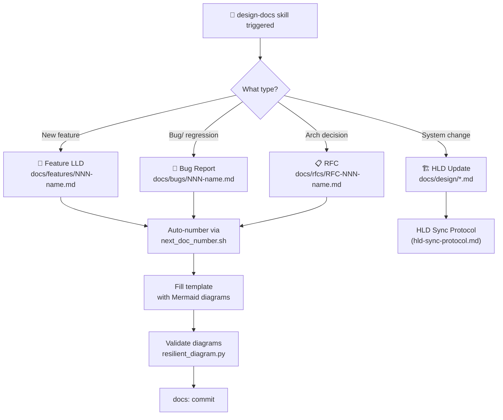
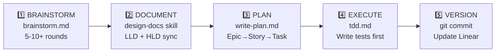

# Feature LLD: Docs-Driven Development Workflow + Agent Tooling

> **Doc ID:** 001-docs-driven-dev-workflow
> **Date:** 2026-03-06
> **Type:** Feature LLD
> **Last Updated:** 2026-03-08
> **Status:** Implemented
> **DRI:** Hassan
> **Linear Issues:** SCA-5 (✅ Done), SCA-9 (✅ Done)

---

## 1. Problem Statement

The agent had no enforced documentation step before coding. It would jump straight from brainstorming into writing a plan and then code, with no persistent design artifacts. Key gaps:

- No structured LLD/HLD documentation
- Brainstorming was capped at 2-3 rounds (not enough)
- No Mermaid diagram requirements
- No master workflow to orchestrate the full dev cycle
- No project management integration (Linear)
- Skills loaded incompletely (only `SKILL.md` read, sub-files skipped)
- Context management was implicit, not enforced

**Update (2026-03-08):** Two additional gaps were discovered and resolved:

- Skill loading was **full-load** (ALL files preloaded regardless of relevance), wasting 80-90% of context budget per skill activation
- `skill-creator` used a stale local copy; `design-docs` was missing error recovery and validation pipeline files from its upstream source
- Global rule propagated the wrong loading pattern, making it mandatory to read every file in every skill activation

---

## Changelog

| Date | Change |
|---|---|
| 2026-03-06 | Initial draft — docs-driven-dev workflow + agent tooling design |
| 2026-03-08 | Updated — added progressive disclosure section, skill loading gaps, design-docs upstream file restoration |

---

## 2. What Was Built

### 2.1 New Skill: `design-docs` (`.agents/skills/design-docs/`)

The core skill that handles all documentation generation.



**Files (updated after 2026-03-08 upgrade):**

| File | Purpose |
|---|---|
| `SKILL.md` | Orchestrator — decision tree flowchart, routing table, resilient workflow |
| `references/doc-standards.md` | Quality checklists for all doc types |
| `references/hld-sync-protocol.md` | When/how to update HLDs from LLD changes |
| `references/troubleshooting.md` | **[RESTORED]** 28 Mermaid error fixes |
| `references/resilient-workflow.md` | **[RESTORED]** Validation pipeline guide |
| `references/code-to-diagram.md` | **[RESTORED]** Master guide for code→diagram |
| `references/code-to-diagram-fastapi.md` | **[RESTORED]** FastAPI patterns |
| `references/code-to-diagram-react.md` | **[RESTORED]** React/Next.js patterns |
| `references/mermaid/activity-diagrams.md` | Activity diagram guide |
| `references/mermaid/sequence-diagrams.md` | Sequence diagram guide |
| `references/mermaid/architecture-diagrams.md` | Architecture diagram guide |
| `references/mermaid/deployment-diagrams.md` | Deployment diagram guide |
| `references/mermaid/unicode-symbols.md` | Symbol reference sheet |
| `templates/feature-lld.md` | Feature Low-Level Design template |
| `templates/bug-report.md` | Bug report + root cause analysis template |
| `templates/rfc.md` | Request for Comments template |
| `templates/system-design-template.md` | System HLD template |
| `templates/api-design-template.md` | API HLD template |
| `templates/database-design-template.md` | Database HLD template |
| `templates/architecture-design-template.md` | Architecture HLD template |
| `templates/feature-design-template.md` | Feature design HLD template |
| `scripts/next_doc_number.sh` | Auto-increment doc numbers (001, 002…) |
| `scripts/extract_mermaid.py` | Extract/validate Mermaid blocks |
| `scripts/resilient_diagram.py` | **[RESTORED]** Automated validation + image gen |
| `scripts/mermaid_to_image.py` | **[RESTORED]** PNG/SVG rendering |

**Source repos referenced:**

- [`design-doc-mermaid`](https://github.com/SpillwaveSolutions/design-doc-mermaid.git) — Mermaid guides + templates (upstream, 4 files restored in 2026-03-08 upgrade)
- [`claude-code-skills`](https://github.com/levnikolaevich/claude-code-skills.git) — Cherry-picked: Epic→Story→Task hierarchy (ln-200), structured verification (ln-310, ln-500)

---

### 2.2 Enhanced Existing Workflows

#### `brainstorm.md`

**Before:** 2-3 round implicit limit, no checklist, no diagram requirement
**After:**

- Minimum 5-10+ rounds enforced
- Completeness checklist: problem, users, constraints, alternatives, diagrams, edge cases, risks
- Mermaid sketching encouraged during brainstorm
- Anti-rush rules: cannot proceed unless user explicitly satisfied
- Transitions into `design-docs` skill when done

#### `write-plan.md`

**Before:** Flat task list
**After:**

- Epic → Story → Task 3-level hierarchy (from ln-200 scope-decomposer)
- Mermaid diagrams embedded in plans where useful
- References LLD document (links to the doc created in step 2)

#### `verify.md`

**Before:** Simple checklist
**After:**

- Structured validation checklist (from ln-310)
- 4-level verdict system:
  - ✅ **PASS** — all checks green, proceed
  - ⚠️ **CONCERNS** — minor issues, document and proceed
  - 🔄 **REWORK** — issues found, fix before proceeding
  - ❌ **FAIL** — critical failure, escalate

---

### 2.3 New Master Workflow: `docs-driven-dev.md`

The orchestrator that glues everything together. Entry point for any feature/bugfix/decision.



**Commit strategy (conventional commits):**

- `docs:` — after documentation step
- `feat:` / `fix:` / `test:` / `refactor:` — per logical unit during execution
- `chore:` — HLD updates, Linear issue close, final cleanup

---

### 2.4 GEMINI.md Updates (`~/.gemini/GEMINI.md`)

Updated global agent rules:

| Change | Detail |
|---|---|
| Activation Map | Added `docs-driven-dev.md` + `design-docs` |
| Pre-Action Gate | "Build feature/fix bug" now triggers `docs-driven-dev.md` |
| Anti-Drift | Added: "You wrote code without a design doc in `docs/`" |
| Artifact Mapping | Added: Design docs (LLD/HLD) → `docs/` directory |
| Skill Loading | **Updated (2026-03-08):** Full-load → Progressive Disclosure |

> **Note:** The public-facing `global-rule.md` (in `.agents/workflows/global-rule.md`) was synced from GEMINI.md — paste its content into Antigravity → Customizations → Rules → Global.

---

### 2.5 Skill Loading Protocol — Progressive Disclosure (Updated 2026-03-08)

**Old behavior:** Agent reads ALL files in a skill folder when activated (GEMINI.md mandated this)

> Reading only SKILL.md was explicitly called a "VIOLATION" in the old rule.

**New behavior (3-level progressive disclosure):**

```
Level 1 — Metadata (name + description)
  Always in context via system prompt (~100 words)

Level 2 — SKILL.md body
  Read when the skill triggers. Acts as the router/orchestrator.

Level 3 — Bundled resources
  Loaded ON-DEMAND only when SKILL.md tells you to.
  Scripts execute directly — never read into context.
```

**Impact:**

- `design-docs` was consuming ~6,800 lines of context per activation (full-load)
- With progressive disclosure it now consumes ~184 lines (SKILL.md only) + only the specific reference needed
- Context waste reduced by ~97% per activation for complex skills

**Changes to files:**

| File | Change |
|---|---|
| `.agents/workflows/global-rule.md` | Replaced full-load mandate with progressive disclosure protocol |
| Anti-drift check #6 | Flipped: now catches preloading-all instead of not-loading-all |
| Red flags | "preloaded ALL skill reference files" = drift |
| Final Mandate | "follow progressive disclosure — read SKILL.md, then load only what it tells you to" |
| **Full-load override** | User can say "load the full X skill" to force full context load |

---

### 2.6 Skill-Creator Upgrade (Updated 2026-03-08)

**Old:** Local copy of `skill-creator`, incrementally edited, out of sync with upstream
**New:** Replaced from canonical source ([anthropics/skills](https://github.com/anthropics/skills)) then customized

Customizations re-applied on top of upstream:

- Updated `description` field to include workflow creation + "single entry point for ANY new capability"
- Added **Step 0 Classification** decision tree (Antigravity-specific):
  - Skill vs Workflow vs Paired (Skill + Workflow) routing
  - Key differences table (structure, frontmatter, location, bundled resources)
  - Skill + Workflow Pair Pattern with template

---

### 2.7 Docs Directory Structure

```
docs/
├── design/            ← HLD (system-wide, updated as system evolves)
│   ├── system-architecture.md
│   ├── database-design.md
│   └── api-design.md
├── features/          ← Feature LLDs (auto-numbered: 001, 002...)
├── bugs/              ← Bug reports (auto-numbered)
├── rfcs/              ← Requests for Comments
├── archive/           ← Old docs (9 migrated here from this session)
└── sre/               ← Existing SRE docs (runbooks, SLOs, chaos experiments)
```

**Auto-numbering rule:** Use `bash .agents/skills/design-docs/scripts/next_doc_number.sh features` before creating a new feature LLD.

---

### 2.8 Linear MCP Integration

**Config file:** `~/.gemini/antigravity/mcp_config.json`

```json
{
  "linear": {
    "command": "npx",
    "args": ["-y", "@emmett.deen/linear-mcp-server"],
    "env": { "LINEAR_API_KEY": "lin_api_..." }
  }
}
```

**Workspace setup:**

- Organization: **SCALE** (`scale-ind`)
- Team: **SCA**
- Project: [SpendSmart Dashboard](https://linear.app/scale-ind/project/spendsmart-dashboard-3982848882ec)

**Workflow states available:** Backlog → Todo → In Progress → In Review → Done → Canceled → Duplicate
**Labels available:** Bug, Feature, Improvement

---

### 2.9 HLD Generation (Phase 3 — Verification)

The skill was verified by generating 3 fresh HLD docs from the 9 archived files:

| HLD | Key Diagrams |
|---|---|
| `docs/design/system-architecture.md` | Architecture graph (gateway + domains + infra), deployment pipeline (Phase 1→3) |
| `docs/design/database-design.md` | ER diagram (3 tables), index strategy graph, polyglot persistence roadmap |
| `docs/design/api-design.md` | Request lifecycle sequence, auth flow sequence, full endpoint catalog |

---

## 3. Key Design Decisions

| Decision | Choice | Rationale |
|---|---|---|
| Skill structure | `SKILL.md` + `references/` + `templates/` + `scripts/` | Progressive disclosure, separation of concerns |
| **Skill loading** | **Progressive disclosure (3-level)** | Full-load wastes 80-90% of context; n² attention scaling degrades quality |
| **skill-creator source** | **Upstream Anthropic repo (cloned)** | Stay in sync with canonical; customizations layered on top |
| Diagram tool | Mermaid (code blocks) | GitHub/Linear/Antigravity all render natively |
| Doc numbering | Auto-increment (001, 002...) | No collisions, sortable, Linear handles dates |
| Linear server | `@emmett.deen/linear-mcp-server` | Best available Linear MCP server |
| Brainstorm limit | Removed entirely | User satisfaction > round count |
| Docs location | `docs/design/` HLD, `docs/features/` LLD | Clear separation of scope level |
| Archive strategy | Move to `docs/archive/` (not delete) | Preserve history, searchable |
| Commit strategy | Conventional commits per logical unit | Traceable, semvar-compatible |
| **Error recovery** | **troubleshooting.md + resilient_diagram.py** | 28 documented Mermaid errors; automated validate-before-embed loop |

---

## 4. How to Resume in a New Conversation

When starting fresh, tell the agent:

> *"Read the design-docs skill at `.agents/skills/design-docs/SKILL.md` and follow its routing table — load only the references the task requires. Linear MCP is connected — use it to check open issues for what to work on next."*

Or simply say:

> *"Start a new feature: [describe it]"*

The agent will follow `docs-driven-dev.md` automatically via the activation map in GEMINI.md.

---

## 5. Open Issues in Linear

| ID | Title | Status |
|---|---|---
| SCA-5 | Migrate docs + generate HLD | ✅ Done |
| SCA-6 | Document transaction categorization engine (LLD) | Todo |
| SCA-7 | Document ingestion engine (LLD) | Todo |
| SCA-8 | Document forecasting module (LLD) | Todo |
| SCA-9 | Implement docs-driven-dev workflow | ✅ Done |

**SCA-6, SCA-7, SCA-8** are the next natural tasks — run the `design-docs` skill to generate the LLDs for the three core packages (`categorization`, `ingestion_engine`, `forecasting`).

---

## 6. Files Changed

### Phase 1 (2026-03-06 — Original)

**New Files:**

```
.agents/skills/design-docs/          ← entire new skill
.agents/workflows/docs-driven-dev.md ← new master workflow
docs/design/system-architecture.md
docs/design/database-design.md
docs/design/api-design.md
docs/features/                        ← empty, ready
docs/bugs/                            ← empty, ready
docs/rfcs/                            ← empty, ready
docs/archive/                         ← 9 migrated files
```

**Modified Files:**

```
.agents/workflows/brainstorm.md       ← extended, checklist added
.agents/workflows/write-plan.md       ← Epic→Story→Task hierarchy
.agents/workflows/verify.md           ← 4-level verdict system
.agents/workflows/global-rule.md      ← synced from GEMINI.md
~/.gemini/GEMINI.md                   ← activation map + anti-drift updated
~/.gemini/antigravity/mcp_config.json ← Linear MCP added
```

### Phase 2 (2026-03-08 — Progressive Disclosure Upgrade)

**Replaced:**

```
.agents/skills/skill-creator/         ← replaced with upstream Anthropic version
                                         + Step 0 Classification re-applied
```

**Modified:**

```
.agents/workflows/global-rule.md      ← skill loading: full-load → progressive disclosure
.agents/skills/design-docs/SKILL.md   ← rewritten as progressive disclosure router (184 lines)
```

**Restored from upstream (design-doc-mermaid):**

```
.agents/skills/design-docs/references/troubleshooting.md          ← 28 Mermaid error fixes
.agents/skills/design-docs/references/resilient-workflow.md       ← validation pipeline
.agents/skills/design-docs/references/code-to-diagram.md          ← code analysis master guide
.agents/skills/design-docs/references/code-to-diagram-fastapi.md  ← FastAPI patterns
.agents/skills/design-docs/references/code-to-diagram-react.md    ← React/Next.js patterns
.agents/skills/design-docs/scripts/resilient_diagram.py           ← automated validation
.agents/skills/design-docs/scripts/mermaid_to_image.py            ← PNG/SVG rendering
```

---

## 7. Success Criteria

- [x] Design doc created before any code in every session
- [x] Brainstorming has no fixed round limit — runs until user is satisfied
- [x] At least one Mermaid diagram in every LLD/HLD
- [x] HLD sync check performed after every LLD
- [x] `docs-driven-dev.md` workflow loaded automatically for any code change
- [x] Progressive disclosure reduces skill context load by ~97%
- [x] No `.agents/` references in Claude configuration

## 8. Scope

### In Scope

- Agent configuration (Claude + Gemini workflows and skills)
- Docs directory structure and conventions
- Skill loading protocol (progressive disclosure)
- Brainstorming gate enforcement

### Out of Scope

- Application code changes (no API/DB/frontend changes)
- Linear MCP setup (deferred — needs API key)
- Splitting existing docs into per-topic LLDs

## 9. Edge Cases

| Scenario | Behaviour |
|---|---|
| User asks a pure question (no code change) | Skip brainstorming gate — answer directly |
| Trivial task (rename, typo fix) | Skip full workflow — edit directly |
| Skill references `.agents/` path | Blocked — only `.claude/` paths valid for Claude |
| Doc type ambiguous | Default to Feature LLD; escalate to RFC if decision is significant |

## 10. Security Considerations

N/A — this feature modifies agent configuration only, not application code. No PII, secrets, or auth surfaces affected.

## 11. Testing Strategy

- **Manual verification:** Activate design-docs skill → confirm decision tree routes correctly
- **Context budget check:** `wc -l .claude/CLAUDE.md .claude/rules/*.md` → confirm under 210 lines total always-loaded
- **Progressive disclosure:** Open a skill file, confirm references are NOT preloaded

## 12. Related Documents

- RFC: `docs/rfcs/RFC-001-claude-md-rewrite.md`
- Implementation plan: `docs/rfcs/RFC-001-implementation-plan.md`
- HLD: No HLD changes (agent config only)
