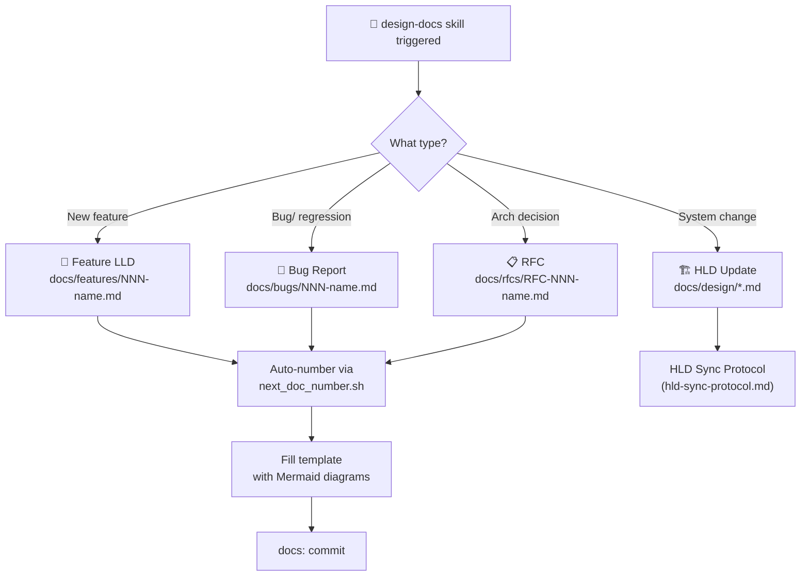
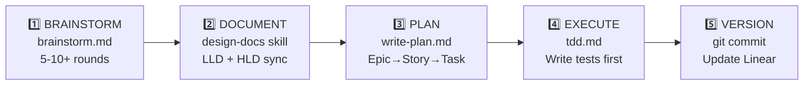

# Feature LLD: Docs-Driven Development Workflow + Agent Tooling

> **Doc Number:** 001  
> **Type:** Feature LLD  
> **Status:** Completed  
> **Date:** 2026-03-06  
> **Linear Issues:** SCA-5 (✅ Done), SCA-9 (✅ Done)

---

## 1. Problem Statement

The agent had no enforced documentation step before coding. It would jump straight from brainstorming into writing a plan and then code, with no persistent design artifacts. Key gaps:

- No structured LLD/HLD documentation
- Brainstorming was capped at 2-3 rounds (not enough)
- No Mermaid diagram requirements
- No master workflow to orchestrate the full dev cycle
- No project management integration (Linear)
- Skills loaded incompletely (only `SKILL.md` read, sub-files skipped)
- Context management was implicit, not enforced

---

## 2. What Was Built

### 2.1 New Skill: `design-docs` (`.agents/skills/design-docs/`)

The core skill that handles all documentation generation.



**Files created:**

| File | Purpose |
|---|---|
| `SKILL.md` | Orchestrator — decision tree, diagram requirements, HLD sync rules |
| `references/doc-standards.md` | Quality checklists for all doc types |
| `references/hld-sync-protocol.md` | When/how to update HLDs from LLD changes |
| `references/mermaid-activity.md` | Activity diagram guide |
| `references/mermaid-sequence.md` | Sequence diagram guide |
| `references/mermaid-architecture.md` | Architecture diagram guide |
| `references/mermaid-deployment.md` | Deployment diagram guide |
| `references/mermaid-unicode-symbols.md` | Symbol reference sheet |
| `templates/feature-lld.md` | Feature Low-Level Design template |
| `templates/bug-report.md` | Bug report + root cause analysis template |
| `templates/rfc.md` | Request for Comments template |
| `templates/hld-system.md` | System HLD template |
| `templates/hld-api.md` | API HLD template |
| `templates/hld-database.md` | Database HLD template |
| `templates/hld-architecture.md` | Architecture HLD template |
| `templates/hld-feature-design.md` | Feature design HLD template |
| `scripts/next_doc_number.sh` | Auto-increment doc numbers (001, 002...) |
| `scripts/extract_mermaid.py` | Extract/validate Mermaid blocks |

**Source repos referenced:**
- [`design-doc-mermaid`](https://github.com/SpillwaveSolutions/design-doc-mermaid.git) — Mermaid guides + templates
- [`claude-code-skills`](https://github.com/levnikolaevich/claude-code-skills.git) — Cherry-picked: Epic→Story→Task hierarchy (ln-200), structured verification (ln-310, ln-500)

---

### 2.2 Enhanced Existing Workflows

#### `brainstorm.md`
**Before:** 2-3 round implicit limit, no checklist, no diagram requirement  
**After:**
- Minimum 5-10+ rounds enforced
- Completeness checklist: problem, users, constraints, alternatives, diagrams, edge cases, risks
- Mermaid sketching encouraged during brainstorm
- Anti-rush rules: cannot proceed unless user explicitly satisfied
- Transitions into `design-docs` skill when done

#### `write-plan.md`
**Before:** Flat task list  
**After:**
- Epic → Story → Task 3-level hierarchy (from ln-200 scope-decomposer)
- Mermaid diagrams embedded in plans where useful
- References LLD document (links to the doc created in step 2)

#### `verify.md`
**Before:** Simple checklist  
**After:**
- Structured validation checklist (from ln-310)
- 4-level verdict system:
  - ✅ **PASS** — all checks green, proceed
  - ⚠️ **CONCERNS** — minor issues, document and proceed
  - 🔄 **REWORK** — issues found, fix before proceeding
  - ❌ **FAIL** — critical failure, escalate

---

### 2.3 New Master Workflow: `docs-driven-dev.md`

The orchestrator that glues everything together. Entry point for any feature/bugfix/decision.



**Commit strategy (conventional commits):**
- `docs:` — after documentation step
- `feat:` / `fix:` / `test:` / `refactor:` — per logical unit during execution
- `chore:` — HLD updates, Linear issue close, final cleanup

---

### 2.4 GEMINI.md Updates (`~/.gemini/GEMINI.md`)

Updated global agent rules:

| Change | Detail |
|---|---|
| Activation Map | Added `docs-driven-dev.md` + `design-docs` |
| Pre-Action Gate | "Build feature/fix bug" now triggers `docs-driven-dev.md` |
| Anti-Drift | Added: "You wrote code without a design doc in `docs/`" |
| Artifact Mapping | Added: Design docs (LLD/HLD) → `docs/` directory |
| Size | 6,874 / 12,000 chars (well within limit) |

> **Note:** The public-facing `global-rule.md` (in `.agents/workflows/global-rule.md`) was synced from GEMINI.md — paste its content into Antigravity → Customizations → Rules → Global.

---

### 2.5 Skill Loading Protocol (GEMINI.md + global rule)

A new rule was added to both GEMINI.md and global-rule.md to enforce full skill loading:

**Old behavior:** Agent reads only `SKILL.md` when activating a skill (~20% context)

**New behavior:**
1. `list_dir` on `.agents/skills/<name>/`
2. Read `SKILL.md`
3. Read every file in `references/`
4. Read every file in `scripts/`
5. Read every other subdirectory (evals/, examples/, agents/, assets/)

This is enforced in the STARTUP PROTOCOL and SKILL LOADING PROTOCOL sections of GEMINI.md.

---

### 2.6 Docs Directory Structure

```
docs/
├── design/            ← HLD (system-wide, updated as system evolves)
│   ├── system-architecture.md
│   ├── database-design.md
│   └── api-design.md
├── features/          ← Feature LLDs (auto-numbered: 001, 002...)
├── bugs/              ← Bug reports (auto-numbered)
├── rfcs/              ← Requests for Comments
├── archive/           ← Old docs (9 migrated here from this session)
└── sre/               ← Existing SRE docs (runbooks, SLOs, chaos experiments)
```

**Auto-numbering rule:** Use `bash .agents/skills/design-docs/scripts/next_doc_number.sh features` before creating a new feature LLD.

---

### 2.7 Linear MCP Integration

**Config file:** `~/.gemini/antigravity/mcp_config.json`

```json
{
  "linear": {
    "command": "npx",
    "args": ["-y", "@emmett.deen/linear-mcp-server"],
    "env": { "LINEAR_API_KEY": "lin_api_..." }
  }
}
```

**Workspace setup:**
- Organization: **SCALE** (`scale-ind`)
- Team: **SCA**
- Project: [SpendSmart Dashboard](https://linear.app/scale-ind/project/spendsmart-dashboard-3982848882ec)

**Workflow states available:** Backlog → Todo → In Progress → In Review → Done → Canceled → Duplicate  
**Labels available:** Bug, Feature, Improvement

**MCP tools available at runtime:**
```
mcp_linear_linear_createIssue
mcp_linear_linear_updateIssue
mcp_linear_linear_createComment
mcp_linear_linear_getProjects
mcp_linear_linear_getTeams
mcp_linear_linear_getWorkflowStates
... (full Linear API via MCP)
```

---

### 2.8 HLD Generation (Phase 3 — Verification)

The skill was verified by generating 3 fresh HLD docs from the 9 archived files:

| HLD | Key Diagrams |
|---|---|
| `docs/design/system-architecture.md` | Architecture graph (gateway + domains + infra), deployment pipeline (Phase 1→3) |
| `docs/design/database-design.md` | ER diagram (3 tables), index strategy graph, polyglot persistence roadmap |
| `docs/design/api-design.md` | Request lifecycle sequence, auth flow sequence, full endpoint catalog |

---

## 3. Key Design Decisions

| Decision | Choice | Rationale |
|---|---|---|
| Skill structure | `SKILL.md` + `references/` + `templates/` + `scripts/` | Full context load, separation of concerns |
| Diagram tool | Mermaid (code blocks) | GitHub/Linear/Antigravity all render natively |
| Doc numbering | Auto-increment (001, 002...) | No collisions, sortable, Linear handles dates |
| Linear server | `@emmett.deen/linear-mcp-server` | Best available Linear MCP server |
| Brainstorm limit | Removed entirely | User satisfaction > round count |
| Docs location | `docs/design/` HLD, `docs/features/` LLD | Clear separation of scope level |
| Archive strategy | Move to `docs/archive/` (not delete) | Preserve history, searchable |
| Commit strategy | Conventional commits per logical unit | Traceable, semvar-compatible |

---

## 4. How to Resume in a New Conversation

When starting fresh, tell the agent:

> *"Read `.gemini/GEMINI.md` then the design-docs skill at `.agents/skills/design-docs/SKILL.md` and all its references, templates, and scripts. Then read `docs/design/system-architecture.md`, `docs/design/database-design.md`, and `docs/design/api-design.md` to understand the current project state. Linear MCP is connected — use it to check open issues for what to work on next."*

Or simply say:

> *"Start a new feature: [describe it]"*

The agent will follow `docs-driven-dev.md` automatically via the activation map in GEMINI.md.

---

## 5. Open Issues in Linear

| ID | Title | Status |
|---|---|---|
| SCA-5 | Migrate docs + generate HLD | ✅ Done |
| SCA-6 | Document transaction categorization engine (LLD) | Todo |
| SCA-7 | Document ingestion engine (LLD) | Todo |
| SCA-8 | Document forecasting module (LLD) | Todo |
| SCA-9 | Implement docs-driven-dev workflow | ✅ Done |

**SCA-6, SCA-7, SCA-8** are the next natural tasks — run the `design-docs` skill to generate the LLDs for the three core packages (`categorization`, `ingestion_engine`, `forecasting`).

---

## 6. Files Changed in This Session

### New Files

```
.agents/skills/design-docs/          ← entire new skill
.agents/workflows/docs-driven-dev.md ← new master workflow
docs/design/system-architecture.md
docs/design/database-design.md
docs/design/api-design.md
docs/features/                        ← empty, ready
docs/bugs/                            ← empty, ready
docs/rfcs/                            ← empty, ready
docs/archive/                         ← 9 migrated files
```

### Modified Files

```
.agents/workflows/brainstorm.md       ← extended, checklist added
.agents/workflows/write-plan.md       ← Epic→Story→Task hierarchy
.agents/workflows/verify.md           ← 4-level verdict system
.agents/workflows/global-rule.md      ← synced from GEMINI.md
~/.gemini/GEMINI.md                   ← activation map + anti-drift updated
~/.gemini/antigravity/mcp_config.json ← Linear MCP added
```
