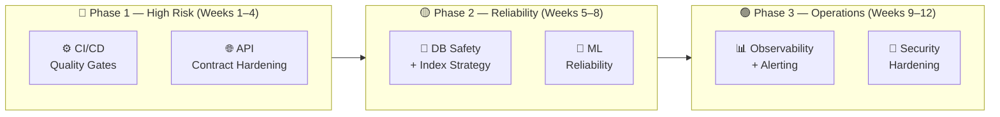

# Feature LLD: Codebase Improvement Recommendations and Hardening Roadmap

> **Doc ID:** 002-codebase-improvement-recommendations
> **Date:** 2026-03-08
> **Status:** Proposed
> **DRI:** Hassan
> **Related Docs:** `docs/bugs/BUG-001-consolidated-code-review.md`

---

## 1. Purpose

This document captures non-bug strategic recommendations for improving reliability, security, scalability, developer velocity, and long-term maintainability of the SCALE App codebase.

It complements the bug report by focusing on system-level improvements, standards, and engineering operating model upgrades.

---

## 2. Goals and Non-Goals

### Goals

- Reduce production risk through stronger quality gates and safer release controls.
- Improve system correctness via clearer contracts and stronger test strategy.
- Improve developer experience and delivery speed through standards and tooling.
- Create scalable engineering foundations for data, ML, and ops.

### Non-Goals

- This document does not replace incident-specific bug fixes.
- This document does not mandate immediate rewrites of stable components.
- This document does not prescribe vendor lock-in for observability or CI tools.

---

## 3. Recommended Improvement Themes

## 3.1 Architecture and Decision Traceability

### Recommendation A1 — Introduce ADRs (Architecture Decision Records)

**What:** Create `docs/adr/` and log major technical decisions.

**Why:** Reduces tribal knowledge and repeated debates; improves onboarding and historical context.

**Scope examples:**
- Auth and tenant isolation model
- Job orchestration architecture
- Forecasting approach and model lifecycle
- Ingestion parsing strategy and dedup semantics

**Implementation notes:**
- Use one-file ADR format: Context, Decision, Alternatives, Consequences.
- Enforce ADR reference in PRs that change architecture.

**Success metric:**
- 100% of architecture-impacting PRs link an ADR within 60 days.

### Recommendation A2 — Formalize service boundaries

**What:** Define strict boundary conventions:
- Routers: HTTP concerns only
- Services: business logic
- Adapters/clients: data provider/database interactions

**Why:** Prevents logic drift and duplicated behavior across endpoints.

**Success metric:**
- New feature PRs follow boundary pattern with shared utilities and reduced duplicated query logic.

---

## 3.2 API Contracts and Error Consistency

### Recommendation API-1 — Standardize error responses

**What:** Use a shared error schema for all failures (problem-details style).

**Why:** Frontend can reliably parse and present actionable errors.

**Implementation notes:**
- Define fields: `type`, `title`, `status`, `detail`, `request_id`, optional `errors[]`.
- Add helper factory in backend core layer.

**Success metric:**
- 100% non-2xx API responses conform to standard schema.

### Recommendation API-2 — Introduce idempotency for mutation endpoints

**What:** For import/training/batch-update style operations, support idempotency keys.

**Why:** Makes retries safe and prevents duplicate writes under network or worker retries.

**Success metric:**
- Duplicate client retries do not create duplicate rows/jobs.

---

## 3.3 Data and Migration Safety

### Recommendation DB-1 — Migration preflight and rollback policy

**What:** Add migration policy requiring:
- lock-risk assessment
- backup confirmation
- rollback script
- dependency impact check

**Why:** Prevents accidental blast radius from schema changes.

**Implementation notes:**
- Add checklist file and CI check that migration PRs include rollback notes.
- Disallow destructive operations without explicit review label.

**Success metric:**
- 0 unplanned downtime incidents tied to migration lock/contention.

### Recommendation DB-2 — Data contract tests for critical tables

**What:** Add invariant tests for core entities (`transactions`, `training_jobs`, model metadata).

**Why:** Catches schema or data-shape drift before deployment.

**Success metric:**
- Contract tests run in CI and fail fast on incompatible changes.

---

## 3.4 ML/Forecasting/Categorization Governance

### Recommendation ML-1 — Couple model artifacts with feature schema version

**What:** Persist model metadata with required feature schema/version hash.

**Why:** Prevents silent train/infer mismatch.

**Implementation notes:**
- Record: feature list, normalization version, training horizon/window, quantile config.
- Block inference when schema mismatch detected.

**Success metric:**
- 0 runtime inference failures from schema mismatch after rollout.

### Recommendation ML-2 — Add quality regression gates

**What:** CI should run lightweight evaluation fixtures and compare against baseline metrics.

**Why:** Current tests mostly validate code behavior, not output quality drift.

**Metrics examples:**
- Categorization: macro-F1 on fixed fixture
- Forecasting: MAPE/MAE on fixed holdout

**Success metric:**
- Model-related PRs blocked when quality drops beyond agreed threshold.

### Recommendation ML-3 — Separate pipeline tests from model-behavior tests

**What:** Distinguish tests for infra/plumbing vs. tests for prediction behavior.

**Why:** Improves signal quality and clarifies failures.

---

## 3.5 Frontend Engineering Quality

### Recommendation FE-1 — Centralized cache policy and invalidation contract

**What:** Define cache ownership rules:
- key conventions
- TTL strategy
- invalidation triggers
- destructive action cleanup

**Why:** Reduces stale state bugs and inconsistencies across pages.

**Success metric:**
- All cache operations use shared utility wrappers; no direct ad-hoc `localStorage` key deletions.

### Recommendation FE-2 — Progressive TypeScript strictness hardening

**What:** Run a staged cleanup plan for `any`, lint errors, and dead code.

**Why:** Improves maintainability and catches issues earlier.

**Plan:**
- Phase 1: eliminate lint errors
- Phase 2: reduce `any` in core app paths
- Phase 3: tighten tsconfig checks

### Recommendation FE-3 — Standardized route data-state patterns

**What:** Use shared page-state primitives for loading/error/empty/success.

**Why:** Consistent UX and fewer ad-hoc edge-case bugs.

---

## 3.6 Background Jobs and Worker Reliability

### Recommendation WK-1 — Explicit job state machine

**What:** Define canonical lifecycle and legal transitions (`queued -> processing -> succeeded|failed|retry`).

**Why:** Prevents state drift and ambiguous stuck-job behavior.

**Implementation notes:**
- Encode transition rules in one shared module.
- Add transition guard tests.

### Recommendation WK-2 — Retry taxonomy

**What:** Classify failures as transient vs terminal with per-task retry policy.

**Why:** Avoids over-retrying permanent failures and under-retrying transient faults.

**Success metric:**
- Reduced stuck jobs and lower manual intervention frequency.

### Recommendation WK-3 — Dead-letter and recovery visibility

**What:** Add dead-letter queue/table and admin/reporting endpoint.

**Why:** Improves recoverability and operator visibility.

---

## 3.7 Security and Compliance Hardening

### Recommendation SEC-1 — Enforce security scan outcomes in CI

**What:** Secret scanning, dependency audits, and image scans should hard-fail by default.

**Why:** Vulnerabilities should not silently pass pipeline.

### Recommendation SEC-2 — Action pinning and least privilege in workflows

**What:** Pin all third-party actions to SHA and set explicit minimal `permissions:`.

**Why:** Reduces supply-chain risk and token over-permissioning.

### Recommendation SEC-3 — Export and data-handling safety policy

**What:** Add standards for CSV/XLS exports (formula injection guard, optional masking, audit log entries).

**Why:** Protects users from downstream spreadsheet execution attacks and PII leakage.

---

## 3.8 Observability and SRE Readiness

### Recommendation OBS-1 — End-to-end correlation IDs

**What:** Propagate `request_id` and `job_id` across API, worker, and datastore operations.

**Why:** Speeds up root-cause analysis and incident response.

### Recommendation OBS-2 — Define core SLIs/SLOs

**What:** Start with practical indicators:
- ingestion success rate
- categorization latency
- forecast endpoint availability/latency
- training completion reliability

**Why:** Aligns engineering effort with user-visible reliability.

### Recommendation OBS-3 — Golden dashboard and alert policy

**What:** One dashboard for top reliability and performance indicators with alert thresholds.

**Why:** Creates shared operational truth and quicker anomaly detection.

---

## 3.9 Developer Experience and Delivery Workflow

### Recommendation DX-1 — Unified local verification command

**What:** Add `make verify` running backend tests, lint, type checks, and selected security checks.

**Why:** Consistent pre-PR quality and less CI churn.

### Recommendation DX-2 — Pre-commit hooks

**What:** Enforce formatting/linting/type sanity before commits.

**Why:** Reduces trivial review cycles and broken CI builds.

### Recommendation DX-3 — New endpoint/domain templates

**What:** Provide scaffolds with expected structure, tests, and observability hooks.

**Why:** Improves consistency and development speed.

---

## 4. Prioritized 90-Day Roadmap

## Phase 1 (Weeks 1-3): Foundation Hardening

- Enforce CI security failures and action SHA pinning.
- Add deploy true-gate behavior.
- Standardize API error envelope.
- Launch ADR folder and template.
- Establish migration preflight checklist.

## Phase 2 (Weeks 4-8): Correctness and Reliability

- Implement idempotency patterns for high-risk mutations.
- Adopt worker state machine + retry taxonomy.
- Add cache policy and frontend invalidation standards.
- Add core data contract tests.

## Phase 3 (Weeks 9-12): Scale and Maturity

- Add ML quality regression gates and model metadata compatibility checks.
- Deploy golden dashboard and baseline alerts.
- Tighten TypeScript strictness and reduce high-risk `any` usage.
- Introduce endpoint/domain templates.

---

## 5. Ownership Model (Suggested)

- **Platform/DevOps owner:** CI/CD hardening, action pinning, deployment gates
- **Backend owner:** API contracts, idempotency, worker lifecycle standards
- **Data owner:** migration safety policy, data contracts, schema governance
- **ML owner:** model metadata/versioning and quality gates
- **Frontend owner:** cache standards, TS hardening, route state consistency
- **SRE owner:** SLIs/SLOs, dashboards, alert quality

---

## 6. Key Metrics to Track

### Reliability
- API 5xx rate
- Job stuck ratio (`processing` over SLA)
- Import failure rate

### Quality
- CI pass rate on first run
- Escaped vulnerabilities in main branch
- Lint/type debt trend

### Delivery
- Lead time to merge
- Rework rate after code review
- Regression count by release

### ML
- Categorization quality delta vs baseline
- Forecasting quality delta vs baseline
- Inference compatibility failures

---

## 7. Risks and Mitigations

- **Risk:** Too many improvements at once can reduce feature throughput.  
  **Mitigation:** Timebox each initiative and keep a strict P0/P1/P2 sequence.

- **Risk:** New quality gates may initially increase CI failures.  
  **Mitigation:** Stage gates with baselines and explicit burn-down windows.

- **Risk:** Ownership ambiguity stalls implementation.  
  **Mitigation:** Assign single accountable owner per theme and track weekly.

---

## 8. Immediate Next Steps

1. Approve this recommendations document as baseline improvement charter.
2. Convert each recommendation into tracked tasks/issues with owner and ETA.
3. Start Phase 1 implementation with CI/deploy and API-contract hardening.
4. Run a 2-week checkpoint review and adjust sequencing based on delivery load.

---

## 9. Traceability to Bug Report

This recommendations doc is intentionally broader than bug-level fixes and should be used alongside:

- `docs/bugs/BUG-001-consolidated-code-review.md`

Bug report = concrete defects and direct fixes.
This doc = strategic engineering improvements and operating model upgrades.

---

## 10. Success Criteria

- [ ] All Phase 1 (CI + API contract) improvements implemented and passing CI
- [ ] All Phase 2 (DB safety + ML reliability) improvements implemented
- [ ] All Phase 3 (observability + security) improvements implemented
- [ ] Escaped vulnerability count in main branch = 0 (Critical/High)
- [ ] CI pass rate on first run ≥ 95%
- [ ] Categorization and forecasting quality delta vs baseline ≥ 0

## 11. Scope

### In Scope
- Code quality gates (linting, type checking, test coverage thresholds)
- API contract hardening and auth failure paths
- Database migration safety and index strategy
- ML reliability (model versioning, inference validation)
- Observability (structured logging, metrics, alerting)
- Security hardening (dependency scanning, secret detection)

### Out of Scope
- New product features
- Vendor migration (database, cloud provider)
- Frontend redesign

## 12. Design — Improvement Phases

## 13. Edge Cases

| Scenario | Mitigation |
|---|---|
| Quality gates block existing PRs on day 1 | Stage gates with baselines — current state = floor, not ceiling |
| Improvement ownership ambiguous | Assign single DRI per theme before execution starts |
| Phase overlap (e.g. security needed in Phase 1) | P0 security findings from BUG-001 are pre-Phase-1 — fix immediately |

## 14. Security Considerations

- Auth failure paths (multi-tenant isolation) are Priority 0 — must be fixed before Phase 1
- Secret scanning and dependency audits are Phase 3 but critical findings treated as P0
- All API changes follow existing Supabase RLS model

## 15. Testing Strategy

- Each recommendation produces its own test (unit + integration) as part of implementation
- CI pass rate tracked as primary quality metric
- BUG-001 regression checklist used as acceptance baseline

## 16. Related Documents

- Bug report: `docs/bugs/BUG-001-consolidated-code-review.md`
- HLDs to update on completion: `docs/design/api-design.md`, `docs/design/database-design.md`, `docs/design/system-architecture.md`
