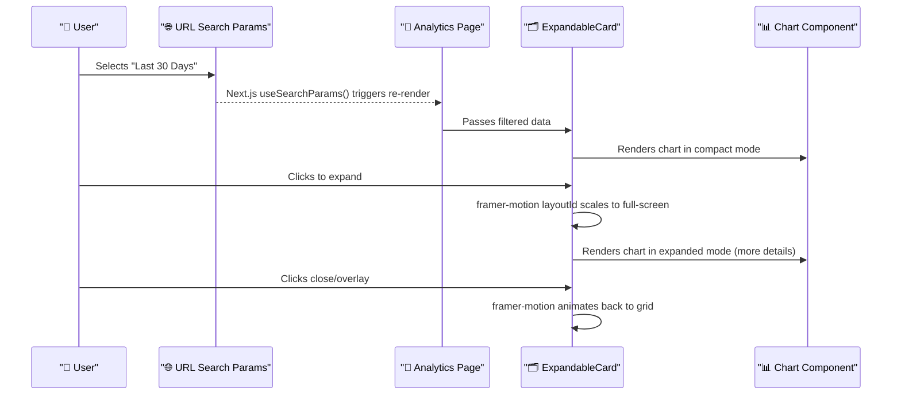
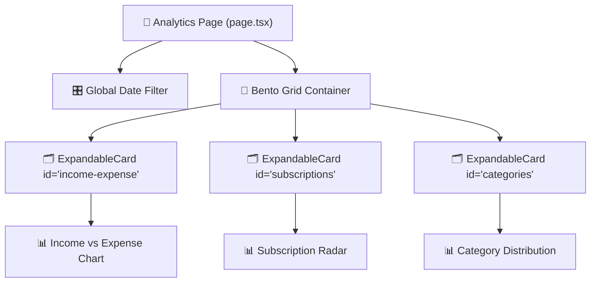

# Feature: Analytics Page UI Redesign (Bento Box & Cinematic Expansion)

> **Doc ID:** 003-analytics-ui-redesign
> **Date:** 2026-03-13
> **Type:** Feature LLD
> **DRI:** Antigravity
> **Status:** Verified

## Problem Statement

The current Analytics page uses a standard, slightly cluttered grid layout that doesn't align with the vision for a premium, highly interactive, and uniquely differentiating user experience. The user wants an aesthetic inspired by award-winning platforms (like Cred, Linear) featuring deep dark modes, micro-interactions, and a "universe exploration" feel. To lay the foundation for this without completely discarding the current tech stack, we need an intermediate UI architecture ("Bento Box" grid) where any chart can cinematically expand to fill the screen for deep analysis.

## Success Criteria

- [x] Analytics page layout is updated to a sleek, "OLED Dark" Bento Box grid.
- [x] Users can click on any chart card to trigger a smooth, full-screen expansion animation using Framer Motion.
- [x] Global date filter is implemented and syncs with URL parameters.
- [x] Micro-interactions (hover glows, scale taps) are applied consistently across the page's components.
- [x] The existing charts (refreshed visually) seamlessly integrate into the new expandable architecture.

## Scope

### In Scope

- Redesigning `/dashboard/analytics/page.tsx` as a Bento Grid.
- Creating a reusable `<ExpandableCard>` wrapper component using `framer-motion`'s Layout Animations (`layoutId`).
- Implementing a Global Date Filter `?range=X` mechanism.
- Standardizing the `tailwind.config.ts` or `index.css` to include the new premium dark mode colors and border utilities.

### Out of Scope

- Complete rewrite of the underlying D3/Recharts chart logic (we are strictly wrapping/styling existing charts for Phase 1).
- Panning/Zooming infinite canvas "Spatial" UI (reserved for V2).
- Narrative Scroll UI (reserved for specific highlight areas later).

## Design

### Architecture / Data Flow

### Component Architecture

### Component Changes

| File | Change |
| --- | --- |
| `apps/web/app/dashboard/analytics/page.tsx` | Rewrite layout to use Bento grid, add URL param state for filters. |
| `apps/web/components/ui/ExpandableCard.tsx` | **[NEW]** Wrapper component managing `framer-motion` AnimatePresence and layoutId for full-screen expansion. |
| `apps/web/app/dashboard/analytics/components/*` | Wrap existing charts in `ExpandableCard`, update styling to match premium OLED dark theme. |
| `apps/web/tailwind.config.ts` | Add new color tokens (`oled-black`, neon accents) and custom micro-interaction classes. |

## Edge Cases & Error Handling

| Scenario | Expected Behavior |
| --- | --- |
| User resizes window while card is expanded | Framer Motion layout animations handle recalculation smoothly. Flex layouts prevent text cutoff on charts. |
| Data fails to load | ExpandableCard shows a styled, premium error state (skeleton/glow). Error messages surface from API limits gracefully. |
| User navigates back via browser | URL params trigger default compact grid state. |

## API Changes

- Added client-side transaction filtering logic to adapt to `accountsApi.getTransactions`.
- Reduced data fetch limit internally to prevent backend Pydantic validation payload sizing errors (`[object Object]`).

## Database Changes

- None required for Phase 1. Subscriptions run on a localized heuristic loop.

## Security Considerations

- Ensured sensitive financial numbers are properly formatted and rendered entirely client-side based on user authenticated session tokens (Supabase).
- No new inputs added, so no new XSS vectors introduced in this phase.

## Testing Strategy

- **Manual Verification:** Verified hover states, text-wrapping, flexbox layout boundaries across desktop resizing.
- **Cross-Component Sync:** Tested interacting with the Global Filter changes the URL search params, which triggers a data refetch and accurately cascades down to Expense pie charts and Subscription aggregations.
- **Unit/E2E:** Can be integrated loosely via Playwright later for verifying `framer-motion` layoutId transitions.

## Dependencies

- `framer-motion` (Needs to be installed `npm install framer-motion`)
- `lucide-react` (For premium icons, e.g., expand/collapse)

## Related Documents

- HLD: N/A
- RFC: N/A
