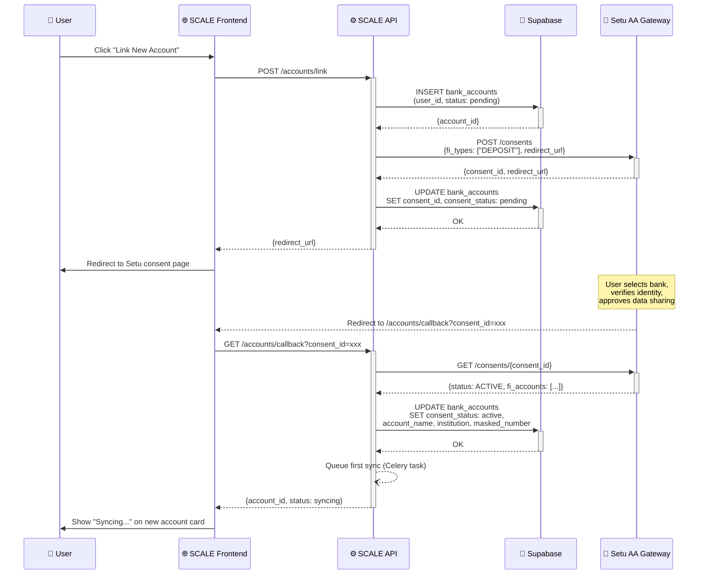
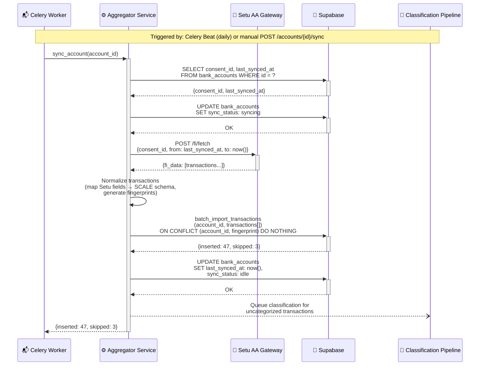

# Feature: Account Aggregator Integration

> **Doc ID:** 004-account-aggregator
> **Date:** 2026-03-15
> **DRI:** Claude (AI)
> **Status:** Verified
> **Type:** Feature LLD

## Problem Statement

SCALE currently has no bank account abstraction — all transactions are tied directly to `user_id` via manual file imports (CSV, XLSX, PDF). Users must export statements from their bank, then upload them into SCALE. This creates friction: data is always stale, the import process is error-prone, and there's no way to distinguish transactions from different bank accounts belonging to the same user.

India's Account Aggregator (AA) framework, regulated by RBI, enables consent-based, real-time access to financial data from banks. Integrating with an AA provider (Setu) allows users to link their bank accounts directly, replacing manual file imports as the primary data source while keeping file import as a secondary option.

## Success Criteria

- [x] Users can link a bank account via Setu's AA consent flow and see transactions within 60 seconds of consent approval
- [x] Transactions from different bank accounts are fully isolated — no cross-account data mixing
- [x] Existing file-imported transactions are migrated to a "Manual Import" account without data loss
- [x] Auto-sync runs daily for all active consents; manual sync is available on-demand
- [x] Account switcher allows seamless switching between bank accounts across dashboard, transactions, and analytics pages
- [x] "All Accounts" aggregated view combines data from all linked accounts
- [x] Aggregator abstraction layer supports swapping Setu for another provider (Plaid, Finvu) without changing consumer code

## Scope

### In Scope

- New `bank_accounts` table and `account_id` foreign key on `transactions`
- Provider-agnostic aggregator abstraction layer with Setu as first implementation
- REST API endpoints for account CRUD, consent flow, sync, and webhooks
- Auto-sync (Celery Beat daily) and manual sync (on-demand)
- Accounts management page with list + detail panel layout
- Account switcher (sidebar dropdown + contextual page badge)
- Adaptive consent flow (full-page onboarding for first link, modal for subsequent)
- Data migration: existing transactions → "Manual Import" account per user
- Per-account + aggregated "All Accounts" dashboard views

### Out of Scope

- Credit card, insurance, or investment account types (data model supports them, but UI/sync logic is bank-only for now)
- Global aggregator providers like Plaid (abstraction layer is ready, but only Setu is implemented)
- Real-time push notifications for new transactions (sync is pull-based)
- Account balance tracking (AA provides transaction history, not live balances in v1)
- Multi-login (SCALE email account) switching — already exists

## Design

### Architecture / Data Flow

#### Bank Account Linking Flow (Consent)

#### Transaction Sync Flow

### API Changes

| Method | Endpoint | Description |
|--------|----------|-------------|
| GET | `/accounts/` | List all bank accounts for authenticated user |
| POST | `/accounts/link` | Initiate bank account linking (creates consent, returns redirect URL) |
| GET | `/accounts/{id}` | Get account details including sync status |
| DELETE | `/accounts/{id}` | Unlink account (revoke consent via Setu, soft-delete) |
| POST | `/accounts/{id}/sync` | Trigger manual sync for a specific account |
| GET | `/accounts/callback` | Handle Setu consent redirect callback |
| POST | `/webhooks/setu` | Receive Setu webhook events (consent status changes) |

**Modified endpoints:**

| Method | Endpoint | Change |
|--------|----------|--------|
| GET | `/accounts/transactions` | Add `account_id` query param (`?account_id=<uuid>` or `?account_id=all`) |
| POST | `/ingest/import` | Associate imported transactions with user's Manual Import account |

### Database Changes

#### New table: `bank_accounts`

| Column | Type | Description |
|--------|------|-------------|
| `id` | `UUID` (PK) | Primary key |
| `user_id` | `UUID` (FK → auth.users) | Account owner |
| `account_name` | `TEXT NOT NULL` | Display name (e.g., "HDFC Savings ****1234") |
| `account_type` | `TEXT NOT NULL DEFAULT 'savings'` | savings, current, credit_card, etc. |
| `institution` | `TEXT` | Bank name (e.g., "HDFC Bank"). Null for manual. |
| `provider` | `TEXT` | Aggregator provider: 'setu', 'plaid', null (manual) |
| `provider_account_id` | `TEXT` | External account ID from the aggregator |
| `consent_id` | `TEXT` | Setu consent artifact ID |
| `consent_status` | `TEXT DEFAULT 'none'` | none, pending, active, expired, revoked |
| `consent_expiry` | `TIMESTAMPTZ` | When the consent expires |
| `last_synced_at` | `TIMESTAMPTZ` | Last successful sync timestamp |
| `sync_status` | `TEXT DEFAULT 'idle'` | idle, syncing, error |
| `is_primary` | `BOOLEAN DEFAULT FALSE` | Default account shown on login |
| `is_manual` | `BOOLEAN DEFAULT FALSE` | True for file-import accounts |
| `masked_number` | `TEXT` | Last 4 digits (e.g., "****1234") |
| `currency` | `TEXT DEFAULT 'INR'` | Account currency |
| `created_at` | `TIMESTAMPTZ DEFAULT now()` | Creation timestamp |
| `updated_at` | `TIMESTAMPTZ DEFAULT now()` | Last update timestamp |

#### Modified table: `transactions`

| Column | Type | Change |
|--------|------|--------|
| `account_id` | `UUID NOT NULL` (FK → bank_accounts) | **New column.** Links each transaction to a bank account. NOT NULL after migration backfills all existing rows. |

**Index changes:**
- Drop: `idx_transactions_user_fingerprint` (UNIQUE on `user_id, fingerprint`)
- Add: `idx_transactions_account_fingerprint` (UNIQUE on `account_id, fingerprint`)
- Add: `idx_bank_accounts_user` (on `user_id`)

**RLS:** `bank_accounts` gets `auth.uid() = user_id` policy. `transactions` keeps existing `user_id`-based RLS for simplicity.

**Migration:** For each existing user, create a "Manual Import" `bank_accounts` row (`is_manual = true`), then backfill all their transactions with that `account_id`.

### Component Changes

#### Backend (new files)

| File | Purpose |
|------|---------|
| `apps/api/domains/aggregator/provider.py` | Abstract `AggregatorProvider` base class |
| `apps/api/domains/aggregator/providers/setu.py` | Setu AA implementation |
| `apps/api/domains/aggregator/providers/manual.py` | No-op provider for file imports |
| `apps/api/domains/aggregator/service.py` | Orchestration: consent, sync, account lifecycle |
| `apps/api/domains/aggregator/router.py` | Account management API endpoints |
| `apps/api/domains/aggregator/schemas.py` | Pydantic request/response models |

#### Backend (modified files)

| File | Change |
|------|--------|
| `apps/api/domains/accounts/router.py` | Add `account_id` filter to transaction queries |
| `apps/api/domains/ingestion/service.py` | Look up or create Manual Import account, pass `account_id` to batch insert |
| `packages/ingestion_engine/import_transactions.py` | Accept `account_id` param, include in transaction rows |
| `apps/worker/` | New Celery Beat task for daily auto-sync |

#### Frontend (new files)

| File | Purpose |
|------|---------|
| `apps/web/app/dashboard/accounts/page.tsx` | Accounts management page (list + detail panel) |
| `apps/web/components/accounts/AccountList.tsx` | Left panel: compact list of accounts |
| `apps/web/components/accounts/AccountDetail.tsx` | Right panel: account info, sync controls, recent txns |
| `apps/web/components/accounts/AccountSwitcher.tsx` | Sidebar dropdown for switching active account |
| `apps/web/components/accounts/AccountBadge.tsx` | Contextual page badge showing active account |
| `apps/web/components/accounts/LinkAccountModal.tsx` | Quick confirmation modal (returning users) |
| `apps/web/components/accounts/LinkAccountOnboarding.tsx` | Full-page first-time AA explanation |
| `apps/web/components/accounts/SyncStatusIndicator.tsx` | Visual sync state (idle/syncing/error) |

#### Frontend (modified files)

| File | Change |
|------|--------|
| `apps/web/app/dashboard/layout.tsx` | Add `AccountSwitcher` to sidebar below profile; add `AccountBadge` to content area |
| `apps/web/app/dashboard/page.tsx` | Scope all queries by selected account; support "All Accounts" aggregation |
| `apps/web/app/dashboard/transactions/page.tsx` | Add `account_id` to transaction queries; show account badge per transaction in "All" mode |
| `apps/web/lib/api/client.ts` | New methods: `listAccounts`, `linkAccount`, `getAccount`, `unlinkAccount`, `syncAccount` |

## Edge Cases & Error Handling

| Scenario | Expected Behavior |
|----------|-------------------|
| User denies consent on Setu's page | Callback receives `REJECTED` status; delete pending `bank_accounts` row; show "Consent denied" message |
| Consent expires (typically 1 year) | `consent_status` updated to `expired` via webhook; show "Consent expired — Re-link" on account card; auto-sync skips expired accounts |
| Setu API is unavailable during sync | Set `sync_status: error` on account; retry on next auto-sync cycle; show error state on account card |
| Duplicate bank account linking | Check `provider_account_id` uniqueness per user before creating; return "Account already linked" error |
| Sync returns transactions already imported via file | Different `account_id` means no fingerprint collision — both copies exist in their respective accounts (by design, per user requirement) |
| User unlinks account with transactions | Soft-delete via `consent_status: revoked` (no separate `deleted_at` column — status field is the source of truth); revoke via Setu API; transactions remain visible but account shows "Unlinked" |
| Large sync (>5000 transactions) | Reuse existing large-file optimization: insert first 100 rows synchronously, remaining in background Celery task |
| Webhook signature verification fails | Return 401; log the attempt; do not process the event |
| User has no bank accounts yet (fresh signup) | Show empty accounts page with prominent "Link Your First Account" CTA and AA explanation |
| Manual Import account deletion attempt | Prevent deletion — Manual Import account is permanent per user |
| Consent expires and user re-links same bank | Update existing `bank_accounts` row with new `consent_id` and `consent_status: active` — preserves the same `account_id` so transaction history stays continuous |
| Duplicate webhook event received | Idempotency via `consent_id` + `consent_status` check — if status already matches the event, skip processing |

## Security Considerations

- **Authentication:** All account endpoints require Supabase JWT auth. RLS ensures users can only access their own accounts.
- **Authorization:** Account operations (link, sync, unlink) are owner-only via `user_id` check. No admin/shared access.
- **Data sensitivity:** Bank account numbers are masked (only last 4 digits stored). Raw transaction data from Setu is stored in `raw_data` JSONB for debugging, same pattern as file imports.
- **Webhook security:** Setu webhooks are verified using HMAC signature validation before processing any event.
- **Consent scoping:** Consent requests specify `DEPOSIT` FI type only (bank accounts). Read-only access — SCALE cannot initiate transactions.
- **Token storage:** Setu API credentials (client_id, client_secret) stored as environment variables, never in DB or frontend.
- **Data at rest:** All data in Supabase (encrypted at rest by default). No additional encryption layer needed for v1.

## Testing Strategy

- **Unit tests:**
  - `AggregatorProvider` interface contract tests
  - Setu provider: consent creation, status parsing, transaction normalization
  - Fingerprint generation with `account_id`
  - Account service: creation, linking, unlinking, sync orchestration
- **Integration tests:**
  - Full consent flow with Setu sandbox
  - Sync flow: fetch → normalize → deduplicate → insert → classify
  - Migration: existing users get Manual Import account + backfilled transactions
  - API endpoint auth and RLS enforcement
- **Edge case tests:**
  - Expired consent handling
  - Duplicate account linking prevention
  - Large sync (>5000 rows) background processing
  - Webhook signature verification (valid and invalid)
  - Concurrent sync requests for same account (idempotency)
- **Frontend tests:**
  - Account switcher state persistence across navigation
  - "All Accounts" aggregation renders correctly
  - Consent flow redirect and callback handling
  - Sync status indicator state transitions

## Dependencies

- **Setu Data Gateway API** — AA provider for bank account linking and transaction fetch. Requires sandbox access for development.
- **Celery Beat** — For scheduling daily auto-sync tasks. Already in the stack via `apps/worker/`.
- **Supabase Migrations** — For schema changes (new table, altered constraints). Existing migration tooling.

## Related Documents

- HLD: `docs/design/database-design.md` — updated 2026-03-15 with `bank_accounts` table
- HLD: `docs/design/api-design.md` — updated 2026-03-15 with `/aggregator` endpoints

---

## Changelog

| Date | Change |
|---|---|
| 2026-03-15 | Initial draft — full AA integration design, Setu provider, bank_accounts schema, status Verified |
