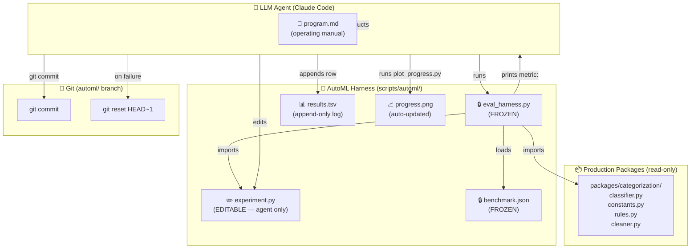
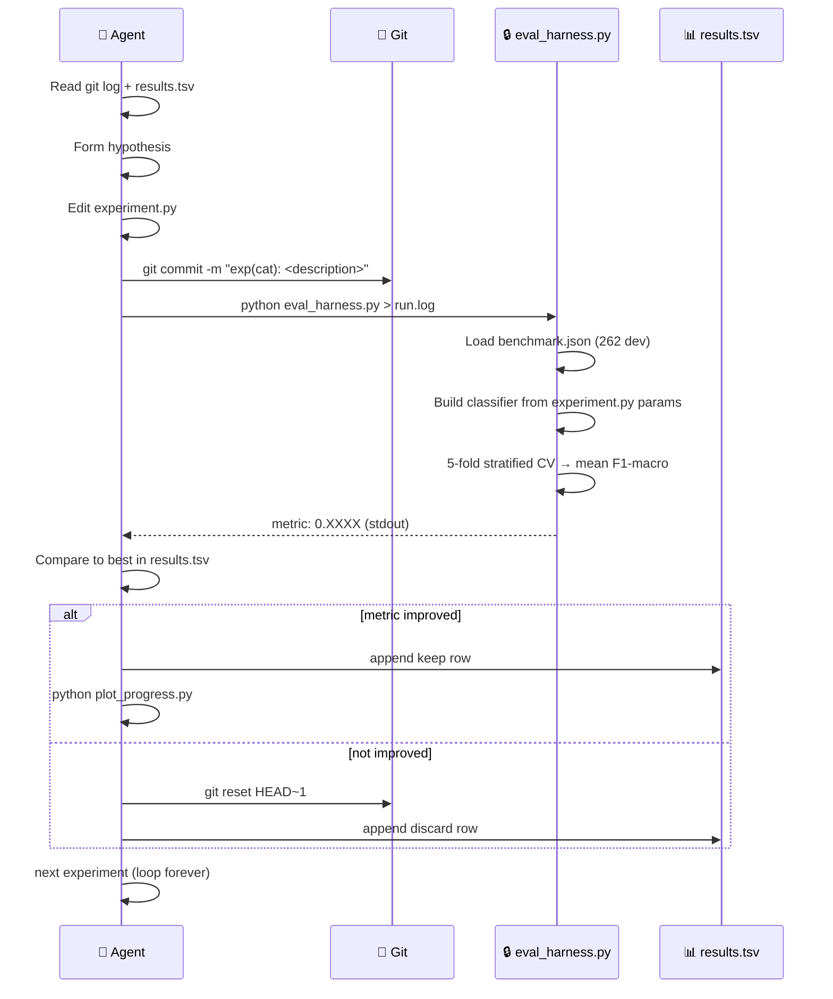

# 005 — AutoML Research Harness

> **Doc ID:** 005-automl-research-harness
> **Date:** 2026-03-16
> **Status:** Approved
> **DRI:** Hassan
> **Type:** Feature LLD

---

## 1. Problem Statement

SCALE's ML components — transaction categorization and spending forecasting — have
hand-tuned hyperparameters, seed phrases, and keyword rules that were set once and
never systematically improved. There is no automated mechanism to:

- Discover whether different confidence thresholds, softmax temperatures, or
  category anchor phrases produce meaningfully better classification accuracy
- Identify which keyword rules are missing (merchants not in the deterministic layer)
- Run many such experiments overnight without human supervision

The result: model quality is frozen at the initial design point. Improvements require
a human to hypothesize, edit, and manually verify — slow, low-throughput, and unlikely
to happen in practice during active feature development.

**Inspiration:** `karpathy/autoresearch` (March 2026) demonstrates that an LLM agent
given a real training codebase, a fixed evaluation harness, and a clear behavioural
loop can run ~100 ML experiments overnight, discovering improvements that would take a
human researcher weeks. The core pattern is: edit one file → commit → run eval →
keep or `git reset` → repeat forever.

This feature adapts that pattern for SCALE's ML packages.

---

## 2. Success Criteria

### Phase 1 — Categorization (this LLD, implemented now)

- [ ] `scripts/automl/categorization/eval_harness.py` runs end-to-end and prints
      `metric: X.XXXX` to stdout
- [ ] `scripts/automl/categorization/benchmark.json` contains 262 dev + 99 holdout
      labeled Indian transactions covering all 32 real categories + UNCATEGORIZED
- [ ] 5-fold stratified CV produces stable F1-macro (std dev < 0.02 across 3 runs)
- [ ] Baseline F1-macro (default `experiment.py`) is measured and recorded
- [ ] `scripts/automl/program.md` is complete and an agent can follow it without
      clarification
- [ ] `scripts/automl/plot_progress.py` generates `progress.png` correctly from a
      populated `results.tsv`
- [ ] `--final` flag on eval_harness runs holdout set and prints `holdout_metric:`
- [ ] A full agent session (10+ experiments) runs without intervention and produces
      a populated `results.tsv`

### Phase 2 — Forecasting (planned, not in this implementation)

- [ ] `scripts/automl/forecasting/` directory exists with `experiment.py`,
      `eval_harness.py`, `benchmark_data.py`
- [ ] `benchmark_data.py` generates reproducible 730-day synthetic Indian spending data
- [ ] `eval_harness.py` runs TFT training on benchmark data in < 5 minutes on CPU
- [ ] Forecasting target listed as `Ready` in `program.md`

---

## 3. Scope

### In Scope

- `scripts/automl/` directory and all files within it
- `scripts/automl/categorization/` — full implementation (Phase 1)
- `scripts/automl/forecasting/` — directory scaffold and design only (Phase 2)
- `program.md` — covers both targets; forecasting marked `Planned`
- `results.tsv` schema (shared across both targets)
- `plot_progress.py` (shared chart generator)
- `analysis.ipynb` (post-hoc analysis notebook)

### Out of Scope

- Logic changes to `packages/categorization/` business rules
- Changes to `packages/forecasting/` (not ready; separate work item)

> **Note on `packages/categorization/` kwargs (Phase 1):** `TransactionClassifier`
> and `train_adapter()` require minimal, backwards-compatible optional kwargs to
> allow the eval harness to inject experiment parameters (`temperature`,
> `seed_overrides`, `adapter_dropout`, `adapter_weight_decay`). Defaults remain
> identical to current values — no production behaviour changes. This is the only
> touch to production packages in Phase 1.
- CI/CD integration (this is a local developer tool)
- Cloud/GPU execution (local CPU only for Phase 1)
- Meta-dev loop (agent editing production code) — deferred indefinitely
- Skill optimization loop — deferred to Phase 3

---

## 4. Design

### 4.1 High-Level Architecture



### 4.2 Experiment Loop (single iteration)



### 4.3 Directory Structure

```
scripts/
  automl/
    program.md                    ← unified agent operating manual
    results.tsv                   ← gitignored — unified experiment log
    plot_progress.py              ← shared chart generator
    analysis.ipynb                ← post-hoc analysis notebook
    categorization/
      experiment.py               ← THE ONLY EDITABLE FILE (agent modifies this)
      eval_harness.py             ← FROZEN — eval pipeline
      benchmark.json              ← FROZEN — 262 dev + 99 holdout transactions
      progress.png                ← gitignored — auto-generated chart
    forecasting/                  ← PLANNED (Phase 2, not built)
      experiment.py               ← placeholder
      eval_harness.py             ← placeholder
      benchmark_data.py           ← placeholder
      progress.png                ← gitignored
```

### 4.4 `experiment.py` — Categorization (the agent's edit target)

Four clearly labelled sections. The agent edits only this file. All other files are
frozen.

```python
# ============================================================
# CATEGORIZATION EXPERIMENT — Agent edits this file only
# eval_harness.py is FROZEN. benchmark.json is FROZEN.
# ============================================================

# --- SECTION: SIMILARITY ---
# Controls confidence and sharpness of cosine similarity classification.
CONFIDENCE_THRESHOLD = 0.75   # min confidence to assign a category [0.5, 0.95]
SOFTMAX_TEMPERATURE  = 0.10   # lower = sharper distribution [0.01, 1.0]

# --- SECTION: ADAPTER ---
# Per-user linear adapter trained on CV fold's training split.
# TRAIN_ADAPTER=True is slower (~5x) — only enable if it clearly improves metric.
TRAIN_ADAPTER        = False
ADAPTER_DROPOUT      = 0.3
ADAPTER_LR           = 1e-3
ADAPTER_EPOCHS       = 5
ADAPTER_WEIGHT_DECAY = 1e-4

# --- SECTION: SEED PHRASES ---
# Override DEFAULT_CATEGORY_KEYWORDS for specific categories.
# Keys must exactly match Category enum values (e.g. "Food", "Groceries").
# Empty dict = use defaults from packages/categorization/constants.py
SEED_OVERRIDES: dict[str, list[str]] = {}

# --- SECTION: KEYWORD RULES ---
# Additional keyword rules prepended before the base KeywordMatcher.
# Earlier rules win. Format: [("CategoryName", ["keyword1", "keyword2"])]
CUSTOM_KEYWORD_RULES: list[tuple[str, list[str]]] = []
```

### 4.5 `eval_harness.py` — Categorization (frozen evaluation pipeline)

**Parameter injection:** `eval_harness.py` passes `experiment.py` values into the
classifier via kwargs added in Phase 1. `TransactionClassifier.__init__()` gains
optional `temperature` and `seed_overrides` params (defaults unchanged). `train_adapter()`
gains optional `dropout` and `weight_decay` params (defaults unchanged). The harness
does not monkey-patch private attributes.

`CUSTOM_KEYWORD_RULES` are injected by prepending to `KeywordMatcher._rules` after
instantiation. This is an intentional, documented harness-internal pattern — the
eval harness is frozen code and `_rules` mutation is explicitly acceptable here
(not in production callers).

```
Load benchmark.json (262 dev entries)
         │
Import params from experiment.py
         │
Validate SEED_OVERRIDES keys against Category enum → ValueError if unknown
Validate CUSTOM_KEYWORD_RULES categories → ValueError if unknown
         │
Build TransactionClassifier(
  confidence_threshold = CONFIDENCE_THRESHOLD,
  temperature          = SOFTMAX_TEMPERATURE,
  seed_overrides       = SEED_OVERRIDES       ← merged with DEFAULT_CATEGORY_KEYWORDS
)
         │
matcher = KeywordMatcher()
matcher._rules = CUSTOM_KEYWORD_RULES + matcher._rules   ← prepend (earlier wins)
         │
StratifiedKFold(n_splits=5, shuffle=True, random_state=42)
         │
For each fold (5 total):
  ├── If TRAIN_ADAPTER:
  │     train LinearAdapter on fold's train split
  │     (passes ADAPTER_LR, ADAPTER_EPOCHS, ADAPTER_DROPOUT, ADAPTER_WEIGHT_DECAY)
  │     If fold train split has < 5 examples for any class → skip adapter, warn
  └── Predict all val entries (using augmented matcher) → F1-macro (excl. Uncategorized)
         │
mean_f1 = mean of 5 fold F1-macros
(zero_division=0 for any class absent from a fold's predictions)
         │
Print to stdout:
  ---
  metric:          0.XXXX    ← agent greps this
  cv_f1_weighted:  0.XXXX
  cv_accuracy:     0.XXXX
  total_seconds:   X.X
  num_examples:    262
  num_categories:  32
         │
If --final flag:
  Load holdout (99 entries), run predict with same params, print holdout_metric: 0.XXXX
  (agent does NOT make keep/discard decisions based on holdout_metric)
```

**Note:** `plot_progress.py` is called by the **agent** after appending to
`results.tsv`, not by the harness itself. The harness only prints metrics to stdout.

### 4.6 `benchmark.json` — Labeled Transactions

**262 dev + 99 holdout transactions.** Synthetic, grounded in real Indian bank
statement formats (UPI/DR, POS ATM PURCH, NEFT, IMPS patterns).

The `Category` enum has 33 entries total. 32 are real categories; `UNCATEGORIZED`
is excluded from F1-macro but still present in the benchmark to test the
classifier's handling of ambiguous inputs.

Coverage: 32 real categories × 8 dev examples = 256, plus UNCATEGORIZED × 6 = **262 dev total**.
Holdout: 32 real categories × 3 holdout = 96, plus UNCATEGORIZED × 3 = **99 holdout total**.

Each entry:

```json
{
  "id": "food_001",
  "raw": "WDL TFR UPI/DR/500123456789/Swiggy/SBIN/swiggy@sbi/PhonePe",
  "category": "Food",
  "difficulty": "easy",
  "passes_keyword": true
}
```

Three difficulty tiers per category:
- **easy (3 dev):** keyword match expected — tests keyword rule coverage
- **medium (3 dev):** keyword fails, neural required — tests semantic embeddings
- **hard (2 dev):** genuinely confusable across similar categories (e.g. "Bank
  transfer to property manager" — Rent or Transfers to People?)

Hard cases are where agent improvements surface. Easy cases are the sanity floor.

### 4.7 Metric — F1-macro (excl. Uncategorized)

**Why F1-macro:** 32 categories with unequal real-world frequency. A model that
nails Food/Groceries (high frequency) but fails on Taxes/Bank Fees (low) looks good
on accuracy but is broken in practice. F1-macro weights each category equally.

**Why exclude Uncategorized:** it is a catch-all, not a real classification target.
Including it would let the agent game the metric by routing uncertain predictions to
UNCATEGORIZED.

**Why 5-fold CV:** prevents evaluation set overfitting. With a single train/test
split, agents can tune to the specific val split. With 5-fold, the metric is the
mean of 5 independent evaluations — gaming one fold gains nothing.

**Statistical caveat:** 262 dev / 5 folds ≈ 52 examples per val fold, so ~1.6
examples per category per fold on average. Some low-frequency categories (e.g.
`UNCATEGORIZED` with 6 dev examples) will have exactly 1 example in some val folds,
making per-fold F1 for that class zero or one. `sklearn.metrics.f1_score` with
`zero_division=0` handles this gracefully. The mean across 5 folds still produces
a stable aggregate signal — std dev < 0.02 is the acceptance criterion in Section 2.
`StratifiedKFold` requires at least `n_splits` samples per class; `UNCATEGORIZED`
has 6 ≥ 5, so stratification succeeds.

**Holdout:** 99 transactions, never seen during the loop. Evaluated once at session
end via `--final` to confirm the improvement generalises beyond the dev benchmark.

### 4.8 results.tsv Schema

Five columns, tab-separated. Gitignored (ephemeral session state).

| Column | Type | Values |
|---|---|---|
| `commit` | string | 7-char git SHA |
| `target` | string | `categorization` \| `forecasting` |
| `metric` | float | F1-macro (cat) or QuantileLoss (fore) |
| `status` | string | `keep` \| `discard` \| `crash` |
| `description` | string | Agent's hypothesis description |

**Literal header line** (agent writes this exactly when creating the file):

```
commit target metric status description
```

Example populated file:

```
commit target metric status description
a1b2c3d categorization 0.7834 keep baseline
b2c3d4e categorization 0.7901 keep lower temperature 0.05 — sharper distribution
c3d4e5f categorization 0.7812 discard temperature 0.01 — too sharp, hurt tail cats
d4e5f6g categorization 0.7923 keep add dineout + social festival keywords to Food
```

---

## 5. Forecasting Target — Planned Design (Phase 2)

> **Status: Planned.** The forecasting package requires optimization and
> comprehensive testing before this target is viable. This section documents the
> complete intended design so implementation can proceed without further design work
> when forecasting is ready.

### 5.1 Why Forecasting Is Deferred

The TFT training pipeline (`packages/forecasting/trainer.py`) currently:
- Uses `accelerator="cpu"` with no GPU path
- Has limited test coverage
- Has not been validated on real user data at scale
- Uses `QuantileLoss` output that has not been benchmarked against a baseline

Plugging an unvalidated model into an autonomous experiment loop would optimize
towards a metric that may not reflect real forecast quality. Forecasting needs its
own dedicated testing and baseline work first.

### 5.2 `benchmark_data.py` — Synthetic Indian Spending Data

Generates 730 days (2 years) of daily spending data, deterministic at `SEED=42`.
Output is an enriched DataFrame matching the exact schema of `prepare_training_data()`
output — plugging directly into `create_timeseries_dataset()`.

**Required columns** — matches the output of
`packages/forecasting/trainer.py::prepare_training_data()` (not `dataset.py`'s
same-named function — the trainer version is the correct reference as it adds
`is_payday` and validates minimum history length):

`date`, `daily_income`, `daily_spend`, `closing_balance`, `time_idx`, `day_of_week`,
`day_of_month`, `group_id`, `is_payday`

`is_payday` must be a **string categorical** (`"0"` or `"1"`), matching
`trainer.py` line 119: `enriched["is_payday"] = enriched["is_payday"].astype(str).astype("category")`.

**Spending model — realistic Indian middle-class household:**

| Component | Pattern | Amount (INR) |
|---|---|---|
| Salary | 1st of month | ₹80,000 ± 5% noise |
| Rent | 2nd of month (fixed) | ₹25,000 |
| EMI | 7th of month (fixed) | ₹15,000 |
| Utilities | 15th, with noise | ₹3,000 ± ₹500 |
| Subscriptions | 20th (fixed) | ₹1,500 |
| Groceries | Weekends | ₹800 + Exponential(400) |
| Daily food/misc | Every day | Exponential(300) |
| Big spends (travel, medical) | ~2/month random | Exponential(5,000) |

`closing_balance` is cumulative `sum(daily_income - daily_spend)` from day 0.
`is_payday` is detected by the same `detect_paydays()` logic from `trainer.py`
applied to the synthetic data.

### 5.3 `experiment.py` — Forecasting

Three tunable sections:

```python
# --- SECTION: MODEL ARCHITECTURE ---
HIDDEN_SIZE            = 16    # [8, 16, 32, 64]
ATTENTION_HEAD_SIZE    = 1     # [1, 2, 4]
DROPOUT                = 0.1   # [0.0, 0.1, 0.2, 0.3]
HIDDEN_CONTINUOUS_SIZE = 8     # [4, 8, 16, 32]
LSTM_LAYERS            = 1     # [1, 2]

# --- SECTION: TRAINING ---
LEARNING_RATE          = 0.03  # [0.0003, 0.001, 0.01, 0.03, 0.1]
MAX_EPOCHS             = 30    # harness caps at 30 (CPU runtime ~3-5 min)
EARLY_STOP_PATIENCE    = 5     # [3, 5, 7, 10]
BATCH_SIZE             = 64    # [32, 64, 128]
GRADIENT_CLIP_VAL      = 0.1   # [0.01, 0.1, 0.5, 1.0]

# --- SECTION: DATA CONFIG ---
MAX_ENCODER_LENGTH     = 60    # lookback window in days [30, 60, 90, 120]
# NOTE: MAX_PREDICTION_LENGTH is FIXED at 30 by the harness — do not add here
```

### 5.4 Metric — QuantileLoss (val_loss)

TFT's `QuantileLoss` across 7 quantiles (p10–p90) on the `closing_balance` target.
The harness reads `trainer.checkpoint_callback.best_model_score` (best val_loss
across all epochs). In PyTorch Lightning, `.checkpoint_callback` resolves to the
first `ModelCheckpoint` in the callbacks list. The current `trainer.py` ordering
(EarlyStopping first, ModelCheckpoint second) makes this unambiguous.
**Direction: lower is better.**

**Critical constraint:** `MAX_PREDICTION_LENGTH` is fixed at **30 days** in the
harness regardless of `experiment.py`. If the agent could shorten the horizon,
QuantileLoss would drop trivially (shorter forecasts are easier). This fix ensures
every experiment answers the same question: *"how well does your config forecast
30 days ahead?"*

### 5.5 Harness Output

```
---
metric:          0.4521    ← agent greps this (QuantileLoss, lower is better)
num_epochs:      12
total_seconds:   187.3
dataset_days:    730
best_epoch:      7
peak_memory_mb:  421.3
```

### 5.6 Sub-Targets (both targets)

Both `experiment.py` files have clearly labelled sections. `program.md` can
direct the agent to focus on a specific section per session:

| Target | Sub-target flag | Sections in scope |
|---|---|---|
| categorization | `--focus similarity` | SIMILARITY only |
| categorization | `--focus seeds` | SEED PHRASES only |
| categorization | `--focus keywords` | KEYWORD RULES only |
| categorization | `--focus adapter` | ADAPTER only |
| categorization | `--focus all` (default) | All sections |
| forecasting | `--focus architecture` | MODEL ARCHITECTURE |
| forecasting | `--focus training` | TRAINING |
| forecasting | `--focus data` | DATA CONFIG |
| forecasting | `--focus all` (default) | All sections |

The `--focus` flag is informational — it tells the agent which section to
concentrate on in the session. `program.md` passes it via the session setup
instructions. The harness itself does not enforce it.

**Focus scope discipline (in `program.md`):** If during a focused session the agent
edits a parameter outside the focus section, it must `git reset HEAD~1` and
recommit with changes restricted to the focus section only. This ensures all
experiments in a session are comparable.

### 5.7 Modal GPU Path (future)

Forecasting experiments on CPU run ~3-5 minutes each (15-20 experiments overnight).
When needed, a `--runner modal` flag can route the training step to Modal (already
used in `packages/ingestion_engine/modal_app.py`). The harness handles runner
selection; `experiment.py` stays unchanged. Categorization does not need Modal (CPU
is fast enough at ~10 seconds per experiment).

---

## 6. API Changes

None. This is a developer tool (`scripts/`). No FastAPI routes are added or modified.

---

## 7. Database Changes

None.

---

## 8. Edge Cases & Error Handling

| Scenario | Handling |
|---|---|
| `eval_harness.py` crashes (import error in `experiment.py`) | `tail -50 run.log` — agent reads traceback and fixes trivial bugs |
| Category in `SEED_OVERRIDES` key doesn't match enum | `eval_harness.py` raises `ValueError` with clear message listing valid keys |
| `CUSTOM_KEYWORD_RULES` category doesn't exist | `eval_harness.py` raises `ValueError` — prevents silent misclassification |
| `TRAIN_ADAPTER=True` with too few train examples in a fold | Adapter skipped for that fold, warning printed; CV continues |
| F1-macro returns NaN (category never predicted) | `zero_division=0` in sklearn; warns but continues |
| Experiment runs > 10 minutes (stuck) | Agent's program.md rule: kill and discard after 10 min |
| `git reset` on wrong branch | Agent verifies with `git log --oneline -3` before each reset |
| results.tsv missing (new session) | Agent creates it with headers per program.md setup step |
| Holdout metric lower than dev metric | Expected (harder set). Noted in analysis.ipynb — not a bug |

---

## 9. Security Considerations

**Scope isolation:** The agent runs on a dedicated `automl/<tag>` branch. It is
instructed never to touch files outside `scripts/automl/<target>/experiment.py`.
It cannot commit to `main`. Branch is throwaway — never merged.

**No credentials in scope:** `scripts/automl/` has no access to Supabase, Redis, or
any production service. All evaluation is purely local — no network calls.

**Benchmark data is synthetic:** `benchmark.json` contains no real user transactions.
No PII is introduced into the codebase.

**`results.tsv` is gitignored:** experiment logs (which may contain model metrics
or configurations) are not committed to the repository.

---

## 10. Testing Strategy

### Unit Tests (pytest)

| Test | Location | What it verifies |
|---|---|---|
| Harness runs baseline without error | `scripts/automl/categorization/tests/test_harness.py` | `eval_harness.py` executes and prints `metric:` |
| Metric is valid float in [0, 1] | same | F1-macro sanity range |
| 5-fold CV is deterministic | same | Same seed → same metric across 3 runs |
| `SEED_OVERRIDES` is applied | same | Custom anchors change embeddings |
| `CUSTOM_KEYWORD_RULES` is applied | same | Custom rules fire before base rules |
| Invalid category in `SEED_OVERRIDES` raises ValueError | same | Error handling |
| `--final` flag prints `holdout_metric:` | same | Holdout evaluation path |
| `plot_progress.py` generates PNG from populated results.tsv | `scripts/automl/tests/test_plot.py` | Chart generation |

### Integration Test

One manual "smoke run" before declaring Phase 1 complete:

1. `git checkout -b automl/test-smoke`
2. `python scripts/automl/categorization/eval_harness.py > run.log 2>&1`
3. Verify `grep "^metric:" run.log` returns a value
4. Manually edit `experiment.py` (lower temperature to 0.05)
5. `git commit` and re-run harness
6. Verify metric changes
7. `git reset HEAD~1` — verify state is clean
8. Run `--final` flag — verify `holdout_metric:` prints

---

## 11. Related Documents

| Document | Relation |
|---|---|
| `docs/design/system-architecture.md` | Categorization domain sits in `packages/categorization/` |
| `packages/categorization/classifier.py` | Production classifier imported (read-only) by eval harness |
| `packages/categorization/constants.py` | `DEFAULT_CATEGORY_KEYWORDS` and `Category` enum |
| `packages/forecasting/trainer.py` | TFT pipeline + `prepare_training_data()` — Phase 2 column schema reference |
| `packages/forecasting/dataset.py` | `create_timeseries_dataset()` — Phase 2 TimeSeriesDataSet construction |
| `karpathy/autoresearch` (external) | Inspiration — pattern is followed closely |

---

## Changelog

| Date | Change |
|---|---|
| 2026-03-16 | Initial draft — categorization Phase 1 + forecasting Phase 2 design |
| 2026-03-16 | Rev 1 — fix injection strategy, benchmark count (262), CV caveat, results.tsv header, Phase 2 column references |
