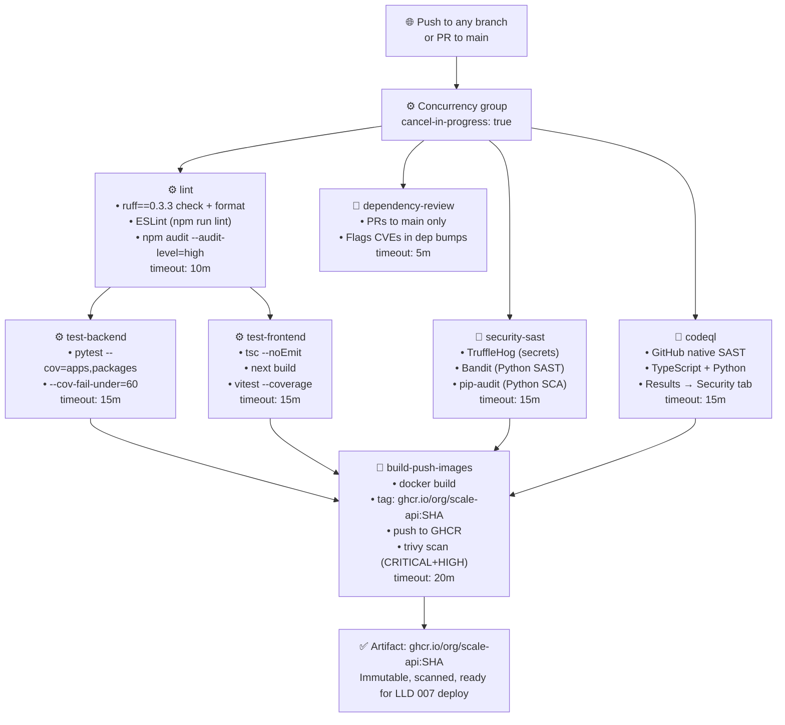
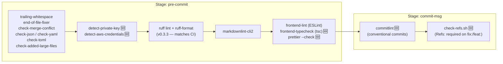

# Feature LLD: CI/CD Pipeline Hardening (Phase 1)

> **Doc ID:** 006-ci-cd-pipeline-hardening
> **Date:** 2026-03-16
> **Status:** Draft
> **DRI:** Mohammed Hassan
> **Type:** Feature LLD

---

## 1. Problem Statement

SCALE's CI/CD pipeline has critical gaps that expose the project to undetected security vulnerabilities, silent quality regressions, and a broken artifact story. A two-pass analysis using the DevSecOps and CI/CD skills identified the following active problems:

1. **Bandit soft-fail bug** — `bandit -c pyproject.toml || bandit -ll` silently falls back to a less-strict scan if the config file is missing, meaning Python SAST can pass with zero real coverage.
2. **No Node.js SCA** — `pip-audit` protects Python deps, but `npm audit` is never run. Node.js vulnerabilities in `apps/web/` are completely undetected.
3. **No ESLint in CI** — ESLint only runs in pre-commit, which is bypassable with `--no-verify`. A broken lint rule can reach `main`.
4. **No `next build` in CI** — TypeScript type-check passes but Next.js build can still fail (missing env vars, App Router constraints, invalid config). The build is never verified server-side.
5. **Images thrown away after scan** — `build-scan-images` builds `scale-api:latest`, scans it with Trivy, then discards it. No versioned artifact is ever pushed to a registry. Deployment is impossible without this.
6. **`latest` Docker tag** — Mutable, non-deterministic tag used in CI. Violates immutable artifact requirement.
7. **CI only triggers on `main`** — Feature branch pushes get zero server-side CI. Any bug on a feature branch is invisible until it reaches `main`.
8. **No CodeQL SAST** — GitHub's free native deep static analysis (TypeScript + Python) is not configured. Logic bugs and injection vulnerabilities that Bandit and TruffleHog miss go undetected.
9. **No coverage enforcement** — CI passes with minimal test coverage. The test suite can shrink to zero tests and CI stays green.
10. **No concurrency cancellation** — Stale CI runs continue after a new push to the same branch, wasting GitHub Actions minutes.
11. **Pre-commit secret detection gaps** — `detect-private-key` and `detect-aws-credentials` are not in pre-commit. TruffleHog catches these post-push, not before.
12. **No TypeScript check in pre-commit** — TypeScript errors only caught after push + 3-minute CI wait instead of <2 seconds locally.
13. **No Prettier enforcement** — Prettier is configured in `package.json` but not enforced in pre-commit or CI. Formatting inconsistencies slip through silently.
14. **No conventional commit validation** — Commit messages are not validated. The orphan-commit rule (`Refs:` required on `fix:`/`feat:`) has no enforcement mechanism.
15. **No automated dependency updates** — CVEs in pinned deps sit unfixed until someone manually notices. `dependabot.yml` does not exist.
16. **No PR dependency review** — PRs that bump a dependency to a vulnerable version are not automatically flagged.
17. **ruff version drift** — Pre-commit pins ruff at `v0.3.3`; CI runs `pip install ruff` (unpinned). The same code can pass locally and fail in CI.
18. **No job timeouts** — GitHub Actions default timeout is 6 hours. A hung job wastes the full quota.

---

## 2. Success Criteria

- [ ] Bandit runs with pyproject.toml config only — no fallback mode. A missing config causes the job to fail, not silently downgrade.
- [ ] `npm audit --audit-level=high` runs on every CI push and fails on high/critical Node.js CVEs.
- [ ] ESLint runs in CI (`cd apps/web && npm run lint`) as part of the `lint` job.
- [ ] `next build` runs in CI as part of `test-frontend`. A broken Next.js build fails CI before it reaches `main`.
- [ ] Docker images are tagged `ghcr.io/<owner>/scale-api:<git-sha>` and pushed to GHCR after every passing CI run on `main`.
- [ ] No `latest` tag is produced by CI anywhere.
- [ ] CI triggers on pushes to all branches (not just `main`). A push to any feature branch runs the full pipeline.
- [ ] CodeQL SAST runs on every push, covering both TypeScript and Python. Results appear in the GitHub Security tab.
- [ ] Backend test coverage threshold enforced at 60% (`--cov-fail-under=60`). CI fails below this floor.
- [ ] Frontend test coverage enforced at 60% (`vitest run --coverage --coverage.thresholds.lines=60`). CI fails below this floor.
- [ ] Concurrency cancellation enabled — a new push to a branch cancels any in-progress run for that branch.
- [ ] `detect-private-key` and `detect-aws-credentials` hooks are active in pre-commit.
- [ ] `tsc --noEmit` runs locally in pre-commit on any `.ts`/`.tsx` change.
- [ ] Prettier check runs in pre-commit on JS/TS/CSS/JSON files.
- [ ] `commitlint` validates every commit message against conventional commit format at commit-msg stage.
- [ ] `check-refs.sh` rejects any `fix:` or `feat:` commit that lacks a `Refs: docs/` line pointing to a real file.
- [ ] ruff version matches between pre-commit (`v0.3.3`) and CI (`pip install ruff==0.3.3`).
- [ ] All CI jobs have `timeout-minutes` set (≤20 minutes each), including the `dependency-review` job.
- [ ] `dependabot.yml` exists and generates weekly PRs for npm, pip, and github-actions deps.
- [ ] `dependency-review-action` runs on all PRs to `main` and fails if a bumped dependency introduces a known CVE.

---

## 3. Scope

### In Scope

- `.github/workflows/ci.yml` — modify all existing jobs, add `codeql` and `dependency-review` jobs
- `.pre-commit-config.yaml` — add 6 new hooks
- `.github/dependabot.yml` — create new file
- `scripts/check-refs.sh` — create new file
- `.commitlintrc.json` — create new file
- `apps/web/package.json` — add `@commitlint/cli` and `@commitlint/config-conventional` as dev dependencies
- `docs/design/system-architecture.md` — add GHCR registry as a new infrastructure component; update Changelog
- GitHub repository secrets: `NEXT_PUBLIC_SUPABASE_URL`, `NEXT_PUBLIC_SUPABASE_ANON_KEY` (manual setup step, not a code change)

### Out of Scope

- CD implementation (Railway deploy steps) — LLD 007
- Playwright E2E in CI — LLD 007 (requires a deployed environment)
- SBOM generation (Syft) — LLD 007
- Artifact signing (cosign) — LLD 007
- Rollback procedure — LLD 007
- DAST (OWASP ZAP) — future RFC
- License compliance scanning — future RFC
- Performance gate on PRs (k6/Lighthouse) — future RFC
- DORA metrics — future RFC

---

## 4. Design

### 4.1 CI Pipeline Architecture (after this LLD)



### 4.2 Pre-commit Hook Stack (after this LLD)



### 4.3 check-refs.sh Logic

```
Read commit message from $1
Extract first line
If first line starts with "fix:" or "feat:":
    Search for line matching "Refs: docs/"
    If found:
        Check that the referenced path exists in the working tree
        If file missing → exit 1 with "Refs: points to non-existent file: <path>"
    If not found → exit 1 with "fix:/feat: commits require a Refs: docs/... line"
Exit 0 (pass)
```

### 4.4 Docker Artifact Flow

**Before this LLD:**

```
ci.yml builds scale-api:latest → Trivy scans → image discarded
```

**After this LLD:**

```
ci.yml builds ghcr.io/<org>/scale-api:<sha>
  → Trivy scans
  → GHCR login (GITHUB_TOKEN)
  → push to ghcr.io/<org>/scale-api:<sha>
  → LLD 007 pulls this exact SHA to deploy
```

The `GITHUB_TOKEN` automatically has write access to GHCR for the same repository — no additional secrets required for the push step.

### 4.5 Coverage Thresholds

| Component | Tool | Command | Floor |
|---|---|---|---|
| Backend | pytest-cov | `--cov=apps --cov=packages --cov-fail-under=60` | 60% line coverage |
| Frontend | @vitest/coverage-v8 | `vitest run --coverage --coverage.thresholds.lines=60` | 60% line coverage |

60% is the initial floor — intentionally low to avoid breaking CI immediately. The floor should be ratcheted up as test coverage improves.

---

## 5. API Changes

None. This feature modifies only CI configuration files and developer tooling. No API endpoints are added, modified, or removed.

---

## 6. Database Changes

None. No schema changes, migrations, or database configuration changes.

---

## 7. Edge Cases & Error Handling

**`next build` requires env vars at build time.**
`NEXT_PUBLIC_SUPABASE_URL` and `NEXT_PUBLIC_SUPABASE_ANON_KEY` must be set as GitHub repository secrets and injected into the `test-frontend` job via `env:`. If the secrets are not configured, `next build` fails with a clear error. This is intentional — a broken env config should fail CI.

**GHCR push requires `packages: write` permission.**
The `build-push-images` job must declare `permissions: packages: write`. The top-level `permissions: contents: read` must be overridden at the job level. The `GITHUB_TOKEN` is sufficient — no personal access token needed.

**CodeQL on a monorepo.**
CodeQL auto-detects languages from the repo root. Both TypeScript (`apps/web/`) and Python (`apps/api/`, `packages/`) are detected automatically. No per-language config file required unless custom queries are needed (out of scope).

**`check-refs.sh` on merge commits.**
Merge commits (`Merge branch 'x' into 'y'`) do not start with `fix:` or `feat:`, so the script exits 0 without checking. This is correct — merge commits are exempt from the Refs requirement.

**`check-refs.sh` on squash-merged PRs.**
When a PR is squash-merged, the resulting commit message is set by the developer. If it starts with `fix:` or `feat:`, the hook fires. The developer must include `Refs:` before squash-merging. This enforces the rule even for squash merges.

**Coverage threshold on a new repo with low test count.**
The 60% floor may immediately fail CI if the current coverage is below 60%. Before merging this LLD's implementation, run `pytest --cov=apps --cov=packages` and `vitest run --coverage` locally to measure actual coverage. If below 60%, set the initial floor to actual coverage - 5% (e.g., 35% if current is 40%) and create a follow-up task to raise it.

**ruff version pin drift over time.**
When ruff releases a new version, both `.pre-commit-config.yaml` (rev field) and `ci.yml` (`pip install ruff==X.Y.Z`) must be updated together. Dependabot will open a PR for the pre-commit hook update automatically. The CI pin must be updated manually in the same PR. Document this in the PR template (out of scope for this LLD).

**Concurrency cancellation and deploy.yml.**
`deploy.yml` already has `concurrency: cancel-in-progress: true` scoped to `deploy-${{ github.ref }}`. The new concurrency group in `ci.yml` is scoped to `ci-${{ github.ref }}` — separate groups, no interference.

---

## 8. Security Considerations

**GHCR push uses `GITHUB_TOKEN` (not a PAT).**
`GITHUB_TOKEN` is scoped to the current workflow run and expires when the run ends. It has the minimum permissions needed (`packages: write`). No long-lived credentials are stored.

**CodeQL results are private by default.**
On private repositories, CodeQL results are only visible to repo members with write access. Results appear in the Security tab under Code Scanning. No external service receives the results.

**`detect-private-key` and `detect-aws-credentials` are defence-in-depth.**
TruffleHog already runs in CI (post-push). The pre-commit hooks catch secrets before they ever leave the developer's machine. This is a layered approach — if a developer bypasses pre-commit (`--no-verify`), TruffleHog is the backstop.

**`dependency-review-action` uses the GitHub Advisory Database.**
It checks introduced dependencies against the GitHub Advisory Database (GHSA). It does not send code to any third-party service. It requires `pull-requests: read` permission which is already granted by the default `GITHUB_TOKEN`.

**`check-refs.sh` reads only the commit message file.**
The script reads `$1` (the commit-msg temp file) and does a `test -f` check on the referenced path. It does not execute any content from the commit message and is not vulnerable to injection via crafted commit messages.

**Coverage reports are not uploaded to external services.**
Coverage thresholds are enforced locally in the CI runner (`--cov-fail-under`, `--coverage.thresholds`). No coverage data is uploaded to Codecov or similar. If upload is added later, it should use a repository-scoped token.

---

## 9. Testing Strategy

This feature is CI/CD configuration — the tests are the CI runs themselves.

**Local verification before merging:**

| Check | Command | Expected |
|---|---|---|
| Pre-commit hooks pass | `pre-commit run --all-files` | All hooks green |
| commitlint rejects bad message | `echo "bad message" \| npx commitlint` | Exit 1 |
| commitlint accepts good message | `echo "feat: add thing" \| npx commitlint` | Exit 0 |
| check-refs rejects orphan fix | `echo -e "fix: thing\n" > /tmp/msg && bash scripts/check-refs.sh /tmp/msg` | Exit 1 |
| check-refs accepts valid Refs | `echo -e "fix: thing\n\nRefs: docs/bugs/BUG-001-test.md" > /tmp/msg && bash scripts/check-refs.sh /tmp/msg` (after creating the file) | Exit 0 |
| pytest coverage floor | `pytest apps/ packages/ --cov=apps --cov=packages --cov-fail-under=60` | Pass or reveal actual floor |
| next build locally | `cd apps/web && npm run build` | Build succeeds with env vars set |

**CI verification after merging:**

| Check | Where to look | Expected |
|---|---|---|
| All jobs pass | GitHub Actions → CI workflow | All green |
| Image pushed | GitHub → Packages tab | `scale-api:<sha>` visible |
| No `latest` tag | GitHub → Packages tab | Only SHA tags, no `latest` |
| CodeQL results | GitHub → Security → Code Scanning | Results appear (may be 0 findings) |
| Feature branch CI | Push to any non-main branch | CI runs |
| Concurrency cancel | Push twice quickly to same branch | Second run cancels first |
| Dependabot PRs | GitHub → Pull Requests (after one week) | Auto-PRs from Dependabot appear |

---

## 10. Related Documents

| Document | Relationship |
|---|---|
| `docs/design/api-design.md` | No changes — this LLD does not touch API endpoints |
| `docs/design/database-design.md` | No changes — this LLD does not touch schema |
| `docs/design/system-architecture.md` | **Must update** — GHCR registry is a new infrastructure component; add to infrastructure section and update Changelog (HLD Sync Rule) |
| `docs/features/007-cd-implementation.md` | Successor — LLD 007 consumes the GHCR images produced by this LLD |
| `.claude/rules/documentation-gate.md` | `check-refs.sh` enforces Gate 4 (Commit Gate) from this rule file |
| `.claude/rules/commit-strategy.md` | `commitlint` enforces the commit prefix table from this rule file |
| `docs/STANDARDS.md` | Spec Review Rule and Planned Automation section — pre-commit Refs check is listed as Planned; this LLD implements it |

---

## 11. Changelog

| Date | Entry |
|---|---|
| 2026-03-16 | Draft created. Full gap list compiled via two-pass CI/CD and DevSecOps skill analysis. Design approved through brainstorming session. |
