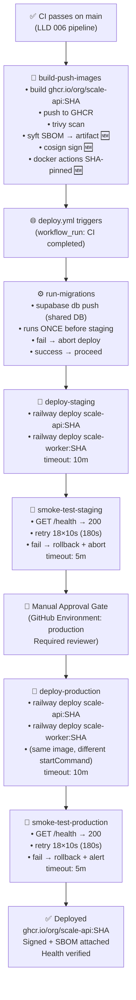
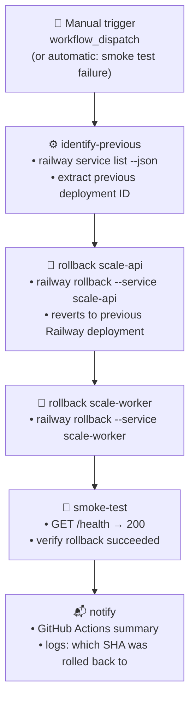
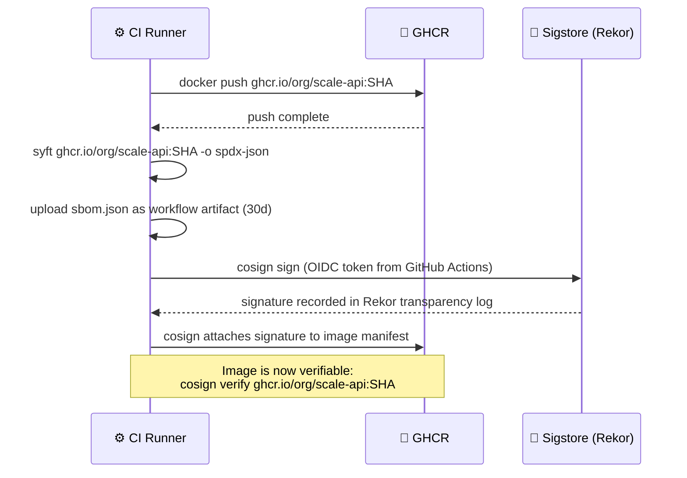

# Feature LLD: CD Implementation (Phase 2)

> **Doc ID:** 007-cd-implementation
> **Date:** 2026-03-16
> **Status:** Verified
> **DRI:** Mohammed Hassan
> **Type:** Feature LLD

---

## 1. Problem Statement

SCALE has a fully functional CI pipeline (LLD 006) that builds, scans, and pushes Docker images to GHCR — but nothing ever gets deployed. Both deployment steps in `deploy.yml` are `echo "TODO"`. The FastAPI backend (`apps/api/`) and Celery worker (`apps/worker/`) are running only locally. Additionally, two remaining security gaps exist in the CI layer:

1. **CD does not exist** — `deploy-staging` and `deploy-production` jobs in `deploy.yml` execute `echo "TODO — configure deployment target"`. No code ever reaches a server.
2. **No smoke test** — Even after deployment is implemented, there is no health check to verify the deploy succeeded. A broken deploy could be silent.
3. **No rollback procedure** — No documented or automated way to revert a bad deployment. The only recovery path is a new commit, which takes the full CI + CD cycle (~10 minutes).
4. **No zero-downtime migration coordination** — Database migrations (`supabase/migrations/`) are applied independently of application deploys. A migration that removes a column will break the running app if applied before the new code is deployed. Ordering is not enforced.
5. **No SBOM** — The shipped Docker image has no Software Bill of Materials. Contents cannot be audited. Required for supply chain security and compliance.
6. **No artifact signing** — A compromised container registry could substitute a malicious image. Image signing (cosign) makes tampering detectable before deploy.
7. **Docker actions use mutable version tags** — `docker/setup-buildx-action@v3` and `docker/build-push-action@v5` are not SHA-pinned. An attacker who compromises these actions could inject malicious build steps.

The frontend (`apps/web/`) is already deployed on Vercel — Vercel handles that automatically on push to `main`. This LLD covers only the backend.

---

## 2. Success Criteria

- [x] `deploy-staging` job in `deploy.yml` actually deploys `scale-api` to Railway staging environment using the GHCR image tagged with `${{ github.sha }}`.
- [x] `deploy-production` job deploys the same image to Railway production after manual approval via GitHub Environments protection rule.
- [x] Both staging and production deploy jobs pull the exact SHA image from GHCR that was built and scanned by CI — no rebuild.
- [x] A smoke test step runs after each deploy: `GET /health` (root) returns HTTP 200 within 360 seconds (36 retries × 10s). CI fails if the health check does not pass. (Timeout extended from 180s — MiniLM model download at cold start takes ~3 min.)
- [x] A rollback job exists in `deploy.yml` that can be triggered manually via `workflow_dispatch`. It re-deploys the previous Railway deployment without a new build.
- [x] Database migrations run before the application container is updated. If migrations fail, the deploy aborts and the current container is not replaced.
- [x] SBOM is generated for `ghcr.io/<org>/scale-api:<sha>` using Syft after every successful push. The SBOM is attached as a workflow artifact with 30-day retention in SPDX JSON format.
- [x] The image is signed with cosign (keyless, via Sigstore OIDC) after every push to GHCR. The signature is verifiable with `cosign verify`.
- [x] `docker/setup-buildx-action` is pinned to an immutable commit SHA in `ci.yml`.
- [x] `docker/build-push-action` is pinned to an immutable commit SHA in `ci.yml`.
- [x] `railway.toml` exists at the repo root and configures both the `scale-api` and `scale-worker` services.
- [x] All new CI/CD jobs have `timeout-minutes` set.

---

## 3. Scope

### In Scope

- `.github/workflows/deploy.yml` — replace both `echo "TODO"` deploy steps with real Railway deploy commands; add migration step; add smoke test step; add rollback job
- `.github/workflows/ci.yml` — add SBOM generation (Syft) and cosign signing to `build-push-images` job; pin `docker/setup-buildx-action` and `docker/build-push-action` to commit SHAs
- `railway.toml` — create new file defining `scale-api` and `scale-worker` services
- `docs/design/system-architecture.md` — update to reflect Railway as backend runtime, SBOM and cosign in the artifact flow

### Manual setup steps (not code — one-time Railway configuration)

- Create Railway project: two services — `scale-api` (web) and `scale-worker` (worker)
- Add `RAILWAY_TOKEN` to GitHub Secrets (scoped to the project)
- Configure Railway env vars for both services: `SUPABASE_URL`, `SUPABASE_SERVICE_KEY`, `SUPABASE_ANON_KEY`, `REDIS_URL`, `SETU_CLIENT_ID`, `SETU_CLIENT_SECRET`, `SETU_BASE_URL`, `SETU_REDIRECT_URL`, `SENTRY_DSN`, `ENVIRONMENT=production`
- Configure GitHub Environments: `staging` (auto-approve) and `production` (require manual reviewer)
- Add `STAGING_API_URL` and `PRODUCTION_API_URL` as GitHub repository variables (used in smoke test steps)

### Out of Scope

- Frontend deployment (Vercel handles this automatically) — no changes
- DAST (OWASP ZAP) — future RFC
- License compliance scanning — future RFC
- Performance gate on PRs — future RFC
- DORA metrics — future RFC
- GitHub's own actions SHA pinning (checkout, setup-python, setup-node) — future RFC (low risk, officially maintained)
- Kubernetes / cloud migration — future RFC (Railway is the current target)

---

## 4. Design

### 4.1 Full CD Pipeline (after this LLD)



### 4.2 Rollback Flow



### 4.3 SBOM + Signing Flow (added to build-push-images)



### 4.4 Deploy Step Design

**Migration step (runs once before staging; production depends on the same job output):**

```
run-migrations job:
  runs-on: ubuntu-latest
  timeout-minutes: 10
  steps:
    1. actions/checkout (ref: triggering SHA)
    2. Install Supabase CLI (via npm: supabase)
    3. supabase db push --db-url ${{ secrets.DATABASE_URL }}
       ← uses SUPABASE DB direct connection string (not anon key)
       ← runs all pending migrations in supabase/migrations/ in order
    if exit code != 0: job fails → deploy-staging does not run

Note: migrations run ONCE, before staging. deploy-production also needs: [run-migrations]
which ensures it uses the same already-applied migration state — migrations are not re-run.
Staging and production share one Supabase database (see Edge Cases §7).
```

**Single-image design (one image, two services):**

```
The Dockerfile has two targets: `api` and `worker`, both derived from `runtime-base`
which contains all application code (apps/ and packages/). One image is built and pushed:
  ghcr.io/${{ github.repository }}/scale-api:<sha>

Both Railway services deploy this same image. Railway's `startCommand` in railway.toml
overrides the image CMD for each service:
  scale-api:    uvicorn apps.api.main:app --host 0.0.0.0 --port $PORT
  scale-worker: celery -A apps.api.celery_app worker --loglevel=info ...

This is intentional — no separate scale-worker image is built or pushed.
```

**Deploy step (staging and production are identical, different Railway environments):**

```
deploy-staging job:
  needs: [run-migrations]
  environment: staging
  timeout-minutes: 10
  permissions:
    packages: read   ← required for docker manifest inspect pre-flight check
  steps:
    1. Log in to GHCR (docker/login-action)
    2. Verify image exists:
       docker manifest inspect ghcr.io/${{ github.repository }}/scale-api:${{ github.event.workflow_run.head_sha }}
       ← fails fast if CI did not push the image
    3. Install Railway CLI (npm install -g @railway/cli)
    4. railway up --service scale-api \
         --image ghcr.io/${{ github.repository }}/scale-api:${{ github.event.workflow_run.head_sha }} \
         --detach
       ← creates a reversible deployment entry in Railway's deployment history
       ← railway rollback can revert this entry
    5. railway up --service scale-worker \
         --image ghcr.io/${{ github.repository }}/scale-api:${{ github.event.workflow_run.head_sha }} \
         --detach
       ← same image; Railway applies scale-worker's startCommand override from railway.toml
  env:
    RAILWAY_TOKEN: ${{ secrets.RAILWAY_TOKEN }}
```

**Smoke test step:**

```
POST-deploy health check:
  timeout-minutes: 5
  steps:
    - name: Wait for health
      run: |
        for i in $(seq 1 18); do
          STATUS=$(curl -s -o /dev/null -w "%{http_code}" ${{ vars.STAGING_API_URL }}/health)
          if [ "$STATUS" = "200" ]; then
            echo "Health check passed on attempt $i"
            exit 0
          fi
          echo "Attempt $i: HTTP $STATUS — waiting 10s"
          sleep 10
        done
        echo "Health check failed after 180s"
        exit 1
      ← targets GET /health (root) which returns {"status": "ok"} with HTTP 200
      ← 18×10s = 180s covers Railway cold starts (60–90s) with headroom
      ← on failure: triggers rollback job, marks deploy as failed
```

### 4.5 Docker Actions SHA Pinning

At implementation time, resolve the current SHAs for:

```yaml
# Current (mutable):
uses: docker/setup-buildx-action@v3
uses: docker/build-push-action@v5

# Required (immutable):
uses: docker/setup-buildx-action@<SHA-of-v3-at-pinning-time>
uses: docker/build-push-action@<SHA-of-v5-at-pinning-time>
```

Resolve using: `gh api repos/docker/setup-buildx-action/git/ref/tags/v3 --jq '.object.sha'`

Dependabot (added in LLD 006) will automatically open PRs to update these SHAs when new versions are released.

### 4.6 railway.toml Structure

`railway.toml` configures per-service deploy settings. Since we deploy pre-built GHCR images (not Railway source builds), the `[build]` section is not used — Railway uses the image supplied by `railway up --image`. The `startCommand` and `healthcheckPath` are still applied by Railway at runtime.

Railway uses one `railway.toml` per service, or a root-level file with service-specific overrides. At implementation time, create two service configuration blocks. The exact multi-service TOML syntax must be verified against the Railway CLI version in use; the schema below reflects current Railway conventions:

```toml
# railway.toml — root-level service configuration

# scale-api service
[deploy]
  startCommand = "uvicorn apps.api.main:app --host 0.0.0.0 --port $PORT"
  healthcheckPath = "/health"
  healthcheckTimeout = 300   # seconds — covers cold start

# scale-worker service
# Workers do not serve HTTP traffic — no healthcheckPath.
# Railway uses process liveness (exit code) to determine worker health.
# [deploy]
#   startCommand = "celery -A apps.api.celery_app worker --loglevel=info --queues=training --concurrency=2"
```

**Note:** The Celery app path is `apps.api.celery_app` (verified from `Dockerfile` line 45 — the worker CMD uses `apps.api.celery_app`). The `railway.toml` for each service is configured separately in the Railway dashboard or via per-service config files. At implementation time, confirm the Railway multi-service TOML format matches the current Railway CLI documentation.

---

## 5. API Changes

None. This feature adds deployment infrastructure but does not modify any API endpoints. The `/health` endpoint must already exist in `apps/api/` — implementation must verify this before writing the smoke test step.

---

## 6. Database Changes

None. This feature does not introduce new migrations. The migration step in `deploy.yml` runs existing migrations in `supabase/migrations/` — it does not create new ones.

---

## 7. Edge Cases & Error Handling

**Railway cold start on first deploy.**
Railway may take 60–90 seconds to pull the image and start the container on a cold start (first ever deploy or after a long period of inactivity). The smoke test retries 18 times with 10-second waits (180 seconds total), which covers the cold-start window with ~90 seconds of headroom. Warm-start deploys typically complete in ~30 seconds.

**Two health routes with different response bodies.**
The FastAPI app has two health endpoints:
- `GET /health` (root) → `{"status": "ok"}` with HTTP 200 — defined inline in `apps/api/main.py`
- `GET /api/v1/health` → `{"status": "healthy", "service": "api", "version": "..."}` — mounted router in `apps/api/routers/health.py`

The smoke test (Section 4.4) targets `GET /health` (root) and only checks for HTTP 200 — the response body is not validated. The Dockerfile `HEALTHCHECK` also uses `/api/v1/health`. Both endpoints return HTTP 200 for a healthy service; either can be used for health checks. Pre-deploy local verification (Section 9) uses the root `/health` to match the smoke test target.

**Migration failure mid-deploy.**
If `supabase db push` fails (e.g., a migration has a syntax error or conflicts with existing data), the `run-migrations` job fails and `deploy-staging` does not run. The existing code stays deployed with the existing schema — no inconsistent state. The developer must fix the migration and push again.

**Migration runs before staging but after production in split-brain scenario.**
The `run-migrations` job runs once, shared by both staging and production paths. Staging uses production migrations (there is only one Supabase project in this architecture). This means staging and production share the same database — a deliberate simplification for early-stage SCALE. When staging and production need separate databases, this design must change (tracked as a future enhancement).

**GHCR image not found at deploy time.**
If `build-push-images` in CI did not push the image (e.g., CI was re-run from a failing step, or GHCR push failed silently), Railway will fail with "image not found". The deploy job should verify image existence before calling `railway up`. Add: `docker manifest inspect ghcr.io/${{ github.repository }}/scale-api:${{ github.event.workflow_run.head_sha }}` as a pre-deploy check.

**cosign keyless signing requires `id-token: write` permission.**
Keyless cosign uses GitHub Actions OIDC tokens to sign via Sigstore. The `build-push-images` job must declare `permissions: id-token: write` in addition to the existing `packages: write`. This overrides the top-level `permissions: contents: read`.

**Syft SBOM generation on a remote image.**
Syft can scan an already-pushed remote image (`syft ghcr.io/org/scale-api:sha`) without pulling it locally. This avoids re-pulling a large image after pushing. Requires the GHCR login to still be active in the job — must run SBOM before the job ends.

**Railway token scope.**
The `RAILWAY_TOKEN` must be a project-scoped token (not a team token). A team token has access to all projects — a compromise exposes the entire Railway account. Generate a project-specific token from Railway project settings.

**`/health` endpoint may not exist.**
The FastAPI app at `apps/api/` must expose `GET /health` returning `{"status": "ok"}` with HTTP 200. If this endpoint does not exist, the smoke test will return 404 and the deploy will be marked failed even though the app is running correctly. Implementation must verify this endpoint exists before writing the smoke test. If it does not exist, it must be added as part of this LLD's implementation (trivial: one 3-line route).

---

## 8. Security Considerations

**`RAILWAY_TOKEN` is a project-scoped secret.**
Generate from Railway dashboard → Project Settings → Tokens. Use project scope, not team scope. Rotate quarterly. Store only in GitHub repository secrets (not environment secrets — repository secrets are accessible to all environments, which is correct here since staging and production use the same Railway project).

**cosign keyless signing — no key management required.**
Keyless signing uses GitHub Actions' OIDC identity as the signing identity. The signature is anchored to the GitHub Actions run ID, repository, and workflow. No private key is stored anywhere. Signatures are recorded in Sigstore's Rekor public transparency log — verifiable by anyone, tamper-evident.

**SBOM is public data.**
The SBOM lists every dependency in the image. For a private repository, attaching the SBOM as a workflow artifact means it is visible to anyone with repository read access. This is acceptable — the SBOM does not expose credentials or business logic.

**Migration credentials.**
`supabase db push` requires a direct database connection string (`DATABASE_URL` — the Postgres connection string with full write access). This is more sensitive than the anon key. It must be stored as a GitHub encrypted secret, not a variable. Never log this value.

**Docker actions SHA pinning prevents supply chain injection.**
Pinning `docker/setup-buildx-action` and `docker/build-push-action` to commit SHAs means a compromised action release cannot inject malicious build steps. Dependabot will open PRs with updated SHAs when new versions are available — review these PRs before merging.

**Deployment approval for production.**
The GitHub Environment protection rule for `production` must require at least one named reviewer. Without this, `deploy-production` runs automatically after `deploy-staging`, defeating the manual approval gate.

---

## 9. Testing Strategy

**Pre-deploy local verification:**

| Check | Command | Expected |
|---|---|---|
| `/health` endpoint exists (smoke test target) | `make dev && curl http://localhost:8000/health` | `{"status": "ok"}` with HTTP 200 |
| `/api/v1/health` endpoint exists (Dockerfile HEALTHCHECK target) | `make dev && curl http://localhost:8000/api/v1/health` | `{"status": "healthy", ...}` with HTTP 200 |
| Docker image builds with SHA tag | `docker build -t scale-api:test . --target api` | Build succeeds |
| Railway CLI authenticated and project linked | `railway status` | Shows project name and environment |
| railway.toml syntax check | `cat railway.toml` (manual inspection) | No obvious syntax errors |
| Syft installed | `syft version` | Version output |
| cosign installed | `cosign version` | Version output |

**CI verification after implementation:**

| Check | Where to look | Expected |
|---|---|---|
| SBOM artifact | GitHub Actions → CI run → Artifacts | `sbom.json` (SPDX format) attached |
| cosign signature | `cosign verify ghcr.io/<org>/scale-api:<sha>` | Verification success |
| Docker actions SHA-pinned | `.github/workflows/ci.yml` lines with `docker/` | Full SHA (not `@v3`/`@v5`) |
| Staging deploy runs | GitHub Actions → deploy.yml | `deploy-staging` job green |
| Staging health check | `curl $STAGING_API_URL/health` | HTTP 200 |
| Production gated | GitHub Actions → deploy.yml | `deploy-production` shows "Waiting for review" |
| Production deploy after approval | Approve in GitHub UI | `deploy-production` runs and completes |
| Production health check | `curl $PRODUCTION_API_URL/health` | HTTP 200 |
| Rollback works | Trigger `workflow_dispatch` on deploy.yml | Previous deployment restored; health check passes |
| Migration runs before deploy | GitHub Actions → `run-migrations` job | Runs before `deploy-staging` in dependency chain |

---

## 10. Related Documents

| Document | Relationship |
|---|---|
| `docs/features/006-ci-cd-pipeline-hardening.md` | **Prerequisite** — GHCR image push (LLD 006) must be implemented before this LLD. deploy.yml pulls the image by SHA from GHCR. |
| `docs/design/system-architecture.md` | **Must update** — Add Railway as backend runtime, GHCR artifact push flow, SBOM and cosign in pipeline. Add Changelog entry. |
| `docs/design/api-design.md` | Relevant — `/health` endpoint must exist. Verify against actual router files before implementation. |
| `docs/design/database-design.md` | Relevant — migration step runs `supabase/migrations/`. No schema changes from this LLD. |
| `.github/workflows/ci.yml` | Modified by this LLD — SBOM, cosign, and Docker SHA pins added to `build-push-images` job. |
| `.github/workflows/deploy.yml` | Modified by this LLD — deploy steps replace `echo "TODO"`. |

---

## 11. Changelog

| Date | Entry |
|---|---|
| 2026-03-16 | Draft created. Scope confirmed via brainstorming session: Railway (API + Worker), GHCR→Railway pipeline, SBOM (Syft), cosign (keyless), Docker actions SHA pins, smoke tests, rollback, migration coordination. Railway chosen as target platform. |
| 2026-03-23 | Implemented. Docker SHA pins, SBOM (Syft, SPDX JSON, 30-day retention), cosign (keyless Sigstore OIDC) added to ci.yml. deploy.yml fully wired: run-migrations → deploy-staging → smoke-test-staging → deploy-production (needs: [smoke-test-staging, run-migrations], manual approval gate) → smoke-test-production. Rollback job (workflow_dispatch). railway.toml created for scale-api and scale-worker. system-architecture.md updated. DEVIATION: all image references use `github.repository_owner` (matching existing ci.yml Push to GHCR step) rather than `github.repository` as written in Section 4.4 — `github.repository_owner` is the correct form for GHCR image paths (`ghcr.io/<owner>/<image>`). |
| 2026-03-24 | Verified. End-to-end pipeline run confirmed: migrations → staging deploy → staging smoke test (HTTP 200) → production deploy (manual approval gate triggered) → production smoke test (HTTP 200). Additional deviations resolved during verification: (1) Railway GraphQL API requires `User-Agent: railway-cli/3.0.0` header to bypass Cloudflare WAF — added to all three Python deploy scripts. (2) Smoke test timeout extended to 360s (36 × 10s) — MiniLM model cold-start download takes ~3 min, exceeding original 180s budget. (3) `PORT=8000` set as Railway env var for both environments — Dockerfile CMD hardcodes port 8000 while Railway routes to `$PORT`; railway.toml startCommand (which uses `$PORT`) is not applied for pre-built image deploys via GraphQL API. |
| 2026-03-25 | ENHANCEMENT: Smoke test loops now log response body on each attempt and dump `curl -v` on final failure for faster post-deploy debugging |
