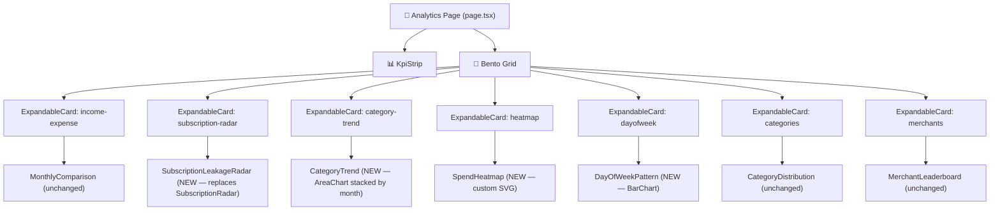
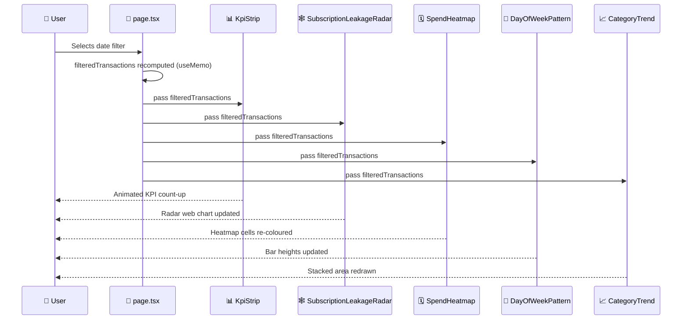

# Feature: Analytics Phase 2 — Advanced Charts & KPI Observatory

> **Doc ID:** 008-analytics-phase-2-advanced-charts
> **Date:** 2026-03-28
> **Type:** Feature LLD
> **DRI:** Hassan
> **Status:** Implemented

## Problem Statement

The current Analytics page (Phase 1) has solid infrastructure — bento grid, expandable cards, framer-motion — but all four charts are visually generic. The MonthlyComparison is a flat dual-area with no summary metrics. The SubscriptionRadar is a half-donut (not a radar). There is no heatmap, no behavioural pattern chart, and no time-series category analysis. The page does not yet deliver the "Financial Observatory" premium feel targeted by the product vision.

Phase 2 adds five new elements that transform the page into a data-dense command centre that rivals Cred and Linear in visual quality.

## Success Criteria

- [ ] Hero KPI Strip is rendered above the bento grid showing Total Income, Total Expenses, Net Savings, and Saving Rate % with animated count-up on mount, all derived from `filteredTransactions`
- [ ] `SubscriptionLeakageRadar` replaces `SubscriptionRadar` with a true Recharts `RadarChart` across 6 category axes; compact mode shows the web chart; expanded mode shows chart + per-category breakdown table
- [ ] `SpendHeatmap` card renders a custom SVG calendar grid showing spend intensity per day across all weeks in the filtered range, with colour gradient from muted to pink-500
- [ ] `DayOfWeekPattern` card renders a `BarChart` of Mon–Sun average spend with the peak day highlighted with a neon glow
- [ ] `CategoryTrend` card renders a stacked `AreaChart` of top 5 spending categories by month, usable as a time-series view alongside the existing snapshot `CategoryDistribution`
- [ ] All five elements update reactively when the global date filter changes (no stale state)
- [ ] `npx tsc --noEmit` passes with zero errors
- [ ] `npm run lint` passes with zero errors
- [ ] Vitest unit tests exist and pass for all five pure-data functions: `computeKpis()`, `mapSubscriptionToAxis()`, `buildHeatmapGrid()`, `computeDowAverages()`, `buildCategoryTrendSeries()`
- [ ] All existing vitest tests continue to pass

## Scope

### In Scope

- New top-level `KpiStrip` component in `apps/web/app/dashboard/analytics/components/`
- New `SubscriptionLeakageRadar` component replacing `SubscriptionRadar` in the same folder
- New `SpendHeatmap` component (custom SVG, no Recharts dependency)
- New `DayOfWeekPattern` component (Recharts `BarChart`)
- New `CategoryTrend` component (Recharts `AreaChart` stacked)
- Updated `page.tsx` grid layout: 4-column, 5 rows with KPI strip at top
- Vitest unit tests for all pure-data transformation logic

### Out of Scope

- Causal graph / network node visualization (Phase 3 — needs AI backend inference)
- Regime shift trendline on MonthlyComparison (deferred — needs rolling-window computation)
- Backend API changes — all computation is client-side from the existing 500-transaction fetch
- Replacing `CategoryDistribution` — it stays; `CategoryTrend` is additive

## Design

### Aesthetic Direction: Financial Observatory

The page should feel like a mission-control centre at 3 AM — data rich, glow-lit, and deeply intentional. Guiding choices:

- **Base**: True `#0A0A0A` background; cards use `bg-white/[0.03]` + `backdrop-blur-md` + `border border-white/[0.06]`
- **Numbers**: `font-mono font-black` with tight letter-spacing; large KPI values get a subtle text-shadow glow matching their accent colour
- **Income accent**: `#10B981` (existing) with `shadow-[0_0_20px_rgba(16,185,129,0.25)]`
- **Expense accent**: `#EF4444` (existing) with `shadow-[0_0_20px_rgba(239,68,68,0.25)]`
- **Subscription / radar**: `#EC4899` pink (existing)
- **Heatmap gradient**: `from-white/[0.04]` → `to-pink-500/80` intensity scale
- **Saving rate gauge**: cyan accent `#06B6D4` (Tailwind `cyan-500`)
- **Motion**: count-up on KPI mount; staggered cell fade-in on heatmap; bar enter animation; radar spin-in from 0 opacity

### Component Architecture



### Data Flow



### Grid Layout (page.tsx)

```
Row 0: [KpiStrip — full width, 4/4 cols]
Row 1: [Income vs Expense 2/4] [Subscription Radar 2/4]
Row 2: [Category Trend 3/4] [Day-of-Week 1/4]
Row 3: [Heatmap — full width, 4/4]
Row 4: [Category Distribution 2/4] [Merchant Leaderboard 2/4]
```

### Component Changes

| File | Change |
|---|---|
| `apps/web/app/dashboard/analytics/page.tsx` | Add `KpiStrip`, add 3 new `ExpandableCard` slots ("Category Trend", "Spend Heatmap", "Day of Week"), update grid to 5 rows |
| `apps/web/app/dashboard/analytics/components/KpiStrip.tsx` | **[NEW]** 4-column animated KPI row |
| `apps/web/app/dashboard/analytics/components/SubscriptionLeakageRadar.tsx` | **[NEW]** True RadarChart with 6 axes; replaces `SubscriptionRadar.tsx` |
| `apps/web/app/dashboard/analytics/components/SpendHeatmap.tsx` | **[NEW]** Custom SVG calendar heatmap |
| `apps/web/app/dashboard/analytics/components/DayOfWeekPattern.tsx` | **[NEW]** Recharts BarChart Mon–Sun average |
| `apps/web/app/dashboard/analytics/components/CategoryTrend.tsx` | **[NEW]** Recharts stacked AreaChart by month |
| `apps/web/app/dashboard/analytics/components/SubscriptionRadar.tsx` | **[DELETE]** Replaced by SubscriptionLeakageRadar |

### KpiStrip — Data Logic

Sign convention: positive `tx.amount` = credit/income; negative `tx.amount` = debit/expense. This matches the existing transaction data model (consistent with `SubscriptionRadar.tsx` line 58–59).

```
totalIncome  = sum(abs(tx.amount)) for tx where amount > 0
totalExpense = sum(abs(tx.amount)) for tx where amount < 0
netSavings   = totalIncome - totalExpense
savingRate   = (netSavings / totalIncome) * 100   [0 if totalIncome === 0]
```

Count-up animation: use `framer-motion` `useMotionValue` + spring animation driving a `useTransform` formatted display string. Duration ~1.2s, ease-out.

### SubscriptionLeakageRadar — Axes Mapping

Map each detected subscription transaction to one of 6 axes by keyword matching on `description.toLowerCase()` (case-insensitive, consistent with existing `SubscriptionRadar.tsx` matching):

| Axis | Keywords |
|---|---|
| Entertainment | netflix, spotify, disney, hulu, youtube premium, apple tv |
| Utilities | electricity, water bill, internet, broadband, gas |
| SaaS | aws, adobe, vercel, github, notion, slack, zoom, figma |
| Fitness | gym, cult.fit, healthify, strava |
| Food Delivery | swiggy, zomato, swiggy one, zomato gold |
| Transport | ola, uber, rapido, metro, irctc |

The `RadarChart` outer boundary = max spend across all axes. Show actual ₹ amounts in the tooltip.

### SpendHeatmap — SVG Grid Logic

- Compute all days in the filtered range, group transactions by day, sum absolute expenses per day
- Arrange into weeks (Mon=col 0 … Sun=col 6), rows = calendar weeks
- Cell colour: linear interpolate between `rgba(255,255,255,0.04)` (zero) and `rgba(236,72,153,0.8)` (max spend day)
- Cell size: 14px with 2px gap; tooltip shows `MMM DD: ₹X`
- Month boundary labels on top row

### DayOfWeekPattern — Computation

```
For each transaction (expense only):
  dow = new Date(tx.transaction_date).getDay()  // 0=Sun ... 6=Sat
  accumulate[dow] += abs(amount)
  count[dow]++

average[dow] = accumulate[dow] / max(count[dow], 1)
```

Display Mon–Sun order (shift Sunday to last). Highlight bar with highest average using `fill="#06B6D4"` + `filter:drop-shadow(0 0 6px rgba(6,182,212,0.6))`.

### CategoryTrend — Computation

```
Group expense transactions by (YYYY-MM, category)
Take top 5 categories by total all-time spend
For each month bucket: sum expense per category
Fill 0 for months where a category has no spend
Output: [{month: "Jan '26", Food: 4200, Transport: 1800, ...}, ...]
```

## Edge Cases & Error Handling

| Scenario | Expected Behavior |
|---|---|
| `filteredTransactions` is empty | KpiStrip shows ₹0 with —% saving rate; all charts show empty state |
| Saving rate > 100% or negative (more income than expenses or net loss) | Clamp display to 0–100% on gauge fill; show raw number in text |
| Subscription transaction matches zero axes | Falls into a seventh "Other" bucket, not rendered on the radar (suppressed from axes) |
| Heatmap: filter range > 52 weeks | Cap at most recent 52 weeks to keep SVG width manageable |
| Heatmap: filter range < 7 days | Render partial week row; do not pad to full week |
| CategoryTrend: fewer than 2 months of data | Render single-column bar fallback with a text note |
| CategoryTrend: top-5 ranking scope | Top 5 computed over filtered range; if fewer than 5 categories exist, render only those present |
| SSR: `window.innerWidth` access | All new components are pure-data — no `window` access needed |

## API Changes

None. All computation is client-side from existing `filteredTransactions` prop.

## Database Changes

None.

## Security Considerations

- All financial data rendered client-side from authenticated Supabase session (inherited from page.tsx — no change)
- No new API calls, no new input surfaces, no new XSS vectors
- Keyword matching runs on `tx.description` which is untrusted user data — rendering via React JSX (auto-escapes) only, never via `dangerouslySetInnerHTML`

## Testing Strategy

- **Unit tests (vitest):** Pure functions — `computeKpis()`, `mapSubscriptionToAxis()`, `buildHeatmapGrid()`, `computeDowAverages()`, `buildCategoryTrendSeries()` — each in `apps/web/app/dashboard/analytics/components/__tests__/`
- **SSR safety:** No `window` / `document` access in any new component (heatmap is pure SVG math; radar uses Recharts which is SSR-safe)
- **Snapshot / render tests:** Not required for Phase 2 — visual components are covered by manual verification

## Dependencies

- `recharts` >= 2.x — `RadarChart`, `Radar`, `PolarGrid`, `PolarAngleAxis`, `BarChart`, `AreaChart` (already installed)
- `framer-motion` >= 11.x — `useMotionValue`, `useSpring`, `useTransform` for count-up (already installed)
- `lucide-react` — icons (already installed)

## Related Documents

- Feature LLD: `docs/features/003-analytics-ui-redesign.md` (Phase 1 — Verified)
- HLD: N/A (no system-level architecture change)

---

## Changelog

| Date | Change |
|---|---|
| 2026-03-28 | Initial draft created. Status set to Draft. Components scoped: KpiStrip, SubscriptionLeakageRadar, SpendHeatmap, DayOfWeekPattern, CategoryTrend. |
| 2026-03-28 | Implementation matches design. tsc clean, 0 lint errors, 118/118 tests pass. Status → Implemented |
