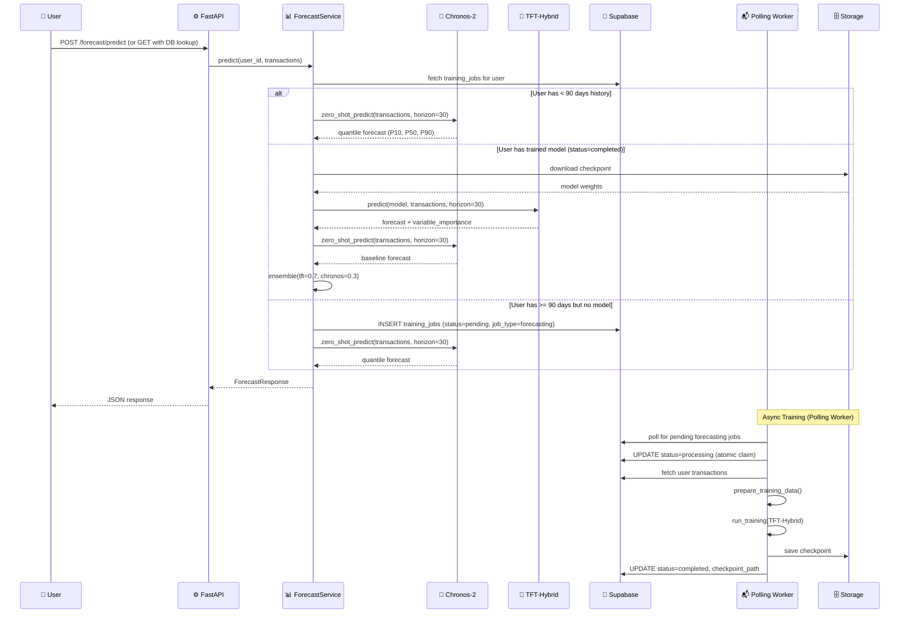

# Feature: Two-Tier Prediction Engine (Chronos-2 + TFT-Hybrid)

> **Doc ID:** 009-prediction-engine
> **Date:** 2026-04-06
> **DRI:** Mohammed
> **Status:** Draft
> **Type:** Feature LLD

## Problem Statement

SCALE users need accurate, interpretable 30-day financial forecasts to plan spending, avoid overdrafts, and build savings habits. The current forecasting code in `packages/forecasting/` uses a vanilla TFT with several critical gaps:

1. **Cold-start problem** — TFT requires 90+ days of transaction history. New users get no forecasts at all.
2. **Training not wired to API** — The polling worker (`apps/worker/main.py`) handles `forecasting` jobs but training must be triggered manually; no API endpoint triggers it.
3. **Missing interpretability output** — The API returns raw quantile numbers with no explanation of *why* the model predicts what it does.
4. **Incomplete API layer** — `service.py` and `schemas.py` are empty stubs; router has business logic that should be in the service.
5. **No foundation model fallback** — The research identified Amazon Chronos-2 as the current #1 zero-shot forecasting model; we're not using it.
6. **`prepare_training_data` duplication** — Exists in both `dataset.py` (line 162) and `trainer.py` (line 96) with different signatures.

## Success Criteria

- [ ] New users (< 90 days of history) receive 30-day probabilistic forecasts via Chronos-2 zero-shot
- [ ] Established users (>= 90 days) receive personalized forecasts from trained TFT-Hybrid model
- [ ] Ensemble mode returns weighted blend (70% TFT, 30% Chronos-2) for established users
- [ ] All forecast responses include P10, P50, P90 quantiles for each predicted day
- [ ] TFT-Hybrid returns variable importance scores (which features drove each prediction)
- [ ] API endpoint `POST /forecast/train` inserts a `training_jobs` row; the existing polling worker picks it up
- [ ] Training job status tracked in `training_jobs` table using existing state machine (pending -> processing -> completed/failed)
- [ ] API schemas (Pydantic) defined for all forecast request/response types
- [ ] Service layer extracts business logic from router into `service.py`
- [ ] All new code covered by tests (unit + integration)
- [ ] CPU inference latency < 500ms per 30-day forecast

## Scope

### In Scope

- Chronos-2-Small (28M params) integration for zero-shot cold-start forecasting
- TFT-Hybrid model with architectural upgrades (SwiGLU, RMSNorm, QK-Norm, RoPE)
- Two-tier routing logic (cold-start -> Chronos-2, established -> TFT-Hybrid/ensemble)
- Pydantic schemas for forecast API
- Service layer extraction from router
- API endpoint to trigger async TFT training (inserts `training_jobs` row for polling worker)
- Training job integration with existing polling worker and `training_jobs` table
- Variable importance output from TFT's Variable Selection Networks
- Model checkpoint versioning in Supabase Storage

### Out of Scope

- Mamba/SSM hybrid layers (future — requires more research/validation)
- LoRA per-user adapters (future — after base model is validated)
- Knowledge distillation from Chronos-2 to TFT (future)
- Multi-Token Prediction head (future)
- Differential Attention (future)
- MoE routing for spending regimes (future)
- Frontend forecast visualization UI (separate feature)
- Neural RDE / HypCD / TDA pipeline components (future features per research docs)

## Design

### Architecture / Data Flow



### Component Architecture

```
packages/forecasting/
  __init__.py
  tft_model.py          # MODIFY: Add SwiGLU, RMSNorm, QK-Norm, RoPE options
  trainer.py             # MODIFY: Add Muon optimizer, WSD schedule, augmentation
  dataset.py             # MODIFY: Add month feature, holiday detection
  inference.py           # MODIFY: Add variable importance extraction
  chronos_engine.py      # NEW: Chronos-2 wrapper for zero-shot forecasting
  ensemble.py            # NEW: Weighted ensemble of TFT + Chronos-2
  optimizers/
    __init__.py           # NEW
    muon.py               # NEW: Muon optimizer implementation
    cautious.py           # NEW: Cautious wrapper (1-line modifier)
  augmentation.py        # NEW: Time-series data augmentation (jitter, scale, warp)
  tests/
    test_chronos.py       # NEW
    test_ensemble.py      # NEW
    test_augmentation.py  # NEW
    test_muon.py          # NEW

apps/api/domains/forecasting/
  router.py              # MODIFY: Thin layer, delegate to service
  service.py             # FILL: Two-tier routing logic, orchestration
  schemas.py             # FILL: Pydantic models for all request/response types

apps/worker/
  main.py                # MINOR: Fix duplicate log lines (L91-94). No other changes needed.
```

### Current State and Migration

The existing router (`apps/api/domains/forecasting/router.py`) has:
- `POST /forecast/predict` — Accepts CSV upload, deduplicates via `uploaded_files` table hash, runs a 7-day statistical moving average (not TFT). ~100 lines of business logic inline.
- `GET /forecast/safe-to-spend` — Queries last 90 days from DB, attempts TFT model load, falls back to statistical forecast. ~80 lines of business logic inline.

**Migration plan:**
1. Extract all business logic from `router.py` into `service.py` (router becomes thin delegation layer)
2. Keep `POST /predict` for CSV-upload flow (backward compatible)
3. Add `GET /predict` for DB-based flow (new — fetches transactions from DB instead of upload)
4. The service layer handles tier selection (Chronos-2 vs TFT-Hybrid) regardless of which endpoint was called
5. Existing `uploaded_files` deduplication logic is preserved in the POST path

### API Changes

| Method | Endpoint | Description |
|---|---|---|
| POST | `/forecast/predict` | EXISTING — accepts CSV upload, returns forecast (upgraded to use two-tier engine) |
| GET | `/forecast/predict?horizon=30` | NEW — fetches user's transactions from DB, returns forecast |
| GET | `/forecast/safe-to-spend` | EXISTING — returns safe spending amount (wire to new service) |
| POST | `/forecast/train` | NEW — inserts training_jobs row to trigger async TFT training |
| GET | `/forecast/model-status` | NEW — returns training job status for current user |

### Response Schema

> **Note:** The project rules (`.claude/rules/backend/fastapi.md`) specify `models.py` for Pydantic models, but this domain already has `schemas.py` as the convention. We use `schemas.py` to match the existing file.

```python
class ForecastPoint(BaseModel):
    date: str                          # "2026-04-07"
    p10: float                         # 10th percentile
    p50: float                         # Median
    p90: float                         # 90th percentile

class VariableImportance(BaseModel):
    feature: str                       # "is_payday", "day_of_week", etc.
    weight: float                      # 0.0 - 1.0

class ForecastResponse(BaseModel):
    forecast: list[ForecastPoint]
    model_type: str                    # "chronos2" | "tft_hybrid" | "ensemble"
    model_version: str                 # "chronos2-small-v1" | "tft-hybrid-v1"
    horizon: int                       # 30
    variable_importance: list[VariableImportance] | None  # Only for TFT
    confidence: str                    # "low" | "medium" | "high"

class TrainRequest(BaseModel):
    force: bool = False                # Force retrain even if model exists

class TrainStatusResponse(BaseModel):
    status: str                        # "no_model" | "pending" | "running" | "completed" | "failed"
    last_trained: str | None
    checkpoint_path: str | None
    training_days: int | None          # Days of data used
```

### Database Changes

No new tables. Existing `training_jobs` table is used.

**State machine** (defined in `apps/worker/job_states.py`):

```
pending -> claimed -> processing -> completed
pending -> processing -> completed    (direct claim)
processing -> failed
failed -> pending                     (retry)
```

| Table | Column | Type | Usage |
|---|---|---|---|
| `training_jobs` | `user_id` | uuid | FK to auth.users |
| `training_jobs` | `status` | text | pending/claimed/processing/completed/failed (CHECK constraint) |
| `training_jobs` | `job_type` | text | Set to "forecasting" for TFT training jobs |
| `training_jobs` | `checkpoint_path` | text | Supabase Storage path (set on completion) |
| `training_jobs` | `metrics` | jsonb | Training metrics (val_loss, epochs, etc.) |
| `training_jobs` | `logs` | text | Progress messages from worker |
| `training_jobs` | `created_at` | timestamptz | Job creation time |
| `training_jobs` | `updated_at` | timestamptz | Last status update |
| `training_jobs` | `transaction_count` | int | Number of transactions used |

### TFT-Hybrid Model Upgrades

The existing TFT in `tft_model.py` uses `pytorch_forecasting.TemporalFusionTransformer`. For v1, we continue using this library but configure it with improved settings:

| Setting | Current | Upgraded |
|---|---|---|
| `hidden_size` | 16 | 64 |
| `attention_head_size` | 1 | 4 |
| `dropout` | 0.1 | 0.1 (base), 0.3 (fine-tune) |
| `hidden_continuous_size` | 8 | 32 |
| `lstm_layers` | 1 | 2 |
| `learning_rate` | 0.03 | 3e-4 |
| `gradient_clip_val` | 0.1 | 1.0 |
| Loss | QuantileLoss() | QuantileLoss() (unchanged) |

Custom architectural changes (SwiGLU, RMSNorm, QK-Norm, RoPE, Muon optimizer) are applied as wrappers or overrides where `pytorch_forecasting` allows. If the library doesn't support a particular change, we document it as a v2.0 item requiring a custom model implementation.

### Chronos-2 Integration

```python
# packages/forecasting/chronos_engine.py
from chronos import ChronosPipeline
import torch

class ChronosEngine:
    """Zero-shot forecasting via Amazon Chronos-2-Small (28M params)."""

    def __init__(self, model_name="amazon/chronos-2-small", device="cpu"):
        self.pipeline = ChronosPipeline.from_pretrained(model_name, device_map=device)

    def predict(self, daily_df, horizon=30, num_samples=100):
        """
        Args:
            daily_df: DataFrame with columns [date, daily_spend, daily_income, closing_balance]
            horizon: prediction length in days
            num_samples: Monte Carlo samples for quantile estimation

        Returns:
            dict with "forecast" list of {date, p10, p50, p90}
        """
        context = torch.tensor(daily_df["closing_balance"].values, dtype=torch.float32)
        samples = self.pipeline.predict(context, prediction_length=horizon, num_samples=num_samples)
        # samples shape: [1, num_samples, horizon]
        quantiles = torch.quantile(samples[0], torch.tensor([0.1, 0.5, 0.9]), dim=0)
        # quantiles shape: [3, horizon]
        # ... format into ForecastPoint list
```

### Data Consolidation

`prepare_training_data` exists in two places with different signatures:
- `dataset.py:162` — Simple: `(transactions, start_date, end_date)` → aggregate + enrich
- `trainer.py:96` — Full: validates 90-day minimum, adds payday detection, converts categoricals

**Decision:** Consolidate into `dataset.py` as the canonical location. The trainer version's extra logic (payday detection, validation) moves into `dataset.py`'s `prepare_training_data`. The trainer imports from `dataset.py`. The duplicate in `trainer.py` is removed.

### Confidence Logic

| Days of history | Model used | Confidence |
|---|---|---|
| 1-30 | Chronos-2 zero-shot | low |
| 31-89 | Chronos-2 zero-shot | medium |
| 90-180, no trained model | Chronos-2 zero-shot | medium |
| 90-180, trained model | TFT-Hybrid + Chronos-2 ensemble | high |
| 180+ | TFT-Hybrid + Chronos-2 ensemble | high |

### Model Initialization Strategy

Chronos-2-Small (28M params) is loaded as a **singleton** at API startup. The model is loaded lazily on first forecast request and cached in-process for subsequent requests. First-load latency (~2-5s for model download + init) is acceptable since it only happens once. The 500ms latency target applies to subsequent inference calls, not first load.

### Component Changes

| File | Change |
|---|---|
| `packages/forecasting/tft_model.py` | Increase hidden_size to 64, attention heads to 4, lstm_layers to 2 |
| `packages/forecasting/trainer.py` | Remove duplicate `prepare_training_data`, import from dataset.py. Add improved optimizer config, gradient_clip_val=1.0 |
| `packages/forecasting/dataset.py` | Consolidate `prepare_training_data` here (add payday detection, 90-day validation, month feature). This is the canonical data preparation function. |
| `packages/forecasting/inference.py` | Extract variable importance from model.interpret_output() |
| `packages/forecasting/chronos_engine.py` | NEW: Chronos-2 zero-shot wrapper (singleton pattern) |
| `packages/forecasting/ensemble.py` | NEW: Weighted ensemble logic |
| `packages/forecasting/augmentation.py` | NEW: Jittering, scaling, magnitude warping |
| `apps/api/domains/forecasting/schemas.py` | NEW: ForecastPoint, ForecastResponse, TrainStatusResponse, VariableImportance |
| `apps/api/domains/forecasting/service.py` | NEW: Two-tier routing logic, extracted from router.py |
| `apps/api/domains/forecasting/router.py` | Refactor: extract business logic to service.py, keep as thin delegation layer. Add GET /predict and POST /train endpoints. |
| `apps/worker/main.py` | No changes needed — existing polling worker already handles `job_type=forecasting` jobs. Fix duplicate log lines (L91-94). |

## Edge Cases & Error Handling

| Scenario | Expected Behavior |
|---|---|
| User has 0 transactions | Return 400: "No transaction data available" |
| User has 1-30 days of data | Chronos-2 zero-shot (may have lower confidence) |
| User has 31-89 days of data | Chronos-2 zero-shot with confidence="medium" |
| User has 90+ days, no trained model | Trigger async training, return Chronos-2 meanwhile |
| Training fails (bad data, OOM) | Update training_jobs.status=failed, log error, continue serving Chronos-2 |
| Checkpoint download fails | Log error, fall back to Chronos-2 |
| Chronos-2 model download fails on first load | Return 503 with retry-after header |
| Concurrent training requests for same user | Skip if training_jobs already has pending/running for user |
| Model produces NaN/Inf predictions | Detect and fall back to Chronos-2, log warning |

## Security Considerations

- **Authentication:** All forecast endpoints require valid JWT (existing Supabase auth middleware)
- **Authorization:** Users can only access their own forecasts. Supabase RLS on `transactions` table + explicit `user_id` filter in queries (defense-in-depth per BUG-002 fix)
- **Data sensitivity:** Transaction data is PII. All model training happens server-side. No transaction data leaves the backend. Model checkpoints are stored per-user in isolated Supabase Storage paths.
- **Model poisoning:** Training data comes only from the user's own verified transactions (ingested through the secure ingestion pipeline). No external training data injection point exists.
- **Resource limits:** Training jobs are rate-limited to 1 concurrent per user. Max training time: 30 minutes (kill if exceeded).

## Testing Strategy

- **Unit tests:**
  - `test_chronos.py`: ChronosEngine.predict() returns correct shape, quantile ordering (p10 <= p50 <= p90), handles empty input
  - `test_ensemble.py`: Ensemble blends correctly at configured weights, handles missing TFT gracefully
  - `test_augmentation.py`: Each augmentation produces valid output, preserves temporal order
  - `test_schemas.py`: Pydantic models validate/reject correctly
  - `test_service.py`: Tier selection logic (< 90 days -> chronos, >= 90 + model -> ensemble, >= 90 no model -> chronos + trigger train)

- **Integration tests:**
  - `test_forecast_api.py`: Full request cycle through API -> service -> engine -> response
  - `test_training_task.py`: Celery task creates job, trains, saves checkpoint, updates DB

- **Edge case tests:**
  - Insufficient data returns appropriate error
  - Concurrent training requests are deduplicated
  - Model with NaN output falls back correctly

- **Performance tests:**
  - Chronos-2 inference latency < 500ms for 30-day horizon on CPU (after model is loaded)
  - TFT-Hybrid inference latency < 500ms for 30-day horizon on CPU
  - Measured with 365-day input history (realistic per-user dataset size)
  - Benchmark on standard CI hardware (or documented local hardware specs)

## Dependencies

| Package | Version | Purpose |
|---|---|---|
| `chronos-forecasting` | >=1.3,<2.0 | Amazon Chronos-2 zero-shot engine |
| `pytorch-forecasting` | >=1.0,<2.0 | TFT model implementation |
| `pytorch-lightning` | >=2.0,<3.0 | Training orchestration |
| `torch` | >=2.0,<3.0 | PyTorch backend |

## Related Documents

- HLD to update: `docs/design/system-architecture.md` (add prediction engine component)
- HLD to update: `docs/design/api-design.md` (add forecast endpoints)
- Existing code: `packages/forecasting/` (current TFT implementation)
- Existing worker: `apps/worker/main.py` (polling worker with `train_model` function)
- State machine: `apps/worker/job_states.py` (JobStatus enum, VALID_TRANSITIONS)
- Reference docs: `references/reference_txt/` (original research documents)

## Changelog

| Date | Entry |
|---|---|
| 2026-04-06 | Initial draft. Two-tier architecture (Chronos-2 + TFT-Hybrid) based on deep research evaluating 20+ models, 15+ optimizers. |
| 2026-04-06 | Spec review fixes: Replaced Celery references with polling worker pattern (C1). Fixed GET->POST for /predict and added migration plan (C2). Fixed training job states to match actual state machine in job_states.py (C3). Consolidated prepare_training_data decision (H1). Fixed broken plan reference (H3). Added current state/migration section (H4). Added confidence logic, model init strategy, performance testing, schemas.py naming note. |
| 2026-04-06 | DEVIATION: `optimizers/muon.py`, `optimizers/cautious.py` deferred — `pytorch-forecasting` library manages its own optimizer internally. Custom optimizers require a custom model implementation (v2.0). The `augmentation.py` module is scaffolded but not yet wired into the training pipeline — integration deferred to avoid scope creep. Safe-to-spend endpoint keeps existing statistical logic for now (wiring to two-tier engine is a future improvement). |
