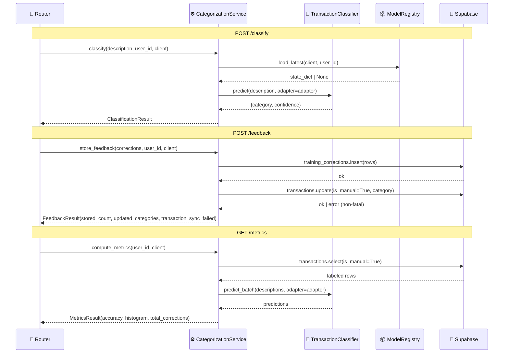

# Feature: Deepen CategorizationService

> **Doc ID:** 012-categorization-service-deepening
> **Date:** 2026-05-05
> **Status:** Draft
> **DRI:** Hassan
> **Type:** Feature LLD

## Problem Statement

`apps/api/domains/categorization/service.py` is a shallow pass-through — it wraps `TransactionClassifier` with no real orchestration. Meanwhile, the router (`router.py`) directly contains domain logic that has no seam: feedback persistence writes to two Supabase tables inline, and metrics computation fetches labeled data and computes accuracy inside an HTTP handler.

This creates three compounding problems:

1. **No test seam.** Tests monkeypatch free functions in the router (`classify_single`, `classify_batch_in_process`) using old 1-arg signatures, forcing every call site to wrap in `try/except TypeError`. Tests work around the interface instead of through it.
2. **No locality for feedback/metrics logic.** A correction quota, an audit log, or a retry policy must be added to a route handler — not to a module whose job is categorization behavior.
3. **Deletion test fails the wrong way.** Delete the service today and the router calls the classifier directly with no impact. The logic worth keeping — feedback persistence, metrics computation — is already in the router with no seam at all.

## Success Criteria

- [ ] `CategorizationService` class exists with methods: `classify`, `classify_batch`, `store_feedback`, `compute_metrics`
- [ ] All five router endpoints delegate entirely to the service; no Supabase table access in `router.py`
- [ ] Both `try/except TypeError` blocks removed from `router.py`
- [ ] `store_feedback` returns `FeedbackResult(stored_count, updated_categories, transaction_sync_failed)` — non-atomic split preserved, result explicit
- [ ] `compute_metrics` moves labeled-data fetch + accuracy + histogram computation out of router
- [ ] Tests construct `CategorizationService(fake_classifier)` directly — no monkeypatching of free functions
- [ ] `pytest apps/api/domains/categorization/` passes with zero skips
- [ ] `make check` passes (lint + tsc + pytest)

## Scope

### In Scope

- Rewrite `apps/api/domains/categorization/service.py` as a class-based module
- Thin down `apps/api/domains/categorization/router.py` — remove all direct DB access and TypeError catches
- Wire singleton `CategorizationService` in `apps/api/main.py` lifespan alongside existing classifier warmup
- Update `apps/api/domains/categorization/tests/test_classify_endpoint.py` — replace monkeypatching with direct service construction
- Add `FeedbackResult` and `MetricsResult` dataclasses to `service.py` (or `schemas.py`)

### Out of Scope

- Changes to `packages/categorization/classifier.py` or `model_registry.py`
- Changes to the `/feedback` or `/metrics` endpoint URLs or response shapes (no API contract change)
- Adding confidence thresholding logic (separate concern, no current caller relies on it)
- Deepening other domain services (forecasting, ingestion) — separate features

## Design

### Architecture / Data Flow



### Module Interface

```python
@dataclass
class ClassificationResult:
    category: str
    confidence: float
    model_used: str = "minilm-cosine-v2"

@dataclass
class FeedbackResult:
    stored_count: int
    updated_categories: list[str]
    transaction_sync_failed: bool  # True = corrections stored; txn update failed

@dataclass
class MetricsResult:
    overall_accuracy: float
    confidence_histogram: dict[str, int]
    total_corrections: int
    model: str = "minilm-cosine-v2"

class CategorizationService:
    def __init__(self, classifier: TransactionClassifier) -> None: ...

    def classify(
        self, description: str, user_id: str, client: Client
    ) -> ClassificationResult: ...

    def classify_batch(
        self, descriptions: list[str], user_id: str, client: Client
    ) -> list[ClassificationResult]: ...

    def store_feedback(
        self, corrections: dict[str, str | list[str]], user_id: str, client: Client
    ) -> FeedbackResult: ...

    def compute_metrics(
        self, user_id: str, client: Client
    ) -> MetricsResult: ...
```

### Singleton Wiring

```python
# apps/api/main.py — lifespan
from apps.api.domains.categorization.service import CategorizationService

@asynccontextmanager
async def lifespan(app: FastAPI):
    classifier = TransactionClassifier()
    app.state.categorization_service = CategorizationService(classifier)
    # ... existing cache/redis setup ...
    yield
    # ... teardown ...

# apps/api/domains/categorization/router.py
def get_categorization_service(request: Request) -> CategorizationService:
    return request.app.state.categorization_service

@router.post("/classify")
async def classify_transaction(
    request: ClassifyRequest,
    user_id: str = Depends(get_current_user_id),
    client: Client = Depends(get_user_client),
    service: CategorizationService = Depends(get_categorization_service),
):
    result = service.classify(request.description, user_id=user_id, client=client)
    return ClassifyResponse(category=result.category, confidence=result.confidence)
```

### Feedback Non-Atomic Split (preserved by design)

`store_feedback` writes to two tables: `training_corrections` (canonical) and `transactions` (denormalized cache for `is_manual=True`). The transaction update is non-fatal — a partial write is preferable to losing the correction on a transient DB error. `FeedbackResult.transaction_sync_failed=True` signals the caller that the denormalization failed; the router logs it as a warning and returns 200.

### API Changes

No endpoint URL or response shape changes. The `/feedback` response gains no new fields visible to callers (the 200 payload is unchanged: `{status, updated_categories}`). `transaction_sync_failed` is internal to the service result, surfaced only in logs.

### Database Changes

None.

### Component Changes

| File | Change |
|---|---|
| `apps/api/domains/categorization/service.py` | Full rewrite: free functions → `CategorizationService` class; add `FeedbackResult`, `MetricsResult`, `ClassificationResult` dataclasses |
| `apps/api/domains/categorization/router.py` | Remove all Supabase table access; remove both `try/except TypeError` blocks; inject `CategorizationService` via `Depends(get_categorization_service)` |
| `apps/api/main.py` | Wire `CategorizationService` singleton in lifespan; remove standalone `TransactionClassifier` warmup (now owned by service constructor) |
| `apps/api/domains/categorization/tests/test_classify_endpoint.py` | Replace `monkeypatch.setattr` on free functions with `CategorizationService(fake_classifier)` construction; remove old mock signatures |

## Edge Cases & Error Handling

| Scenario | Expected Behavior |
|---|---|
| `load_latest` returns `None` (no adapter) | `classify`/`classify_batch` called with `adapter=None`; classifier uses base model |
| `training_corrections.insert` fails | Raise `HTTPException(500)` — primary write is fatal |
| `transactions.update` fails | Log warning; set `FeedbackResult.transaction_sync_failed=True`; return 200 |
| Empty `corrections` dict | Router validates before calling service; `HTTPException(400)` at router layer |
| No labeled data for metrics | Service raises `ValueError("no_labeled_data")`; router converts to `HTTPException(404)` |
| Classifier not yet warmed (service constructor raises) | App startup fails; `lifespan` propagates exception; FastAPI refuses requests |

## Security Considerations

- **Authentication:** All endpoints require `get_current_user_id` — unchanged.
- **Authorization:** Service methods receive `user_id` from the authenticated dependency; never trust user-supplied `user_id` in request body.
- **Data sensitivity:** `training_corrections` stores raw transaction descriptions (PII). No change to what is stored — only where the write is initiated (service instead of router).

## Testing Strategy

- **Unit tests:** Construct `CategorizationService(fake_classifier)` with a `MagicMock` or minimal stub classifier. Assert `classify` returns correct `ClassificationResult`; assert `store_feedback` calls the right tables; assert `transaction_sync_failed=True` when `transactions.update` raises.
- **Integration tests (existing HTTP suite):** Override `get_categorization_service` dependency with a `CategorizationService(stub_classifier)` — no monkeypatching of module-level functions. All existing HTTP assertions pass unchanged.
- **Edge case tests:** `store_feedback` with no valid corrections rows (expect `FeedbackResult(stored_count=0)`); `compute_metrics` with empty labeled data (expect `ValueError`).

## Dependencies

- `packages/categorization/classifier.py` — `TransactionClassifier`, `LinearAdapter` (no version change)
- `packages/categorization/model_registry.py` — `load_latest` (no version change)
- `supabase-py` — Supabase client (existing version)

## Related Documents

- HLD: `docs/design/api-design.md` (no endpoint changes; no update required)
- Architectural analysis: session context (improve-codebase-architecture skill, 2026-05-05)

## Changelog

| Date | Entry |
|---|---|
| 2026-05-05 | Draft created — design locked via grilling session (deepen not collapse, class + client-per-call, non-atomic feedback split) |
