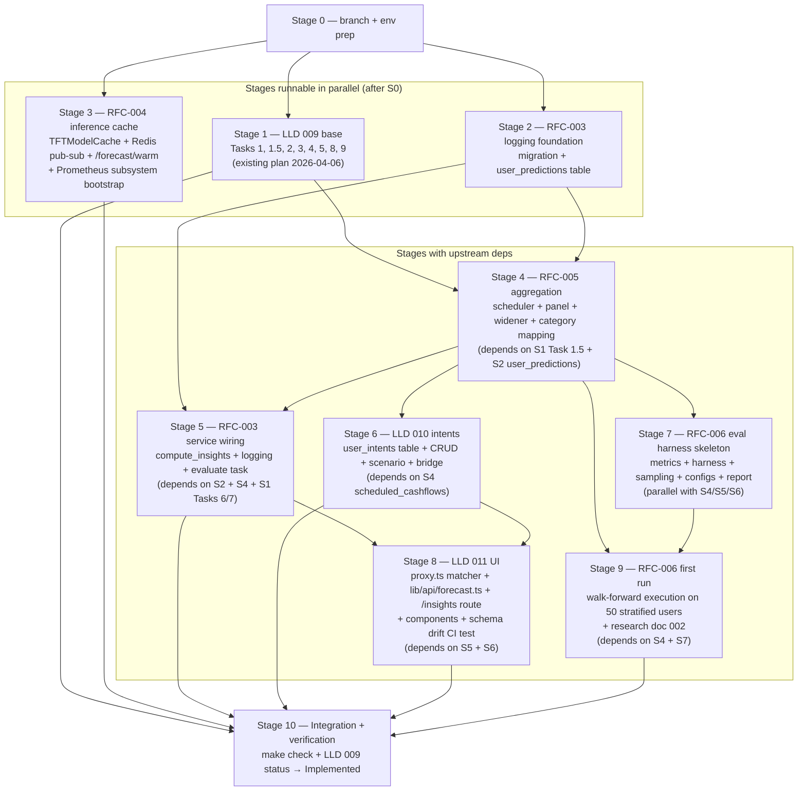

# Prediction Engine v1 — Master Implementation Plan

> **For agentic workers:** REQUIRED SUB-SKILL: `superpowers:subagent-driven-development`.
> Each Stage below is a parallel-safe or dependency-gated unit. Dispatch one subagent per Stage
> under `superpowers:dispatching-parallel-agents` where the dependency column says "parallel".
> Each Stage's authoritative implementation spec is the doc it references — subagents read the
> RFC/LLD and execute per §"Detailed Design" / §"Task" exactly.

**Goal:** Land the full prediction-engine v1 design — LLD 009 base + RFC-003 (schema + logging) + RFC-004 (inference cache) + RFC-005 (aggregation) + RFC-006 (eval harness) + LLD 010 (intents + scenario) + LLD 011 (Insights UI) — onto `main` with `make check` green.

**Non-goal:** production deploy. This plan covers code landing; production rollout is a separate phase once BUG-018 is verified resolved (RFC-004 implementation satisfies this).

**Master status:** `Draft → In Progress` flipped on first stage start; `Implemented` when all stages complete; `Verified` after Phase 4e integration run + RFC-006 first walk-forward documented.

## Stage Dependency Graph

## Stage 0 — branch + env prep

- [ ] Create feature branch `git switch -c feature/prediction-engine-v1`.
- [ ] Verify baseline: `make check` passes on `main`. If not, note pre-existing failures before starting.
- [ ] Verify Supabase local dev stack up via `supabase start`; `supabase migration list` prints existing migrations without error.
- [ ] Read `docs/design/prediction-engine-roadmap.md` §v1 Document Map for the full cross-reference sheet.
- [ ] Commit: nothing to commit; stage is verification only.

## Stage 1 — LLD 009 base implementation

**Spec:** `docs/plans/2026-04-06-prediction-engine.md` Tasks 1, 1.5, 2, 3, 4, 5, 8, 9.
**Deps:** Stage 0.
**Parallel with:** Stage 2, Stage 3.

- [ ] Execute Task 1 (consolidate `prepare_training_data` into `dataset.py` as a panel-ready helper per RFC-005 framing; LLD 009 plan §Task 1).
- [ ] Execute Task 1.5 (import updates in `inference.py` + `trainer.py` + `worker/main.py` + tests).
- [ ] Skip Task 2 hyperparameter bump at 64/4/2 — defer the upgrade to Stage 4, which lands the full RFC-005 target of 128/8/3. Mark Task 2 `SKIPPED per RFC-005` in the plan changelog.
- [ ] Execute Task 3 (Chronos engine) **per RFC-003 Chronos-path quantile expansion**: module-level `QUANTILES = torch.tensor([0.02, 0.1, 0.25, 0.5, 0.75, 0.9, 0.98])`; tests assert all 7 keys.
- [ ] Execute Task 4 (ensemble.py) — blend across all 7 quantiles.
- [ ] Execute Task 5 (augmentation.py) — unchanged.
- [ ] Execute Task 8 (router delegation to service) **per RFC-003 service shape**. `ForecastService.predict` stubbed here; real insights + logging wiring lands in Stage 5.
- [ ] Execute Task 9 (worker duplicate log fix).
- [ ] All tests green. Commits carry `Refs: docs/features/009-prediction-engine.md` per Gate 4.

## Stage 2 — RFC-003 logging foundation

**Spec:** `docs/rfcs/RFC-003-forecast-api-schema-and-prediction-logging.md` §4 only.
**Deps:** Stage 0.
**Parallel with:** Stage 1, Stage 3.

- [ ] Write migration `supabase/migrations/20260418000000_user_predictions.sql` per RFC-003 §4 DDL exactly (table + two indexes + RLS + two policies).
- [ ] Apply migration locally via `supabase db reset` (or equivalent); verify via `\d public.user_predictions` + `pg_policies` query.
- [ ] Add expanded Pydantic schemas (`ForecastPoint` 7-quantile, `VariableImportance`, `QuantileSnapshot`, `LowestBalance`, `ForecastInsights`, `ForecastResponse`, `TrainRequest`, `TrainStatusResponse`) per RFC-003 §1 exactly — including `Annotated[int, Field(ge=1, le=30)]` on horizon and `prediction_id: UUID`.
- [ ] Tests in `apps/api/domains/forecasting/tests/test_schemas.py` cover the **full RFC-003 §1 contract** once in this stage so Stage 5 does not need to revisit: 7-quantile requirement + ordering (p2 ≤ p10 ≤ … ≤ p98); `ForecastInsights` required; `prediction_id` is a valid UUID; `TrainStatusResponse.status` Literal rejection for invalid values; `horizon` Pydantic `Field(ge=1, le=30)` bound. Stage 5 only adds scenario + intent schema tests in separate files.
- [ ] `make test` green on the schema module.
- [ ] Commit. `Refs: docs/rfcs/RFC-003-forecast-api-schema-and-prediction-logging.md`.

## Stage 3 — RFC-004 inference cache + Prometheus subsystem

**Spec:** `docs/rfcs/RFC-004-tft-inference-cache-architecture.md` §Detailed Design 1–5 + 8.
**Deps:** Stage 0.
**Parallel with:** Stage 1, Stage 2.

- [ ] Create `packages/forecasting/cache.py` with `TFTModelCache` + `CachedModel` + `CacheStats` + `get_or_load` + `_inflight` leader-follower pattern + `_download_and_load` full body (not elided — full impl is in the RFC under §1).
- [ ] Create `packages/forecasting/cache_invalidation.py` with `publish_invalidation` + `start_subscriber` + CHANNEL constant + reconnect-on-disconnect loop + out-of-order stale-guard.
- [ ] Create the `TFTModelCache` + subscriber + pub-sub modules but **keep `_MODEL_CACHE`, `load_model`, `invalidate_cache` in `packages/forecasting/inference.py` in place as legacy shims**. The deletion is deferred to Stage 5 after service-layer call-sites have been migrated to `get_or_load`. Stage 3's tests exercise the new cache modules directly; they do not remove the old symbols. This prevents Stage 1 / Stage 3 parallel-safety breakage: Stage 1 Task 1.5 still imports the legacy names until Stage 5 flips both.
- [ ] Wire FastAPI lifespan in `apps/api/main.py`: instantiate `TFTModelCache` + start subscriber + construct `app.state.warm_rate_limiter` via existing `RateLimiter + rate_limit_dependency` pattern.
- [ ] Add `POST /forecast/warm` endpoint in `apps/api/domains/forecasting/router.py` with rate-limit dep.
- [ ] Wire `publish_invalidation(user_id, checkpoint_updated_at)` into `apps/worker/main.py::train_model` AFTER the `training_jobs.status='completed'` DB commit.
- [ ] Add `prometheus-client>=0.20,<1.0` to `apps/api/requirements.txt`.
- [ ] Create `apps/api/core/metrics.py` with `REGISTRY` + factories + **ten** RFC-004 metric singletons (per RFC-004 §Detailed Design 8 table: hits, misses, evictions_total w/ reason label, load_duration_seconds histogram, resident_entries, resident_bytes, pubsub_invalidations, pubsub_invalidations_skipped_stale, pubsub_publish_failures, subscriber_reconnects). Register `GET /metrics/prom` route (distinct from existing `/metrics` JSON route; the existing categorization `/metrics` route is NOT renamed in this stage — rename tracked separately per RFC-004 §Detailed Design 8).
- [ ] Tests: `test_cache.py` (LRU, byte cap, TTL, single-flight Future, invalidation, stats), `test_cache_invalidation.py` (fakeredis, stale-guard, reconnect), `test_warm_endpoint.py`, `test_train_publishes_invalidation.py`.
- [ ] `make test` green.
- [ ] Commit. `Refs: docs/rfcs/RFC-004-tft-inference-cache-architecture.md` + `Refs: docs/bugs/BUG-018-tft-inference-cold-load-no-bounded-cache.md`. Bump BUG-018 Status `Root Cause Found → Fix Applied`.

## Stage 4 — RFC-005 aggregation strategy

**Spec:** `docs/rfcs/RFC-005-aggregation-strategy-three-tier-data-separation.md` §Detailed Design 1–5.
**Deps:** Stage 1 (Task 1.5 consolidation), Stage 2 (user_predictions table exists for RFC-005 pinball computation reference in harness later).

- [ ] Write migration `supabase/migrations/20260418200000_scheduled_cashflows.sql` per RFC-005 §Data Model Changes.
- [ ] Create `packages/forecasting/scheduler.py`: `CATEGORY_BUCKETS` constant + `RecurrenceRule` dataclass + `detect_recurring_cashflows` + `project_scheduled_cashflows`. Also extract `CATEGORY_BUCKETS` into `packages/forecasting/buckets.py` to prevent circular import w/ category_mapping (M4 from RFC-005 review).
- [ ] Create `packages/forecasting/category_mapping.py` with `CLASSIFIER_LABEL_TO_BUCKET` enumerating every `Category` enum value from `packages/categorization/constants.py` (per RFC-005 H1 implementation note; route `Insurance` / `Taxes` / `Bank Fees` / `Home Maintenance` to `"other"`). Add mapping-validator test `test_category_mapping.py::test_every_classifier_label_maps` asserting 100% coverage.
- [ ] Verify `fetch_user_transactions` in `packages/forecasting/trainer.py` projects merchant column; if not, extend projection per RFC-005 H2.
- [ ] Rewrite `packages/forecasting/dataset.py::aggregate_daily` → `aggregate_daily_panel` per RFC-005 §3. Include `scheduled_event_amount` per-(date, bucket) via zero-fill join against projected scheduled cashflows. **Preserve** `prepare_training_data` as an orchestration shim that now internally calls `aggregate_daily_panel` + emits the panel shape; no callers are broken. All callers (trainer.py, inference.py, worker/main.py) are audited in this stage to confirm they consume the new panel output shape correctly; update tests accordingly.
- [ ] Update `create_timeseries_dataset` with panel `group_ids=["user_id", "category_bucket"]`. Update `target="closing_balance"` duplicated across group rows.
- [ ] Update `packages/forecasting/tft_model.py` defaults to RFC-005 table: `hidden_size=128, attention_head_size=8, lstm_layers=3, hidden_continuous_size=64`.
- [ ] Create `packages/forecasting/stochastic_widener.py` with `compute_bucket_volatility` + `widen_intervals` per RFC-005 §Layer 4.
- [ ] Wire scheduler detection into `apps/worker/main.py::train_model` before `prepare_training_data` call; upsert `scheduled_cashflows` rows with source='heuristic'.
- [ ] Tests: `test_scheduler.py`, `test_category_mapping.py`, `test_dataset_panel.py`, `test_stochastic_widener.py`, updates to `test_trainer.py` + `test_model.py`.
- [ ] `make test` green.
- [ ] Commit. `Refs: docs/rfcs/RFC-005-aggregation-strategy-three-tier-data-separation.md`.

## Stage 5 — RFC-003 service wiring + evaluation task

**Spec:** `docs/rfcs/RFC-003-forecast-api-schema-and-prediction-logging.md` §2, §3, §3b, §5 + LLD 009 plan Task 6.5, Task 10.5.
**Deps:** Stage 2, Stage 4.

- [ ] Create `packages/forecasting/insights.py` with `INSIGHTS_VERSION: str = "v1"` + `derive_floor` + `compute_insights` + `_safe_default_insights`. Integrate `widen_intervals` call inside `compute_insights` per RFC-005 Layer 4 integration surface.
- [ ] TDD tests in `test_insights.py` matching the 17 test-function list in the implementation plan `2026-04-06-prediction-engine.md::Task 6.5`.
- [ ] Wire `ForecastService.predict`: tier routing + insights + `uuid4()` prediction_id + hour-bucket dedup + fire-and-forget INSERT into `user_predictions`. Wrap `compute_insights` in guard with fallback to `_safe_default_insights`. Use user-scoped Supabase client (per RFC-003 §4 INSERT RLS policy `users insert own predictions`).
- [ ] Add `GET /forecast/predict` route per LLD 009 plan Task 8 (needed by LLD 011 UI; POST remains for CSV upload path). **Override** the pre-existing plan's `horizon: int = Query(30, ge=1, le=90)` to `horizon: int = Query(30, ge=1, le=30)` on BOTH the new GET and the existing POST — this matches RFC-003's `Annotated[int, Field(ge=1, le=30)]` cap. Both POST and GET share the same `ForecastService.predict` call path; service-layer insight/logging is identical; the POST CSV-upload dedup path (`uploaded_files` row insert) is NOT replicated on GET.
- [ ] Update `router.py` POST `/forecast/predict` `response_model=ForecastResponse` reference to the NEW RFC-003 `ForecastResponse` (the expanded Pydantic class landed in Stage 2). Existing Stage 1 Task 8 commits the thin delegation; Stage 5 bumps the response_model annotation + horizon cap.
- [ ] **Delete** `_MODEL_CACHE`, `load_model`, `invalidate_cache` from `packages/forecasting/inference.py` (shims kept in place in Stage 3 are removed here now that the service layer no longer calls them). Migrate `_download_and_load` body into `packages/forecasting/cache.py` if not already done by Stage 3. Add regression test `test_inference_module_exports_bounded_cache_not_raw_dict` per BUG-018 §Regression Prevention.
- [ ] Tests: `test_service.py` (tier routing) + `test_service_logging.py` (INSERT happens on first call per hour, dup skipped within hour, 200 returned on INSERT failure, prediction_id is valid UUID even when INSERT fails).
- [ ] Create `apps/api/core/tasks/evaluate_predictions.py` — Celery beat task `evaluate_past_predictions`. Atomic `UPDATE ... FROM claimable ... RETURNING` claim-and-fetch per RFC-003 §5, PLUS per-row UPDATE populating `actual_outcomes` + `mape` + `pinball_loss` after metric computation (two-pass: claim first → compute → fill). Pinball-loss impl validated against `sklearn.metrics.mean_pinball_loss` in `test_evaluate_predictions.py`.
- [ ] Register beat entry in `apps/api/celery_app.py`: `include=[..., "apps.api.core.tasks.evaluate_predictions"]` + `beat_schedule["evaluate-past-predictions"] = {"task": "evaluate_past_predictions", "schedule": 86400}`. Preserve existing `cleanup-stale-training-jobs` entry.
- [ ] `make test` green.
- [ ] Commit. `Refs: docs/rfcs/RFC-003-forecast-api-schema-and-prediction-logging.md` + `Refs: docs/features/009-prediction-engine.md`.

## Stage 6 — LLD 010 intents + scenario

**Spec:** `docs/features/010-user-intents-and-scenario-forecasting.md` §Design (Architecture / Data Flow + Domain Model + Bridge + LIFE_EVENT Propagation + Scenario Endpoint Design + Component Architecture) + §Database Changes.
**Deps:** Stage 4 (scheduled_cashflows table exists).
**Parallel with:** Stage 5 after Stage 4 lands.

- [ ] Migration 1: `supabase/migrations/20260418300000_user_intents.sql` per LLD 010 §Database Changes (table + RLS policies + CHECK constraints + `updated_at` trigger + `savings_goal_has_end_date` CHECK).
- [ ] Migration 2: `supabase/migrations/20260418300001_scheduled_cashflows_source_rule_id.sql` adding FK column.
- [ ] Apply both locally + verify cascade semantics.
- [ ] Extend Pydantic schemas in `apps/api/domains/forecasting/schemas.py` per LLD 010 §Domain Model: `IntentType` + `IntentConfidence` enums + `UserIntent` + `IntentCreateRequest` + `IntentUpdateRequest` + `ScenarioRequest` + `ScenarioDelta` + `ScenarioResponse` (direct `ForecastResponse` reference, ordered-after — no forward-ref string).
- [ ] Create `packages/forecasting/intent_bridge.py`: `CONFIDENCE_COVARIATE_WEIGHT` constant + `should_have_bridge_row` + `intent_to_scheduled_cashflow_row` per LLD 010 §Bridge. Document source-of-truth split (user_intents.amount raw, scheduled_cashflows.amount weighted).
- [ ] Create `apps/api/domains/forecasting/intents_service.py`: CRUD + bridge orchestration. Transactional insert (user_intents + scheduled_cashflows in one BEGIN/COMMIT via Supabase RPC).
- [ ] Add 6 routes in `router.py`: POST/GET/GET{id}/PATCH/DELETE `/forecast/intents/*` + POST `/forecast/scenario`. Rate-limit: 20/min for intent CRUD, 5/min for scenario.
- [ ] Wire LIFE_EVENT + (low|medium confidence) intents into `ForecastService.predict`'s `widen_intervals(active_intents=...)` call per LLD 010 §LIFE_EVENT Propagation.
- [ ] Implement `ForecastService.scenario_predict(user_id, excludes, ephemeral)` per LLD 010 §Scenario Endpoint. Parallel A/B forecast via `asyncio.gather`. Compute `ScenarioDelta` field-by-field.
- [ ] Tests: `test_intent_schemas.py`, `test_intent_bridge.py`, `test_intents_service.py`, `test_scenario.py`, `test_intents_cascade.py` (contract test asserting auth.users delete cascades through both tables).
- [ ] `make test` green.
- [ ] Commit. `Refs: docs/features/010-user-intents-and-scenario-forecasting.md`.

## Stage 7 — RFC-006 harness skeleton

**Spec:** `docs/rfcs/RFC-006-forecast-evaluation-harness.md` §Detailed Design 1–7 (module layout, CLI contract, fold protocol, training configs, metrics module, stratified sampling, report rendering). §8 Execution model is run-time policy, not code.
**Deps:** Stage 4 (harness uses aggregate_daily_panel).
**Parallel with:** Stage 5, Stage 6.

- [ ] Create `packages/forecasting/eval/` sub-package with `__init__.py`, `metrics.py`, `harness.py`, `sampling.py`, `configs.py`, `report.py`, `tests/` dir.
- [ ] Implement `metrics.py` per RFC-006 §5 with golden tests against `sklearn.metrics.mean_pinball_loss`.
- [ ] Implement `configs.py` with `DEFAULT` and `GROKKING` `TrainingConfig` presets.
- [ ] Expand `packages/forecasting/trainer.py::run_training` kwargs: add `weight_decay`, `batch_size`, `learning_rate`; preserve `enriched_df` and `early_stop_patience` (no breaking renames). Harness maps `TrainingConfig.patience → run_training(early_stop_patience=...)`.
- [ ] Implement `harness.py` fold loop (expanding + rolling) + `sampling.py` stratified 50-user sample + `report.py` threshold evaluation + markdown rendering.
- [ ] CLI entrypoint `scripts/walk_forward_eval.py` with `run` + `diff` subcommands.
- [ ] Tests: `test_metrics.py`, `test_harness.py`, `test_sampling.py`, `test_report.py` + end-to-end synthetic smoke.
- [ ] `make test` green.
- [ ] Commit. `Refs: docs/rfcs/RFC-006-forecast-evaluation-harness.md`.

## Stage 8 — LLD 011 UI

**Spec:** `docs/features/011-ai-insights-page.md` §Design + §Component Specifications + §Data-fetching Contract.
**Deps:** Stage 5 (service layer produces ForecastResponse), Stage 6 (intents + scenario endpoints exist).

- [ ] Extend `apps/web/proxy.ts` matcher to include `/insights/:path*`. Extend `apps/web/lib/supabase/middleware.ts` auth gate to treat `/insights` as a protected route (rename the flag to `isProtectedRoute` for clarity per LLD 011 §In Scope).
- [ ] Create `apps/web/lib/api/forecast.ts` + `apps/web/lib/api/forecast.types.ts` with hand-written types mirroring RFC-003 + LLD 010 Pydantic shapes.
- [ ] Create `apps/web/lib/api/forecast.schema.json` — checked-in JSON-Schema snapshot generated from the Pydantic models (one-off CLI: `python -c "from apps.api.domains.forecasting.schemas import ForecastResponse, ...; ..."` producing the schema file).
- [ ] Create Python CI test `apps/api/domains/forecasting/tests/test_frontend_schema_drift.py` asserting Pydantic → JSON-Schema equals the committed file.
- [ ] Rename existing `apps/web/lib/api/client.ts::ForecastResponse` → `LegacyForecastResponse` + `@deprecated` JSDoc.
- [ ] Create `apps/web/app/insights/page.tsx` all-client (`'use client'`) + `loading.tsx` + `error.tsx`.
- [ ] Create 9 components under `apps/web/app/insights/components/` per LLD 011 §Component Specs: BalanceForecastChart (recharts fan chart), SafeToSpendCard, MonthEndSnapshot, OverdraftRiskBadge, ConfidenceBadge, PrimaryDrivers, ScenarioImpactCard, AddPlanModal (framer-motion, not shadcn), ColdStartBanner, WarmTrigger (module-level `fired` sentinel).
- [ ] Feature-key → human-label map in `forecast.ts` for `PrimaryDrivers` (enumerate keys emitted by RFC-005 panel TFT VSN).
- [ ] Cap `upcomingIntents(intents, 10)` helper on the /insights page.
- [ ] Vitest tests for every component's 3 states. Playwright + axe-core accessibility smoke at `apps/web/e2e/insights.spec.ts`.
- [ ] `make test-fe` green. `cd apps/web && npm run lint && npx tsc --noEmit` clean.
- [ ] Commit. `Refs: docs/features/011-ai-insights-page.md`.

## Stage 9 — RFC-006 first run + research doc

**Spec:** `docs/rfcs/RFC-006-forecast-evaluation-harness.md` §Phase 7.
**Deps:** Stage 4 (panel aggregator), Stage 7 (harness code).

- [ ] Run `.venv/bin/python -m scripts.walk_forward_eval run --users stratified:50 --window both --config default --output docs/research/runs/2026-04-18-default.json`.
- [ ] Run the same with `--config grokking`.
- [ ] Run diff: `.venv/bin/python -m scripts.walk_forward_eval diff --a ... --b ... --render docs/research/002-walk-forward-baseline.md`.
- [ ] Spec review the research doc (new research docs require review per the project's standards).
- [ ] Commit. `Refs: docs/rfcs/RFC-006-forecast-evaluation-harness.md`.

## Stage 10 — Integration + verification

**Deps:** all prior stages.

- [ ] Full repo `make check` green (lint + tsc + pytest).
- [ ] Smoke test: `make dev`, hit `GET /api/v1/forecast/predict?horizon=30` as a test user. Verify response carries all 7 quantiles + `insights` sub-object + `prediction_id` UUID. Inspect `SELECT * FROM public.user_predictions WHERE user_id = '<uuid>' ORDER BY generated_at DESC LIMIT 1` returns the logged row.
- [ ] Smoke test: `POST /api/v1/forecast/intents` creates a LIFE_EVENT intent. `GET /api/v1/forecast/predict` reflects widened intervals. `POST /api/v1/forecast/scenario { intent_ids_to_exclude: [id] }` returns non-zero `ScenarioDelta`.
- [ ] Smoke test: trigger retraining via admin-level Supabase RPC or test seed. Verify `publish_invalidation` fires after `status='completed'` commit (check worker logs). Verify subscriber receives + evicts cache entry (check structlog).
- [ ] Verify `GET /metrics/prom` returns Prometheus exposition format with all nine RFC-004 metrics.
- [ ] Browser smoke: navigate to `/insights` as authenticated user. Verify 7 components render. Open AddPlanModal, create one of each of 7 intent types. Verify Scenario Impact Card toggle updates delta.
- [ ] Update LLD 009 `Status: Draft → Implemented`. Update RFC-003 / RFC-004 / RFC-005 / RFC-006 / LLD 010 / LLD 011 `Status: Proposed|Draft → Implemented`. Add changelog entries on each.
- [ ] Dispatch `superpowers:code-reviewer` on the combined doc-status-update bundle per Documentation Gate 3 (`.claude/rules/documentation-gate.md`). Single review pass is acceptable since the status flip is mechanical and the per-doc changelog entries are summary lines. Fix any issues found before committing.
- [ ] Commit. `Refs: docs/plans/2026-04-17-prediction-engine-v1-master.md`.

## Deployment Gate (separate from this plan)

Per RFC-004 §Success Metrics and LLD 011 Deployment Gate, flipping to `Verified` status + production rollout requires:

- Stage 9 results show grokking config decision recorded.
- Stage 3 Prometheus metrics live in production scrape config.
- BUG-018 verified fixed via `TFTModelCache` running in prod with resident-bytes gauge < 80% of ceiling.
- FE `POST /forecast/warm` call landed in production frontend deploy.

This plan does NOT cover production deployment. That is a separate post-merge checklist tracked via `docs/policies/deployment-checklist.md` (or similar) once the prediction engine is the next feature to roll out.

## Tracking

Each Stage's checkboxes are updated in-place during execution. A subagent executing Stage N writes the stage's completion notes (commit hashes, test counts, any DEVIATION entries to relevant RFCs/LLDs) into this plan's Stage section before flipping to the next Stage.

## Related Documents

- `docs/design/prediction-engine-roadmap.md` — the v1 boundary this plan implements
- LLD 009 + RFC-003 through RFC-006 + LLD 010 + LLD 011 + BUG-018 — per-Stage authoritative specs
- `docs/plans/2026-04-06-prediction-engine.md` — pre-existing plan; Stage 1 executes its tasks in updated form; after this master plan merges, that plan is effectively superseded (its §Task 2 hyperparameter bump is skipped in favour of Stage 4's RFC-005 target; its §Task 6 schemas are superseded by Stage 2 + Stage 5 scope)

## Changelog

| Date | Entry |
|---|---|
| 2026-04-17 | Initial draft. Master plan consolidates LLD 009 + RFC-003 through RFC-006 + LLD 010 + LLD 011 + BUG-018/RFC-004 into 11 Stages (0–10) with explicit dependency DAG. Stages 1/2/3 runnable in parallel after Stage 0. Stages 4–9 serialise via data-model + service-layer deps. Stage 10 is integration verification. Deployment gate explicitly out of scope; tracked separately. Each Stage references its authoritative RFC/LLD spec rather than duplicating implementation detail. |
| 2026-04-17 | Spec review fixes: C1 RFC-006 §Detailed Design range corrected to 1–7 (includes report rendering). C2 LLD 010 spec reference corrected to `§Design + §Database Changes` (LLD uses `## Design`, not `## Detailed Design`). C3 RFC-004 metric count corrected 9 → 10 (per RFC-004 §8 table). H1 Stage 2 now carries the full RFC-003 §1 contract tests so Stage 5 owns only scenario + intent schema tests. H2 Stage 5 now explicitly bumps `/forecast/predict` POST response_model to the new `ForecastResponse`, overrides `horizon le=90` → `le=30` on both GET and POST, and documents GET/POST sharing the same service-call-path (GET skips CSV upload dedup). H3 `_MODEL_CACHE` deletion moved from Stage 3 to Stage 5 after service-layer migration, preventing parallel-safety breakage; Stage 3 keeps legacy shims in place. H4 Stage 4 explicitly preserves `prepare_training_data` as an orchestration shim over `aggregate_daily_panel` to avoid breaking Stage 1's trainer imports. H5 Stage 5 GET endpoint contract documented. M4 Stage 10 now dispatches `superpowers:code-reviewer` on the doc-status-update bundle per Gate 3. M6 evaluate task two-pass (claim first → compute → fill) explicit. |
