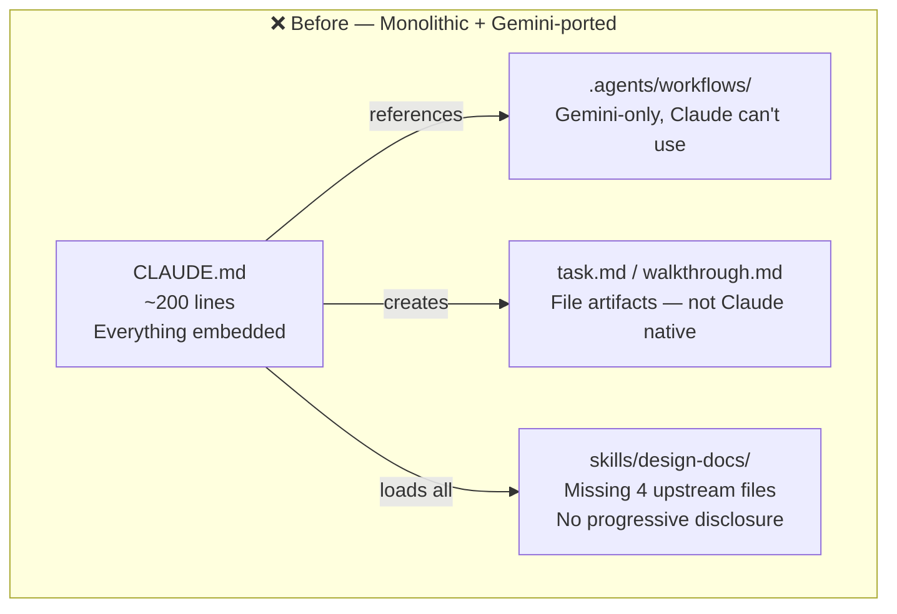
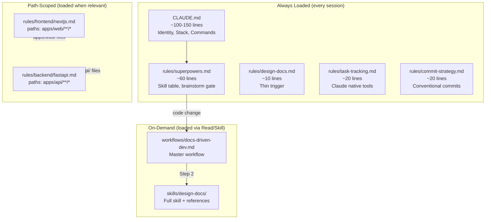

# RFC-001: CLAUDE.md Rewrite + Design-Docs Skill Update

> **Doc ID:** RFC-001-claude-md-rewrite
> **Date:** 2026-03-07
> **Status:** Implemented
> **DRI:** Hassan
> **OKR Alignment:** Developer velocity — reduce agent friction and enforce consistent workflow discipline

## Problem Statement

The current `.claude/CLAUDE.md` was ported from `GEMINI.md` and has fundamental incompatibilities with Claude Code's native tooling:

1. **Wrong skill-loading paradigm** — References manual file reads for superpowers skills; Claude Code uses the `Skill` tool for plugin skills.
2. **Gemini artifacts** — References `task.md`, `implementation_plan.md`, `walkthrough.md` which don't exist in Claude Code.
3. **No brainstorming gate** — No project-level rule reinforcing `superpowers:brainstorming` before creative work.
4. **Broken artifact mapping** — CLAUDE.md paths conflict with the design-docs skill paths.
5. **Design-docs skill gaps** — Missing progressive disclosure, error recovery, and validation pipeline from the original `design-doc-mermaid` repo.
6. **`.agents/` dependency** — CLAUDE.md references `.agents/workflows/` which is Gemini-only territory.

## Before State

The configuration before this RFC — monolithic CLAUDE.md with Gemini artifacts:



## Proposed Solution

### Architecture: Master CLAUDE.md + Modular Rules



### Files to Create / Modify

| File | Action | Description |
|---|---|---|
| `.claude/CLAUDE.md` | **Rewrite** | Thin master: identity, stack, commands, structure |
| `.claude/rules/superpowers.md` | **New** | Skill table, brainstorming gate, anti-drift |
| `.claude/rules/design-docs.md` | **New** | Thin trigger for design-docs skill |
| `.claude/rules/task-tracking.md` | **New** | TaskCreate/Update/List rules, artifact mapping |
| `.claude/rules/commit-strategy.md` | **New** | Conventional commits, when to commit |
| `.claude/rules/frontend/nextjs.md` | **New** | Path-scoped Next.js conventions |
| `.claude/rules/backend/fastapi.md` | **New** | Path-scoped FastAPI conventions |
| `.claude/workflows/docs-driven-dev.md` | **New** | Claude-native master workflow |
| `.claude/skills/design-docs/SKILL.md` | **Rewrite** | Progressive disclosure decision tree |
| `.claude/skills/design-docs/references/troubleshooting.md` | **Restore** | 28 Mermaid error fixes |
| `.claude/skills/design-docs/references/resilient-workflow.md` | **Restore** | Validation pipeline |
| `.claude/skills/design-docs/scripts/resilient_diagram.py` | **Restore** | Automated validation |
| `.claude/skills/design-docs/scripts/mermaid_to_image.py` | **Restore** | PNG/SVG rendering |

### Skill Table (in rules/superpowers.md)

| Situation | How | Target |
|---|---|---|
| Any code change (master) | Read | `.claude/workflows/docs-driven-dev.md` |
| Brainstorming | `Skill` tool | `superpowers:brainstorming` |
| Design docs (LLD/HLD) | Read all files | `.claude/skills/design-docs/` |
| Implementation plans | `Skill` tool | `superpowers:writing-plans` |
| TDD execution | `Skill` tool | `superpowers:test-driven-development` |
| Execute plan | `Skill` tool | `superpowers:executing-plans` |
| Debugging | `Skill` tool | `superpowers:systematic-debugging` |
| Parallel tasks | `Skill` tool | `superpowers:dispatching-parallel-agents` |
| Verification | `Skill` tool | `superpowers:verification-before-completion` |
| Code review | `Skill` tool | `superpowers:requesting-code-review` |
| Branch isolation | `Skill` tool | `superpowers:using-git-worktrees` |
| Creating/editing skills | `Skill` tool | `superpowers:writing-skills` |
| Next.js / React | `Skill` tool | `fullstack-dev-skills:nextjs-developer` |
| Python / FastAPI | `Skill` tool | `fullstack-dev-skills:fastapi-expert` |
| Database / Postgres | `Skill` tool | `fullstack-dev-skills:postgres-pro` |
| TypeScript | `Skill` tool | `fullstack-dev-skills:typescript-pro` |
| Full-stack feature | `Skill` tool | `fullstack-dev-skills:fullstack-guardian` |
| Security review | `Skill` tool | `fullstack-dev-skills:secure-code-guardian` |
| CI/CD pipelines | `Skill` tool | `ci-cd:ci-cd` |
| Monitoring / SLOs | `Skill` tool | `monitoring-observability:monitoring-observability` |

### Artifact Mapping

| What | Where |
|---|---|
| Task tracking | `TaskCreate` / `TaskUpdate` / `TaskList` |
| Feature LLD | `docs/features/NNN-name.md` |
| Bug reports | `docs/bugs/BUG-NNN-name.md` |
| RFCs | `docs/rfcs/RFC-NNN-name.md` |
| HLD (living docs) | `docs/design/*.md` |
| Session state | auto memory (`MEMORY.md`) |
| **NEVER create** | `task.md`, `implementation_plan.md`, `walkthrough.md`, `docs/plans/` |

### Brainstorming Gate Rule

> Before any feature, bug fix, architectural decision, or ambiguous request: invoke `superpowers:brainstorming`. Run as many rounds as the user needs — no fixed limit. Skip only if: (a) the request is purely a question with no code change implied, OR (b) the task is trivially scoped (rename, typo fix). When in doubt, brainstorm.

### docs-driven-dev Pipeline (Claude-native)

```
Step 1: Brainstorm → superpowers:brainstorming (IS step 1, not separate)
Step 2: Document  → Read .claude/skills/design-docs/ (LLD/HLD/bug/RFC)
Step 3: Plan      → superpowers:writing-plans (saves to docs/ subdir)
Step 4: Execute   → superpowers:test-driven-development + executing-plans
Step 5: Verify    → superpowers:verification-before-completion
Step 6: Commit    → Conventional commits, HLD sync check
```

### Design-Docs Skill Update

**Restore from original `design-doc-mermaid`:**

- `references/troubleshooting.md` — 28 Mermaid error fixes
- `references/resilient-workflow.md` — validation pipeline
- `scripts/resilient_diagram.py` — automated validation + image gen
- `scripts/mermaid_to_image.py` — PNG/SVG rendering

**Keep SCALE custom:**

- `references/doc-standards.md` — LLD/HLD quality checklists
- `references/hld-sync-protocol.md` — LLD-to-HLD sync protocol
- All 8 templates (feature-lld, bug-report, rfc, + 5 design templates)
- `scripts/next_doc_number.sh` — auto-numbering
- `scripts/extract_mermaid.py` — diagram extraction

**Rewrite SKILL.md with progressive disclosure:**

- Decision tree routes to specific guides on demand
- Only loads what's needed per request (~2KB vs ~50KB)
- Merges doc-centric workflow with original's hierarchical architecture

### Progressive Disclosure Levels

```
Level 1: rules/design-docs.md (~10 lines, always loaded)
  → "Before writing code, invoke design-docs skill"

Level 2: skills/design-docs/SKILL.md (~200 lines, loaded on invoke)
  → Decision tree, process overview, quick reference

Level 3: skills/design-docs/references/ (loaded per decision tree)
  → Only the specific guide needed for the current task
```

## Alternatives Considered

1. **Convert design-docs to a plugin** — Rejected. Too much packaging overhead for a project-specific skill with custom templates.
2. **Embed everything in CLAUDE.md** — Rejected. Would exceed 200-line recommendation and reduce adherence.
3. **Keep referencing `.agents/` workflows** — Rejected. Creates conflicts between Gemini and Claude Code agents.

## Impact Assessment

- **CLAUDE.md**: Complete rewrite. Old version fully replaced.
- **`.claude/rules/`**: New directory with 6 rule files.
- **`.claude/workflows/`**: New directory with 1 workflow file.
- **`.claude/skills/design-docs/`**: SKILL.md rewritten, 4 files restored from original repo.
- **No code changes**: This RFC only affects agent configuration, not application code.

## Success Metrics

| Metric | Before | After |
|---|---|---|
| CLAUDE.md line count | ~200 lines (bloated) | ~75 lines (thin master) |
| Always-loaded context | 1 file, ~200 lines | 6 files, ~210 lines (modular) |
| Plugin skills mapped | 0 | 22 situations → skill |
| Design-docs upstream files | Missing 4 | All restored |
| Progressive disclosure | None (load-all) | 3-level decision tree |
| `.agents/` references in Claude config | 6+ | 0 |

## Timeline

| Phase | Date | Deliverable |
|---|---|---|
| Brainstorm + design | 2026-03-07 | RFC-001 written, approach approved |
| Implementation | 2026-03-07 → 2026-03-08 | All 8 tasks executed (see RFC-001-implementation-plan.md) |
| Verification + commit | 2026-03-08 | Committed as `cd63a8e` — 29 files, 8107 insertions |

## Decision

> **Decision:** Approved
> **Date:** 2026-03-07
> **Rationale:** Eliminates Gemini/Claude config conflicts, enforces brainstorming gate, restores missing upstream files, reduces CLAUDE.md to manageable size.

---

## Changelog

| Date | Change |
|---|---|
| 2026-03-07 | Initial draft, decision Approved |
| 2026-03-08 | Implemented — CLAUDE.md rewritten, 6 rule files created, design-docs skill restored, committed cd63a8e |
