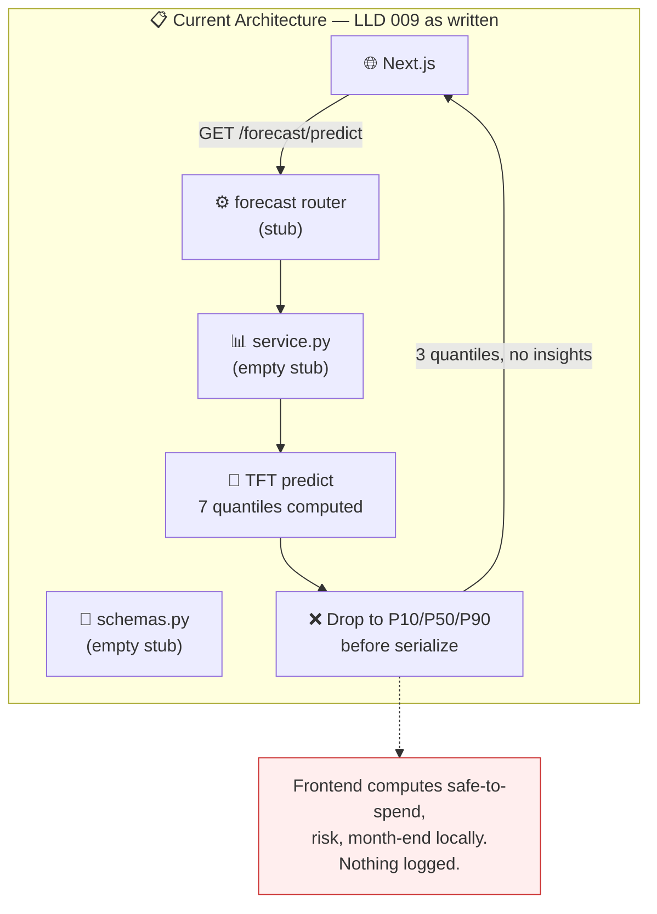
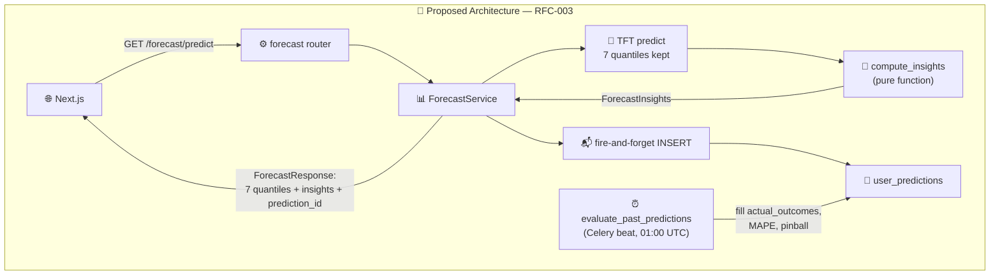
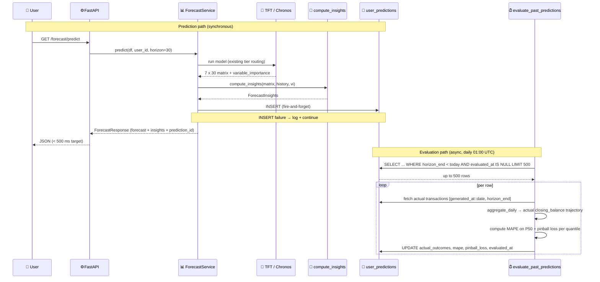

# RFC-003: Forecast API Schema Expansion + Prediction Logging

> **Doc ID:** RFC-003-forecast-api-schema-and-prediction-logging
> **Date:** 2026-04-17
> **DRI:** Mohammed Hassan Mohiddin
> **Status:** Implemented
> **OKR Alignment:** Q2 2026 — "Ship a forecast product that users understand and act on" (requires honest uncertainty display + actionable derived metrics). Enables measurability of the < 500 ms latency SLO and the eventual model-quality SLO.

## Problem Statement

Feature LLD `docs/features/009-prediction-engine.md` specifies a forecast API response
(`ForecastResponse`) whose `ForecastPoint` exposes only three quantiles (P10, P50, P90),
contains no derived insights (safe-to-spend, overdraft risk, month-end snapshot, primary
drivers), and commits no prediction to persistent storage for subsequent evaluation. Three
concrete consequences follow:

1. **Hidden signal.** The current TFT configuration uses `QuantileLoss(output_size=7)` —
   the model already computes P2/P25/P75/P98 during every forward pass. The API discards
   them. The fan-chart UI component planned on the AI Insights page cannot render the
   outer-confidence band; scenario comparison cannot surface tail-risk deltas; calibration
   assessment cannot test the outer quantiles. Information is produced, used for loss, and
   thrown away at the serialization boundary.
2. **Financial math pushed to the frontend.** With only three raw quantiles returned, the
   Next.js layer would have to compute safe-to-spend, overdraft risk, month-end snapshot,
   monthly spend/income totals, and primary-driver ranking. This scatters identical logic
   across every UI component, breaks on unit tests of server behaviour, and guarantees
   divergence between mobile/web clients if SCALE adds one later.
3. **No prediction audit trail.** Because no prediction is persisted, there is no data to
   power walk-forward validation (the correct primary evaluation method, per the Cowork
   brainstorming session), no data to drive shadow-mode drift monitoring, no data to back
   a future counterfactual-aware model, and no way to diagnose a regression claim like
   "my forecast was wrong last month". The latency SLO in the LLD (`< 500 ms`) and the
   implicit accuracy SLO become unmeasurable in production.

If this is not solved now, the cost is compounding: every month of shipped forecasting
without a prediction log is a month of missing training data for v2/v3 features
(counterfactual modelling, intervention-aware training). Those features require
~12–18 months of matched prediction-outcome pairs to even begin. Logging must be turned on
day 1 of the forecast feature's life or the data never exists.

## Proposed Solution

### Overview

Expand the forecast API contract to expose all 7 TFT quantiles per day (upgrading the
Chronos-2 engine to emit the same 7-quantile set so both tiers satisfy one contract) and
introduce a nested `ForecastInsights` sub-object containing ten server-computed derived
fields. Add a single new table `public.user_predictions` that logs every prediction
(fire-and-forget insert) with its full 7×30 quantile matrix, derived insights snapshot,
and a `shown_to_user` flag reserved for future shadow-mode rollout. Add a new periodic
task `evaluate_past_predictions` **registered on the existing Celery beat schedule at
`apps/api/celery_app.py`** (alongside the existing `cleanup-stale-training-jobs`) that
fills `actual_outcomes`, MAPE, and pinball loss at each prediction's horizon end — no new
worker infrastructure introduced. Logic for deriving insights lives in a new pure-Python
module `packages/forecasting/insights.py` so it is unit-testable in isolation from
service, database, and HTTP layers.

**Worker-pattern clarification:** LLD 009's spec review (changelog C1, line 378) rejected
using Celery `.delay()` to enqueue per-user **training jobs** — those remain owned by the
hand-rolled polling worker `apps/worker/main.py` because it already owns the
`training_jobs` state machine. **This RFC does not revisit that decision.** The
evaluation task is a periodic batch scan, not a per-user queued job, and matches the
existing `cleanup-stale-training-jobs` beat pattern at
`apps/api/core/tasks/maintenance_tasks.py`. Two distinct patterns coexist in the repo
today, each fit for a different workload.

Scenario comparison, user-configurable floors, shadow-mode holdouts, intervention
detection, and the AI Insights frontend are explicitly out of scope and deferred to
v1.5+.

### Architecture (Current → Proposed)

**Current State:**



**Proposed State:**



### Detailed Design

#### 1. Pydantic Schema — `apps/api/domains/forecasting/schemas.py`

```python
from typing import Annotated, Literal
from uuid import UUID
from pydantic import BaseModel, Field

class ForecastPoint(BaseModel):
    """One predicted day's full 7-quantile distribution.

    All 7 quantiles are required floats. Both tiers (TFT-Hybrid and
    Chronos-2) emit the same 7-quantile set; see §"Chronos-path quantile
    expansion" below for the Chronos engine upgrade that makes this true.
    """
    date: str                                 # "YYYY-MM-DD"
    p2:  float
    p10: float
    p25: float
    p50: float
    p75: float
    p90: float
    p98: float

class VariableImportance(BaseModel):
    """One `(feature, weight)` pair from the TFT Variable Selection Network.

    Used both for the full `ForecastResponse.variable_importance` list (every
    feature the VSN reports) and for the top-3 subset surfaced in
    `ForecastInsights.primary_drivers`. Empty for Chronos-only forecasts.
    """
    feature: str
    weight:  float

class QuantileSnapshot(BaseModel):
    p10: float
    p50: float
    p90: float

class LowestBalance(BaseModel):
    date: str
    p10:  float
    p50:  float

class ForecastInsights(BaseModel):
    lowest_balance:           LowestBalance
    month_end:                QuantileSnapshot    # day 30 of horizon (rolling, not calendar)
    predicted_monthly_spend:  float               # sum of negative P50 daily deltas over horizon
    predicted_monthly_income: float               # sum of positive P50 daily deltas over horizon
    confidence_band_width:    float               # mean (P90 - P10) across horizon
    primary_drivers:          list[VariableImportance]  # top 3 from VSN by weight desc; empty list when model_type == "chronos2"
    safe_to_spend:            float               # largest spend such that all P10 days >= floor_used
    overdraft_risk_score:     float               # fraction of horizon days with P10 < floor_used, range [0, 1]
    floor_used:               float               # floor value applied
    floor_source:             Literal["auto_p10_history", "user_override"]

class ForecastResponse(BaseModel):
    """Full forecast payload returned by both predict endpoints."""
    forecast:            Annotated[list[ForecastPoint], Field(min_length=1, max_length=30)]
    model_type:          Literal["chronos2", "tft_hybrid", "ensemble"]
    model_version:       str
    horizon:             Annotated[int, Field(ge=1, le=30)]
    confidence:          Literal["low", "medium", "high"]
    variable_importance: list[VariableImportance] | None
    insights:            ForecastInsights
    prediction_id:       UUID    # generated in ForecastService BEFORE fire-and-forget INSERT

class TrainRequest(BaseModel):
    force: bool = False

class TrainStatusResponse(BaseModel):
    status:          Literal["no_model", "pending", "claimed", "processing", "completed", "failed"]
    last_trained:    str | None = None
    checkpoint_path: str | None = None
    training_days:   int | None = None
```

**Chronos-path quantile expansion (C2 fix):** LLD 009 §"Chronos-2 Integration" draft
(line 266) configured `ChronosEngine.predict` with `torch.tensor([0.1, 0.5, 0.9])` — 3
quantiles only. That line is superseded by this RFC. The fix is a one-line change on the
quantile list used inside the engine:

```python
# packages/forecasting/chronos_engine.py  — constant at module scope
QUANTILES = torch.tensor([0.02, 0.1, 0.25, 0.5, 0.75, 0.9, 0.98])

# inside ChronosEngine.predict, after Monte-Carlo samples are drawn:
quantiles = torch.quantile(samples[0].float(), QUANTILES, dim=0)      # shape [7, horizon]
```

Chronos-2 is a sampling forecaster (`num_samples=100` per call), so producing P2/P25/P75/P98
costs zero extra model forward passes — the quantile list only determines how the already-
drawn samples are summarised. Both tiers therefore satisfy one non-nullable `ForecastPoint`
contract. This supersedes the corresponding snippet in LLD 009 and is captured there as a
DEVIATION changelog entry (see §"LLD 009 impact").

**Horizon-interpretation decision (v1):** rolling 30 days from `generated_at`. Calendar
month boundaries are not honoured. This matches what the TFT literally predicts; calendar
month adds date edge cases (today = 28th → only 2 days in "current month") without adding
product value. Revisit in v1.5 if UX research shows users think in calendar months.

**Primary-drivers decision (v1):** top 3 `{feature, weight}` pairs from the TFT Variable
Selection Network. Empty list for Chronos-only forecasts (no VSN output). UI decides how
to render (sentence / bar chart); schema does not bake in a presentation choice.

#### 2. Insights computation — `packages/forecasting/insights.py` (new module)

Pure functions only. No database, no HTTP, no logging. Inputs are: the raw 7×30 forecast
array (from `predict_with_tft` or `chronos_engine.predict`), the user's history DataFrame
(for floor derivation), the variable-importance vector (if available), and an optional
`user_floor_override`.

```python
def compute_insights(
    forecast_matrix:   np.ndarray,         # shape (30, 7) — rows=days, cols=p2..p98
    future_dates:      list[date],         # length 30
    history_df:        pd.DataFrame,       # for floor derivation
    variable_importance: dict[str, float] | None,  # raw VSN weights or None
    user_floor_override: float | None = None,
) -> ForecastInsights: ...

def derive_floor(
    history_df:    pd.DataFrame,
    user_override: float | None = None,
) -> tuple[float, str]:
    if user_override is not None:
        return float(user_override), "user_override"
    balance = history_df["closing_balance"]
    p10 = balance.quantile(0.10)
    return max(0.0, round(float(p10), 2)), "auto_p10_history"
```

**Floor-derivation decision (v1):** 10th percentile of the user's historical closing
balance, clamped at zero. Override slot preserved in the signature but never used in v1.
v1.5 introduces `user_profile.balance_floor` column that is read by `ForecastService` and
passed as `user_override`. API contract does not change.

**Edge cases guarded in `compute_insights`:**

| Edge case | Handling |
|---|---|
| Horizon < 30 days (shouldn't happen in v1 but defensive) | Use actual length; all math operates over `len(forecast_matrix)` |
| `history_df` has no `closing_balance` column | Raise `ValueError("cannot derive floor without closing_balance history")` — caller converts to 400 |
| All P10 days ≥ floor | `overdraft_risk_score = 0.0`, `safe_to_spend` computed from positive slack |
| All P10 days < floor | `overdraft_risk_score = 1.0`, `safe_to_spend = 0.0` |
| `variable_importance = None` or model is Chronos-only | `primary_drivers = []` |
| Monthly spend/income computation divides by zero (constant-balance user, unlikely) | Return 0.0; log the condition |

#### 3. Service-layer changes — `apps/api/domains/forecasting/service.py`

```python
from uuid import uuid4

class ForecastService:
    def predict(
        self,
        transactions_df: pd.DataFrame,
        user_id: str,
        horizon: int = 30,
    ) -> ForecastResponse:
        # 1. Existing tier-routing logic (Chronos-2 / TFT / ensemble)
        raw = self._run_model(transactions_df, user_id, horizon)

        # 2. Compute insights from raw forecast matrix.
        #    compute_insights is wrapped in a guarded block so an insights-math bug never
        #    blocks a forecast response. Degraded insights + structlog warn is preferable
        #    to a 500 for the user.
        try:
            insights = compute_insights(
                forecast_matrix      = raw.matrix,
                future_dates         = raw.future_dates,
                history_df           = raw.history_df,
                variable_importance  = raw.variable_importance,
                user_floor_override  = None,             # v1.5 will pass profile setting
            )
        except Exception as e:
            logger.warning("insights_compute_failed", user_id=user_id, error=str(e))
            insights = _safe_default_insights(raw)       # zero-filled, floor_source=auto_p10_history

        # 3. Generate prediction_id BEFORE the fire-and-forget INSERT so the response
        #    always carries a valid id even if the DB write fails.
        prediction_id = uuid4()

        # 4. Build response
        response = build_forecast_response(raw, insights, prediction_id=prediction_id)

        # 5. Fire-and-forget log
        try:
            self._log_prediction(
                prediction_id   = prediction_id,
                user_id         = user_id,
                response        = response,
                shown_to_user   = True,
            )
        except Exception as e:
            # Counter also emitted: forecast_log_insert_failures_total
            logger.warning(
                "prediction_log_failed",
                user_id       = user_id,
                prediction_id = str(prediction_id),
                error         = str(e),
            )

        return response
```

The logging call never blocks the response. A failed INSERT produces a warning log plus
a Prometheus counter increment (`forecast_log_insert_failures_total`) and the user still
receives their forecast. The `shown_to_user=True` default is a ratchet for the v1.5
shadow-mode feature (which flips 10% of rows to `False`).

**Insights versioning protocol (H4 fix):**
`packages/forecasting/insights.py` exports a module-level constant:

```python
INSIGHTS_VERSION: str = "v1"
```

`ForecastService._log_prediction` reads this constant and passes it to the INSERT. Any
pull request that changes `compute_insights` logic in a way that could alter field
values (new formula, changed quantile mapping, different floor derivation) **must** bump
`INSIGHTS_VERSION` (`v1` → `v2`) and add an entry to the changelog of this RFC (or a new
RFC if the change is substantial) describing the behavioural delta. The evaluation task
records but does not interpret `insights_version` — old rows preserve their historical
values for walk-forward analysis; new rows reflect current logic.

The DB column `insights_version` intentionally has no `DEFAULT` (see DDL above); this
forces the service layer to supply it on every insert, so a stale migration cannot
silently record `"v1"` after the code has advanced.

#### 3b. Logging dedup (v1) — DB-enforced atomic upsert

Frontend components often fetch `GET /forecast/predict` multiple times per page view
(re-renders, tab switches, React Query revalidation). Logging every call floods
`user_predictions` without adding any accuracy signal since the model output for a user
is stable within a short window. v1 policy: **one prediction row per
`(user_id, generated_hour)`** where `generated_hour` is a stored generated column =
`date_trunc('hour', generated_at)`.

**Dedup is enforced at the database, not in service code.** A `UNIQUE (user_id,
generated_hour)` constraint guarantees atomicity under concurrent
`/forecast/predict` calls; the service issues a single `INSERT … ON CONFLICT
(user_id, generated_hour) DO NOTHING` and treats a `0 rowcount` as "row already
exists for this hour, no-op". No SELECT-then-INSERT (that pattern is a
check-then-act race; both concurrent calls can pass the existence check and
both insert).

```python
# apps/api/domains/forecasting/service.py
# Single round trip; DB enforces exactly-one-per-hour. Concurrent calls either
# win the INSERT or hit ON CONFLICT and no-op. Idempotent by construction.
supabase.rpc(
    "log_user_prediction",                    # SECURITY DEFINER wrapper around
                                              # INSERT ... ON CONFLICT DO NOTHING
    {"payload": row},                         # canonical param name = "payload"
).execute()
```

Implementation notes:
- The RPC `public.log_user_prediction(payload jsonb)` returns the `prediction_id`
  of whichever row is now resident for the (user_id, generated_hour) pair —
  either the just-inserted row (when the INSERT wins) or the pre-existing row
  (when ON CONFLICT fires). The service uses this id for the response payload.
- Canonical param name throughout = **`payload`**. DDL signature, code-block
  call site, all test fixtures must use `payload` exactly. Mismatched names
  silently bind to NULL.
- The hour bucket is intentional: long enough to collapse page-view noise, short
  enough to catch meaningful state changes (e.g., user imports new transactions
  mid-day). Tunable in v1.5 by changing the generated-column expression; v1
  hard-codes `date_trunc('hour', ...)`.

**Required test:** `test_service_logging.py::test_concurrent_predict_does_not_duplicate`
fires N parallel `predict()` calls for the same user under `asyncio.gather`. After
all complete, asserts exactly one row in `user_predictions` for that
(user_id, hour) pair. Without the UNIQUE constraint this test fails; with it,
N-1 calls hit ON CONFLICT and no-op.

#### 4. Data model — new table `public.user_predictions`

```sql
CREATE TABLE public.user_predictions (
    prediction_id       uuid        PRIMARY KEY DEFAULT gen_random_uuid(),
        -- DEFAULT retained as safety net; application-level INSERTs from ForecastService
        -- supply prediction_id explicitly so the value is known before the INSERT completes.
    user_id             uuid        NOT NULL REFERENCES auth.users(id) ON DELETE CASCADE,
    generated_at        timestamptz NOT NULL DEFAULT now(),
    -- Generated column used as the dedup key. STORED so the UNIQUE index works without
    -- per-query function evaluation; immutable per row.
    generated_hour      timestamptz NOT NULL GENERATED ALWAYS AS (date_trunc('hour', generated_at)) STORED,
    model_type          text        NOT NULL,    -- chronos2 | tft_hybrid | ensemble
    model_version       text        NOT NULL,
    horizon_days        int         NOT NULL CHECK (horizon_days BETWEEN 1 AND 30),
    horizon_end         date        NOT NULL,    -- (generated_at::date + horizon_days)
    forecast            jsonb       NOT NULL,    -- list[ForecastPoint], length = horizon_days, each item carries all 7 quantiles
    variable_importance jsonb,                   -- list[VariableImportance] | null (null for chronos2)
    insights            jsonb       NOT NULL,    -- ForecastInsights snapshot, frozen at insert time
    insights_version    text        NOT NULL,    -- supplied by service; see §"Insights versioning protocol"
    shown_to_user       boolean     NOT NULL DEFAULT true,
    actual_outcomes     jsonb,                   -- filled by evaluate_past_predictions beat task
    mape                float,                   -- P50 MAPE, filled by evaluation task
    pinball_loss        jsonb,                   -- {p2, p10, p25, p50, p75, p90, p98}
    -- Evaluation lease (Codex Fix #2). claimed_at is set when the worker claims the
    -- row; lease_expires_at gives a re-claim deadline so a crashed/timed-out worker's
    -- rows are recoverable. evaluated_at is the FINAL completion marker, set ONLY
    -- after metrics are written. The unevaluated index keys on evaluated_at.
    claimed_at          timestamptz,
    lease_expires_at    timestamptz,
    evaluated_at        timestamptz,
    created_at          timestamptz NOT NULL DEFAULT now()
);

-- Atomic dedup: exactly one row per (user_id, hour). Concurrent INSERTs collide on
-- this constraint and the second one no-ops via ON CONFLICT.
CREATE UNIQUE INDEX uniq_user_predictions_user_hour
    ON public.user_predictions (user_id, generated_hour);

CREATE INDEX idx_user_predictions_user_recent
    ON public.user_predictions (user_id, generated_at DESC);

-- Partial index for the evaluation worker's claim query. A row is "claimable" when
-- evaluated_at IS NULL AND (claimed_at IS NULL OR lease_expires_at < now()) — i.e.
-- never claimed, OR claimed but its lease expired. The partial index keeps only
-- unevaluated rows; the lease-expiry check happens in the WHERE of the claim query.
CREATE INDEX idx_user_predictions_unevaluated
    ON public.user_predictions (horizon_end)
    WHERE evaluated_at IS NULL;

ALTER TABLE public.user_predictions ENABLE ROW LEVEL SECURITY;

-- Users read only their own predictions.
CREATE POLICY "users read own predictions"
    ON public.user_predictions FOR SELECT TO authenticated
    USING (auth.uid() = user_id);

-- Users INSERT their own predictions via the user-scoped client used by the forecast router.
-- WITH CHECK enforces that a user cannot log a prediction for someone else.
CREATE POLICY "users insert own predictions"
    ON public.user_predictions FOR INSERT TO authenticated
    WITH CHECK (auth.uid() = user_id);

-- No UPDATE policy for authenticated; only the evaluation task (service-role key) updates
-- actual_outcomes / mape / pinball_loss / evaluated_at / claimed_at / lease_expires_at.

-- SECURITY DEFINER RPC for atomic insert-or-no-op.
--
-- Trust boundary (Codex Fix #5/#6):
-- The RPC is grantable to `authenticated` ONLY because every server-owned
-- field that affects ML quality is derived inside the function — not taken
-- from the caller-supplied payload. A malicious authenticated user invoking
-- this RPC directly cannot:
--   * write a row for another user (auth.uid() check)
--   * back-date or future-date a prediction (generated_at = now() ALWAYS)
--   * write a row for an arbitrary horizon (horizon_days clamped 1..30,
--     horizon_end = (now()::date + horizon_days))
--   * pollute model_type / model_version with junk strings (validated
--     against allowed sets)
--   * write to multiple hour buckets per call (single INSERT, generated_hour
--     auto-derived from now())
-- The fields the caller CAN supply (forecast, insights, variable_importance,
-- insights_version, prediction_id, shown_to_user) are either content the
-- model produced for that user (no integrity gain from forging) or
-- bookkeeping the service controls.
CREATE OR REPLACE FUNCTION public.log_user_prediction(payload jsonb)
RETURNS uuid
LANGUAGE plpgsql
SECURITY DEFINER
SET search_path = public
AS $$
DECLARE
    out_id uuid;
    payload_user      uuid    := (payload->>'user_id')::uuid;
    payload_horizon   int     := (payload->>'horizon_days')::int;
    payload_model     text    := payload->>'model_type';
    payload_pred_id   uuid    := (payload->>'prediction_id')::uuid;
    payload_shown     boolean := coalesce((payload->>'shown_to_user')::boolean, true);
    server_generated  timestamptz := now();          -- server-owned: always now
    server_horizon_end date;
BEGIN
    -- Tenant guard
    IF payload_user IS NULL OR payload_user <> auth.uid() THEN
        RAISE EXCEPTION 'log_user_prediction: user_id mismatch';
    END IF;

    -- Validate caller-supplied fields BEFORE touching the table. RAISE on
    -- any junk so abuse attempts surface immediately rather than poisoning
    -- the table.
    IF payload_horizon IS NULL OR payload_horizon < 1 OR payload_horizon > 30 THEN
        RAISE EXCEPTION 'log_user_prediction: horizon_days must be 1..30';
    END IF;
    IF payload_model NOT IN ('chronos2', 'tft_hybrid', 'ensemble') THEN
        RAISE EXCEPTION 'log_user_prediction: invalid model_type';
    END IF;
    IF payload_pred_id IS NULL THEN
        RAISE EXCEPTION 'log_user_prediction: prediction_id required';
    END IF;
    IF (payload->>'insights_version') IS NULL THEN
        RAISE EXCEPTION 'log_user_prediction: insights_version required';
    END IF;
    IF (payload->'forecast')    IS NULL THEN RAISE EXCEPTION 'forecast required';    END IF;
    IF (payload->'insights')    IS NULL THEN RAISE EXCEPTION 'insights required';    END IF;

    -- Server-owned: derive the time-locked fields. Caller cannot back-date.
    server_horizon_end := (server_generated::date) + (payload_horizon || ' days')::interval;

    INSERT INTO public.user_predictions (
        prediction_id, user_id, generated_at,
        model_type, model_version, horizon_days, horizon_end,
        forecast, variable_importance, insights, insights_version,
        shown_to_user
    )
    VALUES (
        payload_pred_id,
        payload_user,
        server_generated,                    -- ← server-owned
        payload_model,
        payload->>'model_version',
        payload_horizon,
        server_horizon_end,                  -- ← server-owned
        payload->'forecast',
        payload->'variable_importance',
        payload->'insights',
        payload->>'insights_version',
        payload_shown
    )
    ON CONFLICT (user_id, generated_hour) DO NOTHING
    RETURNING prediction_id INTO out_id;

    -- ON CONFLICT path: return the existing row's id so the response payload
    -- still references a real row (the one the user effectively "saw" this hour).
    IF out_id IS NULL THEN
        SELECT prediction_id INTO out_id
        FROM public.user_predictions
        WHERE user_id = payload_user
          AND generated_hour = date_trunc('hour', server_generated)
        LIMIT 1;
    END IF;

    RETURN out_id;
END;
$$;

GRANT EXECUTE ON FUNCTION public.log_user_prediction(jsonb) TO authenticated;
```

**Required test (Codex Fix #5/#6):** `test_log_user_prediction_rpc_hardening` —
exercises each guard:
- mismatched user_id → RPC raises
- horizon_days = 0 / 31 / NULL → raises
- model_type = "junk" → raises
- prediction_id NULL / missing → raises
- valid payload + caller forging `generated_at = '2030-01-01'` → row stored with
  `generated_at = now()` (server-derived; back-dating ignored)
- valid payload + caller forging `horizon_end = '2030-12-31'` → row stored
  with server-recomputed `horizon_end = generated_at::date + horizon_days`

**Client choice for writes:** the forecast router uses `get_user_client(request)`
(user-scoped JWT client) per `apps/api/domains/forecasting/router.py:29`. The
`users insert own predictions` policy + `log_user_prediction` SECURITY DEFINER RPC
together let the user-scoped client perform an atomic insert-or-no-op without
service-role escalation on the request path. The evaluation task runs inside the
Celery beat worker and uses `get_service_client()` from
`apps/api/core/tasks/maintenance_tasks.py`, which bypasses RLS for the UPDATE pass
(claim, fill).

**Insert-time freezing:** `insights` and `variable_importance` are **snapshots** of what
the user saw. If `compute_insights` logic changes in v1.1, old rows preserve old values
and `insights_version` identifies which logic produced them. The evaluation job does not
recompute insights — only actual outcomes, MAPE, and pinball loss.

**Chronos-only logging:** Every predict call logs, regardless of tier. Cold-start users
(Chronos-only) produce rows with `variable_importance=null` and `insights.primary_drivers=[]`.
Walk-forward validation and accuracy measurement need cold-start rows as much as
established-user rows.

**Partial index rationale:** `idx_user_predictions_unevaluated` only indexes rows the
evaluation job needs. Once `evaluated_at` is set the row leaves the index, keeping it
small regardless of total table size.

#### 5. Evaluation task — `apps/api/core/tasks/evaluate_predictions.py` (new file)

A Celery task registered on the **existing beat schedule** at `apps/api/celery_app.py`
alongside `cleanup-stale-training-jobs`:

```python
# apps/api/celery_app.py — append to existing beat_schedule dict
celery_app.conf.beat_schedule = {
    "cleanup-stale-training-jobs": {
        "task": "cleanup_stale_jobs",
        "schedule": 3600,
    },
    "evaluate-past-predictions": {                          # NEW
        "task": "evaluate_past_predictions",
        "schedule": 86400,                                  # 24 h
    },
}

# apps/api/celery_app.py — extend include=[] to load the new task module
include=[
    "apps.api.tasks.training_tasks",
    "apps.api.core.tasks.maintenance_tasks",
    "apps.api.core.tasks.evaluate_predictions",             # NEW
]
```

The task module itself mirrors the `maintenance_tasks.py` pattern:

```python
# apps/api/core/tasks/evaluate_predictions.py
from apps.api.celery_app import celery_app
from apps.api.core.tasks.maintenance_tasks import get_service_client

@celery_app.task(name="evaluate_past_predictions")
def evaluate_past_predictions() -> dict:
    """Fill actual_outcomes, mape, pinball_loss for matured predictions."""
    supabase = get_service_client()
    ...
```

Runs daily (24 h cadence; first fire ~24 h after beat starts). One batch per invocation,
bounded by `LIMIT 500` to cap runtime. Per-row isolation: one failure does not abort the
batch.

**Claim-and-fetch query — lease-based, recoverable from crash:**

The previous design set `evaluated_at = now()` at claim time, which conflated "this row
is being worked on right now" with "this row's metrics have been computed". A worker
crash between claim and fill-in left rows marked evaluated but with NULL metrics — those
rows are then permanently invisible to the partial index `idx_user_predictions_unevaluated`
and never re-claimed. **Codex Fix #2:** introduce a lease.

Two state columns instead of one:

- `claimed_at timestamptz` — set when a worker claims the row.
- `lease_expires_at timestamptz` — claim deadline. After this, the row is re-claimable
  even if `claimed_at` is non-null (covers the crashed-mid-eval case).
- `evaluated_at timestamptz` — final completion marker. Only set after metrics
  successfully written. Re-claim ignores `claimed_at` for rows where `evaluated_at`
  is still NULL.

Claim query (atomic, lease-acquiring):

```sql
WITH claimable AS (
    SELECT prediction_id
    FROM public.user_predictions
    WHERE horizon_end < CURRENT_DATE
      AND evaluated_at IS NULL
      AND (claimed_at IS NULL OR lease_expires_at < now())     -- never claimed OR lease expired
    ORDER BY horizon_end
    LIMIT 500
    FOR UPDATE SKIP LOCKED
)
UPDATE public.user_predictions up
SET claimed_at       = now(),
    lease_expires_at = now() + interval '15 minutes'           -- generous; tunable per workload
FROM claimable c
WHERE up.prediction_id = c.prediction_id
RETURNING up.prediction_id, up.user_id, up.generated_at, up.horizon_end,
          up.forecast, up.model_type;
```

The lease bound (15 min) is the worker's hard deadline. If the worker crashes,
times out, or is OOM-killed before completing the row, the next beat fire (24 h
later — far longer than 15 min) re-acquires the row because
`lease_expires_at < now()`.

Fill-in update (per row, after metrics computed) — **only this update sets `evaluated_at`**:

```sql
UPDATE public.user_predictions
SET actual_outcomes = $1,
    mape            = $2,
    pinball_loss    = $3,
    evaluated_at    = now(),
    claimed_at      = NULL,           -- release lease bookkeeping
    lease_expires_at = NULL
WHERE prediction_id = $4
  AND evaluated_at IS NULL;          -- defensive; impossible if logic correct
```

Per claimed row, the worker:

1. Fetch actual transactions for `user_id` over `[generated_at::date, horizon_end]`.
2. Aggregate to daily closing-balance trajectory via existing `TransactionLoader.aggregate_daily()`.
3. Compute `mape` on P50 vs actual daily closing_balance.
4. Compute per-quantile pinball loss.
5. Issue the fill-in UPDATE above. If this UPDATE fails (DB transient error,
   serialization failure), the lease still expires in ≤ 15 min and the row is
   re-claimed on the next beat fire — no data loss, only a one-cycle delay.

**Required test:** `test_evaluate_predictions.py::test_crashed_worker_row_is_reclaimable`
seeds a row with `claimed_at = now() - interval '20 minutes'`,
`lease_expires_at = now() - interval '5 minutes'`, `evaluated_at = NULL`. Runs
the claim query. Asserts the row is re-claimed (lease expired) and the test
worker can complete the fill-in.

**Failure modes:**

| Condition | Handling |
|---|---|
| User has no transactions in horizon window | `actual_outcomes = {"note": "no_data"}`, `mape = null`, `pinball_loss = null`, `evaluated_at = now()` (so the row leaves the unevaluated index) |
| User was deleted | `ON DELETE CASCADE` already removed the row; job never sees it |
| Exception during evaluation of one row | Log with `prediction_id`; continue batch. The row keeps `evaluated_at IS NULL` because only the successful fill-in update sets it. Its lease expires after 15 min, after which the next beat fire re-claims it. No data loss; max one-cycle delay (24 h). |
| Worker crashes after claim, before fill-in (process killed, OOM, network drop) | `claimed_at` non-null but `lease_expires_at < now()` once 15 min elapse. Next beat fire's claim query picks it up via the `claimed_at IS NULL OR lease_expires_at < now()` predicate. Recovery is automatic. |
| Beat worker not running | Rows accumulate in partial index. First restart processes up to 500. Operational alert on `idx_user_predictions_unevaluated` size > N (set in monitoring, not this RFC). |

#### 6. Data-flow sequence



### Data Model Changes

Single new table `user_predictions` (full DDL above). No column changes to existing
tables. No drops. No renames. Supabase migration file
`supabase/migrations/20260418000000_user_predictions.sql` checked in alongside the RFC
implementation plan.

### API Changes

| Endpoint | Change |
|---|---|
| `POST /forecast/predict` (existing) | Response type → `ForecastResponse` with 7-quantile `ForecastPoint` + `insights` + `prediction_id` |
| `GET /forecast/predict` (new per LLD 009, now shipping with expanded contract) | Same expanded `ForecastResponse` |
| `GET /forecast/safe-to-spend` (existing) | No contract change in this RFC; remains on the legacy statistical path per LLD 009 §"Component Changes". Separate follow-up RFC migrates it onto `ForecastService`. |

No endpoint removed. No path renamed. Existing mobile/web clients consuming only `p10`,
`p50`, `p90` continue to work because those fields remain in `ForecastPoint`. The schema
expansion is strictly additive for the fields that previously existed; clients that
ignore unknown fields (Pydantic `extra="ignore"`, JavaScript destructuring without
strict typing) see no breaking change.

## Alternatives Considered

### Alternative 1: Flat `ForecastResponse` (derived fields inline, no `insights` sub-object)

Instead of nesting derived fields under `insights`, put `safe_to_spend`,
`overdraft_risk_score`, etc. directly on `ForecastResponse` alongside `forecast`,
`model_type`, etc.

- **Pros:** One less layer of indirection on the client (`data.safe_to_spend` vs
  `data.insights.safe_to_spend`). Simplest possible Pydantic shape.
- **Cons:** Mixes two responsibilities in one model — raw forecast contract and computed
  derived view. Every new derived field (v1.5 scenario deltas, v2 weekly breakdowns)
  either churns the top-level schema or drifts into an ad-hoc `insights` anyway.
  Harder to isolate in tests — `test_schemas.py` has to assert both halves together.
  Extensions pollute the top level namespace.
- **Why rejected:** The nesting cost (one `.insights.` traversal) is negligible; the
  isolation benefit scales as more derived fields land. `ForecastInsights` is the natural
  home for everything the LLM orchestrator will eventually read to generate natural-
  language summaries. Baking that into the top-level schema would force a rename later.

### Alternative 2: Separate endpoints (`GET /forecast/predict` + `GET /forecast/insights`)

Return the raw 7-quantile forecast from `/predict` and a separate derived-fields response
from `/insights`. Two round-trips per page load.

- **Pros:** Maximum separation of concerns. `/insights` cacheable longer than `/predict`
  if the underlying forecast is identical.
- **Cons:** Double HTTP round-trip (adds ~100–200 ms on mobile). Duplicate cache plumbing.
  Needs a shared `prediction_id` linking the two responses, or insights silently drifts
  from the forecast it describes. Every client change to add a new derived field touches
  two endpoints.
- **Why rejected:** The latency cost is real (the < 500 ms SLO in LLD 009 is per request,
  but the user experience is per page). No current derived field is expensive enough to
  justify paying the round-trip. Revisit only if `compute_insights` grows an expensive
  component (e.g., scenario simulation across N intent permutations).

### Alternative 3: Defer prediction logging to v1.5

Ship the schema expansion now, add `user_predictions` later when shadow mode is actually
running.

- **Pros:** Smaller v1 change. No new table, no Celery beat schedule, no evaluation job.
- **Cons:** **The data does not exist retroactively.** Walk-forward validation from the
  existing historical transactions is fine, but live-production accuracy tracking,
  drift detection, and the counterfactual-aware v2 model all require matched
  prediction-outcome pairs collected over time. Every month without logging is a month
  of missing future training data. The v2 counterfactual model needs 12–18 months of
  logs before training.
- **Why rejected:** Logging is the lowest-cost piece of the whole RFC (one table, one
  fire-and-forget insert, one daily batch job). Deferring it saves maybe a day of
  engineering work and costs a year of future data. Straightforwardly wrong trade.

### Alternative 4: Reuse existing `training_jobs` table for prediction logging

Add `forecast`, `actual_outcomes`, `mape` columns to `training_jobs` and use a sentinel
`job_type="prediction"` to distinguish.

- **Pros:** No new table.
- **Cons:** `training_jobs` is modelled as a state machine for the async training worker
  (pending → claimed → processing → completed/failed). Predictions have no state machine;
  they are insert-then-later-evaluate. The two lifecycles are unrelated. Forcing them
  into one table poisons both: `training_jobs` queries gain `WHERE job_type=...` clauses
  everywhere, and prediction logic inherits state-machine baggage that makes no sense.
  The CHECK constraint on `training_jobs.status` is trivially ALTER-able (see migration
  `20260316000001_fix_training_jobs_status_constraint.sql` which already rewrites it
  once), but that is the wrong reason not to share the table — adding prediction states
  to that CHECK would widen it with values unrelated to training, making its invariants
  less expressive rather than more.
- **Why rejected:** Violates single-responsibility. The naming alone would be misleading
  to future readers. `public.user_predictions` is the right place.

## Impact Assessment

### What Changes

- **Backend — new files:**
  - `packages/forecasting/insights.py` (pure module, exports `compute_insights` + `derive_floor` + `INSIGHTS_VERSION`)
  - `packages/forecasting/tests/test_insights.py`
  - `apps/api/core/tasks/evaluate_predictions.py` (Celery beat task, sibling of existing `maintenance_tasks.py`)
  - `apps/api/core/tasks/tests/test_evaluate_predictions.py`
  - `apps/api/domains/forecasting/tests/test_service_logging.py`
- **Backend — modified files:**
  - `apps/api/celery_app.py` — extend `include=[...]` with `apps.api.core.tasks.evaluate_predictions`; append `"evaluate-past-predictions"` entry to `celery_app.conf.beat_schedule`
  - `apps/api/domains/forecasting/schemas.py` (expand to 7 quantiles + `ForecastInsights` + `prediction_id: UUID`; fold `DriverWeight` into `VariableImportance`)
  - `apps/api/domains/forecasting/service.py` (wire insights + logging + hour-bucket dedup + in-service `uuid4()` generation)
  - `apps/api/domains/forecasting/router.py` (response_model update)
  - `apps/api/domains/forecasting/tests/test_schemas.py` (update for expanded schema)
  - `packages/forecasting/chronos_engine.py` — module-level `QUANTILES = torch.tensor([0.02, 0.1, 0.25, 0.5, 0.75, 0.9, 0.98])`; `predict()` uses this list so both tiers emit all 7 quantiles
  - `packages/forecasting/inference.py` — extend `predict_with_tft` return so per-row keys are `{p2, p10, p25, p50, p75, p90, p98}` instead of `{p10, p50, p90}`
- **Database — new migration:**
  - `supabase/migrations/20260418000000_user_predictions.sql` (DDL above)
- **Docs — updated:**
  - `docs/features/009-prediction-engine.md` (add §"Prediction Logging", update §"Response Schema", add DEVIATION changelog entry pointing at this RFC)
  - `docs/plans/2026-04-06-prediction-engine.md` (expand task 6 schemas, task 7 service, add new tasks T6.5 compute_insights and T10.5 prediction logging + eval job)
  - `docs/design/system-architecture.md` or equivalent HLD (add prediction-logging flow diagram)

### What Could Break

| Risk | Assessment | Mitigation |
|---|---|---|
| Expanding `ForecastPoint` breaks existing consumers | **Low.** Current router returns statistical-MVP predictions (not TFT) per `router.py:95–100`; no live consumer depends on the Pydantic shape of the TFT path because that path is not yet production. Next.js type stubs regenerated from the new schema. | Run full `make test` + `make test-fe` before merge; verify no consumer reads unknown quantile keys. |
| Insights math errors return 500 on every forecast request | **Medium.** If `compute_insights` raises on an unanticipated edge case, the whole forecast fails. | 20+ table-driven tests in `test_insights.py` covering the edge cases enumerated above. Service layer wraps `compute_insights` call in a guarded block that returns a safe default insights (zero-filled) with `floor_source="auto_p10_history"` + structlog warn on unexpected exceptions. This preserves forecast availability at the cost of one degraded-insights response. |
| Logging INSERT failures accumulate silently | **Low.** Fire-and-forget pattern means a Supabase outage or a policy misconfiguration drops predictions. | Emit Prometheus counter `forecast_log_insert_failures_total`; alert on rate > 10/min. `prediction_id` is generated in `ForecastService` via `uuid4()` BEFORE the INSERT (not by Postgres default) so clients always receive a valid id even if INSERT fails. Smoke test in CI asserts a successful INSERT occurs against a real Supabase local instance with the RLS `users insert own predictions` policy applied. |
| Evaluation job lags; unevaluated index bloats | **Low.** Partial index stays small as long as job runs daily. If job is broken, index grows linearly with prediction rate. | Monitor partial-index row count; alert on count > 10K unevaluated rows. |
| JSONB storage costs grow unboundedly | **Low.** Per-row payload breakdown: `forecast` 7×30 matrix ~2.4 KB, `insights` ~0.5 KB, `variable_importance` ~0.5 KB when present, `actual_outcomes` + `pinball_loss` ~1.5 KB after evaluation → ~5 KB total uncompressed per row; ~1.7 KB after TOAST compression. At 100K users × average 10 predictions/month (see dedup note below) × 12 months = 12M rows/year → ~20 GB/year effective. Within Supabase paid tier. | Log dedup policy (v1): one prediction row per (user_id, generated_at-truncated-to-hour) — see §"Logging dedup" below. Retention policy deferred to v1.5 (archive `evaluated_at < now() - 2 years` to cold storage). |
| Pinball loss math is wrong and silently records bad numbers | **Medium.** Pinball is subtle; wrong sign on one quantile contaminates months of calibration data. | Ship with a reference implementation validated against scikit-learn's `mean_pinball_loss` on synthetic data in the test suite. Golden-value tests for known quantile / actual pairs. |
| `compute_insights` floor derivation assumes `closing_balance` column exists | **Low.** `packages/forecasting/dataset.py` produces this column for TFT paths. Chronos cold-start path uses the same `aggregate_daily()` helper. | Unit tests assert the precondition; service raises 400 if history lacks the column (real users never hit this because ingestion guarantees it). |

### Migration Strategy

Deploy in one commit sequence, no feature flag:

1. Migration runs first (creates `user_predictions` table and indexes; no data to backfill).
2. Deploy backend containing the expanded schemas, new insights module, updated service,
   and Celery beat registration.
3. No frontend changes required in this RFC — the AI Insights page work is a separate
   feature LLD that depends on this RFC's response shape.
4. Evaluation job first fires 24 h after first prediction is logged; no urgency.

Zero downtime. No user-visible change until the AI Insights page consumes the new fields
(out of scope).

**Rollback:** Code rollback (revert the backend deploy) leaves `public.user_predictions`
in place. An empty table is not referenced by any user-facing feature; no cleanup is
required on rollback. If the feature is fully reverted, a subsequent migration drops the
table. The Celery beat entry is self-deactivating — removing `evaluate-past-predictions`
from `beat_schedule` in a follow-up commit stops the task; orphaned unevaluated rows
remain in the partial index (no operational impact) until a `DROP TABLE` migration lands.

**Test-discovery note:** new test files land under `apps/api/core/tasks/tests/` (for the
evaluation task) and `apps/api/domains/forecasting/tests/` (for the service logging
test) and `packages/forecasting/tests/` (for `compute_insights`). All three directories
are already discovered by the existing `pytest apps/ packages/` command in `make test`.
No `pyproject.toml` testpaths change is required.

## Success Metrics

| Metric | Current | Target (30 days post-launch) |
|---|---|---|
| `ForecastResponse.forecast` quantile count exposed | 3 (P10/P50/P90) | 7 (P2 through P98) |
| Derived fields computed server-side | 0 | 10 (listed in `ForecastInsights`) |
| Predictions persisted to `user_predictions` | 0 | 100% of successful forecast responses |
| Predictions with `evaluated_at` set at horizon + 1 day | n/a | ≥ 95% (allows for a retried run next day) |
| P50 MAPE on evaluated predictions (walk-forward baseline, to be measured and reported) | unknown | baseline established on first 30 days of evaluations; threshold TBD in the future accuracy-SLO RFC |
| Pinball loss, averaged per-quantile across evaluated predictions | unknown | baseline established on first 30 days of evaluations; threshold TBD in the future accuracy-SLO RFC |
| P10–P90 interval coverage (fraction of actuals inside the 80% band) | unknown | ≥ 0.80 (honest bands should at least meet their nominal coverage) |
| Logging INSERT failure rate | n/a | < 0.1% |

## Timeline

| Phase | Duration | Deliverable |
|---|---|---|
| Phase 1 | 1 day | RFC spec review + user approval; merge RFC |
| Phase 2 | 1 day | Migration file + `supabase/migrations/` commit |
| Phase 3 | 2 days | `compute_insights` module + tests (TDD) |
| Phase 4 | 1 day | Schema expansion + service logging + tests |
| Phase 5 | 1 day | `evaluate_predictions` job + tests + beat registration |
| Phase 6 | 1 day | LLD 009 changelog + implementation-plan update + HLD sync |
| Phase 7 | 1 day | Full `make check` + integration tests + merge |

Total: ~8 engineering-days, single-threaded. Parallelisable to ~5 days with independent
development on insights module vs logging pipeline.

## Decision

> **Decision:** Pending spec review
> **Date:** 2026-04-17
> **Rationale:** Captures four aligned decisions from the Cowork brainstorming session:
> (1) expose all 7 quantiles already computed by the model, (2) push derived financial
> math to server-side, (3) log every prediction from day 1 so future accuracy work has
> data, (4) defer UI-facing features (scenarios, user floor override, shadow mode) to
> dedicated follow-up RFCs. Scope chosen to be additive and non-breaking.

## Related Documents

- Feature LLD to update: `docs/features/009-prediction-engine.md` — this RFC modifies its
  §"Response Schema" and adds a §"Prediction Logging" section
- Implementation plan to update: `docs/plans/2026-04-06-prediction-engine.md` — tasks 6
  and 7 expand; new tasks T6.5 (compute_insights) and T10.5 (prediction logging +
  evaluation job) added
- Related bug: `docs/bugs/BUG-018-tft-inference-cold-load-no-bounded-cache.md` —
  independent; no overlap in scope but both feed into the deployability of LLD 009
- Future RFCs blocked on this one:
  - `RFC-NNN-forecast-scenario-comparison` (scenario endpoint + intents_override) — needs
    `ForecastInsights` shape as input
  - `RFC-NNN-forecast-shadow-mode-rollout` — needs `shown_to_user` flag wiring already in
    place (lands via this RFC)
  - `RFC-NNN-user-intent-schema` (Track A remainder from brainstorming) — independent but
    UI components built on top will reference the same `ForecastInsights` extension
    points
- HLD to update: `docs/design/system-architecture.md` — add the prediction-logging box
  and the evaluation-job lane to the forecast sequence diagram

## Changelog

| Date | Entry |
|---|---|
| 2026-04-17 | Initial draft. Produced from the Cowork brainstorming session synthesis covering quantile exposure, derived insights, prediction logging, walk-forward evaluation, and shadow-mode groundwork. Scope: expansion-only changes that unblock the AI Insights page and the future counterfactual-aware model. Explicitly defers scenario comparison, user floor override, shadow-mode holdout rollout, and intervention detection to follow-up RFCs. |
| 2026-04-17 | Spec review pass 1. Fixed C1 (evaluation task moved from a fictional `apps/worker/evaluate_predictions.py` Celery-beat path to the **existing** Celery beat at `apps/api/celery_app.py`, with the task module sibling to `maintenance_tasks.py`; LLD 009's polling-worker precedent retained for queued training jobs), C2 (Chronos engine upgraded to emit all 7 quantiles — module-level `QUANTILES` constant — so `ForecastPoint` contract is non-nullable for both tiers; supersedes LLD 009 line 266), C3 (removed duplicate `DriverWeight` Pydantic class; `primary_drivers` now typed as `list[VariableImportance]`). Fixed H1 (`prediction_id: UUID` typed; generated via `uuid4()` in `ForecastService` before INSERT), H2 (added `users insert own predictions` RLS policy so the user-scoped client can write; documented service-role use for evaluation UPDATE), H3 (rewrote claim-and-fetch as atomic `UPDATE … FROM claimable … RETURNING` with `FOR UPDATE SKIP LOCKED`), H4 (added "Insights versioning protocol" subsection; `insights_version` column has no DEFAULT so service must supply), H5 (replaced ambiguous "pinball calibration" metric with separate pinball-loss and P10–P90 coverage rows), H6 (corrected Alt-4 CHECK-constraint argument). Picked up M1 (`public.` prefix on DDL), M2 (corrected JSONB storage math + introduced v1 hour-bucket logging dedup), M3 (added `horizon_days` CHECK + Pydantic `Annotated[int, Field(ge=1, le=30)]`), M4 (test-discovery note), M5 (rollback paragraph). Status promoted `Draft → Proposed`. |
| 2026-04-17 | Codex adversarial review pass. **Codex Fix #1** (high) — hourly logging dedup was a SELECT-then-INSERT race. Fixed via `generated_hour timestamptz GENERATED ALWAYS AS date_trunc('hour', generated_at) STORED` + `UNIQUE (user_id, generated_hour)` + new `log_user_prediction(payload jsonb)` SECURITY DEFINER RPC implementing `INSERT … ON CONFLICT DO NOTHING`. Service no longer reads-then-writes; one round trip. Concurrency test added to required test list. **Codex Fix #2** (high) — evaluation claim semantics could permanently lose metrics if a worker crashed between `evaluated_at = now()` and the metric-fill UPDATE. Replaced single `evaluated_at` claim flag with a lease pair (`claimed_at` + `lease_expires_at`); `evaluated_at` is set ONLY by the successful fill-in UPDATE. Lease default 15 min; re-claimable via `claimed_at IS NULL OR lease_expires_at < now()`. Failure-modes table updated. New invariant test `test_crashed_worker_row_is_reclaimable`. |
| 2026-04-17 | Codex pass-2 fixes. **Codex Fix #5** (high) — RPC param name mismatch (`row` vs `payload`). Canonicalised to `payload` everywhere; updated service call site `{"payload": row}`. Added "canonical name" implementation note. **Codex Fix #6** (high) — `SECURITY DEFINER` RPC granted to `authenticated` let users forge synthetic rows by supplying `generated_at` / `horizon_end` / `model_type`. Hardened: `generated_at = now()` server-derived; `horizon_end = now()::date + horizon_days` server-derived; `horizon_days` validated 1..30; `model_type` validated against allowed set; `prediction_id` / `insights_version` / `forecast` / `insights` validated NOT NULL. Required test `test_log_user_prediction_rpc_hardening` exercises each guard. |
| 2026-05-04 | Status flipped Proposed → Implemented. Migration `supabase/migrations/20260418000000_user_predictions.sql` + Pydantic schemas + `log_user_prediction` RPC + `ForecastService.predict` atomic dedup logging + `evaluate_past_predictions` Celery beat task + horizon_end partial index landed across master-plan Stages 2 + 5. DEVIATION: RPC `RETURNS boolean` (true=inserted, false=dedup skipped) instead of the §4 prose `RETURNS uuid` — caller already has client-side `uuid4()` `prediction_id`, boolean is the simpler contract. RPC integration tests skip-stubbed pending Stage 10 supabase apply (local schema bootstrap gap blocks `db reset`). |
