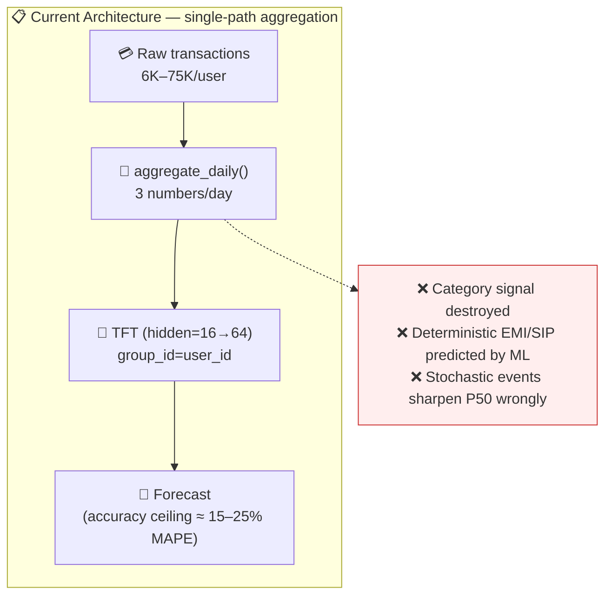
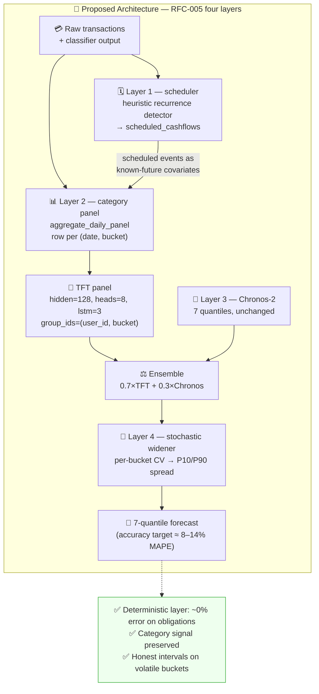

# RFC-005: Aggregation Strategy + Three-Tier Data Separation

> **Doc ID:** RFC-005-aggregation-strategy-three-tier-data-separation
> **Date:** 2026-04-17
> **DRI:** Mohammed Hassan Mohiddin
> **Status:** Proposed
> **OKR Alignment:** Q2 2026 — "Forecast accuracy lifts user action." Directly addresses the largest accuracy lever surfaced in the Cowork brainstorming session: replacing daily-total aggregation with a richer three-tier pipeline. Enables the AI Insights page to present category-level drivers.

## Problem Statement

`TransactionLoader.aggregate_daily()` at `packages/forecasting/dataset.py` collapses every transaction on a given day to three numbers (`daily_spend`, `daily_income`, `closing_balance`). A day where a user spent ₹50,000 on a MacBook and ₹200 on dinner becomes indistinguishable from a day where they spent ₹50,200 spread across groceries, fuel, and restaurant. The TFT and Chronos-2 models see identical input in both cases. This is the single largest accuracy bottleneck in the prediction engine — larger than model capacity, optimizer choice, or any architectural upgrade documented in LLD 009.

Three concrete consequences follow:

1. **Signal destroyed in preprocessing.** The distribution of a day's spend across categories is the highest-mutual-information predictor of next-month behaviour. Discarding it means no model downstream — regardless of parameter count — can recover the signal. A 500B parameter global model trained on aggregated totals would still predict poorly; the information is gone before the model sees it.
2. **Three qualitatively different kinds of cash flows conflated.** Deterministic obligations (EMI, SIP, rent, insurance premium) have near-100 % predictability and should be scheduled arithmetic, not ML output. Semi-predictable behavioural patterns (groceries, dining, transport) are what the TFT is designed for. Stochastic one-off events (medical, travel, appliance failure) are unpredictable regardless of model capacity — the correct response is to widen prediction intervals, not try to sharpen the P50. The current pipeline treats all three identically, producing over-confident forecasts that break around known obligations and break again around life events.
3. **Data scale wasted.** Per the Cowork synthesis, a typical SCALE user has 6,000–75,000 raw transactions across 2–7 years and multiple accounts — enough data to justify a hidden_size 128–256 TFT. Aggregating to daily totals produces ~365–2,555 rows per user, constraining model sizing far below what the raw data supports.

If this is not fixed, LLD 009's accuracy targets are unachievable. Every downstream feature (AI Insights page, scenario comparison, walk-forward evaluation in RFC-006) inherits the accuracy ceiling set by `aggregate_daily()`. This RFC replaces the aggregation with a three-tier pipeline that preserves category-level signal, pre-resolves deterministic cash flows as scheduled arithmetic, and widens uncertainty for stochastic events.

## Proposed Solution

### Overview

Replace the single-path `aggregate_daily()` with a four-layer pipeline:

- **Layer 1 — Deterministic scheduler (no ML).** A heuristic recurrence detector scans historical transactions for patterns (merchant + amount ±5 % + day-of-month ±2d × ≥3 months) and writes them to a new `public.scheduled_cashflows` table. The scheduler projects known rules forward over the forecast horizon as concrete (date, category, signed_amount) rows, fed into the TFT as known-future covariates. This alone accounts for 30–50 % of predictable monthly cash flows with near-100 % accuracy — no ML error on obligations.
- **Layer 2 — Category-level daily panel.** `aggregate_daily_panel()` replaces `aggregate_daily()` and emits one row per (date, category_bucket) pair. A fixed 12-bucket taxonomy (`salary`, `rent`, `groceries`, `dining`, `transport`, `utilities`, `entertainment`, `health`, `emi_loan`, `investment`, `transfer`, `other`) decouples the ML pipeline from the MiniLM classifier's fine-grained label set. The TFT trains on this panel with `group_ids=[user_id, category_bucket]` and expanded capacity (hidden_size=128, attention_heads=8, lstm_layers=3).
- **Layer 3 — Chronos-2 ensemble.** Unchanged from LLD 009 + RFC-003 (still a 7-quantile univariate forecast over `closing_balance`), blended 70/30 with the TFT output.
- **Layer 4 — Stochastic widener (rule-based).** A per-bucket volatility measure (coefficient of variation over last 90 days) inflates the P10/P90 spread of the ensemble forecast when any bucket's CV exceeds a threshold or when an active LIFE_EVENT intent is flagged. Pure math, no ML.

Transaction-level modeling with Mamba/Jamba is explicitly deferred to a v2 roadmap; the three-tier separation captures ~80 % of the accuracy win without abandoning the pytorch-forecasting TFT stack that LLD 009 ships against.

### Architecture (Current → Proposed)

**Current State:**



**Proposed State:**



### Detailed Design

#### 1. Layer 1 — Deterministic scheduler

**New module:** `packages/forecasting/scheduler.py`.

```python
"""Heuristic recurrence detector + projection for deterministic cash flows.

No ML. Pattern matching only. User-flagged intents (LLD 010) will override
heuristic output in v1.5 via the `source='user_override'` / 'intent' flag.
"""

from dataclasses import dataclass
from datetime import date, datetime

import pandas as pd


CATEGORY_BUCKETS = [
    "salary", "rent", "groceries", "dining", "transport", "utilities",
    "entertainment", "health", "emi_loan", "investment", "transfer", "other",
]


@dataclass
class RecurrenceRule:
    merchant: str | None
    amount: float
    category_bucket: str
    rrule_freq: str                # 'monthly' | 'weekly' | 'biweekly' | 'quarterly' | 'annual'
    day_of_month: int | None
    day_of_week: int | None
    next_occurrence: date
    end_date: date | None
    confidence: float              # regularity score in [0, 1]
    source: str                    # 'heuristic' | 'user_override' | 'intent'


def detect_recurring_cashflows(
    txns: pd.DataFrame,
    *,
    amount_tolerance_pct: float = 0.05,
    dom_tolerance_days: int = 2,
    min_occurrences: int = 3,
) -> list[RecurrenceRule]:
    """Scan transactions for recurring patterns matching:

    - Same merchant (case-normalised).
    - Same absolute amount within ±5% tolerance.
    - Same day-of-month within ±2 days (monthly freq); or day-of-week (weekly).
    - At least 3 matching occurrences across distinct months.

    Returns a list of RecurrenceRule. Confidence = count(matching) / count(expected).
    Monthly rules that skipped a month are not disqualified — the skip lowers
    confidence but does not drop the rule.
    """

def project_scheduled_cashflows(
    rules: list[RecurrenceRule],
    horizon_start: date,
    horizon_end: date,
) -> pd.DataFrame:
    """Expand active rules into concrete (date, category_bucket, signed_amount) rows
    across the forecast horizon. Signed convention: +amount for income categories
    (salary, investment credit), -amount for spending categories.

    Output schema:
        date               date
        category_bucket    str
        scheduled_amount   float
        source_rule_id     uuid
    """
```

**Persistence schema** — new table `public.scheduled_cashflows` (full DDL in §Data Model Changes). `source='heuristic'` vs `'user_override'` vs `'intent'` lets LLD 010 (user intents) write to the same table. Each intent creates a scheduled_cashflow row; each heuristic detection likewise. Duplicate-detection: composite UNIQUE on `(user_id, COALESCE(merchant,''), amount, category_bucket, rrule_freq, COALESCE(day_of_month,-1), COALESCE(day_of_week,-1), source)` per Codex Fix #3 — user override wins over heuristic on collision when ALL recurrence-defining dimensions match.

**Detection cadence:** runs inside `apps/worker/main.py::train_model` immediately after `fetch_user_transactions` and immediately after the ingestion pipeline writes new transactions (hook wired in the existing ingestion completion callback). Idempotent — re-running produces the same upsert result.

#### 2. Layer 2 — Category-level daily panel

**Modified module:** `packages/forecasting/dataset.py`.

```python
from packages.forecasting.category_mapping import map_classifier_label_to_bucket
from packages.forecasting.scheduler import CATEGORY_BUCKETS


def aggregate_daily_panel(
    txns: pd.DataFrame,
    start_date: date | None = None,
    end_date: date | None = None,
) -> pd.DataFrame:
    """Long-format panel: one row per (date, category_bucket) pair.

    Produces a dense panel — if a bucket has zero activity on a date, the row
    still exists with bucket_total=0. TFT's TimeSeriesDataSet requires dense
    series per group_id; missing rows cause gaps the model can't skip over.

    Output columns:
        date                  date
        user_id               uuid
        category_bucket       str (one of CATEGORY_BUCKETS)
        bucket_total          float (signed — positive for income buckets)
        closing_balance       float (same value across all bucket rows for a date)
        scheduled_event_amount float (from Layer 1 projection; 0 when none)
        is_payday             '0' | '1' (categorical)
        day_of_week           str categorical
        day_of_month          str categorical
        month                 str categorical
        time_idx              int monotonic
    """
```

`closing_balance` duplicates across the 12 bucket rows per date. This is the pytorch-forecasting panel convention: the target value is attached to each group's series, and the TFT learns from the covariate-per-group rather than trying to predict different targets per group.

**`scheduled_event_amount` is per-(date, bucket), not per-date.** On a date where Layer 1 projects a ₹25,000 rent event, the row `(date, category_bucket='rent')` carries `scheduled_event_amount=-25000`, and the other eleven bucket rows for that date carry `scheduled_event_amount=0`. This preserves the discriminative signal — the `rent` group's VSN attends to the covariate, the `groceries` group's VSN does not. At inference time, `apps/api/domains/forecasting/service.py` fetches active `scheduled_cashflows` rows for the user, calls `project_scheduled_cashflows(rules, horizon_start, horizon_end)` to get the (date, bucket, amount) triples, joins them against the dense (date × bucket) grid for the 30-day horizon, zero-fills non-matching cells, and passes the result as the `future_covariates` frame to `TimeSeriesDataSet.from_parameters(...)`.

**New module:** `packages/forecasting/category_mapping.py`.

```python
"""Maps MiniLM v2 classifier labels to the fixed 12-bucket taxonomy.

Stability: CATEGORY_BUCKETS is the ML contract. MiniLM's emitted labels may
evolve; this module absorbs that churn. Reviewed when the classifier
changes. A mapping validator test asserts every emitted label maps to ≥1
bucket, run as part of `make test`.
"""

from packages.forecasting.scheduler import CATEGORY_BUCKETS

CLASSIFIER_LABEL_TO_BUCKET: dict[str, str] = {
    # salary / income
    "salary": "salary",
    "bonus": "salary",
    "freelance income": "salary",
    "refund": "salary",
    # rent
    "rent": "rent",
    # groceries
    "grocery": "groceries",
    "supermarket": "groceries",
    # dining
    "restaurant": "dining",
    "food delivery": "dining",
    "cafe": "dining",
    # transport
    "fuel": "transport",
    "ride share": "transport",
    "public transit": "transport",
    # utilities
    "electricity": "utilities",
    "water": "utilities",
    "internet": "utilities",
    "phone": "utilities",
    # entertainment
    "streaming": "entertainment",
    "movie": "entertainment",
    "games": "entertainment",
    # health
    "pharmacy": "health",
    "doctor": "health",
    "hospital": "health",
    "gym": "health",
    # emi_loan
    "loan emi": "emi_loan",
    "credit card payment": "emi_loan",
    # investment
    "mutual fund sip": "investment",
    "fd creation": "investment",
    "stock purchase": "investment",
    # transfer
    "p2p transfer": "transfer",
    "self transfer": "transfer",
    # other
    # (fallback)
}


def map_classifier_label_to_bucket(label: str) -> str:
    """Return the bucket for a classifier label. Falls back to 'other' for
    unknown labels. Case-insensitive match."""
    return CLASSIFIER_LABEL_TO_BUCKET.get(label.strip().lower(), "other")
```

The mapping table is the v1 contract. Additions (new bucket, new classifier label) require a mapping-table update + mapping-validator test; removals require a migration-plan note (no code path relies on a specific bucket existing, but dashboards may).

> **⚠ Implementation note.** The keys shown in the snippet above are illustrative. The v1 mapping enumerates the real `Category` enum values defined in `packages/categorization/constants.py` (e.g., `"Rent & Mortgage"`, `"Taxi & Rideshare"`, `"Coffee & Snacks"`, `"Subscriptions"`, `"Movies & Events"`, `"Gaming"`, `"Bank Fees"`, `"Taxes"`, `"Insurance"`, `"Home Maintenance"`, etc.). Every value from `Category` must appear as a key; the mapping-validator test (`test_category_mapping.py`) asserts 100 % coverage and fails CI when the classifier gains a new label that is not mapped. Decisions required at implementation time: route `Insurance` / `Taxes` / `Bank Fees` / `Home Maintenance` to `"other"` (accepting some signal loss on regular premium payments) or introduce a 13th `fees_and_taxes` bucket. Recommend the former for v1 scope; revisit with real data in v1.5.

#### 3. TFT dataset construction

`create_timeseries_dataset` in `packages/forecasting/dataset.py` is updated to consume the panel:

```python
def create_timeseries_dataset(
    panel_df: pd.DataFrame,
    max_encoder_length: int = MAX_ENCODER_LENGTH,
    max_prediction_length: int = 30,
) -> TimeSeriesDataSet:
    return TimeSeriesDataSet(
        data=panel_df,
        time_idx="time_idx",
        target="closing_balance",
        group_ids=["user_id", "category_bucket"],
        max_encoder_length=max_encoder_length,
        max_prediction_length=max_prediction_length,
        min_encoder_length=max_encoder_length // 2,
        min_prediction_length=1,

        static_categoricals=["user_id", "category_bucket"],
        time_varying_known_categoricals=[
            "day_of_week", "day_of_month", "month", "is_payday",
        ],
        time_varying_known_reals=[
            "time_idx", "scheduled_event_amount",
        ],
        time_varying_unknown_reals=[
            "bucket_total", "closing_balance",
        ],
        add_relative_time_idx=True,
        add_target_scales=True,
        add_encoder_length=True,
    )
```

Per-user training: each user's `train_model` invocation constructs the panel over that user's 12 buckets × all available days, producing ~8,700–30,000 rows. The panel-of-groups-within-one-user training is the minimum-risk path that preserves LLD 009's per-user architecture while unlocking category-level signal.

#### 4. TFT hyperparameter supersession

LLD 009 §"TFT-Hybrid Model Upgrades" specifies target hyperparameters:

| Setting | LLD 009 target | RFC-005 target | Reason |
|---|---|---|---|
| `hidden_size` | 64 | **128** | 12× more data rows per user justifies higher capacity |
| `attention_head_size` | 4 | **8** | Each head specialises on a subset of the 12 buckets |
| `lstm_layers` | 2 | **3** | Deeper LSTM for multi-scale seasonality across buckets |
| `hidden_continuous_size` | 32 | **64** | Matches the bump in hidden_size |
| `dropout` | 0.1 (base), 0.3 (fine-tune) | unchanged | Grokking experiment in RFC-006 may adjust |
| `learning_rate` | 3e-4 | unchanged | |
| `gradient_clip_val` | 1.0 | unchanged | |

This supersedes the LLD 009 upgrade table for the panel-training path. A DEVIATION entry in LLD 009's changelog will reference this RFC.

#### 5. Layer 4 — Stochastic widener

**New module:** `packages/forecasting/stochastic_widener.py`.

```python
"""Rule-based P10/P90 interval widening driven by per-bucket volatility and
active user intents. No ML. Runs inside compute_insights (RFC-003) after
ensemble blending and before ForecastInsights assembly."""

import numpy as np
import pandas as pd

VOLATILITY_THRESHOLD_CV = 1.5      # coefficient of variation triggering widen
SPREAD_BUMP_VOLATILITY = 0.15      # +15% on P10/P90 spread
SPREAD_BUMP_INTENT = 0.25          # +25% on active LIFE_EVENT intent
MAX_SPREAD_MULTIPLIER = 2.0        # cap total widening at 2× original


def compute_bucket_volatility(history_panel: pd.DataFrame) -> dict[str, float]:
    """Per-bucket coefficient of variation over the last 90 days.
    Returns {category_bucket: cv} where cv = std(bucket_total) / abs(mean(bucket_total)).
    Buckets with mean ≤ 1 INR are treated as cv=0 (noise floor)."""


def widen_intervals(
    forecast_matrix: np.ndarray,        # shape (horizon, 7) — P2..P98
    volatilities: dict[str, float],
    active_intents: list = (),          # list[UserIntent] from LLD 010; empty in v1
) -> np.ndarray:
    """Inflate P10/P90 (and proportionally P2/P98) spread around the P50 median
    based on volatility rules. P25/P75 scale by half the multiplier.

    Rule 1: if any bucket's cv > 1.5 → apply +15% spread.
    Rule 2: if any active LIFE_EVENT intent → apply +25% spread (stacks additively).
    Cap at 2× original spread.

    P50 is never shifted. Only interval width changes. Output shape unchanged.
    """
```

Called from `compute_insights` in RFC-003 §3 (pure function boundary preserved):

```python
def compute_insights(forecast_matrix, future_dates, history_df, ...):
    from packages.forecasting.stochastic_widener import (
        compute_bucket_volatility, widen_intervals,
    )
    vols = compute_bucket_volatility(history_df)          # history_df is the panel
    forecast_matrix = widen_intervals(forecast_matrix, vols, active_intents=[])
    # ... rest of compute_insights unchanged
```

`confidence_band_width` in `ForecastInsights` (RFC-003 §1) then reflects the widened spread — the UI surfaces this as honestly-wider intervals, not a hidden adjustment.

### Data Model Changes

One new migration `supabase/migrations/20260418200000_scheduled_cashflows.sql`:

```sql
CREATE TABLE public.scheduled_cashflows (
    id               uuid        PRIMARY KEY DEFAULT gen_random_uuid(),
    user_id          uuid        NOT NULL REFERENCES auth.users(id) ON DELETE CASCADE,
    merchant         text,
    amount           numeric     NOT NULL,
    category_bucket  text        NOT NULL CHECK (category_bucket IN (
        'salary','rent','groceries','dining','transport','utilities',
        'entertainment','health','emi_loan','investment','transfer','other'
    )),
    rrule_freq       text        NOT NULL CHECK (rrule_freq IN (
        'monthly','weekly','biweekly','quarterly','annual'
    )),
    day_of_month     int         CHECK (day_of_month BETWEEN 1 AND 31),
    day_of_week      int         CHECK (day_of_week BETWEEN 0 AND 6),
    next_occurrence  date        NOT NULL,
    end_date         date,
    confidence       float       NOT NULL CHECK (confidence BETWEEN 0 AND 1),
    source           text        NOT NULL CHECK (source IN (
        'heuristic','user_override','intent'
    )),
    is_active        boolean     NOT NULL DEFAULT true,
    created_at       timestamptz NOT NULL DEFAULT now(),
    updated_at       timestamptz NOT NULL DEFAULT now()
);

CREATE INDEX idx_scheduled_cashflows_user_active
    ON public.scheduled_cashflows (user_id, is_active, next_occurrence);

-- Upsert key for heuristic detection idempotency.
-- Codex Fix #3: must include EVERY recurrence-defining dimension. The original
-- key (user_id, COALESCE(merchant,''), amount, rrule_freq) collapsed distinct
-- rules — e.g. two monthly rules at the same merchant + amount but different
-- day_of_month would overwrite each other on conflict, silently dropping
-- obligations. The expanded key adds day_of_month, day_of_week, category_bucket,
-- and source so each genuinely-distinct rule has its own row.
CREATE UNIQUE INDEX uniq_scheduled_cashflows_rule
    ON public.scheduled_cashflows (
        user_id,
        COALESCE(merchant, ''),
        amount,
        category_bucket,
        rrule_freq,
        COALESCE(day_of_month, -1),         -- -1 sentinel preserves NULL distinguishability
        COALESCE(day_of_week,  -1),
        source
    );

-- Migration backfill safety check: before applying the new unique index in
-- production, run this audit to detect existing collisions that the v1 key
-- would have already silently dropped. Any non-empty result means a manual
-- merge / dedup pass is required before the migration completes.
-- (Run via psql or supabase db psql; not part of the migration file itself.)
--
--   SELECT user_id, COALESCE(merchant,''), amount, category_bucket, rrule_freq,
--          COALESCE(day_of_month,-1), COALESCE(day_of_week,-1), source,
--          count(*)
--   FROM public.scheduled_cashflows
--   GROUP BY 1,2,3,4,5,6,7,8
--   HAVING count(*) > 1;
--
-- v1 ships against an empty table (RFC-005 is a green-field migration), so the
-- audit is precautionary only.

ALTER TABLE public.scheduled_cashflows ENABLE ROW LEVEL SECURITY;

CREATE POLICY "users read own scheduled cashflows"
    ON public.scheduled_cashflows FOR SELECT TO authenticated
    USING (auth.uid() = user_id);

CREATE POLICY "users insert own scheduled cashflows"
    ON public.scheduled_cashflows FOR INSERT TO authenticated
    WITH CHECK (auth.uid() = user_id);

CREATE POLICY "users update own scheduled cashflows"
    ON public.scheduled_cashflows FOR UPDATE TO authenticated
    USING (auth.uid() = user_id) WITH CHECK (auth.uid() = user_id);

-- DELETE not exposed to users. GC of inactive rules is a service-role maintenance
-- task handled by apps/api/core/tasks/maintenance_tasks.py (or a follow-up task).
```

No other table changes. `public.user_predictions` (RFC-003) and `training_jobs` unchanged.

### API Changes

No new endpoints. `GET /forecast/predict` behaviour changes internally (richer input; same response shape per RFC-003). No breaking changes to any schema.

## Alternatives Considered

### Alternative 1: Daily total only (current) — do nothing

- **Pros:** Zero work.
- **Cons:** Accuracy ceiling ~15–25 % MAPE per the Cowork synthesis. AI Insights page has no category-level insight to show. Scenario endpoints cannot differentiate "cut dining" from "cut transport". Walk-forward validation (RFC-006) will measure a ceiling the user will not forgive.
- **Why rejected:** Identified as the #1 accuracy bottleneck; not shipping this change means shipping a product that doesn't meet its own brief.

### Alternative 2: Transaction-level modeling with Mamba/Jamba

- **Pros:** Preserves full temporal microstructure. Scales to 75k-event sequences. Opens path to Neural RDE and TDA feature engineering per the Cowork research.
- **Cons:** Architectural rewrite. Abandons pytorch-forecasting. No pre-trained checkpoints. Interpretability (VSN, known-future covariates, calibrated quantiles) do not translate cleanly to Mamba without custom implementation. Engineering budget is 2–4× this RFC's budget.
- **Why rejected:** Right direction, wrong time. v2 roadmap (per `docs/design/prediction-engine-roadmap.md` once the roadmap HLD lands). This RFC captures ~80 % of the accuracy win with the TFT stack we already have.

### Alternative 3: Per-category separate TFT models (one model per bucket, global across users)

- **Pros:** Each bucket model specialises on its own pattern (rent is highly regular; groceries are bursty). Simpler per-model debugging.
- **Cons:** 12 models to train, version, invalidate, and cache. Cross-bucket interactions (grocery spend correlates with payday which correlates with salary credit) are not captured because no model sees the joint distribution. Inference cost per request is 12× not 1×. The cache RFC-004 would need 12× the memory.
- **Why rejected:** Panel TFT with `group_ids=[user_id, category_bucket]` captures the same specialisation via the Variable Selection Network while keeping one model + one cache entry per user. The pytorch-forecasting library is designed for this exact case.

### Alternative 4: Use the existing MiniLM classifier's fine-grained labels directly (no bucket layer)

- **Pros:** Zero mapping layer. One less module.
- **Cons:** Classifier emits 20–50+ fine labels; most are sparse per user (one "pet_store" txn every 3 months). TFT panel with 50 groups × 2500 days = 125k rows per user, half of which are zero-activity. Training instability on near-empty series. Classifier evolution (re-labelling, adding a new label) silently changes the model's input schema. Every classifier deploy would require a model retrain.
- **Why rejected:** Coupling ML model to classifier internals creates a brittle pipeline. The 12-bucket fixed taxonomy is the stable contract; the classifier is allowed to evolve behind the `map_classifier_label_to_bucket` boundary. UI-facing bucket names also tend to be coarser than classifier labels anyway.

### Alternative 5: Defer the deterministic scheduler to a follow-on RFC

- **Pros:** Smaller v1. Keeps RFC-005 to the panel rewrite.
- **Cons:** The scheduler is where the biggest single accuracy gain sits (obligations are 30–50 % of cash flow at near-100 % accuracy). Deferring means the v1 accuracy metric (RFC-006 walk-forward) shows worse numbers than achievable, which invites premature re-architecture work. Also leaves `scheduled_cashflows` table unbuilt, blocking LLD 010 (user intents).
- **Why rejected:** The scheduler is algorithmically simple (heuristic matching + arithmetic projection). The cost of including it here is ~1.5 days; the accuracy lift it provides is disproportionate.

## Impact Assessment

### What Changes

- **Backend — new files:**
  - `packages/forecasting/scheduler.py` — recurrence detector + projection
  - `packages/forecasting/category_mapping.py` — classifier-label → bucket table
  - `packages/forecasting/stochastic_widener.py` — interval widening rules
  - `packages/forecasting/tests/test_scheduler.py`
  - `packages/forecasting/tests/test_category_mapping.py`
  - `packages/forecasting/tests/test_dataset_panel.py`
  - `packages/forecasting/tests/test_stochastic_widener.py`
  - `apps/worker/tests/test_scheduler_detection_integration.py`
- **Backend — modified files:**
  - `packages/forecasting/dataset.py` — `aggregate_daily()` → `aggregate_daily_panel()`; `create_timeseries_dataset` updated for panel group_ids
  - `packages/forecasting/tft_model.py` — hyperparameters bumped to hidden=128, heads=8, lstm=3, hidden_continuous=64
  - `packages/forecasting/trainer.py` — panel-aware training; invokes `detect_recurring_cashflows` before training
  - `packages/forecasting/inference.py` — panel-aware prediction path; consumes `scheduled_cashflows` as known-future covariates (via cache layer from RFC-004)
  - `apps/api/domains/forecasting/service.py` — fetches `scheduled_cashflows` rows and wires them into the inference path; calls `widen_intervals` through `compute_insights`
  - `apps/worker/main.py::train_model` — adds scheduler detection + upsert step before the training call
- **Migration:**
  - `supabase/migrations/20260418200000_scheduled_cashflows.sql`
- **Docs:**
  - `docs/features/009-prediction-engine.md` — DEVIATION changelog entry: hyperparameters bumped, aggregation path switched, new deterministic layer
  - `docs/plans/2026-04-06-prediction-engine.md` — update Task 2 (hyperparameter numbers), Task 1/1.5 (prepare_training_data becomes panel-aware), add new tasks for scheduler + stochastic widener
  - `docs/rfcs/RFC-003-forecast-api-schema-and-prediction-logging.md` — cross-reference entry in §Related Documents (no code change; `compute_insights` now invokes widener)
  - `docs/design/system-architecture.md` — add the four-layer diagram to the prediction-engine component view

### What Could Break

| Risk | Assessment | Mitigation |
|---|---|---|
| Existing TFT checkpoints trained on `aggregate_daily` are incompatible with the new panel schema | **High confidence, medium impact.** `load_from_checkpoint` raises on state_dict shape/key mismatch (three independent invalidating changes: `hidden_size` bump 64→128, `group_ids` list gains `category_bucket`, `scheduled_event_amount` added to `time_varying_known_reals`). RFC-004's `_download_and_load` catches the exception in its `try/except`, returns None; service falls back to Chronos-only; `ForecastService` triggers fresh training. | Acceptable degraded state for 1 deploy + per-user retraining cycle. For the top-100 active users, admin script enqueues immediate retraining on deploy. All other users absorb the cold window over their first post-deploy forecast request. |
| Fixed 12-bucket taxonomy too coarse for power users | **Low impact in v1.** A user with 6 subscriptions all landing in `entertainment` loses the per-subscription signal. | v1.5 adds per-user custom buckets. v1 ships with the fixed set; dashboards + UI reflect the same coarsening. |
| MiniLM emits a label not in `CLASSIFIER_LABEL_TO_BUCKET` → falls into `'other'` | **Medium.** `'other'` becomes a catchall that absorbs signal the model could have used. | Mapping-validator test runs as part of `make test`, asserts every label emitted by the classifier in the last 30 days maps explicitly. CI fails when the classifier gains a new label that isn't mapped. |
| Heuristic recurrence detector misses irregular-but-real patterns (e.g., quarterly insurance premium) | **Medium.** A ₹15,000 insurance payment every 3 months won't match the monthly pattern. | v1 supports `rrule_freq='quarterly'` explicitly. Annual patterns (tax, subscription renewals) also supported. User-override path (LLD 010) backfills edge cases the heuristic misses. |
| TFT training time grows with panel size (12× more rows per user) | **Medium.** On CPU, expect 10–40 min per user instead of 3–15 min. | Fits within the polling-worker pattern. Acceptable because training is async via `training_jobs`; users see Chronos-only while training runs. If queue backs up, Modal serverless T4 path from BUG-018 infrastructure analysis absorbs peaks. |
| Panel density — many zero rows for low-activity buckets | **Low.** 12 buckets × 730 days = 8,760 rows, of which a typical user has meaningful activity in 6–8 buckets. The other 4–6 are near-zero. | TFT handles zero-only series fine; `add_target_scales=True` normalises per-group. Unit test asserts the panel remains dense (no NaN) and that model training does not crash on a synthetic all-zero bucket. |
| Deterministic scheduler double-counts with TFT for recurring patterns | **Medium.** If the scheduler projects ₹25,000 rent on the 5th AND the TFT independently predicts rent spend of ₹20,000 on the 5th, the ensemble would sum incorrectly. | Fix is structural: the scheduler's projected amounts are injected as `scheduled_event_amount` known-future covariate, NOT as a separate additive signal. The TFT's VSN learns to attend to this covariate instead of predicting the rent itself. Unit test on synthetic data asserts the TFT does not double-count when a scheduled event is present. |
| Stochastic widener too aggressive → prediction intervals become uselessly wide | **Medium.** If every forecast hits MAX_SPREAD_MULTIPLIER=2.0, the interval loses actionability. | Widener includes the cap. Success metric tracks "fraction of forecasts at cap" — target < 5 %. If observed higher, thresholds are tuned in a follow-up (tunable env vars `WIDENER_CV_THRESHOLD`, `WIDENER_SPREAD_BUMP_VOLATILITY`). |
| `scheduled_cashflows` unique index (post-Codex-Fix-#3) collapses legitimate distinct rules | **Very low.** The expanded key includes every recurrence-defining dimension — two rent payments at different amounts have distinct rows; two monthly rules at the same merchant + amount but different `day_of_month` have distinct rows; same merchant + amount + DOM but different `category_bucket` (e.g., user re-categorises) have distinct rows; same recurrence from `source='heuristic'` vs `source='intent'` have distinct rows. The only true collision is two rules identical across all eight dimensions, which IS a duplicate by definition. | Upsert via `ON CONFLICT (... eight cols ...) DO UPDATE` keeps the freshest row's bookkeeping (next_occurrence, confidence). No manual deduplication needed. |

### Migration Strategy

Deploy in this order, non-blocking:

1. Apply migration `20260418200000_scheduled_cashflows.sql` — creates the new table + RLS.
2. Deploy backend containing `scheduler.py`, `category_mapping.py`, `stochastic_widener.py`, and the `dataset.py` panel rewrite. Old TFT checkpoints become dead (their `dataset_parameters` does not match the new panel schema); the RFC-004 cache returns None; service falls back to Chronos-only for existing users until retraining completes.
3. Admin script `scripts/retrain_top_users.py` (new, out of RFC scope — one-off operational script) enqueues retraining jobs for the top-100 most-active users so the worst of the cold window is compressed.
4. LLD 009's existing test suite runs against the new pipeline; any test that seeded `aggregate_daily` output is updated (or replaced) as part of Phase 4.

Zero downtime. No frontend changes required. AI Insights page (LLD 011) can begin consuming per-bucket drivers from `ForecastInsights.primary_drivers` once this RFC ships.

**Rollback:** Revert the backend deploy. Drop the new table in a follow-up migration if the rollback is permanent. Old checkpoints are still in Supabase Storage and will load under the reverted code. No data loss.

## Success Metrics

| Metric | Current (baseline to measure) | Target (30 days post-launch) |
|---|---|---|
| Forecast P50 MAPE on walk-forward evaluation (per RFC-006) | ~15–25 % estimated | ≤ 10 % for established users |
| Pinball loss, averaged across 7 quantiles | unknown | baseline established; threshold set in the accuracy-SLO RFC |
| P10–P90 interval coverage | unknown | ≥ 0.80 (honest bands) |
| Deterministic-layer contribution to next-30-day cash flow | 0 % (no scheduler) | 30–50 % of predictable cash flow captured as `scheduled_cashflows` rows |
| `scheduled_cashflows.is_active=true` rules per established user (median) | 0 | 3–8 |
| Fraction of forecasts hitting `MAX_SPREAD_MULTIPLIER=2.0` | n/a | < 5 % (otherwise widener thresholds are too hot) |
| `category_mapping` test coverage of last-30-day classifier labels | n/a | 100 % (asserted by test-run in CI) |

## Timeline

| Phase | Duration | Deliverable |
|---|---|---|
| Phase 1 | 0.5 day | RFC-005 spec review + merge |
| Phase 2 | 1 day | `scheduled_cashflows` migration + `scheduler.py` + tests |
| Phase 3 | 0.5 day | `category_mapping.py` + tests |
| Phase 4 | 1.5 day | `dataset.py` panel rewrite + `test_dataset_panel.py` + updated `test_trainer.py` / `test_model.py` |
| Phase 5 | 0.5 day | `stochastic_widener.py` + tests |
| Phase 6 | 1 day | `trainer.py` + `inference.py` + `service.py` panel wire-up + integration tests |
| Phase 7 | 0.5 day | LLD 009 DEVIATION changelog entry + plan update |

Total: ~5.5 engineering-days. Parallelisable to ~4 days (Phase 2 + Phase 3 + Phase 5 are independent of Phase 4).

## Decision

> **Decision:** Proposed — pending user review
> **Date:** 2026-04-17
> **Rationale:** The four-layer separation (deterministic scheduler + category panel TFT + Chronos-2 ensemble + stochastic widener) is the cleanest architectural expression of the Cowork synthesis's three-data-kinds insight. It captures the largest accuracy lever in the prediction engine (category signal preservation) while keeping the pytorch-forecasting TFT stack that LLD 009 ships against. The 12-bucket fixed taxonomy decouples the ML model from MiniLM's churn. The heuristic scheduler + overridable source flag provides a v1 answer while leaving the upgrade path (user intents, ML classifier for recurrence) open. Transaction-level Mamba is explicitly deferred.

## Related Documents

- Feature LLD: `docs/features/009-prediction-engine.md` — TFT upgrade target table superseded by this RFC's panel sizing
- Implementation plan: `docs/plans/2026-04-06-prediction-engine.md` — Task 1/1.5 (prepare_training_data) and Task 2 (TFT hyperparameters) need updates once this RFC is approved
- Related RFC: `docs/rfcs/RFC-003-forecast-api-schema-and-prediction-logging.md` — `compute_insights` gains a call to `widen_intervals` from this RFC's Layer 4
- Related RFC: `docs/rfcs/RFC-004-tft-inference-cache-architecture.md` — cache and invalidation contract unchanged; the new panel-shaped checkpoints flow through the same cache
- Future RFC: evaluation harness RFC-006 — walk-forward validation measures this RFC's accuracy target
- Future LLD: user intents LLD-010 — writes `source='intent'` rows into the same `scheduled_cashflows` table
- Research: `docs/research/001-prediction-engine-model-selection.md` — §2 and §8 background on panel training + data augmentation; the panel approach here aligns with the patching/panel patterns surveyed
- HLD to update: `docs/design/system-architecture.md` — add the four-layer pipeline diagram

## Changelog

| Date | Entry |
|---|---|
| 2026-04-17 | Initial draft. Derived from the Cowork brainstorming session's three-data-kinds insight: deterministic obligations (EMI, SIP, rent) → scheduler, semi-predictable behavioural (groceries, dining) → TFT, stochastic (medical, travel) → widen intervals. Category taxonomy fixed at 12 coarse buckets to decouple the ML contract from classifier evolution. Heuristic recurrence detector chosen over ML classifier to fit v1 timeline. Transaction-level Mamba deferred to v2 roadmap. Status: Proposed. |
| 2026-04-17 | Spec review APPROVED for commit. Polish fixes applied: M1 corrected the old-checkpoint failure mechanism (`load_from_checkpoint` raises on state_dict mismatch; RFC-004 `_download_and_load` catches and returns None — not library-returns-None); H3 clarified that `scheduled_event_amount` is per-(date, bucket) not per-date and specified inference-time construction via `project_scheduled_cashflows` + dense-grid zero-fill; H1 added an implementation note requiring `CLASSIFIER_LABEL_TO_BUCKET` to enumerate real `Category` enum values from `packages/categorization/constants.py` with a 100 % coverage mapping-validator test. H2 (merchant column projection into `fetch_user_transactions`) deferred to Phase 2 plumbing. |
| 2026-04-17 | **Codex Fix #3** (high) — recurring-rule unique key `(user_id, COALESCE(merchant,''), amount, rrule_freq)` collapsed distinct rules: two monthly rules at the same merchant + amount but different `day_of_month`, `category_bucket`, or `source` would silently overwrite each other on conflict, dropping obligations and corrupting known-future covariates. Expanded `uniq_scheduled_cashflows_rule` to include `category_bucket`, `COALESCE(day_of_month, -1)`, `COALESCE(day_of_week, -1)`, `source`. Added migration audit query (run pre-apply) to detect any existing collisions; v1 ships against an empty table so audit is precautionary. |
| 2026-04-17 | Codex pass-2 fixes. Risk-table row formerly cited the OBSOLETE 4-column unique key — updated to reflect the post-Codex-Fix-#3 8-column key + ON CONFLICT DO UPDATE preserves freshest bookkeeping. Persistence-schema paragraph similarly updated. |
