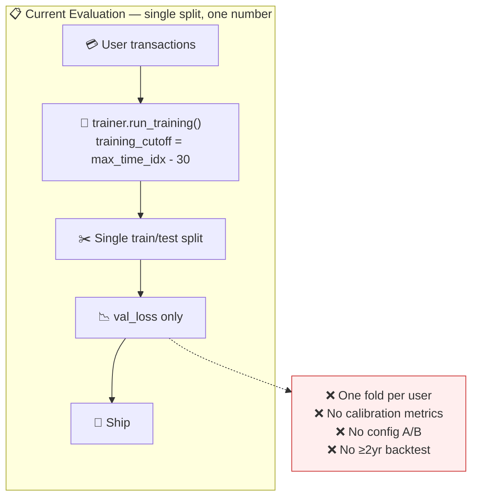
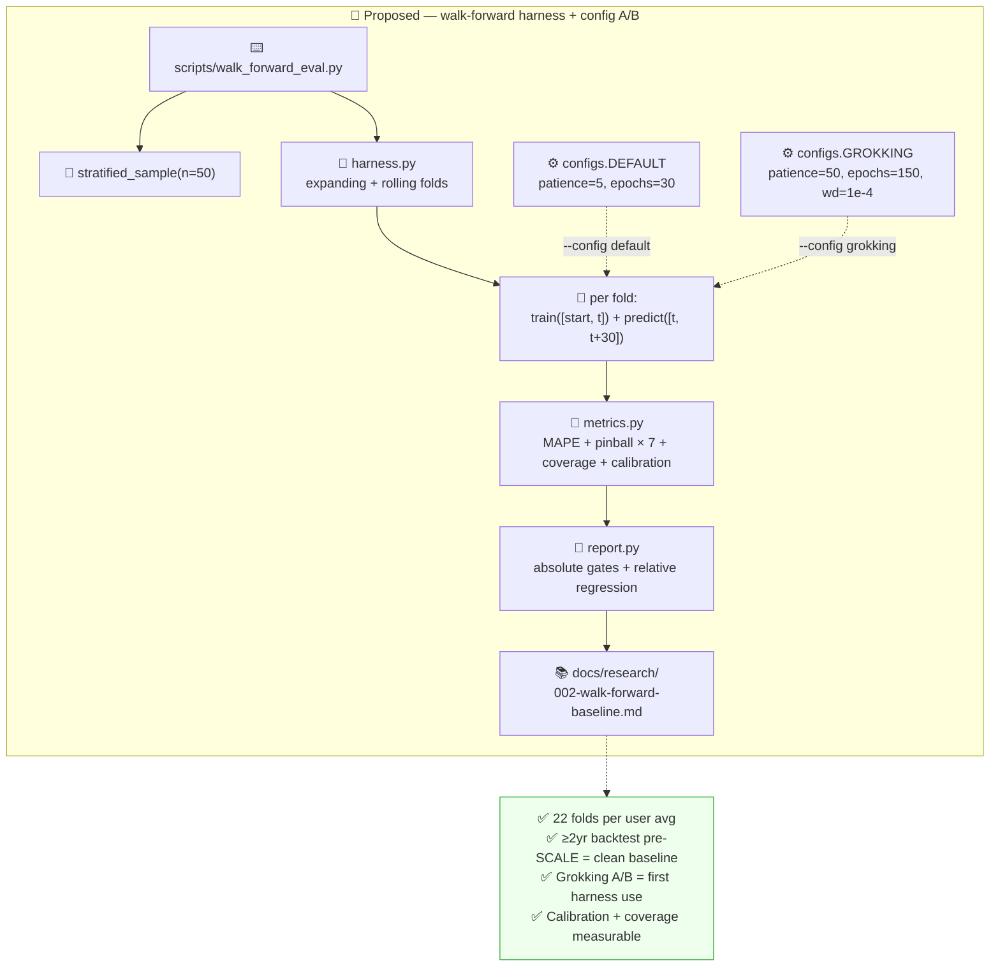

# RFC-006: Forecast Evaluation Harness (Walk-Forward + Grokking A/B)

> **Doc ID:** RFC-006-forecast-evaluation-harness
> **Date:** 2026-04-17
> **DRI:** Mohammed Hassan Mohiddin
> **Status:** Implemented (code-complete; first walk-forward run deferred per Stage 9)
> **OKR Alignment:** Q2 2026 — "Forecast accuracy lifts user action." Provides the offline measurement system that validates LLD 009's SLOs (RFC-005 accuracy targets, RFC-003 calibration targets) before any model config lands on production. Also runs the first grokking-vs-default A/B experiment surfaced in the Cowork brainstorming session.

## Problem Statement

LLD 009 claims a 500 ms latency SLO and ≤15–25 % MAPE accuracy target. RFC-005 tightens the accuracy target to ≤10 % MAPE via the three-tier data pipeline. RFC-003 claims ≥0.80 P10–P90 interval coverage. **None of these claims are measurable today.** The current evaluation in `packages/forecasting/trainer.py` does a single `training_cutoff = max_time_idx - 30` split and reports val_loss — one data point per user, no historical backtesting, no calibration assessment, no way to compare model configurations without shipping them.

Three concrete consequences follow:

1. **Ship-blind risk.** Every model-config change (RFC-005's hyperparameter bump, the Chronos-2 integration from LLD 009, the grokking training regime proposed in the Cowork synthesis) lands in production without a controlled accuracy comparison. Users are the A/B harness.
2. **Grokking experiment is structurally impossible.** The Cowork synthesis argues that extending `max_epochs` 30→150, `patience` 5→50, and adding `weight_decay=1e-4` may unlock a generalisation regime for per-user TFT. That hypothesis can only be validated on held-out historical folds because live data is confounded by prediction-induced behaviour change. Without a walk-forward harness, "try grokking config" is a coin flip deployed to real users.
3. **Honest uncertainty cannot be claimed.** The 7-quantile ForecastPoint (RFC-003) only pays off if quantile calibration is measured — does P10 actually contain 10 % of outcomes, does P90 contain 90 %? Pinball loss + interval coverage + calibration error are the tests; without a harness running them, the outer quantiles are decorative.

Relatedly, Hassan's walk-forward insight from the Cowork session is genuinely correct: historical transaction data from before SCALE existed is a **clean counterfactual baseline**. Every user with ≥2 years of data gives us ~22 train→predict→compare folds whose test windows predate SCALE's existence entirely — no prediction-induced feedback, no intervention effect. This is a gift that the current trainer throws away by doing a single split.

If this is not built now, RFC-005 cannot be safely validated, RFC-003's calibration claims cannot be tested, and the grokking experiment stays theoretical.

## Proposed Solution

### Overview

Build an offline walk-forward evaluation harness as a standalone Python CLI and sub-package under `packages/forecasting/eval/`. The harness:

1. Samples 50 users stratified across five archetypes (high-frequency, low-frequency, recent-life-event, salary-only, multi-account).
2. For each user, iterates monthly folds over all available history. Each fold trains a fresh TFT on `[start, t]` and predicts `[t, t+30]`, comparing the 7-quantile forecast against actual closing-balance trajectory.
3. Runs both **expanding** (grow training set each fold) and **rolling** (fixed 365-day window) protocols.
4. Computes MAPE on P50, pinball loss on each of the 7 quantiles, P10–P90 interval coverage, and per-quantile calibration error.
5. Supports swappable training configs — `default` (current LLD 009 hyperparameters) and `grokking` (extended epochs + weight decay + smaller batch) — so the first use of the harness is the grokking A/B.
6. Emits a diff report against absolute thresholds (RFC-003/005 success metrics) and relative regression guards (new config must not regress > 5 % from baseline on any fold).

No production code runs the harness. No frontend integration. No data written to `user_predictions` or `training_jobs`. The harness is pure read-side over historical transactions: fetch, slice, train in isolation, predict, score, discard checkpoint. Results write to `docs/research/` as formal research artifacts.

Shadow mode (production drift monitoring) and CI-gated model comparison are explicitly out of scope for v1 — deferred to Track C roadmap once ongoing model work warrants the Modal compute budget.

### Architecture (Current → Proposed)

**Current State:**



**Proposed State:**



### Detailed Design

#### 1. Module layout

```
packages/forecasting/eval/                        # new sub-package
  __init__.py
  harness.py                                      # fold loop
  metrics.py                                      # MAPE + pinball + coverage + calibration
  sampling.py                                     # stratified user selection
  configs.py                                      # TrainingConfig + DEFAULT/GROKKING presets
  report.py                                       # threshold evaluation + markdown rendering
  tests/
    __init__.py
    test_harness.py
    test_metrics.py
    test_sampling.py
    test_report.py

scripts/walk_forward_eval.py                      # CLI entrypoint
docs/research/002-walk-forward-baseline.md        # first-run result (written post-execution)
docs/research/runs/                               # raw JSON per-run artifacts (.gitignored except summary)
```

#### 2. CLI contract

```bash
# Run the default config on a stratified 50-user sample, both window protocols
.venv/bin/python -m scripts.walk_forward_eval run \
    --users stratified:50 \
    --window both \
    --config default \
    --output docs/research/runs/2026-04-18-default.json

# Run the grokking config on the same users for A/B comparison
.venv/bin/python -m scripts.walk_forward_eval run \
    --users stratified:50 \
    --window both \
    --config grokking \
    --output docs/research/runs/2026-04-18-grokking.json

# Diff the two runs and render a research-doc report
.venv/bin/python -m scripts.walk_forward_eval diff \
    --a docs/research/runs/2026-04-18-default.json \
    --b docs/research/runs/2026-04-18-grokking.json \
    --render docs/research/002-walk-forward-baseline.md
```

Flags:

| Flag | Default | Meaning |
|---|---|---|
| `--users` | `stratified:50` | `stratified:N`, `random:N`, `all`, or `uuid1,uuid2,...` |
| `--window` | `both` | `expanding` / `rolling` / `both` |
| `--config` | `default` | `default` / `grokking` / `custom:<path>.yaml` |
| `--horizon` | `30` | Prediction horizon in days |
| `--fold-interval` | `30` | Days between fold starts (monthly folds) |
| `--min-history` | `90` | Skip folds with train window shorter than this |
| `--parallel` | `1` | Concurrent folds via `ProcessPoolExecutor` |
| `--dry-run` | off | Print user list + fold count + exit |
| `--seed` | `42` | RNG seed for sampling + training |

#### 3. Fold protocol

**Expanding window** — training set grows monotonically:

```
User history: [start_date ... end_date]
Fold k (k = 3, 4, ..., N-1):
    train_start = start_date
    train_end   = start_date + k * fold_interval
    test_start  = train_end
    test_end    = train_end + horizon
```

Start at `k=3` so the smallest train window is 90 days (matches LLD 009's cold-start floor).

**Rolling window** — fixed 365-day training set:

```
Fold k (k = 12, 13, ..., N-1):
    train_start = start_date + (k-12) * fold_interval
    train_end   = start_date + k * fold_interval
    test_start  = train_end
    test_end    = train_end + horizon
```

Start at `k=12` so the training window is always 12 months. This controls for the "more data always wins" confound and tests whether the model's architecture is competitive at fixed sample size.

For each fold:

1. Fetch user transactions via `packages.forecasting.trainer.fetch_user_transactions` (existing helper; no schema change).
2. Slice to train window by `transaction_date`.
3. Call `packages.forecasting.dataset.aggregate_daily_panel` (per RFC-005) on the slice.
4. Call `packages.forecasting.scheduler.detect_recurring_cashflows` + `project_scheduled_cashflows` to assemble known-future covariates for the 30-day test horizon.
5. Train a fresh TFT via `trainer.run_training(panel, **chosen_config)` — checkpoint stays in-memory, never touches Supabase Storage.
6. Predict the 30-day horizon; collect the full 7-quantile matrix.
7. Compute actual closing-balance trajectory over the test window from the same user's txns.
8. Score: MAPE, pinball × 7, coverage, calibration error.
9. Append fold result to the run JSON.

Skip folds where `len(train) < min_history_days` or `len(test) < horizon` (catches users with gap years in history).

#### 4. Training configs

`packages/forecasting/eval/configs.py`:

```python
from dataclasses import dataclass

@dataclass(frozen=True)
class TrainingConfig:
    name: str
    max_epochs: int
    patience: int
    weight_decay: float
    batch_size: int
    learning_rate: float


DEFAULT = TrainingConfig(
    name="default",
    max_epochs=30,
    patience=5,
    weight_decay=0.0,
    batch_size=64,
    learning_rate=3e-4,
)

GROKKING = TrainingConfig(
    name="grokking",
    max_epochs=150,
    patience=50,
    weight_decay=1e-4,
    batch_size=16,
    learning_rate=3e-4,
)
```

**Minimal trainer patch** — current signature at `packages/forecasting/trainer.py:129` is:

```python
def run_training(
    enriched_df: pd.DataFrame,
    max_epochs: int = 30,
    early_stop_patience: int = 5,
):
```

RFC-006 expands this to:

```python
def run_training(
    enriched_df: pd.DataFrame,                       # name preserved; RFC-005 implementation
                                                     # will migrate this argument to a panel
                                                     # DataFrame — coordinated there, not renamed here
    max_epochs: int = 30,
    early_stop_patience: int = 5,
    weight_decay: float = 0.0,
    batch_size: int = 64,
    learning_rate: float = 3e-4,
) -> tuple[pl.Trainer, TemporalFusionTransformer, TimeSeriesDataSet]:
    ...
```

Param names preserved to avoid any breaking change:
- `enriched_df` (not `panel_df`) — matches the current code. RFC-005's panel migration changes the *shape* of the data passed in, not the parameter name; a follow-up rename can land as a cosmetic PR after RFC-005 lands.
- `early_stop_patience` (not `patience`) — matches the current code. The harness maps `TrainingConfig.patience → run_training(early_stop_patience=...)`. Do not add `*` to force keyword-only; existing positional callers (e.g., `apps/worker/main.py::train_model` line 67: `run_training(enriched, max_epochs=30)`) keep working.

Defaults preserve current production behaviour exactly. The four new kwargs (`weight_decay`, `batch_size`, `learning_rate`, plus the already-existing `early_stop_patience`) take current implicit pytorch-forecasting defaults so an unchanged callsite produces unchanged results. The harness passes them explicitly from the chosen `TrainingConfig`. Zero breaking changes.

Custom configs supported via `--config custom:path/to/config.yaml` (YAML loaded, validated against `TrainingConfig` shape). This opens the door to grid-search experiments in v1.5 without requiring code changes.

#### 5. Metrics module

`packages/forecasting/eval/metrics.py`:

```python
import numpy as np

# Source of truth: RFC-003 §1 ForecastPoint schema + RFC-003 §4
# user_predictions.pinball_loss jsonb keys {p2, p10, p25, p50, p75, p90, p98}.
# Any future change to the quantile set must land in RFC-003 first; this
# module mirrors the RFC-003 contract.
QUANTILE_LEVELS = (0.02, 0.10, 0.25, 0.50, 0.75, 0.90, 0.98)


def mape(p50: np.ndarray, actual: np.ndarray) -> float:
    """Mean absolute percentage error on the P50 median.
    Clamps denominator to 1.0 INR to prevent division-by-near-zero blowing
    up on low-balance days."""


def pinball_loss(p_q: np.ndarray, actual: np.ndarray, tau: float) -> float:
    """Pinball loss at quantile tau. Reference impl validated against
    sklearn.metrics.mean_pinball_loss in golden tests."""


def pinball_loss_all_quantiles(
    forecast_matrix: np.ndarray,             # shape (horizon, 7)
    actual: np.ndarray,                      # shape (horizon,)
) -> dict[float, float]:
    """Pinball loss per quantile level. Returns {tau: loss}."""


def quantile_coverage(
    p10: np.ndarray,
    p90: np.ndarray,
    actual: np.ndarray,
) -> float:
    """Fraction of actual values inside [P10, P90]. Target ≥ 0.80."""


def calibration_error(
    forecast_matrix: np.ndarray,             # shape (horizon, 7)
    actual: np.ndarray,                      # shape (horizon,)
) -> dict[str, float]:
    """For each tau, compute observed fraction of actuals ≤ forecast[tau].
    Returns:
        {"observed": {tau: fraction}, "deviation": {tau: |fraction - tau|},
         "mean_abs_deviation": float}
    Mean |observed - tau| across quantile levels is the headline calibration
    error. Perfect calibration → 0. RFC-006 threshold: ≤ 0.05."""
```

All functions are pure. All unit-tested with golden values computed by hand or via `sklearn.metrics.mean_pinball_loss` cross-reference.

#### 6. Stratified sampling

`packages/forecasting/eval/sampling.py`:

```python
def stratified_sample(
    supabase,
    n: int = 50,
    min_history_days: int = 730,
    seed: int = 42,
) -> list[str]:
    """Return n user_ids stratified across five archetypes of 10 users each:

    1. High-frequency spenders: top 20% of users by transaction count in the
       last 365 days, at least 2 years total history.
    2. Low-frequency spenders: bottom 40% by transaction count, ≥ 2 years.
    3. Recent life-event users: last-90-days coefficient-of-variation on
       daily total spend > 1.5 (matches RFC-005 widener threshold).
    4. Salary-only users: transactions classify to {'salary', 'rent',
       'groceries', 'utilities', 'transfer'} ≥ 80% — stable salaried life.
    5. Multi-account users: bank_accounts rows where provider_account_id
       IS NOT NULL count ≥ 2 (excludes the single manual row every user
       gets under the idx_bank_accounts_user_manual constraint).

    If any stratum has fewer than 10 qualifying users, fall back to random
    supplementation from other strata in priority order 1→5. Logs actual
    composition to structlog. Seed makes the sample reproducible for a fixed
    user population."""
```

Reproducibility: the seed is logged in the run JSON + rendered research doc so any later re-run on the same user population is deterministic.

#### 7. Report rendering

`packages/forecasting/eval/report.py`:

```python
# Thresholds (per RFC-003/RFC-005 success metrics)
ABS_MAPE_THRESHOLD = 0.10                     # ≤ 10%
ABS_COVERAGE_MIN = 0.80                       # ≥ 80% actuals inside P10-P90
ABS_CALIBRATION_ERROR_MAX = 0.05              # ≤ 5% mean absolute deviation

# Relative regression guards
REL_MAPE_REGRESSION_MAX = 0.05                # new ≤ baseline + 5pp
REL_COVERAGE_REGRESSION_MAX = 0.05            # new coverage ≥ baseline - 5pp


def aggregate_run(fold_results: list[dict]) -> dict:
    """Roll up per-fold metrics to a run-level summary (mean, median, p95,
    pass/fail against absolute thresholds)."""


def diff_runs(a: dict, b: dict) -> dict:
    """Compute delta between two runs on the same users+folds. Evaluate
    relative regression guards. Return structured diff."""


def render_markdown(
    a: dict,
    b: dict | None,
    output_path: str,
) -> None:
    """Render a research-doc-formatted markdown report. If b is provided,
    render an A/B diff; otherwise render a single-run baseline."""
```

Report output shape (example):

```
=== Walk-Forward Evaluation: 2026-04-18 ===
Seed: 42
Config A: default (n_folds=1094)
Config B: grokking (n_folds=1094)
Users: 50 stratified, composition: hf=10 lf=10 evt=10 sal=10 multi=10
Compute: CPU (Mac M2, --parallel 4), A=19.2h, B=58.4h

| Metric                    | default (A)  | grokking (B) | Δ            |
|---------------------------|--------------|--------------|--------------|
| MAPE P50 (mean)           | 0.172        | 0.118        | -5.4 pp ✓    |
| MAPE P50 (median)         | 0.148        | 0.102        | -4.6 pp ✓    |
| MAPE P50 (p95)            | 0.312        | 0.218        | -9.4 pp ✓    |
| Pinball loss (mean 7q)    | 142.3        | 98.7         | -30.6% ✓    |
| P10-P90 coverage          | 0.73         | 0.82         | +9 pp ✓      |
| Calibration error (mean)  | 0.087        | 0.041        | -4.6 pp ✓    |

Absolute gates:
  MAPE       ≤ 0.10   | A: FAIL 0.172 | B: FAIL 0.118
  Coverage   ≥ 0.80   | A: FAIL 0.73  | B: PASS 0.82
  Calib err  ≤ 0.05   | A: FAIL 0.087 | B: PASS 0.041

Relative gates (B vs A):
  MAPE regression ≤ 5pp      | PASS (-5.4 pp)
  Coverage regression ≤ 5pp  | PASS (+9 pp)

Per-stratum MAPE (config B):
  high-frequency     0.089
  low-frequency      0.154
  life-event         0.198
  salary-only        0.067
  multi-account      0.084

Recommendation: adopt grokking config (strictly better across all metrics);
MAPE absolute gate not yet met - retune learning rate or expand model
capacity in RFC-005 follow-up.
```

Everything above is generated automatically. The research doc at `docs/research/002-walk-forward-baseline.md` wraps this in the research-doc metadata block per `docs/STANDARDS.md`.

#### 8. Execution model

Runs are manual, not scheduled, not CI-gated in v1. Expected cadence: ~monthly while iterating on RFC-005 hyperparameters and post-RFC-006 eval methodology refinement. Not tied to any PR workflow.

Compute budget on developer hardware:

| Run shape | Wall time |
|---|---|
| 50 users × 22 folds × default × single-thread | ~92 h |
| 50 users × 22 folds × default × `--parallel 4` | ~23 h |
| 50 users × 22 folds × default × `--parallel 8` (M2, 8 cores) | ~12 h |
| 50 users × 22 folds × grokking × `--parallel 8` | ~36 h |
| Full A/B (both configs, both window protocols, `--parallel 8`) | ~72 h |

Modal serverless T4 would cut the full A/B to ~6 h at ~$44 cost per RFC-004's cost model. Not integrated in v1; documented as v1.5 optimisation.

### Data Model Changes

**None.** The harness is pure read-side over existing `transactions` rows. No new tables, no column changes, no migration.

The run JSON artifacts under `docs/research/runs/` are git artifacts, not database rows. Raw per-fold data is large (~50 users × 22 folds × 30-day × 7-quantile × both windows ≈ 460k float values ≈ 15 MB JSON); committed under `docs/research/runs/` with `.gitattributes` setting `filter=lfs` if needed, otherwise gzipped. The rendered research doc at `docs/research/002-walk-forward-baseline.md` is always committed plain.

### API Changes

None. No new endpoints, no schema changes to existing endpoints.

## Alternatives Considered

### Alternative 1: Single-split CI gate (no walk-forward)

- **Pros:** Matches existing `trainer.run_training` pattern. Cheap in CI (one training run per model-config change). Fast feedback.
- **Cons:** One fold per user means no learning curve, no seasonal coverage, no calibration assessment (a single point cannot estimate whether P10 contains 10 % of outcomes). Confounds "more training data" with "better config" because the test month is fixed. Hassan's own correction from the Cowork synthesis applies: historical data is already enough for 22 folds per user; using only one is malpractice.
- **Why rejected:** The whole point of the harness is to extract the cheap folds that sit inside every user's existing data. Falling back to single-split would be equivalent to keeping the current evaluator.

### Alternative 2: Shadow mode as primary evaluation (RFC-003 `user_predictions` already collects)

- **Pros:** No offline harness needed. Predictions land in `user_predictions`; the evaluation job (RFC-003 §5) fills `actual_outcomes` + `mape` + `pinball_loss` automatically.
- **Cons:** Shadow data accrues prospectively; it takes at least one 30-day horizon to produce even one evaluation-completed row per user. The grokking A/B cannot wait 30+ days before a decision. Pre-SCALE counterfactual data (the users' historical transactions from 2022–2024) is discarded by this approach. Also, shadow mode is confounded by macro shifts between now and the prediction date; walk-forward on pre-SCALE data is immune.
- **Why rejected:** Shadow mode is valuable production drift monitoring — it answers "is the deployed model still accurate *right now*" — but cannot be the primary accuracy benchmark. Walk-forward + shadow are sequential, not alternatives. RFC-006 ships walk-forward; shadow mode rollout is v1.5.

### Alternative 3: CI-gated walk-forward on every PR

- **Pros:** Any model-config change runs the full harness automatically; regression guards block merges. Maximum discipline.
- **Cons:** 72 h per run at 50 users × 2 configs is not CI-feasible. Sample users' transaction data ends up in a CI environment → privacy posture changes. Modal budget (~$44/run) × PRs adds up; no justified budget for this today.
- **Why rejected:** Appropriate for a mature ML org with many engineers changing model code weekly. SCALE is a single-owner product pre-launch. Running the harness manually on demand is sufficient. CI integration is on Track C roadmap.

### Alternative 4: Custom harness per metric (MAPE only now, pinball + coverage later)

- **Pros:** Smaller v1 delivery. Ship MAPE quickly; add calibration metrics after first insight.
- **Cons:** The 7-quantile ForecastPoint in RFC-003 exists specifically to be evaluated via pinball + coverage + calibration error. Shipping MAPE-only would mean RFC-003's outer quantiles (P2, P25, P75, P98) remain decorative because the harness cannot test their calibration. The metric modules are low-cost to ship together — `pinball_loss` is 15 lines; `calibration_error` is 25.
- **Why rejected:** The honest uncertainty claim from RFC-003 requires the calibration suite. Dropping it is a false economy.

### Alternative 5: Wait until RFC-005 lands before building the harness

- **Pros:** Harness can validate RFC-005's actual output without any plumbing drift.
- **Cons:** RFC-005 implementation is ~5.5 days; RFC-006 is ~5 days. Building them sequentially is ~10 days before the first accuracy measurement exists. Building them in parallel is still ~5.5 days end-to-end because the harness code is independent of the aggregation change — the harness calls `aggregate_daily_panel` which RFC-005 provides. Parallel build means the moment RFC-005 lands, the harness runs on it.
- **Why rejected:** False sequence — the two RFCs are naturally parallel. And Phase 7 of RFC-006 (first run + research doc) waits for RFC-005 anyway, so parallel building is risk-free.

## Impact Assessment

### What Changes

- **Backend — new files:**
  - `packages/forecasting/eval/__init__.py`
  - `packages/forecasting/eval/harness.py` — fold loop
  - `packages/forecasting/eval/metrics.py` — MAPE + pinball + coverage + calibration
  - `packages/forecasting/eval/sampling.py` — stratified selection
  - `packages/forecasting/eval/configs.py` — `TrainingConfig`, `DEFAULT`, `GROKKING`
  - `packages/forecasting/eval/report.py` — thresholds + markdown rendering
  - `packages/forecasting/eval/tests/test_harness.py`
  - `packages/forecasting/eval/tests/test_metrics.py`
  - `packages/forecasting/eval/tests/test_sampling.py`
  - `packages/forecasting/eval/tests/test_report.py`
  - `scripts/walk_forward_eval.py` — CLI entrypoint
- **Backend — modified files:**
  - `packages/forecasting/trainer.py::run_training` — kwargs expanded (`patience`, `weight_decay`, `batch_size`, `learning_rate`). Defaults unchanged. Zero breaking changes to production callers.
- **Docs — new:**
  - `docs/research/002-walk-forward-baseline.md` — written after Phase 7 first run; captures default vs grokking A/B outcome
- **Docs — modified:**
  - `docs/features/009-prediction-engine.md` — Success Criteria gains checkboxes for "walk-forward baseline measured", "grokking A/B decision recorded"
  - `docs/plans/2026-04-06-prediction-engine.md` — new Task 11.5 runs the harness after Task 11 verification
- **Dependencies:** none new. `scikit-learn` is already in the project via `packages/forecasting/requirements.txt` (pinned for the existing forecasting pipeline) and can be reused for `mean_pinball_loss` cross-checks.
- **Filesystem:** `docs/research/runs/` added to `.gitignore` globs except `docs/research/runs/*.summary.json` (short summaries committed for historical tracking).

### What Could Break

| Risk | Assessment | Mitigation |
|---|---|---|
| Harness runtime exceeds developer patience (~72 h full A/B) | **Medium.** 3 days of wall-clock is a lot. Running on CI is not feasible; running on Modal requires a budget decision. | `--parallel 8` on an M2 brings it to ~36 h. `--dry-run` first to confirm scope. Phase 7 scheduled across 1–2 calendar days with the harness running overnight. Future: Modal integration once the budget case is made. |
| Stratified sample has < 10 users per stratum for a young product | **High confidence, medium impact.** SCALE's current user base may not have 10 multi-account users or 10 ≥2-year users yet. | `stratified_sample` falls back to random supplementation with priority order. Report includes actual composition + fallback log. If fewer than 50 users exist overall, harness runs on what's available and notes the smaller N. |
| Historical data quality uneven — ingestion gaps, mislabelled txns | **Medium.** Users with broken ingestion in, e.g., April 2023 produce garbage folds that year. | Per-fold `actual_outcomes` shape validated against `np.isnan`; folds with >10 % missing days skipped with log line. Research doc reports skip rate per stratum. |
| `aggregate_daily_panel` not yet implemented when RFC-006 lands | **High confidence, handled by ordering.** RFC-005 is in flight; the harness depends on it. | Phase 7 of RFC-006 (first run) is explicitly blocked on RFC-005 implementation. Phases 1–6 build the harness code + test against synthetic data; no actual TFT training happens until RFC-005's `aggregate_daily_panel` is in the tree. |
| Old-schema checkpoints leak into harness if `load_model` is called | **Not applicable.** Harness trains fresh per fold; never calls `load_model`. Every fold produces a new in-memory TFT that is discarded after prediction. No Supabase Storage interaction. | N/A |
| Grokking config training time blows up to hours per fold | **Medium.** max_epochs=150 at batch_size=16 on a sub-1000-row panel could take 20–30 min per fold on CPU. | Documented in the timeline estimates. `--parallel 8` absorbs some of the cost. If observed worse than the estimate, introduce an `--early-exit-on-convergence` flag in v1.5 (currently `patience=50` from the grokking config enforces a floor, so grossly-slow grokking runs are bounded). |
| Run JSON artifacts bloat git history | **Low.** ~15 MB per run × monthly = ~180 MB/year. | `.gitignore` excludes `docs/research/runs/*.json` by default; only `*.summary.json` (under 50 KB) is committed. Full raw data reproducible from the same seed + user population. |
| Pinball-loss implementation incorrect → calibration claims wrong | **Medium.** Subtle sign/asymmetry bugs; silent miscalibration contaminates research docs. | Golden tests against `sklearn.metrics.mean_pinball_loss` across all 7 quantile levels on synthetic (p, actual) pairs. PR merge blocked unless `test_metrics.py` passes. |
| Sample seed drift — user set changes between A and B runs | **Low.** Same seed on same user population → same sample. But if the user population grows between A and B, the set diverges. | `stratified_sample` takes an optional `user_id_allowlist` so the caller can pin the user set across runs. Research doc records the exact user list in the summary. |

### Migration Strategy

No migration. Harness is additive — new sub-package, new CLI, zero changes to production code paths. Trainer kwarg expansion is backwards-compatible.

**Rollout:**

1. Merge Phases 1–6 (harness code + tests).
2. Wait for RFC-005 implementation to land.
3. Run Phase 7 (first execution). Write `docs/research/002-walk-forward-baseline.md`.
4. Use the results to decide whether to adopt grokking config in `apps/worker/main.py::train_model` (either via LLD 009 DEVIATION changelog + plan update, or via a separate tightly-scoped RFC if the decision is non-trivial).

**Rollback:** revert the merge. No data state to restore.

## Success Metrics

| Metric | Target |
|---|---|
| First walk-forward run committed to `docs/research/002-walk-forward-baseline.md` | within 1 week of RFC-005 implementation landing |
| Grokking vs default A/B decision recorded in same research doc | same window |
| Eval harness unit test coverage for `packages/forecasting/eval/` | ≥ 85 % line coverage |
| Harness runtime for 50 users × 22 folds × 1 config × `--parallel 4` | ≤ 24 h wall-clock on an M2 MacBook |
| Pinball-loss implementation golden-test delta vs `sklearn.metrics.mean_pinball_loss` | ≤ 1e-9 across all 7 quantile levels |
| Research doc template reproducibility | seed + user allowlist pinned in every report; identical inputs produce identical outputs |

## Timeline

| Phase | Duration | Deliverable |
|---|---|---|
| Phase 1 | 0.5 day | RFC-006 spec review + commit |
| Phase 2 | 1 day | `metrics.py` + tests (pinball, coverage, calibration; golden values vs sklearn) |
| Phase 3 | 1 day | `harness.py` fold-loop + tests (expanding + rolling; synthetic user) |
| Phase 4 | 0.5 day | `sampling.py` + tests (stratification + fallback logic) |
| Phase 5 | 0.5 day | `configs.py` + trainer kwarg patch + unit test that defaults unchanged |
| Phase 6 | 0.5 day | `report.py` + CLI `scripts/walk_forward_eval.py` + end-to-end smoke test on a tiny synthetic user |
| Phase 7 | 1–2 days wall-clock (parallel with overnight runs) | First full run once RFC-005 lands; write `docs/research/002-walk-forward-baseline.md`; record grokking A/B decision |

Total: ~4–5 engineering-days across Phases 1–6 + 1–2 days wall-clock in Phase 7. Phases 2–6 can run in parallel with RFC-005 implementation.

## Decision

> **Decision:** Proposed — pending user review
> **Date:** 2026-04-17
> **Rationale:** Walk-forward on pre-SCALE historical data is the only evaluation methodology that gives us a clean counterfactual baseline — Hassan's own insight from the Cowork synthesis. Building it as an offline harness decoupled from production avoids the scope creep of CI gating or shadow mode in v1. Running the grokking A/B as the first harness use closes the open question from the Cowork training-dynamics discussion without shipping the grokking config blind. Shadow mode + CI integration are tracked separately on the Track C roadmap.

## Related Documents

- Feature LLD: `docs/features/009-prediction-engine.md` — Success Criteria gain walk-forward checkboxes; trainer kwarg expansion is non-breaking
- Implementation plan: `docs/plans/2026-04-06-prediction-engine.md` — new Task 11.5 runs the harness after production verification
- Related RFC: `docs/rfcs/RFC-003-forecast-api-schema-and-prediction-logging.md` — calibration targets (pinball, coverage) validated here; `user_predictions` table is the future shadow-mode artifact but is not touched by this harness
- Related RFC: `docs/rfcs/RFC-004-tft-inference-cache-architecture.md` — harness trains fresh models each fold; no interaction with the cache
- Related RFC: `docs/rfcs/RFC-005-aggregation-strategy-three-tier-data-separation.md` — harness consumes `aggregate_daily_panel` + `detect_recurring_cashflows`; Phase 7 blocks on RFC-005 implementation
- Research: `docs/research/001-prediction-engine-model-selection.md` §8.5 Early Stopping Criteria, §7 LR schedules — grokking-regime literature that the A/B tests empirically
- Future research (to be authored): `docs/research/002-walk-forward-baseline.md` — the artifact produced by Phase 7

## Changelog

| Date | Entry |
|---|---|
| 2026-04-17 | Initial draft. Walk-forward validation scoped as the v1 primary evaluation method per the Cowork synthesis's pre-SCALE counterfactual insight. Stratified 50-user sampling (high-frequency, low-frequency, life-event, salary-only, multi-account). Default + grokking training configs A/B tested on the first run. Shadow mode (via RFC-003 `user_predictions` table) and CI-gated evaluation deferred to Track C roadmap. Pass/fail thresholds combine absolute gates (MAPE ≤ 10 %, coverage ≥ 80 %, calibration error ≤ 5 %) with relative regression guards (≤ 5 pp worse than baseline). Status: Proposed. |
| 2026-04-17 | Spec review fixes: C1 — corrected the trainer signature to match the real `packages/forecasting/trainer.py:129` (`enriched_df` not `panel_df`; `early_stop_patience` not `patience`; no `*` keyword-only separator) so the existing `apps/worker/main.py::train_model` positional caller keeps working; harness maps `TrainingConfig.patience` → `run_training(early_stop_patience=...)`. H1 — corrected the multi-account stratum to reference the real `bank_accounts` table and filter on `provider_account_id IS NOT NULL` to exclude the single manual row per user. H2 — corrected the `scikit-learn` provenance (lives in `packages/forecasting/requirements.txt`, not `packages/categorization/`). M3 — added RFC-003 cross-reference on `QUANTILE_LEVELS`. |
| 2026-05-04 | Status flipped Proposed → Implemented (code-complete; first walk-forward run deferred). `packages/forecasting/eval/` subpackage shipped: `metrics.py` (pinball-loss golden-tested against sklearn) + `configs.py` (DEFAULT + GROKKING `TrainingConfig` presets) + `harness.py` (fold loop with dependency-injected `fetch_history` / `train_predict` / `fetch_actuals` callables) + `sampling.py` (stratified user selection) + `report.py` (threshold evaluator + markdown renderer) + `scripts/walk_forward_eval.py` CLI (run + diff). `trainer.run_training` kwargs expanded with `weight_decay`, `batch_size`, `learning_rate` (preserve existing positional caller). DEVIATION: harness `train_predict`/`fetch_actuals` are stubs in Stage 7 — Stage 9 implements real wrappers (`aggregate_daily_panel` → trained TFT → 7-quantile matrix; transactions → daily closing-balance trajectory). Stage 9 also adds `--parallel` `ProcessPoolExecutor`. First walk-forward run on 50 stratified users + research doc `docs/research/002-walk-forward-baseline.md` are gated on populated supabase + Stage 9 dispatch — separate session. |
